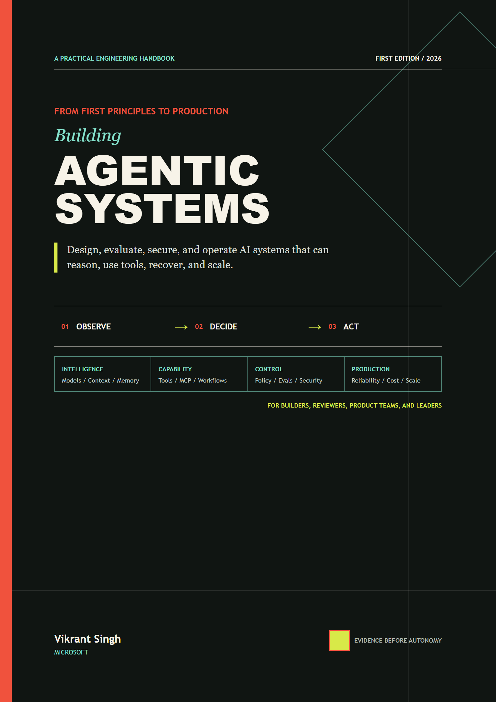

# Building Agentic Systems

**From First Principles to Production**

**Author:** Vikrant Singh, Microsoft

<a href="book/building-agentic-systems.pdf"></a>

A beginner-to-production guide for designing, building, evaluating, securing, deploying, and operating agentic systems.

**Read the book:** [Web edition](https://vikrantsingh01.github.io/Agentic_System_Design/) | [PDF edition](book/building-agentic-systems.pdf)

The project teaches durable, vendor-neutral engineering principles first. Runnable examples live in each chapter's **Build it in Python** section. Microsoft technologies are introduced through supported Python SDKs and architecture mappings where they add practical value.

## Choose your path

You do not need to read every chapter before building something useful.

| Your goal | Start here | Then read |
|---|---|---|
| Learn from the beginning | [Module 1](modules/01-from-zero-to-agents/README.md) | Continue through the modules in order. |
| Build a small controlled agent | [Module 1](modules/01-from-zero-to-agents/README.md) | [Module 2](modules/02-smallest-useful-agent/README.md), then [Module 5](modules/05-evaluation-improvement/README.md) and [Module 6](modules/06-security-safety-governance/README.md). |
| Add retrieval or memory | [Module 3](modules/03-context-knowledge-memory/README.md) | Return to Modules 1 and 2 for any unfamiliar foundations. |
| Prepare a system for production | [Module 7](modules/07-production-architecture-operations/README.md) | [Module 8](modules/08-scale-economics-lifecycle/README.md). Read Modules 5 and 6 before launch. |
| Engineer a hybrid device, edge, and cloud system | [Module 9](modules/09-hybrid-ai-systems-engineering/README.md) | Use Chapters 36-41 for routing, performance, testing, tools, security, and product experience. |
| Map the design to Microsoft services | [Module 10](modules/10-microsoft-synthesis-capstone/README.md) | Use Chapter 42 after the relevant vendor-neutral design chapters. |

## Role-based reading paths

Choose the chapters that match your work. These are focused routes, not requirements to read the whole book.

| Role | Focused path |
|---|---|
| Students | Start with [Module 1](modules/01-from-zero-to-agents/README.md), Chapters 1-4, then build the bounded agent in [Module 2](modules/02-smallest-useful-agent/README.md), Chapters 5-8. Add Chapter 19 for quality and Chapter 24 for threat modeling. |
| Teachers | Use [Module 1](modules/01-from-zero-to-agents/README.md), Chapters 1-4, for foundations; Chapters 19-20 for measurable assignments; Chapter 27 for governance discussion; and Chapter 41 for user-centered projects. |
| Engineers | Focus on Chapters 4, 7-8, and 14-18, then use [Module 7](modules/07-production-architecture-operations/README.md), [Module 8](modules/08-scale-economics-lifecycle/README.md), and [Module 9](modules/09-hybrid-ai-systems-engineering/README.md) for architecture, operations, scale, and hybrid systems. |
| Testers | Read [Module 5](modules/05-evaluation-improvement/README.md), Chapters 19-23, then Chapters 29, 38, and 40 for reliability, fault tolerance, and security assurance. |
| Security | Read [Module 6](modules/06-security-safety-governance/README.md), Chapters 24-27, with Chapters 16, 18, 29-30, and 40 for durable execution, protocol boundaries, operations, and secure hybrid design. |
| Product | Use [Module 5](modules/05-evaluation-improvement/README.md), Chapters 19 and 23, with Chapters 1, 4, 27, 33, 35, and 41 for product fit, governance, economics, iteration, and user experience. Use [Module 10](modules/10-microsoft-synthesis-capstone/README.md), Chapter 42, for Microsoft implementation choices. |
| Design | Use [Module 9](modules/09-hybrid-ai-systems-engineering/README.md), Chapter 41, with Chapters 2, 5, 13, 19, and 26-27 for interaction loops, structured communication, multimodal access, success measures, privacy, oversight, and agent UX. |
| TPM | Read [Module 4](modules/04-reasoning-workflows-collaboration/README.md), Chapters 14-18, then Chapters 19-20, 27-31, 35, and 42 for planning, evidence, delivery, operations, change, and readiness reviews. |
| Engineering leaders | Use [Module 7](modules/07-production-architecture-operations/README.md) and [Module 8](modules/08-scale-economics-lifecycle/README.md), Chapters 28-35, with Chapters 4, 17, 19, and 24. Add Chapters 36, 38, and 40-42 for hybrid routing, resilience, security, experience, and platform synthesis. |
| COO/CEO | Focus on [Module 8](modules/08-scale-economics-lifecycle/README.md), Chapters 33-35, and [Module 10](modules/10-microsoft-synthesis-capstone/README.md), Chapter 42, with Chapters 1, 19, 27-28, and 41 for strategic fit, value, accountability, operating risk, and user trust. |
| Ethics/Governance | Read [Module 6](modules/06-security-safety-governance/README.md), Chapters 24 and 26-27, with Chapters 19-21, 40-41, and [Module 10](modules/10-microsoft-synthesis-capstone/README.md), Chapter 42, for measurement, privacy, responsible governance, human control, and evidence-based platform review. |

## What to expect in a chapter

Each chapter follows the same learning rhythm:

1. Start with a concrete problem and a plain-language explanation.
2. Use diagrams and vocabulary to build a shared mental model.
3. Study the mechanism, tradeoffs, and a Python example.
4. Test a failure or misuse case with synthetic offline data.
5. Apply evaluation, security, and production checks.
6. Finish with review questions and a design exercise.

If a chapter feels too advanced, read its **First pass**, **Picture the idea**, and
**Vocabulary** sections first. Return to the engineering sections when you need implementation
detail.

## Learning path

The material is organized as 42 chapters across ten modules:

1. [From Zero to Agents](modules/01-from-zero-to-agents/README.md), Chapters 1-4
2. [Build the Smallest Useful Agent](modules/02-smallest-useful-agent/README.md), Chapters 5-8
3. [Context, Knowledge, and Memory](modules/03-context-knowledge-memory/README.md), Chapters 9-13
4. [Reasoning, Workflows, and Collaboration](modules/04-reasoning-workflows-collaboration/README.md), Chapters 14-18
5. [Evaluation and Improvement](modules/05-evaluation-improvement/README.md), Chapters 19-23
6. [Security, Safety, and Governance](modules/06-security-safety-governance/README.md), Chapters 24-27
7. [Production Architecture and Operations](modules/07-production-architecture-operations/README.md), Chapters 28-32
8. [Scale, Economics, and Lifecycle](modules/08-scale-economics-lifecycle/README.md), Chapters 33-35
9. [Hybrid AI Systems Engineering](modules/09-hybrid-ai-systems-engineering/README.md), Chapters 36-41
10. [Microsoft Synthesis and Capstone](modules/10-microsoft-synthesis-capstone/README.md), Chapter 42

## Recurring case study

**Northstar Research Assistant** begins as a transparent agent loop and grows into an enterprise system that searches approved sources, creates cited reports, acts under delegated user identity, requests approval for consequential actions, resumes long-running work, and supports multiple tenants and regions. Its files are an architecture and requirements contract for the recurring case study, not a runnable reference implementation.

## Repository map

Reader and source content:

- `front-matter/`: reader guidance included in the PDF and web editions
- `modules/`: 42 chapters across ten modules, with exercises and local asset manifests
- `case-study/northstar/`: architecture and requirements contract for the Northstar case study
- `visuals/agent-system-journey/`: offline interactive journey through an agent system
- `research/dossiers/`: authoritative research-agent evidence outputs
- `research/source-ledger.csv`: approved claims and source freshness

Project coordination and quality records:

- `coordination/contracts/`: frozen authoring and architecture contracts
- `coordination/agents/research-briefs/`: short R1-R9 research assignments
- `coordination/dependency-graph.yml`: multi-agent stages and join gates
- `reviews/`: editorial and publication-quality review records

Tooling and generated publications:

- `scripts/`: validation and book-build tools
- `tests/`: repository contract tests
- `book/`: generated PDF edition; do not edit directly
- `docs/`: generated GitHub Pages edition; do not edit directly
- `build/`: ignored intermediate build files

## Current status

All 42 chapters are present. The repository validator checks the module structure, required
teaching sections, diagrams, and research briefs. Editorial review, companion assets, and
source-freshness work continue in small, independently reviewed changes.

## Validate locally

```powershell
python scripts/validate_repository.py
python -m unittest discover -s tests -v
python visuals\agent-system-journey\tests\check_asset_offline.py
```

## Build the book

The same source produces the PDF and the static GitHub Pages edition:

```powershell
npm install
npm run setup:book-browser
npm run build:book
```

The build writes `book/building-agentic-systems.pdf` and `docs/index.html`. It verifies
the chapter sequence, renders all Mermaid diagrams, rejects diagram errors, and validates
the PDF page count and metadata. The PDF includes an expandable side-panel table of contents
with links to the reader guide, every module, and every chapter. Supporting viewers open the
document-outline pane by default; readers can show or hide it with the viewer's contents control.

See [CONTRIBUTING.md](CONTRIBUTING.md) before authoring or reviewing content.