# Appendix D: Agentic System Design Interview Playbook

This appendix prepares you to discuss agentic system design clearly in an interview. It
covers representative prompts that exercise themes published by teams at Google, OpenAI,
Anthropic, Microsoft, and other leading engineering organizations. It is not a claim about
any company's private interview bank, and no prompt is guaranteed to appear in a particular
interview. Interview loops vary by role, level, team, and date.

The goal is not to memorize eleven designs. Learn one reasoning method, then show how the
requirements change the architecture. A strong answer starts with the user and the success
measure, chooses the least autonomy needed, keeps authority outside the model, and makes
failure visible and recoverable.

## Student shortcut

Remember six words: **ask, think, check, act, verify, stop**.

1. **Ask:** What does the user want?
2. **Think:** What small next step should the system propose?
3. **Check:** Is the step allowed, affordable, and safe?
4. **Act:** Use one approved tool.
5. **Verify:** Did the tool produce the expected result?
6. **Stop:** Return the result, ask for help, or stop when the budget is used.

For example, imagine a library helper. A student asks when the library closes. The helper
searches the current handbook, checks that it found the correct campus, answers with the source
link, and stops. It does not need several agents, long-term memory, or permission to change the
library calendar.

### How to read the diagrams

- A rectangle is a person, service, or action.
- A cylinder is stored information.
- A diamond is a decision.
- A solid arrow shows the main flow of work.
- A dotted arrow carries policy, configuration, or evidence.

Read each diagram from left to right or top to bottom. First follow only the main arrows. Add
the safety, scale, and recovery paths after the basic story is clear.

## What public engineering themes suggest

The source ledger records public, approved material from these organizations. It supports the
engineering themes below, not claims about their hiring processes.

| Public engineering lens | What to demonstrate in a design discussion |
|---|---|
| Google and Google DeepMind | Distributed-system fundamentals, SRE discipline, multimodal inputs, tool interfaces, explicit capacity assumptions, and graceful degradation. |
| OpenAI | Bounded agent loops, structured tool calls, guardrails, tracing, task-specific evaluation, and incremental adoption. |
| Anthropic | Simple composable workflows, careful context management, typed tools, computer-use containment, and a clear reason before adding multiple agents. |
| Microsoft | Enterprise identity, tenant isolation, durable workflows, replaceable provider adapters, observability, governance, and production readiness. |

Use the same vendor-neutral design first. Map it to a provider only when the interviewer asks
for a specific stack.

## The seven-step answer method

For a 45-minute interview, spend roughly 5 minutes clarifying, 5 minutes estimating, 15 minutes
on the main architecture, 10 minutes on one difficult path, and 10 minutes on failure, safety,
evaluation, and tradeoffs.

1. **Frame the job.** Name the user, the task, the output, and what is explicitly out of scope.
2. **Set success and risk.** Define quality, safety, latency, availability, and cost targets.
3. **Choose minimum autonomy.** Compare a deterministic workflow, one bounded agent, and a
   multi-agent system. Start with the simplest option that can meet the requirements.
4. **Draw one request path.** Show identity, orchestration, context, model, tools, state, and
   the final response before adding scale details.
5. **Mark trust boundaries.** Treat prompts, retrieved content, model output, tool output, and
   browser content as untrusted data. Put authorization and credentials outside the model.
6. **Handle production behavior.** Add deadlines, budgets, queues, idempotency, retries,
   checkpoints, backpressure, degraded modes, and human escalation where they are needed.
7. **Close with evidence.** Explain how offline evaluation, adversarial tests, canaries,
   telemetry, rollback, and unit economics prove the design works.

### Clarifying questions that work for almost every prompt

- Who is the user, and on whose authority does the agent act?
- Is the output advisory, or can it cause an external side effect?
- What data may the agent read, retain, or send to a model?
- What are the peak traffic, latency target, task duration, and cost ceiling?
- What quality and safety failures are release blockers?
- Must work survive a crash, support cancellation, or wait for human approval?
- Is one region enough, and what tenant or residency boundaries apply?

If the interviewer does not supply numbers, state reasonable assumptions and continue. The
assumptions matter more than guessing a hidden target.

## Reusable production blueprint

Start every answer with this logical architecture, then remove boxes that the prompt does not
need. The model proposes; deterministic services authorize, execute, record, and stop.

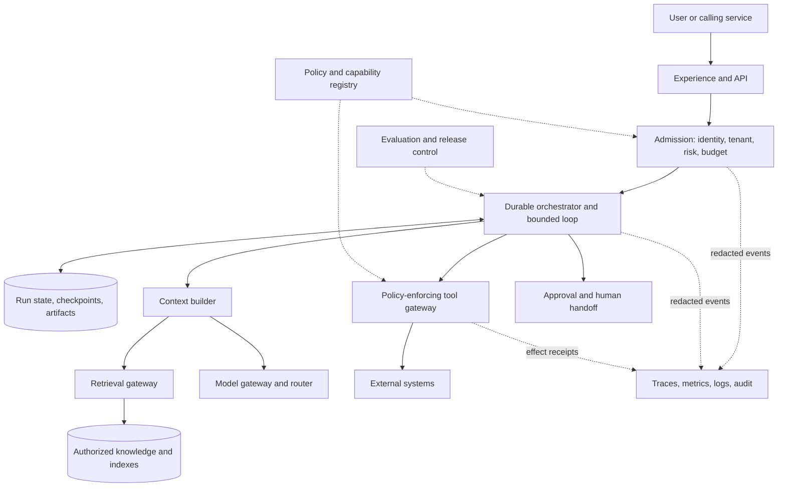

**Takeaway:** one runtime coordinates untrusted model decisions, while typed gateways own data
access, authorization, side effects, and evidence.

**Ordered prose walkthrough:** (1) the API authenticates the caller; (2) admission binds tenant,
risk, policy, and budgets; (3) the orchestrator loads state and builds bounded context; (4) model,
retrieval, and tools sit behind gateways; (5) consequential actions pause for approval; (6) state
and effect receipts support recovery; and (7) redacted evidence feeds evaluation and operations.

### Contracts to label on the whiteboard

| Boundary | Minimum contract |
|---|---|
| Admission | `principal_id`, `tenant_id`, task type, risk tier, deadline, policy version, and budgets |
| Model gateway | Versioned request and structured response schema, timeout, token ceiling, fallback, and provider-independent error types |
| Retrieval gateway | Authorized filter, source version, freshness, passage identifiers, and citation metadata |
| Tool gateway | Typed arguments, scoped identity, side-effect class, idempotency key, deadline, and effect receipt |
| Workflow state | `run_id`, step, attempts, checkpoint version, remaining budget, approval state, and terminal status |
| Evidence | Correlated trace IDs, decisions, latencies, token and tool cost, policy outcomes, redaction, and retention |

### Capacity estimates worth stating

Use approximate arithmetic and say what will be measured later. For peak requests per second
and average end-to-end latency $L$ in seconds, expected in-flight concurrency is:

$$
C \approx QPS_{peak} \times L
$$

For a model route with average input tokens $T_{in}$ and output tokens $T_{out}$, required token
throughput is approximately:

$$
tokens\ per\ second \approx QPS_{model} \times (T_{in} + T_{out})
$$

Report cost per accepted task, not cost per model call:

$$
cost_{accepted} = \frac{model + retrieval + tools + retries + storage + evaluation + operations}{accepted\ tasks}
$$

These estimates reveal queue, quota, and budget pressure. They do not replace a representative
load test.

## Top design 1: Knowledge assistant that searches before answering

**Representative prompt:** Design an assistant that answers employee questions from internal
documents, cites its evidence, and never exposes a document the user cannot access.

**Simple student example:** A student asks, "When is the library open on Friday?" The assistant
searches the current campus handbook, answers with the exact time, and links to the page it used.
If the student cannot open that page, the assistant must not use it in the answer.

**Clarify first:** source types and freshness, permission model, answer latency, citation
requirements, tenant boundaries, and whether conversation history may be retained.

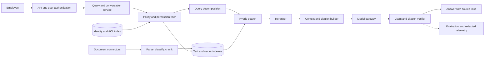

**Takeaway:** authorization happens before retrieval, and every material claim must resolve to
evidence the caller is allowed to open.

**Ordered prose walkthrough:** (1) authenticate the employee; (2) bind their permissions to the
query; (3) search only eligible chunks; (4) rerank and fit evidence into a token budget; (5)
generate an answer; (6) verify claim-to-citation links; and (7) return links that recheck access
when opened.

- **Start simple:** one retrieval pass, one model call, and deterministic citation validation.
- **Scale:** partition indexes by tenant or security domain, cache only permission-safe results,
  batch embeddings, and apply backpressure when model or search quotas saturate.
- **Failure and safety:** fail closed on missing identity or ACL data, show a source-unavailable
  state for stale indexes, and never treat retrieved instructions as policy.
- **Evaluate:** retrieval recall, answer correctness, citation precision, unauthorized-document
  exposure, p95 latency, and cost per accepted answer.

**Likely follow-up:** Why not put all documents into the prompt? The answer is context limits,
cost, freshness, relevance, and, most importantly, permission enforcement.

## Top design 2: Deep research agent

**Representative prompt:** Design an agent that investigates a broad question, searches many
sources, and produces a cited report that can survive long-running failures.

**Simple student example:** A student asks, "Should our school use solar or wind power?" The
agent turns this into smaller questions about cost, weather, maintenance, and environmental
impact, gathers sources for each, and creates one report with citations.

**Clarify first:** allowed sources, report depth, freshness, maximum runtime and spend, citation
standard, parallelism, and whether the user can edit the plan.

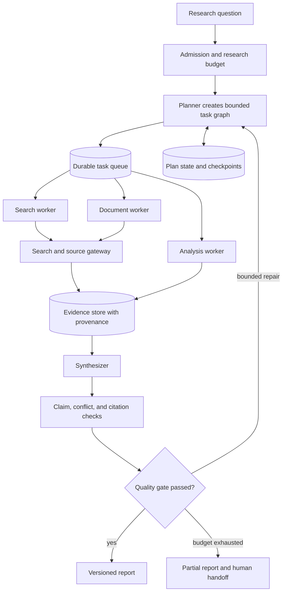

**Takeaway:** durable tasks collect evidence in parallel, but bounded gates prevent endless
research and unsupported synthesis.

**Ordered prose walkthrough:** (1) admit a question with time, step, token, and money budgets;
(2) create a dependency-aware plan; (3) queue independent research tasks; (4) store passages
with provenance; (5) synthesize only from the evidence store; (6) check coverage, conflicts,
and citations; and (7) return a complete or explicitly partial report.

- **Start simple:** a deterministic search, read, outline, draft, verify workflow before adding
  adaptive replanning or specialist agents.
- **Scale:** use bounded worker pools, per-domain rate limits, deduplication by canonical source,
  checkpointed task graphs, and leases for abandoned work.
- **Failure and safety:** cap replans, quarantine prompt injection from source text, respect
  robots and source policy, and preserve cancellation through every worker.
- **Evaluate:** question coverage, source quality and diversity, citation entailment, unsupported
  claim rate, completion under injected failures, latency, and cost per accepted report.

**Likely follow-up:** When do multiple agents help? Only when isolated workers improve a named
metric enough to justify communication cost, inconsistent conclusions, and new failure modes.

## Top design 3: Coding helper for a repository

**Representative prompt:** Design an agent that receives an issue, changes a large repository,
runs tests, and proposes a patch without risking the developer's machine or main branch.

**Simple student example:** A calculator project returns the wrong total. The agent finds the
relevant function, changes a disposable copy of the project, runs the tests, and shows the
student a patch. It cannot change the main project until a person approves it.

**Clarify first:** repository size and languages, allowed commands, network policy, test latency,
patch approval, secret access, and whether the agent may open a pull request.

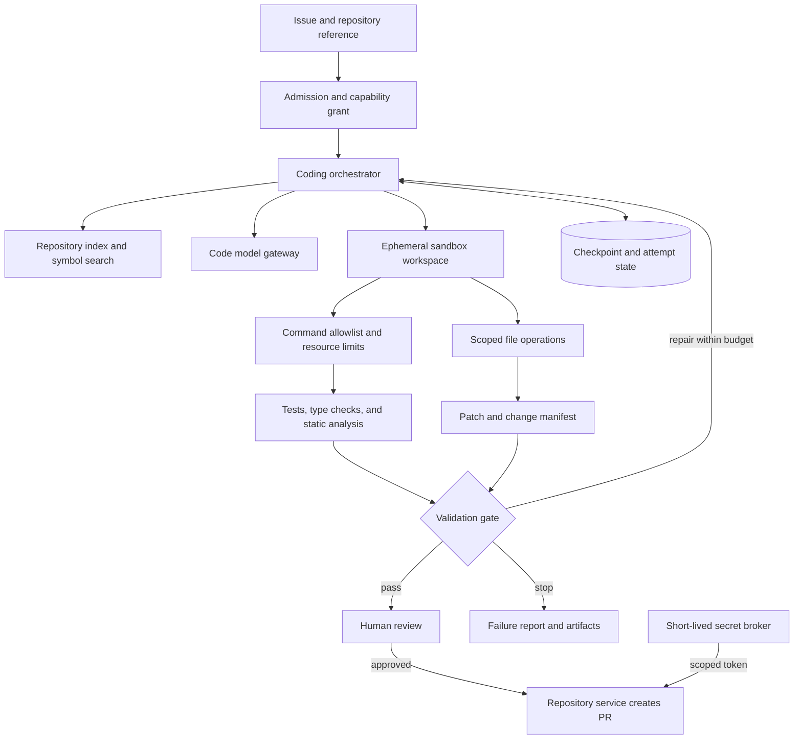

**Takeaway:** all generated code and commands run in an isolated disposable workspace; only a
validated patch crosses into the repository through a separately authorized gate.

**Ordered prose walkthrough:** (1) grant narrowly scoped repository capabilities; (2) retrieve
relevant symbols and tests; (3) propose a plan and edits; (4) execute only allowed commands in
an ephemeral sandbox; (5) validate the patch; (6) stop or repair within budget; and (7) require
approval before a short-lived identity creates a pull request.

- **Start simple:** support one repository, read and patch operations, a fixed validation
  command, and human-controlled submission.
- **Scale:** cache immutable repository indexes, schedule CPU-heavy sandboxes through queues,
  isolate tenants, and shard by repository while preserving per-branch ordering.
- **Failure and safety:** deny host filesystem access, default-deny network egress, scan patches
  and dependencies, redact secrets, cap command resources, and make cleanup automatic.
- **Evaluate:** issue-resolution rate on held-out tasks, test pass rate, regression rate, patch
  size, human correction burden, sandbox escape tests, p95 duration, and accepted-patch cost.

**Likely follow-up:** Why not let the model call Git directly? The model is untrusted decision
logic. A deterministic repository gateway must own credentials, branch policy, and write scope.

## Top design 4: Customer support action agent

**Representative prompt:** Design a support agent that answers product questions and can issue
an eligible refund, update an address, or hand the case to a person.

**Simple student example:** A student's book order is late. The agent reads the shipping status,
explains the delay, and prepares an eligible refund. It asks for confirmation before sending the
refund and records the receipt so a retry cannot pay twice.

**Clarify first:** supported intents, refund and account-change limits, authentication strength,
channels, response target, policy ownership, and mandatory escalation cases.

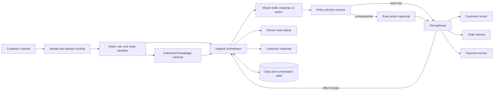

**Takeaway:** the model can propose a support action, but policy, exact approval, and an
idempotent tool gateway decide whether the action occurs.

**Ordered prose walkthrough:** (1) bind the customer to a verified session; (2) classify intent
and risk; (3) retrieve policy-safe knowledge; (4) let the model draft a response or structured
action; (5) evaluate deterministic eligibility; (6) approve and execute the exact action once;
and (7) return the receipt or escalate with context.

- **Start simple:** answer questions and prepare actions for human approval before allowing a
  narrow low-risk action automatically.
- **Scale:** partition case state, queue long operations, enforce per-account ordering, cache
  public knowledge, and isolate failing downstream services with circuit breakers.
- **Failure and safety:** use idempotency keys, transaction limits, fresh authorization, masked
  payment data, immutable effect receipts, compensation procedures, and immediate handoff.
- **Evaluate:** containment rate without quality loss, first-contact resolution, policy accuracy,
  duplicate-effect count, escalation precision, customer correction burden, latency, and cost.

**Likely follow-up:** How do retries avoid duplicate refunds? Persist an operation key before the
call, pass it to the payment service, record the authoritative receipt, and reconcile ambiguous
timeouts before any retry.

## Top design 5: Browser helper that completes a web task

**Representative prompt:** Design an agent that completes a web task by reading a screen,
clicking, typing, and verifying progress.

**Simple student example:** A student asks the agent to fill out a scholarship form. The agent
reads each field, fills only approved information, and checks the page after every click. It
stops for the student to review the form before the final submission.

**Clarify first:** allowed sites and actions, authentication, personal data, accessibility tree
availability, side-effect policy, maximum steps, and recovery or undo requirements.

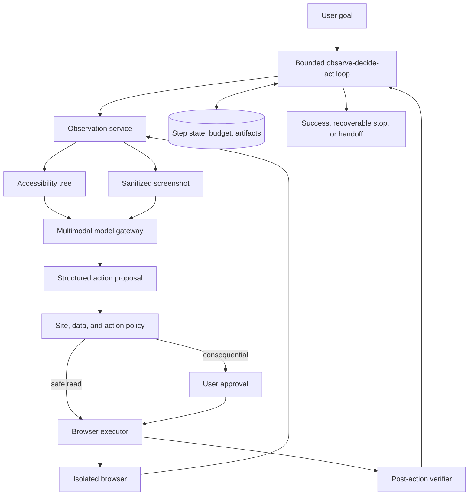

**Takeaway:** every action is proposed, authorized, executed in isolation, and verified against
a new observation before the next step.

**Ordered prose walkthrough:** (1) accept a bounded goal; (2) observe the page through structured
accessibility data and a sanitized image; (3) propose one typed action; (4) apply site and action
policy; (5) request approval for consequential effects; (6) execute in an isolated browser; and
(7) verify the result before continuing or stopping.

- **Start simple:** support one site, navigation and form filling, no purchase, and a low step
  limit. Prefer stable APIs over screen automation when one exists.
- **Scale:** pool clean browser containers, cap concurrent sessions per tenant, stream compressed
  observations, and queue around site and model rate limits.
- **Failure and safety:** isolate cookies and downloads, block arbitrary egress, resist page-borne
  prompt injection, never expose raw secrets to the model, detect loops, and provide cancel.
- **Evaluate:** task success, action accuracy, unsafe-action block rate, post-action verification,
  steps per task, accessibility coverage, p95 duration, and cost.

**Likely follow-up:** What if the page changes after the click? Treat each observation as
short-lived, invalidate element references after state changes, and verify the expected state
before issuing another action.

## Top design 6: Personal study and schedule assistant with memory

**Representative prompt:** Design an assistant that helps with email and calendar work, learns
useful preferences, and lets the user inspect and delete what it remembers.

**Simple student example:** A student usually studies after 4 p.m. The assistant asks whether it
may remember that preference, uses it when suggesting a study session, and provides a button to
correct or delete the memory.

**Clarify first:** memory types, retention, devices, shared calendars, delegated authority,
sensitive topics, write approvals, and offline or regional requirements.

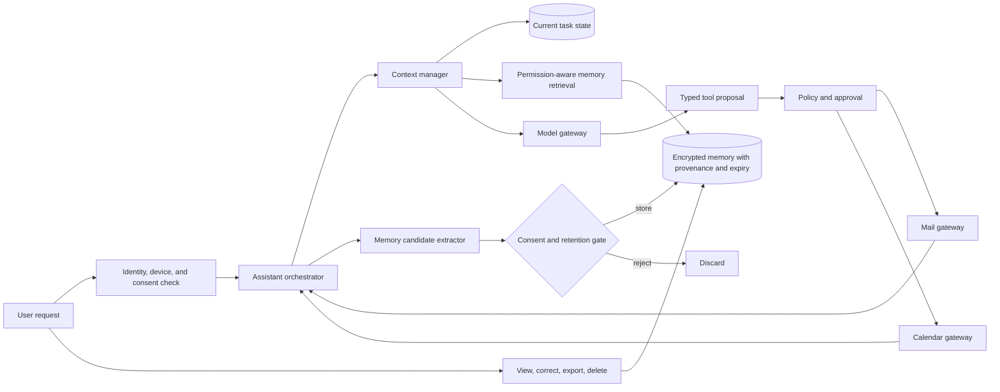

**Takeaway:** memory is a governed data product with purpose, provenance, expiry, and deletion,
not an unlimited transcript attached to every prompt.

**Ordered prose walkthrough:** (1) authenticate the user and check consent; (2) assemble only
task-relevant context; (3) retrieve eligible memories; (4) generate a response or typed tool
proposal; (5) approve writes such as sending or scheduling; (6) extract only useful memory
candidates; and (7) let the user inspect, correct, export, or delete them.

- **Start simple:** keep current-task state only. Add one memory category after an ablation shows
  measurable benefit over the no-memory baseline.
- **Scale:** partition by user and region, cache ephemeral context only, asynchronously expire
  records, and keep shared-resource authorization separate from personal memory.
- **Failure and safety:** prevent cross-user retrieval, do not infer sensitive preferences,
  protect against memory poisoning, bind approval to exact recipients and times, and propagate
  deletion to indexes and backups under policy.
- **Evaluate:** task completion, useful-memory precision, stale or wrong-memory rate, deletion
  completion, cross-user leakage, correction burden, latency, and cost.

**Likely follow-up:** What belongs in memory? Store the minimum stable fact that improves a
named task, with source, confidence, purpose, expiry, and user control. Do not store reasoning
traces or every conversation.

## Top design 7: Data question assistant

**Representative prompt:** Design an agent that answers business questions from warehouse data,
creates charts, and cannot modify production records or bypass row-level access.

**Simple student example:** A teacher asks, "Which book subjects were borrowed most this term?"
The assistant turns the question into a read-only database query, checks the result, and creates
a chart. It cannot change a library record or reveal another class's restricted data.

**Clarify first:** data sources, freshness, query complexity, semantic definitions, user roles,
allowed exports, latency, and whether results can drive automated decisions.

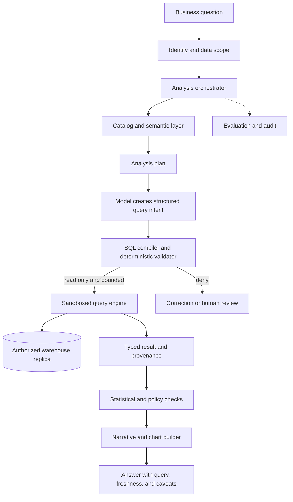

**Takeaway:** the model expresses analytical intent, while a semantic layer, query compiler,
authorization, and read-only execution determine what data can actually be computed.

**Ordered prose walkthrough:** (1) bind identity and row-level scope; (2) resolve business terms
through the semantic layer; (3) create an analysis plan; (4) compile model output into a bounded
read-only query; (5) run it against an authorized replica; (6) check result quality and privacy;
and (7) return the answer with query, provenance, freshness, and caveats.

- **Start simple:** curated metrics, one warehouse, read-only templates, and visible generated
  queries before supporting open-ended joins.
- **Scale:** cache permission-safe aggregates, impose scan and runtime quotas, route heavy jobs
  through a queue, use result pagination, and precompute common semantic metrics.
- **Failure and safety:** block data modification and unrestricted export, enforce row and column
  policy after query generation, cap scans, detect small-group privacy risks, and label stale data.
- **Evaluate:** execution accuracy, semantic correctness, answer faithfulness, unauthorized-row
  exposure, query cost, p95 latency, and analyst correction rate.

**Likely follow-up:** How do you reduce plausible but wrong answers? Separate query generation
from narrative generation, expose the executed query and metric definitions, and verify every
numeric statement against the typed result.

## Top design 8: Website incident response assistant

**Representative prompt:** Design an agentic system that investigates production alerts,
correlates evidence, recommends remediation, and can execute only preapproved low-risk actions.

**Simple student example:** The school website becomes slow after a release. Separate workers
check error logs, the latest deployment, and database health. One coordinator combines the
evidence and suggests a rollback, but the human operator decides whether to run it.

**Clarify first:** service graph, telemetry sources, alert rate, incident severity, runbook
coverage, action authority, on-call workflow, and recovery objectives.

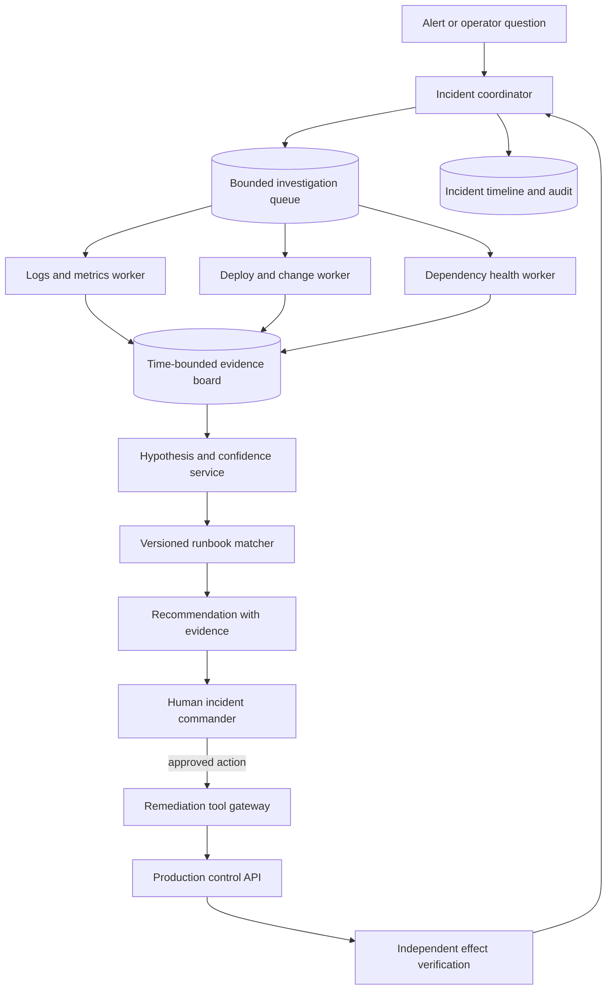

**Takeaway:** specialist workers gather evidence in parallel, while the human incident commander
retains authority and every remediation is independently verified.

**Ordered prose walkthrough:** (1) create an incident with severity and time bounds; (2) dispatch
independent evidence collectors; (3) correlate their outputs on one evidence board; (4) rank
hypotheses with uncertainty; (5) match versioned runbooks; (6) ask the incident commander to
approve a bounded action; and (7) verify the effect and preserve a timeline.

- **Start simple:** read-only evidence collection and runbook recommendation. Automate an action
  only after repeated evidence shows that its preconditions and rollback are reliable.
- **Scale:** deduplicate correlated alerts, isolate incidents by service and tenant, prioritize by
  severity, rate-limit telemetry queries, and cap worker fan-out.
- **Failure and safety:** do not let agents silently agree from shared context, require source
  timestamps, block actions outside the incident scope, provide kill controls, and keep a known
  manual operations path.
- **Evaluate:** time to useful hypothesis, evidence precision, false remediation rate, mean time
  to recovery, unauthorized effects, recovery drill results, operator trust calibration, and cost.

**Likely follow-up:** Why use multiple agents here? Evidence collection is naturally parallel and
can use isolated permissions. Keep synthesis and authority centralized unless measured results
justify a more complex topology.

## Top design 9: Voice and camera assistant across device and cloud

**Representative prompt:** Design an assistant that understands voice, camera, and text, responds
quickly, protects sensitive input, and still offers useful behavior with poor connectivity.

**Simple student example:** A museum visitor points a phone camera at a sign and asks a question
by voice. The phone removes unnecessary personal details, chooses an allowed local or cloud
model, and reads the answer aloud. With no network, it gives a smaller offline answer.

**Clarify first:** device classes, modalities, latency target, local hardware, privacy classes,
offline tasks, battery budget, regions, and tool side effects.

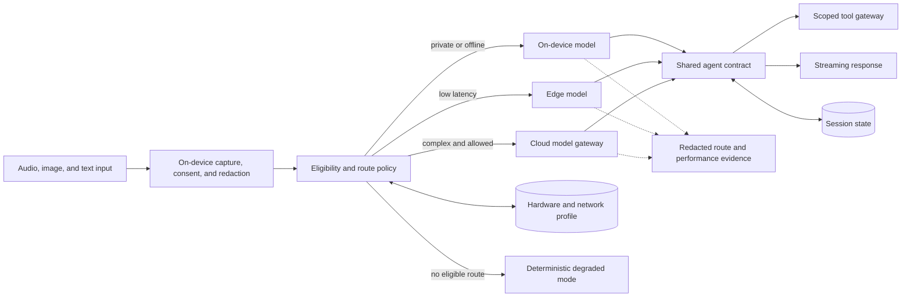

**Takeaway:** policy first determines which routes are eligible; latency and cost optimize only
among routes that satisfy privacy, capability, quality, and hardware constraints.

**Ordered prose walkthrough:** (1) capture input with clear consent; (2) redact locally where
possible; (3) filter routes by data, network, hardware, capability, and quality policy; (4) choose
an eligible device, edge, or cloud model; (5) preserve one agent and tool contract across routes;
(6) stream the response; and (7) fall back to a deterministic limited mode when no route qualifies.

- **Start simple:** one cloud route plus a deterministic offline fallback. Add on-device or edge
  inference only for a measured privacy, latency, availability, or cost need.
- **Scale:** use regional edge capacity, admission control by hardware profile, session affinity,
  adaptive batching where latency permits, and backpressure instead of unlimited cloud fallback.
- **Failure and safety:** fail closed for restricted data, show degraded mode, prevent route
  oscillation, respect thermal and battery limits, cancel all downstream streams, and verify tool
  authorization independently of model location.
- **Evaluate:** end-to-end and time-to-first-token latency, task quality by route, route eligibility
  violations, offline completion, energy per accepted task, thermal behavior, fallback rate, and cost.

**Likely follow-up:** Why not always choose the fastest route? A fast route fails if it lacks the
required capability, violates data policy, falls below quality, or cannot sustain device load.

## Top design 10: Shared agent platform for many teams

**Representative prompt:** Design a platform on which many product teams can create and operate
agents with different models, tools, data, budgets, and regional requirements.

**Simple student example:** A university lets the library, admissions office, and engineering
department build assistants on one platform. They share the runtime, but each department keeps
separate data, tools, budgets, and permissions. A library request can never read admissions data.

**Clarify first:** platform versus product responsibilities, number and size of tenants, isolation
tier, extension model, supported regions, service objectives, quotas, and compliance boundaries.

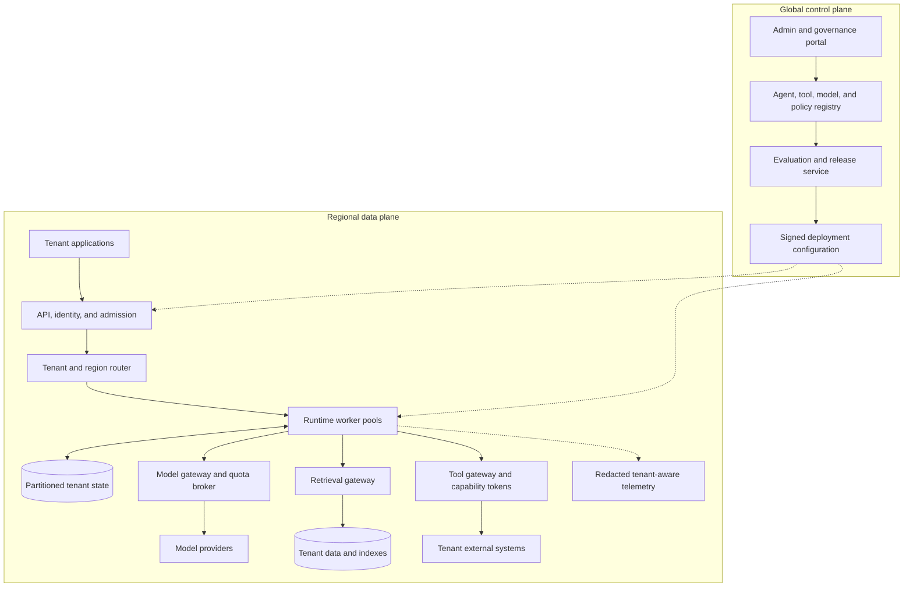

**Takeaway:** tenant requests stay in regional data planes, while a separate control plane ships
versioned, evaluated, and signed configuration without handling untrusted task content.

**Ordered prose walkthrough:** (1) authenticate each application and tenant; (2) route work to an
eligible region and isolated worker pool; (3) load partitioned state; (4) broker model, retrieval,
and tool access through tenant-aware gateways; (5) enforce quotas and capability tokens; (6)
export redacted tenant-aware evidence; and (7) use the control plane to evaluate and promote
signed versions.

- **Start simple:** one region, logical tenant isolation, one runtime contract, one model adapter,
  and a small approved tool registry. Do not build a general platform before two real products
  prove shared needs.
- **Scale:** partition by tenant and run ID, use weighted fair queues, reserve critical capacity,
  rate-limit every expensive dependency, autoscale worker pools, and isolate noisy neighbors.
- **Failure and safety:** prevent cross-tenant cache keys and telemetry, scope workload identities,
  pin policy with each run, contain provider failure with bulkheads, test regional recovery, and
  support tenant-specific kill switches.
- **Evaluate:** tenant-isolation tests, accepted-task rate, noisy-neighbor impact, p95 and p99
  latency, quota accuracy, regional recovery, provider fallback, platform availability, and full
  cost per accepted task by tenant.

**Likely follow-up:** What belongs in the platform? Centralize capabilities with stable shared
contracts and proven economies of scale. Keep product policy, user experience, domain tools,
and domain evaluation with the product team.

## Top design 11: AI-powered messaging system

**Representative prompt:** Design a real-time messaging system where people can exchange direct
or group messages and invite an AI assistant to summarize, translate, answer questions, or
suggest a reply.

**Simple student example:** A study group sends messages throughout the day. A student writes,
"@Helper, summarize the last 20 messages." The AI reads only those permitted messages and posts
a short summary into the group. If the AI is unavailable, students can still send and receive
normal messages.

**Clarify first:** direct and group chat size, expected users and message rate, delivery and
ordering guarantees, online and offline devices, AI trigger rules, context limits, retention,
moderation, encryption, and regional requirements.

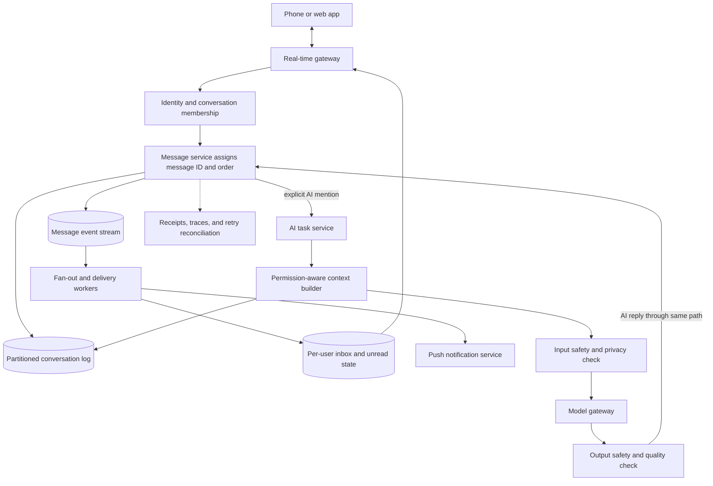

**Takeaway:** the messaging service owns durable delivery and conversation order; the AI is an
optional participant that uses the same authorized message path as everyone else.

**Ordered prose walkthrough:** (1) connect the device to a real-time gateway; (2) authenticate the
user and check conversation membership; (3) assign each accepted message an ID and position in
that conversation; (4) store it before acknowledging success; (5) fan it out to online or offline
recipients; (6) invoke AI only after an allowed trigger; and (7) post an approved AI result through
the normal message service so ordering, delivery, and audit rules still apply.

- **Start simple:** support text, small groups, one device per user, at-least-once transport with
  client deduplication, and AI only when someone explicitly mentions it.
- **Scale:** partition by `conversation_id`, keep message ordering within each partition, use
  WebSocket gateways for online delivery, durable per-user cursors for offline sync, and separate
  fan-out strategies for small groups and very large channels.
- **Failure and safety:** use client message IDs for retry deduplication, reconcile missing
  acknowledgements, isolate slow members, moderate user and AI content, exclude blocked or deleted
  messages from AI context, and never let an AI timeout block person-to-person chat.
- **Privacy:** fetch only the conversation range authorized for the AI request. End-to-end
  encryption requires an explicit design choice: run AI on a trusted device, or have participants
  knowingly share selected content with an AI service. Do not claim both server-side AI access and
  strict server-blind encryption.
- **Evaluate:** accepted-to-durable latency, online and offline delivery latency, missing,
  duplicate, or out-of-order messages, reconnect success, unauthorized context exposure,
  moderation errors, summary faithfulness, AI response latency, and cost per AI request.

**Likely follow-up:** How do you guarantee global message order? Usually you do not need it.
Guarantee a stable order inside one conversation, identify every message uniquely, and let clients
merge conversations independently. This scales better and matches what users observe.

## Cross-design decisions interviewers often probe

| Decision | Prefer the simpler option when | Add complexity when evidence requires it |
|---|---|---|
| Workflow versus agent | Steps and branches are known | The system must choose among changing paths based on observations |
| One agent versus many | One context and permission set can do the job | Parallelism, isolation, or specialized evaluation creates a measured gain |
| Synchronous versus durable | Work finishes inside one short request and has no approval wait | Tasks are long, retryable, cancellable, or must survive process failure |
| Direct model versus RAG | The task needs transformation, not private or fresh facts | Answers require current, attributable, permission-aware evidence |
| API tool versus computer use | A typed supported API exists | No suitable API exists and visual interaction can be safely contained |
| Cloud versus device or edge | Policy, connectivity, and latency allow one cloud route | Privacy, offline operation, sustained latency, or unit economics justify another route |
| Automatic action versus approval | The action is reversible, low impact, and policy-complete | Consequences, ambiguity, or regulation require informed human control |
| Cache versus recompute | Identity, policy, source, and version are part of the key | Safe invalidation cannot be guaranteed, so recomputation is safer |

## Failure checklist

Before finishing any design, inject at least these cases verbally:

- model timeout, malformed structured output, or provider quota exhaustion;
- stale, poisoned, unauthorized, or unavailable retrieved data;
- tool timeout before an effect receipt and repeated delivery after recovery;
- workflow crash after checkpointing and cancellation during a tool call;
- user revokes access or changes an approval while work is queued;
- downstream latency causes queue growth and budget exhaustion;
- telemetry loses correlation or accidentally includes sensitive content;
- a new prompt, model, tool, or index version regresses a protected slice; and
- one tenant, repository, incident, or browser session attempts to cross its boundary.

For each case, state the detection signal, bounded response, durable state transition, user or
operator message, and evidence that proves containment.

## Evaluation scorecard

Do not close with "we will monitor it." Name the decision rule.

| Dimension | Example measures | Example release rule |
|---|---|---|
| Outcome | Task success, answer correctness, grounded claims, accepted patch, resolved case | Meet the frozen threshold on the protected test set and priority slices |
| Trajectory | Correct tool choice, valid arguments, efficient steps, successful recovery | No forbidden action; bounded steps and retries; expected terminal state |
| Safety and security | Unauthorized access or effect, injection success, secret exposure, tenant crossing | Zero hard-invariant breaches in the release-blocking suite |
| Reliability | Completion, duplicate effects, checkpoint recovery, cancellation, degraded mode | Meet the service objective and produce zero duplicate consequential effects |
| Latency | p50, p95, p99, time to first useful result, queue delay | Meet the target by task and cohort under representative load |
| Cost | Tokens, tool calls, retries, infrastructure, review, cost per accepted task | Stay below the ceiling without violating quality or safety gates |
| Human experience | Correction burden, approval comprehension, handoff quality, accessibility | Critical journeys pass usability and accessibility acceptance |

## A concise closing answer

End the interview by summarizing five points:

1. "I chose this autonomy level because the uncertain decision is X; the rest stays deterministic."
2. "Identity, policy, budgets, and credentials remain outside the model."
3. "The critical failure is Y, contained by Z, with this recovery path."
4. "The first scale limit will probably be this queue, quota, or store, so I measure and protect it."
5. "I ship only if outcome, safety, reliability, latency, and cost gates pass against the simpler baseline."

That closing shows judgment. It also makes tradeoffs easy for the interviewer to challenge.

## Practice prompts

1. Redesign the knowledge assistant for a hospital where source access can change during a
   conversation and every answer needs clinical review.
2. Redesign the coding agent for a monorepo with 20,000 developers and tests that take four hours.
3. Redesign the support agent for a payment outage where downstream calls return ambiguous timeouts.
4. Redesign the browser agent for a site that frequently changes layout and contains malicious text.
5. Redesign the memory assistant for a family account with shared and private calendars.
6. Redesign the analyst for streaming data with a 30-second freshness objective.
7. Redesign incident response for two regions that fail at the same time.
8. Redesign the multimodal assistant for an offline wearable with strict battery limits.
9. Redesign the platform for a regulated tenant that requires a dedicated deployment.
10. Remove every component from one design that cannot be justified by a stated requirement.
11. Redesign the messaging system for a class channel with one million members and intermittent
  mobile connections.

## Related chapters and sources

- Use [Chapter 8: Agent Runtime](../modules/02-smallest-useful-agent/chapters/08-agent-runtime.md)
  for bounded loops and [Chapter 14: Workflow Patterns](../modules/04-reasoning-workflows-collaboration/chapters/14-workflow-patterns.md)
  for the workflow-first baseline.
- Use [Chapter 10: RAG Foundations](../modules/03-context-knowledge-memory/chapters/10-rag-foundations.md),
  [Chapter 12: Memory Without Mythology](../modules/03-context-knowledge-memory/chapters/12-memory-without-mythology.md),
  and [Chapter 17: Multi-Agent Systems](../modules/04-reasoning-workflows-collaboration/chapters/17-multi-agent-systems.md)
  for the major capability choices.
- Use [Chapter 24: Threat Modeling Agentic Systems](../modules/06-security-safety-governance/chapters/24-threat-modeling-agentic-systems.md),
  [Chapter 25: Secure Tools and Sandboxes](../modules/06-security-safety-governance/chapters/25-secure-tools-and-sandboxes.md),
  and [Chapter 26: Identity, Privacy, and Content Safety](../modules/06-security-safety-governance/chapters/26-identity-privacy-content-safety.md)
  for trust and authority boundaries.
- Use [Chapter 28: Reference Architecture](../modules/07-production-architecture-operations/chapters/28-reference-architecture.md),
  [Chapter 29: Reliability Engineering](../modules/07-production-architecture-operations/chapters/29-reliability-engineering.md),
  and [Chapter 33: Performance and Cost Engineering](../modules/08-scale-economics-lifecycle/chapters/33-performance-cost-engineering.md)
  for production and scale follow-ups.
- Use [Chapter 36: Hybrid AI Model Orchestration](../modules/09-hybrid-ai-systems-engineering/chapters/36-hybrid-ai-model-orchestration.md),
  [Chapter 38: AI System Testing and Fault Tolerance](../modules/09-hybrid-ai-systems-engineering/chapters/38-ai-system-testing-fault-tolerance.md),
  and [Chapter 41: Product and UX Design for Agentic Systems](../modules/09-hybrid-ai-systems-engineering/chapters/41-product-ux-design-agentic-systems.md)
  for hybrid routing, fault campaigns, and human control.

Public-theme references in the approved source ledger include SRC-013, SRC-014, SRC-017,
SRC-018, SRC-020 through SRC-026, SRC-028 through SRC-033, and SRC-040 through SRC-049. Recheck
volatile provider documentation before using product-specific details. These sources support
the architecture principles in this appendix; they do not document company interview questions.