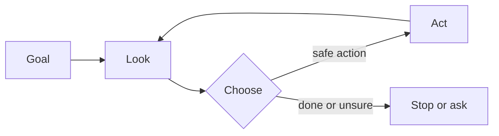
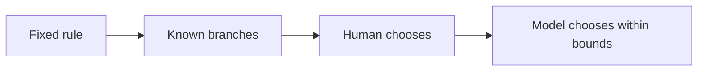

# Chapter 01: Why Agentic Systems

> Status: drafting  
> Owner: Module 01 Chapter 01 author
> Last verified: 2026-09-06

## The problem

Imagine you are packing for a picnic. A checklist can say, “Pack two sandwiches,
then two apples.” But what if it rains, a friend has an allergy, or the park is
closed? The fixed checklist cannot choose a sensible next step for a situation its
author did not spell out.

Some software faces this kind of changing problem. It must inspect what is happening,
choose among permitted actions, see what changed, and sometimes try again. An
**agent** (software that uses a model to choose actions in pursuit of a goal within
explicit controls) can help. An agent is not automatically the best answer: fixed
software is usually safer, cheaper, and easier to test when the steps are already
known.

## Learning objectives

By the end of this chapter, the reader can:

- classify five example systems as automation, assistant, workflow, or agent, with
  at least four correct;
- explain the difference between a goal, a chosen action, and a fixed step;
- place a system on a four-level autonomy spectrum and name its approval boundary;
- implement and run a deterministic Python agent loop that stops within three turns;
- propose one outcome, safety, latency, and cost check for an agent; and
- identify at least three situations in which an agent should not be used.

## First pass

### Four ways software can help

A kitchen timer is like **automation** (software that follows a fixed rule when a
known event occurs): when the time is up, it rings. Automation is excellent when the
rule is stable. The analogy stops here: real automation can contain many rules,
retries, and computer systems; it need not be a tiny timer.

A recipe is like a **workflow** (a predetermined control flow that may contain model
calls): first mix, then bake, then cool. A workflow may branch: “if the cake is still
wet, bake five more minutes”, but its designer chose the branches in advance. The
analogy stops here: software workflows can run steps in parallel, wait for days, and
recover from machine failures.

A librarian who suggests books after you ask is like an **assistant** (software that
responds to a person but does not necessarily pursue a goal by acting on its own).
The person remains in charge of each next move. The analogy stops here: an AI
assistant is software, does not understand or care as a person does, and may give
confidently wrong answers.

A trip helper that checks weather, compares permitted routes, asks before buying,
and replans after a cancellation is like an agent. Its **model** (a learned
component that maps input to a prediction or proposed output) chooses what to do
next. The **environment** (the outside world the software can observe or affect)
includes the weather and booking system. A **tool** (a typed capability through
which an agent reads or changes its environment) lets it check weather or reserve a
seat. The analogy stops here: the
software has no human judgment or wishes. It only processes data, and its choices
are bounded by code, permissions, available tools, and a stopping rule.

These labels describe control patterns, not product names:

| Pattern | Who chooses the next step? | Good fit | Example |
|---|---|---|---|
| Automation | A fixed rule | Repeated, predictable event | Rename every uploaded file |
| Assistant | The person, one request at a time | Advice or drafting | Suggest clearer wording |
| Workflow | A designed sequence and branches | Known process | Check form, route it, send receipt |
| Agent | A model, inside controls | Open-ended path toward a clear goal | Investigate why a test failed |

A system can mix patterns. A workflow can call an assistant, or a workflow can
contain one carefully bounded agent step.

The running project is **Northstar**, a bounded research helper. Its environment is
an approved, read-only source catalog. Its goal is to return relevant evidence and a
summary. It may search the catalog, inspect a result, cite it, or stop; it may not
publish, buy, message, or change a record. The baseline is a fixed workflow:
search once, return matching passages, and stop. Northstar should become agentic only
if choosing a later search from earlier results measurably improves that baseline.

### Autonomy is a dimmer, not a switch

**Autonomy** (how much freedom software has to choose and carry out next actions)
comes in levels:

1. **Suggest:** it proposes; a person acts.
2. **Act with approval:** it prepares each important action; a person approves it.
3. **Act inside a sandbox:** it acts alone only in a limited test space or with
   reversible changes.
4. **Act within delegated bounds:** it performs approved kinds of actions until it
   finishes, reaches a budget, or must escalate.

More autonomy is not automatically better. The right level is the lowest one that
delivers enough value. Buying, deleting, publishing, changing permissions, or
affecting health and safety should have narrow permissions and explicit human
authorization.

## Picture the idea



**Takeaway:** An agent repeats a checked look-choose-act cycle until it should stop.

**Step by step:** First, the goal says what success means. Second, the agent looks at
the current situation. Third, it chooses a permitted action or “stop or ask.” Fourth,
it acts and looks again. Enforced controls can stop the cycle at every turn.



**Takeaway:** Use the simplest pattern that gives enough freedom for the task.

**Step by step:** Compare four choices. A fixed rule has no changing path. A workflow
uses branches chosen by its designer. An assistant leaves each next choice to a
person. An agent lets a model choose within delegated bounds. This is not a required
maturity path: use the leftmost pattern that meets the need.

## Vocabulary

| Term | Plain-language meaning |
|---|---|
| Agent | Software that uses a model to choose actions toward a goal within explicit controls. |
| Assistant | Software that responds to a person; the person usually chooses each next step. |
| Automation | Software that follows a fixed rule after a known event. |
| Workflow | A predetermined sequence or branching control flow; it may include model calls. |
| Model | A learned component that predicts or proposes an output from input. |
| Tool | A typed, permission-checked capability for reading or changing an environment. |
| Environment | The outside part the system can observe or affect, such as files or a calendar. |
| Goal | A desired result with a checkable success condition. |
| State | The information retained about the task so far. |
| Runtime | The control loop that manages state, model calls, tools, budgets, and stopping. |
| Autonomy | How much freedom software has to choose and carry out next actions. |
| Guardrail | A control that blocks, limits, checks, or escalates risky behavior. |
| Idempotency key | A unique request label used to prevent a retry from causing another effect. |
| Token | A model-counted unit of text; it may be shorter or longer than a word. |
| Trajectory | The observable sequence of tool requests and results in a run. |
| Evaluation | A repeatable measurement of results, action paths, safety, speed, or cost. |
| Production ready | Evaluated, secure, observable, recoverable, operable, and cost-bounded. |

## How it works

An agent needs more than a chat box:

1. A person or calling system supplies a **goal** and success condition.
2. The runtime records **state** (information retained about the task so far).
3. The runtime gives the model only relevant observations and permitted tool
   descriptions.
4. The model proposes a structured next action, such as `check_weather(city)`.
5. Code validates the action, arguments, identity, permissions, and remaining budget.
6. A person approves the action when policy requires it.
7. The runtime executes the tool and records its result.
8. The loop repeats until success, refusal, timeout, budget exhaustion, or escalation.

The model proposes; ordinary software enforces. A model must not grant itself a new
tool, widen its own permissions, or decide that an approval is unnecessary.
Consequential tools should accept an **idempotency key** (a unique request label that
prevents an accidental repeat from causing another effect).

An assistant becomes agentic only when the system lets a model choose later actions
from feedback. A long workflow is not necessarily agentic if every transition was
fixed by its author.

## Engineering deep dive

An agent can be viewed as a policy that maps current state and observations to a
proposed action. Unlike a conventional state machine, its possible transitions may
not all be enumerated. That flexibility handles messy inputs, but it introduces
uncertainty.

The important control boundary surrounds the uncertain model:

- schemas restrict action names and argument shapes;
- allowlists restrict which tools exist for this identity and task;
- authorization checks happen again inside every tool;
- turn, time, **token** (a model-counted unit of text that may be shorter or
  longer than a word), and money budgets force termination;
- approval gates protect consequential side effects;
- durable state permits recovery without silently repeating an action; and
- an observable **trajectory** (the sequence of tool requests and results) supports
  evaluation without collecting private chain-of-thought.

### Choosing the simplest control pattern

Use fixed automation when inputs and rules are stable. Use a workflow when branches
are known. Use an assistant when a person can cheaply make each decision. Consider
an agent only when the route is hard to enumerate, feedback matters, and a bad choice
can be detected and contained.

Do **not** use an agent when:

- a simple rule or query solves the task;
- an exact, repeatable answer is mandatory and can be computed directly;
- success cannot be measured;
- the needed data or action should not be exposed to the system;
- mistakes are irreversible or high impact and no qualified approver is available;
- latency or cost must be tightly predictable; or
- there is no reliable stop condition, permission boundary, or recovery plan.

The useful comparison is not “agent versus nothing.” Compare it with a non-agent
baseline on quality, failures, time, and cost. Adding multiple agents increases
communication and failure paths; require evidence that they beat one workflow or one
bounded agent.

## Build it in Python

This smallest example is vendor-neutral and deterministic. The “model” is a local
function double, so it works offline on Python 3.11. It can inspect a pretend room,
choose one permitted action, and stop.

```python
from dataclasses import dataclass

@dataclass
class State:
    floor: str
    turns: int = 0

def model_double(state: State) -> tuple[str, str]:
    """Return (action, reason visible to the operator)."""
    if state.floor == "messy":
        return ("sweep", "The goal says the floor should be clean.")
    return ("finish", "The floor is clean.")

def run_agent(state: State, max_turns: int = 3) -> list[str]:
    trace: list[str] = []
    allowed = {"sweep", "finish"}

    while state.turns < max_turns:
        action, reason = model_double(state)
        if action not in allowed:
            trace.append("blocked: action not allowed")
            break
        trace.append(f"{action}: {reason}")
        if action == "finish":
            break
        if action == "sweep":  # Safe simulated tool, not a real-world side effect.
            state.floor = "clean"
        state.turns += 1
    else:
        trace.append("stopped: turn budget reached")
    return trace

assert run_agent(State("messy")) == [
    "sweep: The goal says the floor should be clean.",
    "finish: The floor is clean.",
]
```

The fixed function is not intelligent; it stands in for an uncertain model so the
loop and controls remain visible. Replacing it with a language model would not
remove the allowlist, budget, trace, tests, or stop conditions.

## Microsoft implementation

This chapter intentionally uses no Microsoft SDK: framework code would hide the
small control loop before the reader understands it. Keep the goal, state, and typed
tool interfaces independent of any provider. Current Microsoft product and SDK
mappings require approved, chapter-specific primary-source research before
implementation; none is asserted here.

## How leading teams approach it

Published guidance from Anthropic and OpenAI recommends starting with the simplest
solution and distinguishing model-directed agents from predefined workflows
(SRC-013, SRC-020). That is published guidance, not proof that one architecture wins
for every task. The engineering interpretation here is to require a measurable
baseline before accepting extra autonomy.

The classical agent literature describes agents through interaction with an
environment and properties such as autonomy and reactivity (SRC-001, SRC-002).
Modern implementations add language models and tools, but the need to define goals,
observations, actions, and boundaries remains.

## Failure lab

Reproduce a loop failure by changing the Python double to always return `("sweep",
"Try once more.")`, even when the floor is clean. The expected trace is three
`sweep` entries followed by `stopped: turn budget reached`. Diagnosis: the decision
rule ignores feedback and never declares success.

Apply a measurable correction: restore the clean-floor check. Then assert that the
trace has exactly two entries and ends with `finish`. The turn budget limits damage,
but it does not make the result correct. Other common failures include:

- **wrong goal:** it efficiently does the wrong task;
- **bad observation:** stale or hostile text misleads the choice;
- **unsafe action:** broad tool permissions turn a small error into real damage;
- **duplicate action:** a retry buys or sends twice without idempotency;
- **false finish:** the model claims success without checking the environment; and
- **runaway loop:** repeated actions consume time and money.

For each one, pair prevention with detection and recovery: narrow permissions,
validate inputs, verify outcomes, cap budgets, log tool events, and provide a safe
stop or human escalation.

## Security and safety testing

**Safe offline misuse test:** Change the synthetic model double to propose
`delete_file`, which is not in the `{"sweep", "finish"}` allowlist. Use only
`State("messy")`; create no file and provide no credential or personal data.

**Expected blocked result:** The runtime records `blocked: action not allowed`, stops,
and leaves `state.floor == "messy"`. No tool or side effect runs.

**Evidence:** Assert that the trace equals `["blocked: action not allowed"]`, the
floor is still messy, and a test tool-call counter remains zero. Together, the blocked
event, unchanged state, and zero calls prove that validation happened before action.

## Evaluation

Build a small set of normal, edge, and hostile scenarios. Run the same scenarios
against the agent and the simplest non-agent baseline.

| Dimension | Example measurable check |
|---|---|
| Outcome | At least 95 of 100 simulated rooms end clean and verified. |
| Trajectory | No run uses an unneeded tool; every run stops within three turns. |
| Safety | Zero disallowed actions execute in 100 adversarial proposals. |
| Latency | The offline run completes under 100 ms on the test machine. |
| Cost | No more than three model decisions and two tool calls per task. |
| Recovery | After a simulated crash, no completed side effect repeats. |

Thresholds are design examples, not universal standards. Set them from the real
task's risk and baseline. Evaluate observable inputs, proposed actions, tool results,
and outcomes; never require private chain-of-thought.

## Production checklist

- [ ] The non-agent baseline was measured and the agent adds enough value.
- [ ] Security, identity, data, and tool permission boundaries are identified.
- [ ] Consequential actions require authorization and idempotency controls.
- [ ] Success, refusal, escalation, timeout, and budget stop conditions are defined.
- [ ] Failure, retry, compensation, and crash-recovery behavior are tested.
- [ ] Tool requests, results, approvals, and outcomes are observable and redacted.
- [ ] Quality, latency, safety, and cost budgets have alert thresholds.
- [ ] Model and tool changes trigger regression evaluation.
- [ ] A limited rollout, emergency stop, and rollback path exist.

## Review questions

1. Who chooses the next step in automation, an assistant, a workflow, and an agent?
2. Why can a workflow contain a model call without becoming an agent?
3. What is the lowest useful autonomy level for drafting an email? For sending it?
4. Name two controls that belong in code rather than in a prompt.
5. Why is a turn limit necessary but insufficient?
6. Give a task for which a workflow is better than an agent, and explain why.
7. Which measurements would show that an agent beats its non-agent baseline?

## Try it safely

Use paper only. One person is the “agent,” one is the “environment,” and one is the
“runtime.” Give the agent this goal: arrange three letter cards in alphabetical
order. The agent may ask `look`, `swap two cards`, or `finish`. The runtime allows
four turns and blocks every other action. After each swap, the environment reports
the new order.

Run once with approval before each swap, then once with swaps pre-authorized.
Count turns, blocked actions, and incorrect finishes. Use invented letters, not
personal information. Nothing is uploaded, purchased, or changed on a computer.

## Common misunderstanding

**“An agent is a chatbot that can think for itself.”** No. A chat interface is not
the defining feature, and “for itself” hides the important boundaries. An agent is
software whose model chooses actions toward a supplied goal. People and ordinary
code still define its tools, permissions, budgets, approvals, and stop conditions.

## Recap and next step

- Automation follows fixed rules; workflows follow designed paths.
- Assistants keep a person choosing the next move; agents can choose later actions.
- Autonomy has levels, and lower is safer unless more freedom earns measurable value.
- Models propose actions; deterministic code authorizes, executes, observes, and stops.
- Do not use an agent when simpler software meets the need.

Chapter 2 opens the loop shown here and names each part: environment, goal, state,
policy, action, feedback, and termination.

## Design exercise

A school wants software to remind families about library books. Choose one design:

- **A:** a fixed workflow sends a reminder three days before the due date;
- **B:** an assistant drafts a reminder for a librarian to review; or
- **C:** a bounded agent chooses message timing and wording from allowed templates,
  but a librarian must approve every send.

Write the goal, data allowed, forbidden data, actions, autonomy level, approver, stop
condition, and two evaluation checks. More than one answer is defensible. Explain
why the extra flexibility of your choice is worth its risk and cost, and describe
the simpler baseline you would test first. Do not use real student records.

## Hands-on lab

The self-contained lab is the code in [Build it in Python](#build-it-in-python).
Save it as `agent_demo.py` in a disposable practice folder and run
`python agent_demo.py` with Python 3.11 or later. Its fixture is `State("messy")`;
the expected two-line trace is captured by the assertion.

Then perform the change in [Failure lab](#failure-lab), add an assertion for the
four-entry capped trace, and restore the corrected double. No packages, account,
network, or live provider are needed. Cleanup: delete the practice folder. Do not
place the scratch file in this repository.

## Sources

All identifiers below are approved entries in `research/source-ledger.csv`, accessed
2026-09-05.

- **SRC-001 (durable):** Stuart Russell and Peter Norvig, *Artificial Intelligence:
  A Modern Approach*, 4th ed., 2020. https://aima.cs.berkeley.edu/
- **SRC-002 (durable):** Michael Wooldridge and Nicholas R. Jennings, “Intelligent
  Agents: Theory and Practice,” 1995. https://doi.org/10.1017/S0269888900008122
- **SRC-013 (evolving):** Anthropic, “Building effective agents,” 2024.
  https://www.anthropic.com/research/building-effective-agents
- **SRC-020 (evolving):** OpenAI, “A practical guide to building agents.”
  https://cdn.openai.com/business-guides-and-resources/a-practical-guide-to-building-agents.pdf
