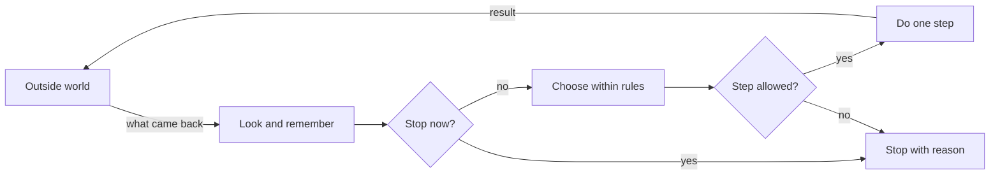
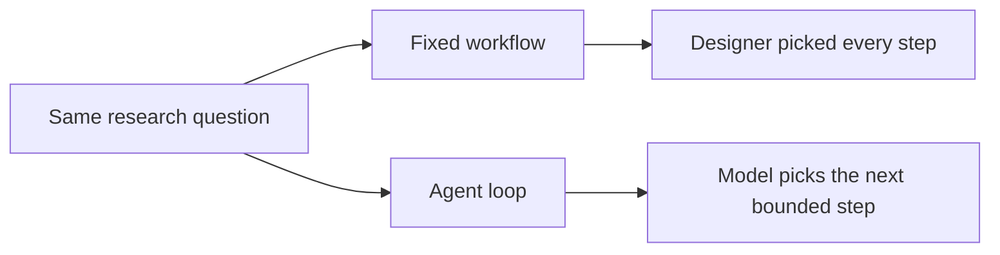

# Chapter 02: The Observe-Decide-Act Loop

> Status: reviewing
> Owner: Agentic System Design maintainers
> Last verified: 2026-09-06

## The problem

Imagine asking Northstar, our bounded research helper, “Find three approved sources about urban
bees and summarize them.”

The helper cannot succeed by making one giant guess. It must look at what is
available, choose a next step, do that step, and inspect what happened. It also
needs to know when to stop. Without limits, it might search forever, repeat the
same query, spend too much, or save an unsafe result.

An **agent** (software that uses a model to choose actions in pursuit of a goal
within explicit controls) needs a loop that makes this work visible and
controllable. This chapter builds that loop without requiring a live AI model.

## Learning objectives

By the end of this chapter, the reader can:

- explain environment, goal, observation, state, policy, action, and feedback;
- trace one complete observe-decide-act cycle;
- implement a small deterministic loop in Python 3.11;
- define controls, budgets, termination rules, and safe stop conditions;
- evaluate both the final result and the path taken to produce it; and
- identify when a fixed workflow is safer and simpler than an agent loop.

## First pass

Think about playing a board game.

First, you **observe** the board: where are the pieces? Next, you **decide**
which legal move best helps you win. Then you **act** by moving a piece. The
changed board gives you **feedback** (information returned after an action).
You remember the new position and repeat until the game ends.

An agent loop follows the same rhythm:

1. Observe what the system can currently know.
2. Update its state.
3. Decide on one permitted action.
4. Perform the action.
5. collect feedback and check whether to continue.

The board-game analogy is useful, but it has limits. A board has clear squares,
legal moves, and an agreed ending. Real environments can be incomplete, stale,
noisy, or changed by other people. A software action can send a message or
delete data, not merely move a wooden piece. The agent's policy may use a
probabilistic model, so the same situation may not always produce the same
choice. That is why the loop needs stronger controls than a game does.

Here are the parts:

- The **environment** (the world the agent can read or change) can include files,
  a database, a simulated room, or approved web pages.
- A **goal** (the desired result) is stated so success can be checked.
- An **observation** (a bounded snapshot) comes from the environment.
- **State** (the explicit record carried between turns) preserves needed facts.
- A **policy** (the rule or model that proposes the next action) uses the goal,
  state, and current observation.
- An **action** (a permitted operation with defined input and result) is one step.
- Feedback is the action result or later change that informs the next turn.
- **Controls** (enforced rules) limit what may happen.
- A **budget** (a measurable limit) might allow five steps or ten seconds.
- **Termination** (ending the loop) records why the runtime stopped.

The **runtime** (the control loop that manages state, model calls, tools,
budgets, and termination) owns the loop. The policy proposes. The runtime
checks. A tool performs the approved action.

## Picture the idea



**Takeaway:** Each new result must pass through memory, rules, and a stop check before
another action.

**Step by step:** First, the outside world supplies an observation. Second, the
runtime adds it to state and checks success, budgets, safety, and progress. Third, if
the run should continue, the policy proposes one action. Fourth, controls check that
proposal. A permitted action reads or changes the environment and returns feedback;
a failed stop or permission check ends the run with a recorded reason.



**Takeaway:** A workflow follows a prewritten route; an agent loop can choose a later
step from earlier results.

**Step by step:** Start with the same research question. In the workflow branch, the
designer has already picked every search and transition. In the agent branch, a model
may choose the next permitted search from recorded results. Both still use the same
approved catalog, budgets, authorization, and stop rules.

## Vocabulary

| Term | Plain-language meaning |
|---|---|
| Agent | Software that uses a model to choose actions toward a goal within explicit controls. |
| Environment | The part of the world the agent can read or change. |
| Goal | A desired result with a checkable success condition. |
| Observation | A bounded snapshot received from the environment. |
| State | The explicit record retained across steps. |
| Policy | A rule or model that proposes the next action from available information. |
| Action | A permitted operation with defined inputs and outputs. |
| Tool | A typed capability through which an agent reads or changes an environment. |
| Feedback | Information returned after an action or environment change. |
| Control | An enforced rule that permits, rejects, or pauses behavior. |
| Budget | A measurable limit on steps, time, money, data, or another resource. |
| Runtime | The code that runs the loop, manages state, enforces controls, and stops. |
| Trajectory | The recorded sequence of observations, decisions, actions, and results. |
| Policy model | A probabilistic component that may help choose an action; it does not enforce the controls. |
| Termination | Ending the loop with an explicit reason. |
| Safe stop condition | A rule that pauses or ends work before uncertain or harmful action. |
| Idempotency | Making a repeated request have no extra effect after the first success. |
| Evaluation | A repeatable measurement of outcomes, paths, safety, latency, or cost. |
| Observe-decide-act loop | Repeatedly inspect the situation, choose a permitted step, perform it, and use the result. |
| Reward | A numeric score used to indicate preferred outcomes. |
| Test double | A small replacement for a real dependency used in tests. |

## How it works

### 1. Give the loop a contract

Before starting, define:

- the goal and a success test;
- allowed observations and actions;
- state fields and their size limits;
- controls and who may authorize exceptions;
- budgets; and
- terminal reasons.

“Research bees” is too vague. “Return three distinct citations from the
approved catalog, or stop after five searches” can be checked.

### 2. Observe, but do not assume the observation is the world

An observation may contain search results, a tool error, a clock reading, or a
user response. It is partial evidence, not perfect truth. Attach useful facts
such as source, timestamp, and request identifier. Validate its shape and
reject oversized or malformed input.

The environment may change between observing and acting. For consequential
changes, the runtime should re-check important facts immediately before the
action.

### 3. Update explicit state

State should contain what later steps need: the goal, accepted sources, search
terms already tried, remaining budget, approvals, and prior tool results.
State is not a request for a model's private chain-of-thought. Store concise,
observable records such as “selected `search_catalog` because only one of three
required sources has been found.”

Not everything belongs in state. Secrets, unnecessary personal data, and an
unbounded transcript increase risk and cost. Keep the minimum useful record.

### 4. Ask the policy for a proposal

The policy can be a simple `if` statement, a planner, a search algorithm, or a
model. It receives only the information it needs and returns a structured
proposal, such as:

```text
action: search_catalog
arguments: {"query": "urban bee habitat"}
```

It does not directly run the tool. Separating proposal from execution creates
a control boundary: a place where ordinary deterministic code can validate
the action name, arguments, permissions, and budget.

### 5. Enforce controls, then act

Useful controls include:

- an allowlist of tool names;
- typed and size-limited arguments;
- least-privilege identity;
- authorization tied to the current user and goal;
- human approval for consequential side effects;
- idempotency keys for retries;
- rate and concurrency limits; and
- isolation between untrusted content and instructions.

If a proposal fails a control, the runtime rejects it. It must not ask the same
policy to “please ignore” an enforced boundary.

### 6. Convert the result into feedback

A tool result should state success or failure, return bounded data, and include
an error category when it fails. The runtime records it, updates counters, and
observes again. A successful tool call is not the same as a successful goal:
a search can run correctly yet find nothing useful.

### 7. Terminate deliberately

Check termination on every cycle. Common terminal reasons are:

- `success`: the success test passed;
- `step_budget_exhausted`, `time_budget_exhausted`, or
  `cost_budget_exhausted`;
- `denied`: authorization or policy rejected the requested work;
- `needs_approval`: a human decision is required;
- `no_progress`: recent steps repeat without measurable improvement;
- `invalid_observation` or `tool_failure`;
- `cancelled`: the user or operator asked the runtime to stop; and
- `unsafe`: continuing could exceed a safety boundary.

A stop is an outcome, not an embarrassment. Return partial safe work, the
reason, and a clear next step when possible.

## Engineering deep dive

One useful abstraction is:

```text
observation_t = observe(environment)
state_t       = update(state_t-1, observation_t)
proposal_t    = policy(goal, state_t)
action_t      = controls.authorize(proposal_t, state_t, budgets)
feedback_t    = environment.apply(action_t)
```

The subscript `t` means “at this step.” The loop ends when a termination
predicate (a function returning true or false) matches.

This resembles the agent-environment framing used in artificial intelligence
and reinforcement learning. However, feedback need not be a single numeric
**reward** (a score used to indicate preferred outcomes). It can be a typed
search result, an error, or an approval response. A language-model policy also
does not make the whole system nondeterministic. Parsing, authorization,
budgets, state transitions, and tool execution can remain deterministic.

### State-machine view

Production runtimes benefit from explicit states:

```text
READY -> OBSERVING -> DECIDING -> AUTHORIZING -> ACTING -> READY
                                \-> WAITING_FOR_APPROVAL
any state -> STOPPED
```

Persist the state before and after an external side effect. If a process
crashes after sending a message but before recording success, an idempotency
key lets a retry discover that the message was already sent.

### Policy choices

A fixed policy is easy to test and should be the baseline. A search or planning
algorithm can compare possible future steps when the environment model is
reliable. A model policy is useful when observations are language and valid
next steps vary. It is also harder to predict and evaluate.

Use a predetermined workflow when the path is known, the decision rules are
stable, or mistakes are costly. Use an agent loop only when choosing the next
step from changing observations adds enough value to justify its uncertainty.

### Budgets are multidimensional

A step limit alone is not enough. Track wall-clock time, tool calls, model
tokens, estimated cost, retries, bytes read, and side effects as appropriate.
Reserve enough budget to save state and stop cleanly. Check a budget before
starting work, not only after spending it.

### Safe stop conditions

Stop or pause when:

- required authorization is absent or expired;
- the proposed action is outside the allowlist or goal scope;
- an observation is untrusted and requests new permissions;
- the environment changed since a consequential decision;
- confidence or evidence is below a declared threshold;
- repeated steps show no progress;
- a tool's result is ambiguous after retries;
- a budget would be exceeded by the next action; or
- cancellation, emergency stop, or operator override is received.

The emergency stop must live outside the policy model. The runtime should be
able to cancel queued work, block new side effects, preserve an audit record,
and report what may already have happened.

## Build it in Python

This offline example searches a tiny catalog. Its policy is deliberately
transparent and deterministic.

```python
from dataclasses import dataclass, field
from typing import Literal

StopReason = Literal["success", "step_budget_exhausted", "no_progress"]

CATALOG = {
    "urban bees": ["City Bee Survey", "Rooftop Pollinator Study"],
    "bee habitat": ["Garden Habitat Guide", "City Bee Survey"],
}


@dataclass
class State:
    goal_count: int = 3
    found: list[str] = field(default_factory=list)
    tried_queries: list[str] = field(default_factory=list)
    steps: int = 0
    max_steps: int = 4


def observe(state: State) -> dict[str, object]:
    return {
        "found_count": len(state.found),
        "remaining_steps": state.max_steps - state.steps,
    }


def decide(state: State, observation: dict[str, object]) -> dict[str, str]:
    if observation["found_count"] >= state.goal_count:
        return {"action": "finish", "reason": "success"}

    for query in ("urban bees", "bee habitat"):
        if query not in state.tried_queries:
            return {"action": "search_catalog", "query": query}

    return {"action": "finish", "reason": "no_progress"}


def authorize(proposal: dict[str, str], state: State) -> None:
    allowed = {"search_catalog", "finish"}
    if proposal.get("action") not in allowed:
        raise ValueError("Action is not allowed")
    if state.steps >= state.max_steps and proposal["action"] != "finish":
        raise RuntimeError("Step budget exhausted")


def act(proposal: dict[str, str]) -> list[str]:
    if proposal["action"] == "finish":
        return []
    return CATALOG.get(proposal["query"], [])


def run() -> tuple[StopReason, State, list[dict[str, object]]]:
    state = State()
    trace: list[dict[str, object]] = []

    while True:
        observation = observe(state)
        proposal = decide(state, observation)
        authorize(proposal, state)
        trace.append({"observation": observation, "proposal": proposal.copy()})

        if proposal["action"] == "finish":
            return proposal["reason"], state, trace  # type: ignore[return-value]

        feedback = act(proposal)
        state.steps += 1
        state.tried_queries.append(proposal["query"])
        state.found.extend(item for item in feedback if item not in state.found)
        trace[-1]["feedback"] = feedback

        if state.steps >= state.max_steps and len(state.found) < state.goal_count:
            return "step_budget_exhausted", state, trace


if __name__ == "__main__":
    reason, final_state, trace = run()
    print({"stop_reason": reason, "found": final_state.found})
    for step in trace:
        print(step)
```

The catalog is a **test double** (a small replacement for a real dependency
used in tests). No network, account, personal data, payment, or model is
needed. In a larger design, replace only `decide` with a model-backed policy.
Keep `authorize`, budget checks, stop handling, and tools outside that model.

## Microsoft implementation

The loop is a vendor-neutral design. It does not require a cloud service.

This chapter intentionally gives no cloud code because the local loop demonstrates
the mechanism. Keep application goal checks, authorization, budgets, and stop rules
independent of a service. A Microsoft mapping requires fresh, approved,
chapter-specific primary sources; the current source ledger does not provide them.

## How leading teams approach it

Published foundations describe agents in terms of what they perceive and do in
an environment, with behavior judged against a performance objective
(SRC-001). Reinforcement-learning literature formalizes an agent interacting
with an environment through observations, actions, policies, and feedback
(SRC-012). Classic agent research also emphasizes reactive behavior, which responds
to change, alongside goal-directed behavior (SRC-002).

The engineering interpretation for this chapter is: make the interaction
boundary explicit, keep the trajectory observable, and judge the policy by
repeatable results rather than by a convincing explanation. These sources do
not by themselves prescribe this chapter's exact runtime or controls.

## Failure lab

Reproduce a looping failure on paper or in the Python example:

1. Change the query loop in `decide` so it always returns `urban bees`.
2. Run the program.
3. Observe that the same action repeats and no new sources appear.

The important failure is not that search returned duplicates. It is that the
policy ignored its state. The step budget eventually limits the damage, but it
still wastes work.

Apply two corrections:

1. Restore the check against `state.tried_queries`.
2. Add a no-progress counter that stops after two consecutive actions add
   zero new items.

Measure the correction with two assertions:

```python
reason, state, trace = run()
assert reason == "success"
assert len(state.found) >= state.goal_count
assert len(trace) <= state.max_steps + 1
```

Also test an empty catalog. The expected result is a bounded `no_progress` or
`step_budget_exhausted` stop, never an endless loop.

## Security and safety testing

**Safe offline boundary test:** Replace one policy proposal with the synthetic action
`{"action": "send_email"}`. That action is outside the catalog loop's allowlist.
Wrap `act` with an in-memory call counter; use no address, account, credential,
personal data, network, or live target.

**Expected contained result:** `authorize` raises `ValueError("Action is not
allowed")` before `act` runs. The catalog and explicit state remain unchanged.

**Evidence:** Catch and assert the error text, then assert `tool_calls == 0`,
`state.steps == 0`, `state.found == []`, and `state.tried_queries == []`. Those
observations prove that the loop contained the proposal at its authorization boundary.

## Evaluation

An **evaluation** is a repeatable measurement of outcomes, paths, safety,
latency, or cost. Test a set of ordinary, edge, denied, and adversarial cases.

| Dimension | Example check |
|---|---|
| Outcome | At least three distinct approved sources are returned, or a truthful stop reason is given. |
| Trajectory | No query repeats without new evidence; every action follows an observation and authorization. |
| Safety | Forbidden actions execute zero times; missing approval always pauses. |
| Termination | Every case stops within its declared step and time budgets. |
| Latency | The 95th-percentile completion time stays below the chosen target. |
| Cost | Tool calls, tokens, and estimated spend stay within per-run budgets. |
| Recovery | Restarting from a saved state neither loses accepted work nor repeats a side effect. |

Test the final answer and the trajectory. A good answer reached through an
unauthorized action is a failed run. A safe refusal in an impossible case can
be a successful run. Compare against a fixed workflow baseline; if the agent
does not improve task completion enough to justify extra latency, cost, and
risk, use the workflow.

## Production checklist

- [ ] Goal and machine-checkable success criteria are defined
- [ ] Observation sources, freshness, validation, and size limits are defined
- [ ] State schema, retention, redaction, and recovery are defined
- [ ] Security and identity boundaries identified
- [ ] Tools use allowlists, typed inputs, least privilege, and idempotency
- [ ] Consequential side effects require explicit authorization
- [ ] Failure and recovery behavior defined
- [ ] Budgets are checked before each action and reserve capacity for safe stop
- [ ] Success, denial, cancellation, no-progress, and unsafe stop paths tested
- [ ] Telemetry and redaction defined
- [ ] Quality, latency, safety, and cost budgets defined
- [ ] Emergency stop works independently of the policy model
- [ ] Rollout and rollback paths defined
- [ ] Fixed-workflow baseline measured

## Review questions

1. What is the difference between an observation and state?
2. Why should a policy propose an action rather than execute it directly?
3. How can a tool call succeed while the goal still fails?
4. Name three budgets other than a step limit.
5. What should happen when an action requires approval?
6. Why is `no_progress` a useful stop reason?
7. Which parts of the example stay deterministic if a model replaces the
   policy?
8. When is a fixed workflow a better design?

## Try it safely

Use paper, a pencil, six coins, and a six-sided die. Do not use personal
information or a live service.

1. Draw boxes labeled `start`, `cupboard`, and `table`. Put all coins in
   `start`. The goal is “move four coins to the table.”
2. Your allowed actions are `look`, `move one coin to cupboard`, `move one coin
   from cupboard to table`, and `stop`.
3. Set a budget of eight actions. Write every observation and action.
4. Before each move, roll the die. On a 1, the move fails and becomes feedback.
   On any other number, it succeeds.
5. Stop on success, after eight actions, after two identical failures, or if
   your partner says “cancel.”
6. Circle the stop reason and count actions used.

Now change the goal to five coins without changing the budget. Compare two
policies: “repeat the last successful move” and “choose based on coin
locations.” Neither person may invent a new action. Discuss which policy makes
better use of observations and why the controls still matter.

## Common misunderstanding

**“Observe-decide-act means the AI model is in charge of everything.”**

No. A model may help with the decide step. Ordinary software should own tool
permissions, argument validation, identity, approvals, budgets, state
persistence, cancellation, and termination. The policy proposes; the runtime
enforces.

## Recap and next step

- An agent repeatedly observes, updates state, decides, acts, and uses feedback.
- Goals and success tests tell the loop what “done” means.
- Controls limit authority; budgets limit resource use.
- Safe stop conditions are first-class outcomes, not afterthoughts.
- Evaluate the result and the trajectory against a simpler baseline.

The next chapter explains the AI and language-model ideas that can power a
policy. This loop remains the protective software frame around that
probabilistic component.

## Design exercise

Design a library-book helper with this goal: “Find an available book on a
requested topic and place a hold only after the reader approves.”

Choose one of two defensible designs:

- a fixed workflow: search, show choices, request approval, place hold; or
- an agent loop that may refine searches based on availability and reader
  preferences.

Write:

1. environment and goal;
2. observations and explicit state;
3. allowed actions and their typed inputs;
4. policy choice and why it is needed;
5. controls for identity, approval, and duplicate holds;
6. step, time, and side-effect budgets;
7. success and safe stop conditions; and
8. one evaluation where the fixed workflow should win.

There is no single correct choice. Defend it using task variability, risk,
latency, and testability.

## Hands-on lab

Use the embedded [Build it in Python](#build-it-in-python) program as the lab.

1. Save the code as `loop_demo.py` in a disposable learning folder.
2. Run `python loop_demo.py` with Python 3.11 or newer.
3. Treat `CATALOG` as the fixture. No network access is needed.
4. Confirm the expected trace: `urban bees`, then `bee habitat`, then
   `finish`; the final reason is `success`, with at least three distinct items.
5. Add the assertions from [Failure lab](#failure-lab).
6. Test duplicate-only and empty fixtures. Confirm bounded termination.
7. Add a `cancelled` flag to state and make the runtime check it before acting.
8. Cleanup: delete only the learning-folder copy of `loop_demo.py`.

The lab is intentionally a simulation. It exposes every decision and avoids
accounts, payments, provider calls, and consequential side effects.

**Navigation:** [Previous: Chapter 1: Why Agentic Systems](01-why-agentic-systems.md) | [Module 01 overview](../README.md) | [Next: Chapter 3: AI and LLM Primer](03-ai-and-llm-primer.md)

## Sources

Approved source-ledger entries used:

- **SRC-001: Pearson, _Artificial Intelligence: A Modern Approach, Fourth
  Edition_ (2020).** Rational-agent framing, environments, and performance
  objectives. <https://aima.cs.berkeley.edu/>. Freshness: durable.
- **SRC-002: IEEE, Wooldridge and Jennings, “Intelligent Agents: Theory and
  Practice” (1995).** Reactivity and goal-directed agent properties.
  <https://doi.org/10.1017/S0269888900008122>. Freshness: durable.
- **SRC-012: Sutton and Barto, _Reinforcement Learning: An Introduction,
  Second Edition_ (2018).** Agent-environment interaction, policies, actions,
  and feedback. <http://incompleteideas.net/book/the-book-2nd.html>.
  Freshness: durable.
- **SRC-027: Google DeepMind, “Mastering Atari, Go, Chess and Shogi by
  Planning with a Learned Model” (2020).** Example of policy, value, planning,
  and environment interaction. <https://www.nature.com/articles/s41586-020-03051-4>.
  Freshness: durable.
No benchmark, price, model-limit, legal, or product-capability claim is made here.
