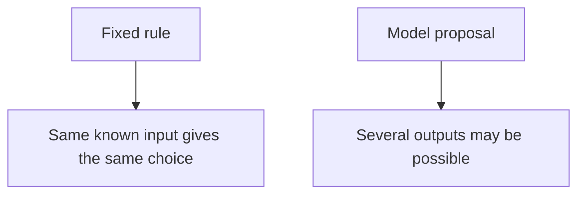
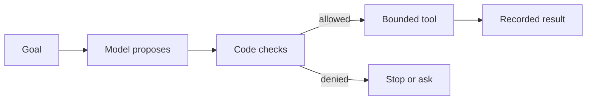
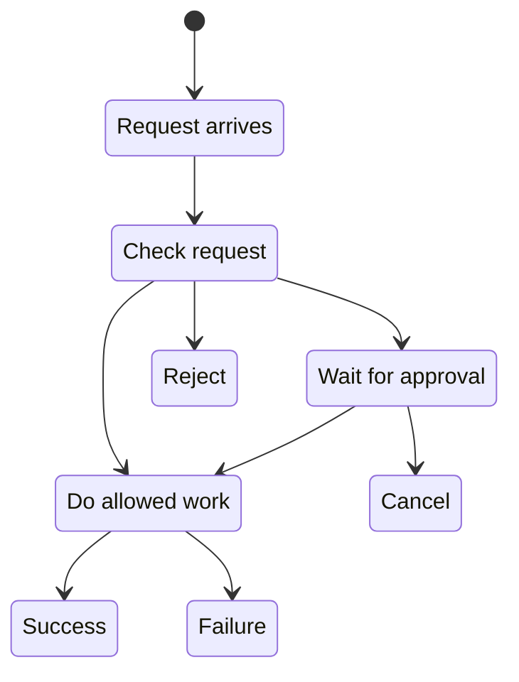

# Chapter 04: From Software to AI Systems

> Status: drafting  
> Owner: Module 01 Chapter 04 author  
> Last verified: 2026-09-06

## The problem

A calculator should return `4` for `2 + 2` every time. A language model may return
different wording or a wrong answer for the same request. Northstar, our bounded
research helper, must use generated language without letting fluent text become
unchecked evidence or an unauthorized action.

The solution is not to pretend that a model is certain. It is to place the model
inside ordinary software that checks data, authority, sequence, resources, and
results.

## Learning objectives

By the end of this chapter, the reader can:

- identify at least four deterministic controls around a probabilistic model;
- write a typed action contract and reject invalid data;
- trace a state machine with approval, success, failure, and stop states;
- distinguish validation from authorization;
- distinguish a control plane from a data plane;
- implement and test a small offline controller; and
- define quality, safety, latency, cost, and recovery checks.

## First pass

Imagine a creative cook in a school cafeteria. The cook can suggest lunches, but
doors, allergy rules, an approved menu, a budget, and closing time limit what the
cafeteria serves.

The cook is like a **probabilistic model** (a component that assigns likelihoods to
possible outputs). The cafeteria rules are like **deterministic software** (explicit
rules that produce a predictable decision from the same known input and state). The
model proposes; deterministic software accepts, rejects, asks for approval, or stops.

**Where the analogy stops:** a model is not a person. It has no taste, duty, or
understanding, and fluent output does not show knowledge. Cafeteria rules are also
not perfect: software controls can fail when their requirements, data, or code are
wrong.

For Northstar, the model may propose:

```text
{"action": "inspect_source", "source_id": "S17"}
```

That text is untrusted data. Code checks its shape, confirms that `S17` belongs to
the approved catalog, verifies that the action is read-only, checks the remaining
budget, and records the result. The model never chooses the user's identity or
creates a new tool by naming one.

## Picture the idea

> **Optional interactive visual: a beginner-friendly architecture journey.** In a local
> copy of this repository, open [the offline animation](../../../visuals/agent-system-journey/index.html)
> directly in a desktop browser, or read [its transcript](../../../visuals/agent-system-journey/transcript.md).
> It starts paused and never autoplays, so playback is optional. The static Mermaid
> diagrams and prose below remain a complete fallback.



**Takeaway:** Fixed rules are predictable, while model proposals can vary.

**Step by step:** Compare the two rows. In the first, deterministic code applies one
explicit rule to known input and state. In the second, a probabilistic model assigns
likelihoods and may propose different output. The comparison does not promise that
ordinary software is bug-free or that model output always changes.



**Takeaway:** A model can propose an action, but only checked code can let a tool run.

**Step by step:** First, a goal goes to a model. Second, the model proposes an action.
Third, ordinary code checks it. Fourth, an allowed proposal reaches a narrow tool,
while a denied or approval-dependent proposal stops or waits. Finally, the tool
result is recorded. The picture omits retries and changing state.



**Takeaway:** A state machine makes forbidden jumps, such as acting before required
approval, unavailable.

**Step by step:** First, a request arrives and is checked. The check can reject it,
pause for approval, or permit work. Approval can permit work or cancellation.
Allowed work ends in success or failure. Production systems also need timeout
transitions from every nonterminal state.

## Vocabulary

| Term | Plain-language meaning |
|---|---|
| Allowlist | An explicit list of permitted choices. |
| Authorization | Checking whether an identified actor may perform an operation on a resource. |
| Budget | An enforced limit on steps, time, tokens, money, or side effects. |
| Compensation | An action that reduces or reverses an earlier side effect when true rollback is unavailable. |
| Contract | A precise agreement about allowed inputs, outputs, and errors. |
| Control plane | The part that configures, permits, budgets, routes, and stops work. |
| Data plane | The part that processes requests and performs permitted work. |
| Data provenance | Information about where data came from and how it changed. |
| Defense in depth | Multiple controls so one failure need not defeat every protection. |
| Deterministic software | Explicit rules that produce a predictable decision from the same known input and state. |
| Idempotency key | An identifier used to make repeated requests count as one operation. |
| Fail closed | Deny an action when a required safety decision cannot be made. |
| Model double | A predictable substitute for a model used in tests. |
| Observability | The ability to understand a system from recorded events and measurements. |
| Postcondition | A fact that should be true after an action. |
| Precondition | A fact that must be true before an action. |
| Probabilistic model | A component that assigns likelihoods to possible outputs. |
| Prompt | Instructions and input supplied to a model. |
| Prompt injection | Untrusted content crafted to redirect model behavior. |
| Safe boundary | A place where data or authority is deliberately restricted. |
| State machine | Named states and the permitted transitions between them. |
| Terminal state | A state from which a run performs no further action. |
| Token | A unit of text processed by a language model. |
| Validation | Checking whether data follows required rules and current preconditions. |

## How it works

### 1. Give proposals a contract

A **contract** states fields, types, required values, size limits, allowed action
names, errors, and a version. It can also state **preconditions** and
**postconditions**.

```text
InspectSourceV1
input:
  action: exactly "inspect_source"
  source_id: 1-20 letters or digits
  researcher_id: supplied by the signed-in session, never by the model
preconditions:
  source exists in the approved catalog
result:
  source passage and provenance, or a typed rejection
```

The source of `researcher_id` is **data provenance**. The model may choose a source
identifier from supplied candidates, but it may not choose whose authority to use.

### 2. Separate validation from authorization

**Validation** asks, “Is the request well formed, allowed by the contract, and
currently possible?” **Authorization** asks, “May this identified actor perform this
operation on this resource?” A valid source identifier can still be forbidden to the
current user. Run both checks at the tool boundary, and recheck changing
preconditions immediately before an effect.

### 3. Restrict sequence with a state machine

A **prompt** may say “ask before publishing,” but a state machine can make
`EXECUTING` unreachable until approval exists. Persist state before and after a
consequential operation. A late approval for a cancelled run must not revive it.

Retries need care. A read is often safe to repeat; sending or charging may happen
twice. An **idempotency key** lets a tool return the stored result of the first
successful operation. If a multi-step effect cannot be rolled back, define
**compensation** and reconciliation rather than pretending the whole transaction
vanished.

### 4. Narrow data, authority, and resources

Useful **safe boundaries** include:

1. input limits on size, type, encoding, and source;
2. model context containing only needed data;
3. typed tools instead of a shell or broad database account;
4. verified identity and least-privilege credentials;
5. approved network destinations;
6. human approval for high-impact or irreversible effects;
7. time, step, token, and cost budgets enforced outside the model; and
8. output escaping and review for its destination.

This is **defense in depth**. No layer is magic: an allowlisted tool is still unsafe
if that tool has excessive power.

## Engineering deep dive

### Control plane and data plane

An airport control tower permits routes; a plane performs the trip. Likewise, the
**control plane** holds policies, identities, allowlists, approvals, limits, rollout
rules, and emergency stops. The **data plane** carries each request, model proposal,
tool call, and result.

**Where the analogy stops:** these are software responsibilities, not necessarily
separate machines. A small program can contain both. The important rule is that a
data-plane failure cannot grant itself broader permission or rewrite its own budget.

### Observable events, not a surveillance diary

Record facts needed to operate and evaluate the system:

- run identifier and state transition;
- contract, policy, model, prompt-template, and tool versions;
- validation and authorization result categories;
- tool start, result category, duration, and retry count;
- step, token, time, and cost counters; and
- final outcome and stop reason.

Do not log private chain-of-thought. Minimize prompts and retrieved passages, redact
secrets and personal data, and restrict retention and access. A model explanation is
not proof of why its numerical computation produced an output.

### Common failure boundaries

| Failure | Deterministic response |
|---|---|
| Invented action or field | Strict parsing and an action allowlist reject it. |
| Valid but forbidden action | Resource-level authorization denies it. |
| Stale proposal | Recheck preconditions before execution. |
| Duplicate side effect | Reuse an idempotency key and stored result. |
| Endless loop | Enforce step and time budgets and a terminal state. |
| Prompt injection in a source | Treat source text as data; keep tools policy-gated. |
| Provider or parser failure | Use a typed error, bounded retry, fallback, or safe stop. |
| Partial multi-step work | Persist state, reconcile, and compensate where possible. |

**Fail closed** (deny an action when a required safety decision cannot be made) for
consequential work. A harmless read-only feature may instead use a reduced,
deterministic fallback.

## Build it in Python

This Python 3.11 program is offline. A **model double** (a predictable substitute for
a model in a test) proposes an action; code alone validates and authorizes it.

```python
from dataclasses import dataclass
from enum import Enum, auto
import re


class State(Enum):
    RECEIVED = auto()
    VALIDATING = auto()
    EXECUTING = auto()
    SUCCEEDED = auto()
    REJECTED = auto()


@dataclass(frozen=True)
class Proposal:
    action: str
    source_id: str


def model_double(_request: str) -> Proposal:
    return Proposal(action="inspect_source", source_id="S17")


def valid(proposal: Proposal) -> bool:
    return (
        proposal.action == "inspect_source"
        and re.fullmatch(r"[A-Za-z0-9]{1,20}", proposal.source_id) is not None
    )


def authorized(user: dict, proposal: Proposal) -> bool:
    return (
        "inspect_source" in user["permissions"]
        and proposal.source_id in user["approved_sources"]
    )


def inspect_source(source_id: str) -> dict[str, str]:
    catalog = {"S17": "Urban bees use many small garden habitats."}
    return {"source_id": source_id, "passage": catalog[source_id]}


def run(request: str, user: dict) -> dict:
    state = State.RECEIVED
    proposal = model_double(request)
    state = State.VALIDATING

    if not valid(proposal) or not authorized(user, proposal):
        return {"state": State.REJECTED.name}

    state = State.EXECUTING
    result = inspect_source(proposal.source_id)
    state = State.SUCCEEDED
    return {"state": state.name, "result": result}


user = {
    "permissions": {"inspect_source"},
    "approved_sources": {"S17"},
}
assert run("Inspect the best approved source", user) == {
    "state": "SUCCEEDED",
    "result": {
        "source_id": "S17",
        "passage": "Urban bees use many small garden habitats.",
    },
}
```

The model double does not think or research. Production code also needs typed errors,
timeouts, persisted transitions, bounded telemetry, current-catalog checks, and
idempotency for any side effect.

## Microsoft implementation

Keep the domain contract, state machine, tools, and evaluations independent of a
service SDK. No Microsoft product mapping is asserted because the source ledger
currently assigns no approved Microsoft primary sources to Chapter 4. Before an
implementation, approve and freshly verify the relevant service, identity,
telemetry, secrets, and supported Python SDK documentation.

## How leading teams approach it

No source-ledger entry is currently approved for Chapter 4, so this chapter does not
attribute a “leading teams” claim. The engineering pattern used here is explicit:
treat model output as untrusted data and test each deterministic boundary. Published
comparison with external practices remains an evidence gap, not a conclusion to
invent.

## Failure lab

Reproduce a boundary failure in the Python program:

1. Change the model double to return `Proposal("erase_catalog", "S17")`.
2. Run the file and confirm the result is `{"state": "REJECTED"}`.
3. Restore the action, change `source_id` to `"PRIVATE1"`, and confirm rejection.
4. Restore the original proposal and remove `"inspect_source"` from permissions;
   confirm rejection again.

The three cases isolate contract validation, resource scope, and authorization.
Correct the double after the test. Add an assertion that `inspect_source` is never
called for a rejected proposal; rejection is only useful if no effect occurs.

## Security and safety testing

**Safe offline boundary test:** Change the model double to return
`Proposal("inspect_source", "PRIVATE1")`. The synthetic user approves only `S17`.
Wrap `inspect_source` with an in-memory call counter. Use no real source, credential,
personal data, network, malware, or live target.

**Expected blocked result:** Resource-level authorization returns false, `run`
returns `{"state": "REJECTED"}`, and the tool never reads the catalog.

**Evidence:** Assert the exact returned state, `tool_calls == 0`, and the absence of a
result payload. A redacted test event containing only `authorization_denied` and the
synthetic run ID proves that the request stopped at the intended boundary.

## Evaluation

Test ordinary, edge, adversarial, and injected-failure cases.

| Dimension | Example measurable check |
|---|---|
| Outcome | At least 95 of 100 labeled requests return the correct approved passage or a correct rejection. |
| Trajectory | Every run uses only permitted state transitions and tools. |
| Safety | Zero unapproved sources are returned in the adversarial set. |
| Contract | Every malformed proposal is rejected before tool execution. |
| Latency | The 95th-percentile offline run stays below the chosen machine-specific target. |
| Cost | Model calls, tokens, and tool calls remain within the per-run budget. |
| Recovery | Injected retries cause zero duplicate effects. |
| Observability | Every run has a stop event, and seeded secrets never appear in logs. |

The numbers are design examples, not universal standards. Record the test set,
machine, configuration, and date. Compare Northstar with the fixed search-and-return
workflow; keep the workflow if model-directed searching does not justify its extra
risk, latency, and cost.

## Production checklist

- [ ] Contracts, states, and errors are versioned
- [ ] Validation and authorization are separate and tested
- [ ] Identity and tool permissions use least privilege
- [ ] Consequential operations require approval and idempotency
- [ ] State is persisted around external effects
- [ ] Step, time, token, cost, and side-effect budgets are enforced
- [ ] Prompt injection and malformed output tests fail safely
- [ ] Telemetry is useful, minimized, redacted, and access-controlled
- [ ] Quality, safety, latency, cost, and recovery thresholds are met
- [ ] Outages, retries, cancellation, and emergency stop are rehearsed
- [ ] A limited rollout and rollback path exist
- [ ] The fixed-workflow baseline is measured

## Review questions

1. Why is a model proposal untrusted data?
2. How do validation and authorization differ?
3. Which identity fields must never come from the model?
4. How does a state machine enforce approval better than a prompt?
5. Why can a retry duplicate a side effect?
6. What belongs in the control plane and data plane?
7. Which events are useful to record, and which data should be omitted?
8. When should a system fail closed?

## Try it safely

Use paper cards only; do not use an account, network, live model, or real personal
information.

1. Draw `RECEIVED`, `VALIDATING`, `AWAITING_APPROVAL`, `EXECUTING`, `SUCCEEDED`,
   `REJECTED`, and `CANCELLED` cards.
2. Write made-up proposals: a valid source read, a missing source ID, an invented
   action, a forbidden source, and an action needing approval.
3. Move each proposal only along a permitted transition.
4. Check shape, source scope, authorization, and approval separately.
5. Confirm every run reaches a terminal card and record its stop reason.

The cards represent states, not concurrent software or crash recovery. A production
runtime must persist and coordinate transitions safely.

## Common misunderstanding

**“If the model is accurate enough, the surrounding controls are unnecessary.”**

No measured accuracy guarantees the next output. A model can receive hostile input,
meet stale state, emit malformed data, or be retried after an unseen success. Better
proposals do not replace identity, authorization, transaction rules, budgets, or
recovery.

## Recap and next step

- A model proposes; deterministic software checks and executes.
- Contracts restrict shape, state machines restrict sequence, and authorization
  restricts authority.
- Safe boundaries limit data, tools, networks, effects, and resources.
- Observable outcomes and transitions support evaluation without human-like claims.
- A simpler fixed workflow remains the baseline.

Module 2 turns Northstar's paper architecture into the smallest useful offline agent:
structured messages, a replaceable inference interface, typed research tools, a
bounded runtime, and explicit stop conditions.

## Design exercise

Finish Northstar's Module 1 design. Compare:

- **fixed workflow:** search once, return matching approved passages, stop; and
- **bounded agent:** refine a search from earlier results, cite approved evidence,
  and stop on success, no progress, denial, or budget.

Define the contract, states, observations, permitted actions, forbidden actions,
identity source, budgets, approval boundary, stop reasons, eight observable events,
four release thresholds, and the evidence that would justify the agent over the
workflow.

## Hands-on lab

Save the [Build it in Python](#build-it-in-python) code as `system_shell.py` in a
disposable learning folder and run it with Python 3.11 or later.

1. Confirm the success assertion.
2. Add assertions for the three rejected proposals in the failure lab.
3. Wrap `inspect_source` with a counter and assert it remains zero after rejection.
4. Test a 21-character identifier and punctuation; both must be rejected.
5. Restore the passing fixture and delete only the learning-folder copy.

The fixture is offline and read-only. It creates no account, network request,
payment, or real-world side effect.

## Sources

- **SRC-070 (durable):** Sculley et al., "Hidden Technical Debt in Machine Learning
    Systems," NeurIPS, 2015. Production ML systems contain extensive surrounding
    controls and dependencies beyond the model itself.
    <https://papers.nips.cc/paper/5656-hidden-technical-debt-in-machine-learning-systems>
- **SRC-071 (durable):** Breck et al., "The ML Test Score: A Rubric for ML Production
    Readiness and Technical Debt Reduction," IEEE Big Data, 2017. Production readiness
    requires tests and monitoring across data, models, infrastructure, and operations.
    <https://research.google/pubs/the-ml-test-score-a-rubric-for-ml-production-readiness-and-technical-debt-reduction/>
