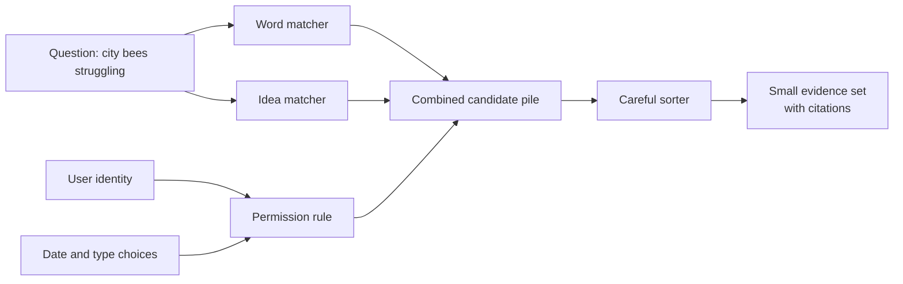
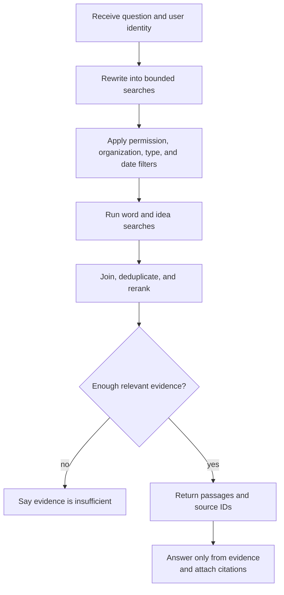

# Chapter 11: Advanced Retrieval

> Status: reviewing
> Owner: Agentic System Design maintainers
> Last verified: 2026-09-06

**On this page**

- [Understand the idea](#the-problem): problem, objectives, first pass, picture, and vocabulary
- [Build the mechanism](#how-it-works): how it works, engineering detail, and Python
- [Apply it](#microsoft-implementation): implementation choices, failures, safety, and evaluation
- [Practice and continue](#review-questions): review, exercises, lab, recap, and sources

## The problem

Northstar can now search approved notes and cite the passages used in Mina's
class reports. But a real library is messy. Mina next asks, “Why are city bees having a hard
time?” One useful report says “urban pollinator decline” and never says “having
a hard time.” Another document contains the exact words but is ten years old.
A third is a private staff note. Which results should Northstar show?

Advanced retrieval is not “find text that sounds close.” It is a controlled
pipeline that finds candidates, enforces boundaries, orders evidence, and
reports where each claim came from. A confident answer cannot repair missing,
forbidden, stale, or misleading evidence.

## Learning objectives

By the end of this chapter, the reader can:

- explain keyword, vector, and hybrid search in plain language;
- describe embeddings, filters, metadata, query rewriting, and reranking;
- place permission and freshness checks at the correct boundaries;
- return citations that point to the evidence actually retrieved;
- calculate precision and recall from a small labeled set;
- build and evaluate a deterministic offline hybrid retriever;
- test that synthetic private records remain blocked; and
- recognize when simple keyword search is safer and sufficient.

## First pass

Imagine a library detective. The detective has three helpers:

1. The **word matcher** finds books containing the words on the request.
2. The **idea matcher** finds books whose descriptions seem to mean something
   similar, even when their words differ.
3. The **rule keeper** removes books the visitor may not read, books of the
   wrong type, and books outside an allowed date range.

The detective can combine both matchers, then ask a careful sorter to inspect a
small candidate pile. This is **hybrid search** (combining word and meaning
signals). The sorter performs **reranking** (scoring a small candidate set again
with a more careful method). Every returned note includes a **citation** (a
pointer to the source and exact passage supporting it).

The detective also checks the visitor's library card *before* searching private
shelves. Hiding a forbidden title only at the end is too late: its title, score,
or text may already have leaked.

The analogy has limits. Software does not understand books as a human
detective does. An **embedding** (a list of numbers representing patterns in
content) is not meaning itself. Similar numbers can join unrelated passages,
miss new language, or preserve flaws in training data. Dates and permissions
are trustworthy only when their source systems and updates are trustworthy.
Retrieval improves the evidence available to a model; it does not guarantee a
true answer.

## Picture the idea

### Visual 1: three helpers, one permitted shelf



**Takeaway:** Use several clues to find evidence, but let permissions and
explicit filters control which shelf can contribute.

**Ordered prose walkthrough:** (1) the question goes to a word matcher and an
idea matcher; (2) the user's identity, chosen dates, and document types become
rules; (3) only permitted candidates enter one combined pile; (4) a careful
sorter orders that pile; and (5) the system returns a small evidence set with
citations.

### Visual 2: a boundary-first retrieval flow



**Takeaway:** Authorization happens before candidate text is exposed, and “not
enough evidence” is a valid result.

**Ordered prose walkthrough:** (1) receive the question and identity; (2)
rewrite only within declared limits; (3) apply permission, organization, type,
and date filters; (4) run word and idea search; (5) join, deduplicate, and rerank
permitted results; (6) check evidence sufficiency and abstain if evidence is
weak; and (7) otherwise return passages and source IDs for a cited answer.

## Vocabulary

| Term | Plain-language meaning |
|---|---|
| Candidate | A possibly useful result not yet chosen as final evidence. |
| Citation | A stable pointer to the source and passage supporting a claim. |
| Corpus | The collection of documents available to a search system. |
| Cross-encoder | A model that scores a query and a candidate passage together. |
| Embedding | A fixed-length list of numbers representing learned patterns in content. |
| Filter | An exact rule that includes or excludes records, such as type or date. |
| Freshness | How current a record and its search index are for the task. |
| Hybrid search | Retrieval that combines keyword and vector signals. |
| Keyword search | Search based mainly on matching terms in text. |
| Metadata | Structured facts about content, such as owner, date, tenant, and source ID. |
| Permission filtering | Restricting search to records the current identity may read. |
| Precision | The share of retrieved items that are relevant. |
| Query rewriting | Turning a request into one or more bounded search queries. |
| Recall | The share of all relevant items that retrieval found. |
| Reciprocal rank fusion | A method that combines ranked lists using each item's position rather than incompatible raw scores. |
| Reranking | Applying a more careful scorer to a small candidate set. |
| Retrieval | Selecting evidence from a collection for a question. |
| Score | A signal used to order results; it is not a probability of truth. |
| Vector search | Search for nearby embeddings rather than exact words. |
| Approximate nearest-neighbor search | A fast vector search that may miss some of the mathematically closest items. |

## How it works

### 1. Prepare searchable records

Split each source into passages large enough to preserve an idea but small
enough to cite precisely. Every passage needs text plus metadata:

```text
passage_id: bee-2026#p3
source_id: bee-2026
title: 2026 City Pollinator Survey
updated_at: 2026-08-15
tenant_id: northstar-school
allowed_groups: [students, science-staff]
document_type: public-report
text: "Fewer flowering corridors reduced available forage..."
```

Keep the source ID and passage location stable across indexing. Metadata is not
decoration. It supports authorization, freshness rules, filtering, tracing,
deduplication, and citations. Validate metadata at ingestion; a missing tenant
or access list should fail closed (deny access when a required decision cannot
be made).

### 2. Match words

**Keyword search** works well for exact names, codes, quotations, dates, and
rare terms. Production systems commonly use variants of BM25, a ranking method
that rewards query terms while reducing the influence of very common words and
very long documents.

Keyword search is explainable because “these terms matched,” and it needs no embedding
model. It can miss synonyms: “pollinator decline” may not match “bees having a
hard time.” Stemming, spelling correction, and synonym lists help, but each can
also broaden a query incorrectly.

### 3. Match patterns with vectors

An embedding model converts the query and each passage into vectors. Vector
search retrieves nearby vectors using a distance or similarity function such
as cosine similarity. This can connect paraphrases and related concepts.

Vector similarity is not factuality, permission, freshness, or task relevance.
“How to prevent a bee sting” may be numerically close to “how to cause a bee
sting.” Exact identifiers may also perform poorly. Record the embedding model
and version because changing it can change every neighborhood. Query and
passage embeddings must be compatible.

### 4. Combine signals

Hybrid retrieval runs keyword and vector searches over the same permitted
scope. Their raw scores usually have different scales, so adding them directly
is unsafe. A simple alternative is **reciprocal rank fusion** (combining ranked
lists from each item's position rather than incompatible raw scores): give each
result points based on its rank in each list:

```text
fusion_score(document) = sum(1 / (constant + rank_in_list))
```

The constant reduces the gap between adjacent ranks. Fusion is robust to score
scale, but its constant, candidate counts, and tie rules still require
evaluation. A weighted normalized sum can work when score distributions are
stable and monitored.

### 5. Rewrite carefully

Query rewriting can expand “city bees struggling” into:

- `city bees struggling`
- `urban pollinator decline`
- `city flowering habitat bee population`

Rewriting may add synonyms, correct spelling, split a multi-part request, or
extract exact entities. It must preserve the user's intent, constraints, and
identity. Never let rewriting turn “2026 reports” into “all years” or
“documents I can read” into “all documents.” Limit the number and length of
rewrites. Log the rewrites as observable data; private chain-of-thought is not
needed.

Use deterministic rules first for dates, identifiers, and product names. If a
model proposes rewrites, validate them against a schema and retain the original
query in the candidate union. Evaluate rewritten and original search
separately so a helpful average does not hide a dangerous boundary change.

### 6. Filter before exposure

There are two kinds of filters:

- **Task filters** express the request: date, language, region, or document type.
- **Security filters** express authority: tenant, user, group, classification,
  legal hold, or source policy.

Construct security filters from trusted identity and policy services, not from
user text or a model. Apply them inside the retrieval request whenever the
backend supports it. Defense in depth then rechecks every returned record
before its text, title, score, snippet, or count reaches a model, cache, trace,
or user.

Post-filtering an unfiltered top 10 is both unsafe and inaccurate. If nine
results are forbidden, the one visible result does not represent the best ten
visible records. Search the authorized subset instead.

### 7. Rerank a bounded pile

A reranker examines the question and perhaps 20–100 permitted candidate
passages more carefully than the first-stage search. It may be a small
cross-encoder (a model that reads query and passage together), a language
model with structured scores, or task-specific rules.

Reranking can improve the first few results, but it adds latency and cost. It
cannot recover a relevant passage absent from the candidate set. It must never
receive forbidden candidates. Use deterministic tie-breaking and cap passage
length and candidate count.

### 8. Check freshness and cite evidence

Freshness has two clocks:

1. **Source freshness:** when the underlying fact or document was updated.
2. **Index freshness:** when the searchable copy was last synchronized.

A recent index can faithfully contain an obsolete document. Choose freshness
rules by task. A historical question may prefer old primary records; “current
school closures” needs a strict source age and index-lag budget. If freshness
metadata is missing or the index is too far behind, state that limitation or
refuse a current claim.

A useful citation contains a stable source ID, passage ID or line range,
version or update time, and resolvable location. A citation proves where text
came from, not that it is correct. Before displaying an answer, check that
every citation refers to a retrieved, permitted passage and that each important
claim is actually supported by its cited passage.

## Engineering deep dive

### Candidate generation versus final evidence

Separate broad candidate generation from narrow evidence selection:

| Stage | Goal | Typical emphasis |
|---|---|---|
| Permission scope | Exclude unreadable data | Zero known boundary violations |
| Candidate generation | Find most possibly relevant passages | High recall |
| Reranking | Put useful passages near the top | Precision at small `k` |
| Evidence check | Support the requested claims | Citation correctness and coverage |

`k` means the number of top results considered. Raising `k` often improves
recall but adds noise, latency, and context usage. It can even reduce answer
quality when relevant evidence is buried among distractors. More context is not
automatically better; position and selection matter [SRC-006].

### Precision and recall

Suppose a labeled test question has four relevant passages in the corpus. The
retriever returns five passages, three of which are relevant:

```text
precision = relevant retrieved / all retrieved = 3 / 5 = 0.60
recall    = relevant retrieved / all relevant  = 3 / 4 = 0.75
```

Precision asks, “How clean is the returned pile?” Recall asks, “How much useful
material did we find?” Neither is accuracy of the final answer. Also measure
precision at the number of passages actually sent onward, recall at candidate
depth, ranking quality, permission violations, citation support, latency, and
cost.

Ground-truth labels can disagree or become stale. Use multiple reviewers for a
sample, document relevance rules, preserve “partly relevant” judgments when
useful, and refresh time-sensitive test cases.

### Filters and approximate indexes

Large vector systems often use **approximate nearest-neighbor search** (a fast
vector search that may miss some of the mathematically closest items), which
trades perfect search for speed. Filtering may happen before, during, or after
vector traversal depending on the engine. Sparse authorized subsets can lower
recall if the engine explores mostly disallowed neighborhoods. Test realistic
tenant sizes and filter combinations rather than trusting an unfiltered
benchmark.

### Chunking, duplicates, and diversity

Small chunks improve citation precision but can lose surrounding definitions.
Large chunks preserve context but may mix unrelated claims and waste space.
Keep headings and source relationships, allow a bounded neighbor expansion
after selection, and evaluate several chunk sizes.

Many adjacent chunks from one source can crowd out independent evidence.
Deduplicate exact copies and consider a diversity rule that limits passages per
source. Do not mistake five chunks from one report for five corroborating
sources.

### Scores are local signals

A score orders candidates under one index, model, query, and configuration. It
is not a universal confidence, truth probability, or permission. Calibrate
abstention thresholds on held-out questions, then monitor score distributions
when content, models, or user populations change. A low top score may mean
“evidence not found,” which should produce a clear limitation rather than an
invented answer.

## Build it in Python

The following Python 3.11 program is offline, deterministic, and uses only the
standard library. Its “vector” is a tiny transparent bag-of-concepts test
double, not a production embedding model. That limitation makes the mechanism
easy to inspect.

Save it as `advanced_retrieval_demo.py`:

```python
from __future__ import annotations

import math
import re
from dataclasses import dataclass
from datetime import date


@dataclass(frozen=True)
class Passage:
    id: str
    source_id: str
    text: str
    tenant: str
    groups: frozenset[str]
    updated: date
    kind: str


DOCS = [
    Passage("P1", "S1", "Urban pollinator counts fell when flower corridors shrank.",
            "school", frozenset({"student", "staff"}), date(2026, 8, 15), "report"),
    Passage("P2", "S2", "City bees need connected flowering habitat for forage.",
            "school", frozenset({"student", "staff"}), date(2026, 7, 4), "guide"),
    Passage("P3", "S3", "Private staff note: hive location is roof zone seven.",
            "school", frozenset({"staff"}), date(2026, 9, 1), "private-note"),
    Passage("P4", "S4", "A 2018 survey counted urban butterfly species.",
            "school", frozenset({"student", "staff"}), date(2018, 6, 1), "report"),
    Passage("P5", "S5", "Coastal whale migration observations.",
            "other-tenant", frozenset({"student"}), date(2026, 8, 20), "report"),
]

CONCEPTS = {
    "bee": "pollinator", "bees": "pollinator", "pollinators": "pollinator",
    "struggling": "decline", "fell": "decline", "fewer": "decline",
    "food": "forage", "flowers": "flowering", "city": "urban",
}


def tokens(text: str) -> list[str]:
    return re.findall(r"[a-z0-9]+", text.lower())


def features(text: str) -> dict[str, float]:
    result: dict[str, float] = {}
    for token in tokens(text):
        key = CONCEPTS.get(token, token)
        result[key] = result.get(key, 0.0) + 1.0
    return result


def cosine(a: dict[str, float], b: dict[str, float]) -> float:
    dot = sum(value * b.get(key, 0.0) for key, value in a.items())
    na = math.sqrt(sum(value * value for value in a.values()))
    nb = math.sqrt(sum(value * value for value in b.values()))
    return dot / (na * nb) if na and nb else 0.0


def allowed(p: Passage, tenant: str, group: str, since: date) -> bool:
    return p.tenant == tenant and group in p.groups and p.updated >= since


def rank(query: str, tenant: str, group: str, since: date, limit: int = 3):
    # Authorization is evaluated before text is scored or returned.
    permitted = [p for p in DOCS if allowed(p, tenant, group, since)]
    query_terms = set(tokens(query))
    keyword = sorted(
        permitted,
        key=lambda p: (-len(query_terms & set(tokens(p.text))), p.id),
    )
    vector = sorted(
        permitted,
        key=lambda p: (-cosine(features(query), features(p.text)), p.id),
    )

    fused: dict[str, float] = {}
    by_id = {p.id: p for p in permitted}
    for ranked_list in (keyword, vector):
        for position, passage in enumerate(ranked_list, start=1):
            fused[passage.id] = fused.get(passage.id, 0.0) + 1 / (60 + position)

    ordered = sorted(fused, key=lambda pid: (-fused[pid], pid))
    return [
        {"passage_id": pid, "source_id": by_id[pid].source_id,
         "text": by_id[pid].text, "score": round(fused[pid], 6)}
        for pid in ordered[:limit]
    ]


if __name__ == "__main__":
    results = rank(
        "Why are city bees struggling?",
        tenant="school",
        group="student",
        since=date(2026, 1, 1),
    )
    assert [item["passage_id"] for item in results] == ["P1", "P2"]
    for item in results:
        print(f'[{item["source_id"]}/{item["passage_id"]}] {item["text"]}')
```

Run it with:

```powershell
python advanced_retrieval_demo.py
```

Expected evidence:

```text
[S1/P1] Urban pollinator counts fell when flower corridors shrank.
[S2/P2] City bees need connected flowering habitat for forage.
```

The output is evidence, not a generated conclusion. An answer layer could say,
“The retrieved reports associate decline with reduced and disconnected
flowering habitat [S1/P1; S2/P2].” It should not claim that habitat is the only
cause.

## Microsoft implementation

As of the verification date above, Azure AI Search documents keyword, vector,
hybrid search, filters, and semantic ranking [SRC-043]. Product features, Python
packages, authentication guidance, API versions, limits, and ranking behavior
are **volatile** and must be rechecked before implementation. The application
must preserve the vendor-neutral identity and permission boundary regardless of
the current client or credential implementation selected in Chapter 36.

A production mapping is:

| Vendor-neutral part | Microsoft mapping |
|---|---|
| Passage text and metadata | Search index fields |
| Keyword candidates | Search text query |
| Vector candidates | Vector query over a vector field |
| Hybrid fusion | One request combining text and vector query |
| Task/security filter | OData filter built by trusted application code |
| Reranking | Semantic ranking where suitable |
| Workload identity | `DefaultAzureCredential`, preferably managed identity in Azure |

Illustrative shape only, not an offline lab or a pinned API recipe:

```python
from azure.identity import DefaultAzureCredential
from azure.search.documents import SearchClient
from azure.search.documents.models import VectorizedQuery

client = SearchClient(endpoint, index_name, DefaultAzureCredential())
security_filter = (
    "tenant_id eq 'school' and "
    "allowed_groups/any(g: g eq 'student') and "
    "updated_at ge 2026-01-01T00:00:00Z"
)
results = client.search(
    search_text="city bees struggling",
    vector_queries=[VectorizedQuery(
        vector=query_vector, k_nearest_neighbors=30, fields="content_vector"
    )],
    filter=security_filter,
    select=["passage_id", "source_id", "text", "updated_at"],
    top=10,
)
```

In real code, do not interpolate untrusted strings into a filter. Map an
authenticated identity to validated tenant/group values, escape according to
the service grammar, request only necessary fields, and recheck each result.
Embedding generation is a separate boundary with its own model version,
privacy review, rate limits, and failure handling.

## How leading teams approach it

Published evidence supports three durable lessons:

1. Retrieval-augmented generation combines retrieved external evidence with
   generation; it does not eliminate model or retrieval errors [SRC-005].
2. Long context can still use information unevenly depending on its position,
   so selecting and ordering evidence matters [SRC-006].
3. Azure AI Search's current documentation treats vector and hybrid retrieval
   as distinct, configurable mechanisms rather than a guarantee of relevance
   [SRC-043, volatile].

The engineering interpretation is to build retrieval as a measured subsystem:
version data and models, preserve identity boundaries, evaluate each stage, and
allow abstention. These sources do not prove that one retriever, embedding
model, chunk size, or cloud product is best for every corpus.

## Failure lab

Reproduce a vocabulary mismatch using the demo:

1. Temporarily make `CONCEPTS = {}`.
2. Search for `Why are city bees struggling?`.
3. Observe that exact overlap may rank a passage with “City bees” above the
   passage about “Urban pollinator counts fell,” even though the latter adds
   important evidence.
4. Restore the concept map and rerun.

Measure the change against labels `{P1, P2}`. In this tiny fixture both should
appear in the first two results. The correction is not “always use vectors.”
It is “add a complementary signal, then test it.” Add an exact-code query such
as `S1` to the evaluation: keyword matching may be the stronger signal there.

Common production failures and responses:

| Failure | Observable symptom | Containment or recovery |
|---|---|---|
| Index update lags | Latest known source absent | Alert on lag; mark result stale or abstain |
| Embedding model changes | Ranking shifts after deployment | Version vectors; rebuild safely; canary and roll back |
| Permission metadata missing | Record cannot be authorized | Quarantine or fail closed |
| Query rewrite drifts | Dates/scope differ from request | Validate constraints; retain original; cap rewrites |
| Candidate recall is low | Reranker never sees labeled evidence | Tune chunking, filters, query, and candidate depth |
| Reranker is unavailable | Latency spike or errors | Use evaluated first-stage fallback or return degraded status |
| Duplicate chunks dominate | One source fills all slots | Deduplicate and limit per-source passages |
| Citation points to changed text | Passage no longer supports claim | Version citations; verify at answer time |
| Empty permitted set | “No results” for authorized user | Distinguish no access from no match without leaking counts |

## Security and safety testing

This boundary test uses only synthetic records. Append it to the demo or save
it as `test_boundary.py` beside the demo:

```python
import unittest
from datetime import date
from advanced_retrieval_demo import rank


class BoundaryTest(unittest.TestCase):
    def test_student_cannot_retrieve_private_or_other_tenant_records(self):
        results = rank(
            # The query deliberately names text from both forbidden records.
            "private staff hive roof zone seven coastal whale migration",
            tenant="school",
            group="student",
            since=date(2000, 1, 1),
            limit=10,
        )
        ids = {item["passage_id"] for item in results}
        rendered = repr(results).lower()
        self.assertNotIn("P3", ids)        # staff-only
        self.assertNotIn("P5", ids)        # another tenant
        self.assertNotIn("roof zone seven", rendered)
        self.assertNotIn("coastal whale", rendered)


if __name__ == "__main__":
    unittest.main()
```

Run:

```powershell
python -m unittest test_boundary.py
```

**Expected contained result:** the runner reports one passing test. Neither
forbidden passage ID nor secret text appears. The evidence is all four
assertions passing. In
production, add tests for caches, logs, result counts, error messages, snippets,
rerank inputs, and cross-tenant concurrency; filtering only final displayed
text is not sufficient.

## Evaluation

Create a versioned set of questions with relevant passage labels, expected
freshness, identity, allowed scope, and forbidden passage IDs. Include:

- exact names and identifiers;
- paraphrases and vocabulary mismatch;
- multi-part and ambiguous questions;
- no-answer questions;
- old versus current evidence;
- duplicate and contradictory sources;
- every tenant, group, and document classification boundary; and
- queries that explicitly quote synthetic forbidden text.

Compare at least these baselines on the same set:

1. keyword search;
2. vector search;
3. hybrid search;
4. hybrid plus reranking; and
5. original versus rewritten queries.

Report distributions and slices, not one average:

| Check | Example measure |
|---|---|
| Candidate outcome | Recall@20 |
| Final evidence outcome | Precision@5 and ranking quality |
| Answer grounding | Share of important claims supported by cited passages |
| Citation integrity | Citation resolves to the exact retrieved version |
| Safety | Forbidden exposure count; target is zero in known boundary tests |
| Freshness | Source age and index lag by task class |
| Trajectory | Rewrites, filters, candidate IDs, and fallback path |
| Latency | Median and tail latency per stage |
| Cost | Embedding, search, reranking, and answer cost per request |

Set budgets from user needs and measured baselines, not from this chapter's toy
numbers. Run offline regression tests on every change to chunking, metadata,
filters, synonyms, fusion, embedding model, reranker, or index schema. Use a
shadow or canary rollout for larger changes. Human review remains important for
high-impact uses and disputed relevance labels.

## Production checklist

- [ ] Security and identity boundaries are enforced inside retrieval and rechecked after it.
- [ ] Missing tenant, permission, source version, or freshness metadata fails closed.
- [ ] Original query, validated rewrites, filters, candidate IDs, and versions are traceable.
- [ ] Logs and caches exclude or redact sensitive text and identity data.
- [ ] Keyword-only, vector-only, hybrid, reranked, and no-answer paths are evaluated.
- [ ] Index lag, empty results, dependency failure, and reranker fallback are defined.
- [ ] Citation support and resolvability are checked before display.
- [ ] Quality, tail latency, safety, freshness, and cost have explicit budgets.
- [ ] Embedding, reranking, schema, and corpus versions support rollback.
- [ ] Tenant and permission boundary tests run before rollout.
- [ ] Canary, monitoring, incident response, and rollback owners are named.

## Review questions

1. Why might keyword search beat vector search for a serial number?
2. Why is an embedding not the same thing as meaning or truth?
3. What does hybrid search combine, and why should raw scores not be blindly added?
4. Why must permission filtering happen before candidate text reaches a reranker?
5. What can reranking improve, and what can it never recover?
6. How do source freshness and index freshness differ?
7. If three of five returned passages are relevant and four relevant passages
   exist, what are precision and recall?
8. What does a citation prove, and what does it not prove?
9. When should a retriever return “insufficient evidence”?

## Try it safely

Play library detective with twelve index cards. Write a harmless made-up passage
on each card and metadata on the back: year, topic, and either `blue` or `green`
reader group. Give a partner a question and one group color.

Round 1: find cards using exact words. Round 2: also allow agreed synonyms.
Before reading any front, remove cards whose back has the wrong group. Choose
the best three, write their card numbers beside your answer, and explain one
miss. Use fictional data only; no names, secrets, accounts, or online service
are needed.

## Common misunderstanding

**Misunderstanding:** “Vector search understands the question, so its first
result is probably true.”

**Correction:** Vector search orders numerical similarity under one model and
index. The closest passage may be irrelevant, outdated, forbidden, or false.
Keywords, filters, reranking, citations, evaluation, and an option to abstain
solve different parts of the problem; none alone guarantees truth.

## Recap and next step

- Keyword search finds strong word matches; vector search finds learned pattern
  similarity; hybrid search can use both.
- Metadata and permission filters define the searchable boundary.
- Reranking improves order only among candidates already found and allowed.
- Freshness, citation integrity, precision, recall, latency, cost, and boundary
  violations must be measured.
- Retrieval supplies evidence, not certainty.

The next chapter, **Memory Without Mythology**, asks what information should
survive beyond one request. Retrieval searches an external corpus; memory
retains selected state across time. The same lessons carry forward: explicit
scope, permission, provenance, freshness, deletion, and evaluation.

## Design exercise

Design retrieval for a school science assistant with public textbooks,
student-class notes, and staff-only safety plans. Questions often contain
misspellings; safety rules change quickly; source IDs must be cited. The
assistant must answer within two seconds.

Choose and defend:

1. keyword-only, vector-only, or hybrid candidate generation;
2. metadata fields and which missing fields fail closed;
3. permission and freshness filter placement;
4. whether reranking fits the latency budget and its fallback;
5. candidate and final evidence sizes;
6. a no-answer rule; and
7. five evaluation slices, including one synthetic boundary test.

There is more than one defensible design. A small, well-evaluated keyword system
may be preferable when exact policy codes dominate. Hybrid retrieval may be
preferable for varied child language. State assumptions and compare both with
the same labeled set.

## Hands-on lab

Use the code in **Build it in Python** and **Security and safety testing**.

1. Create `advanced_retrieval_demo.py` and `test_boundary.py`.
2. Run the demo and confirm only `P1` and `P2` are cited.
3. Run the boundary command and confirm one passing test.
4. Label `{P1, P2}` relevant for the bee question; calculate precision@2 and
   recall@2.
5. Remove the concept map, rerun, and record any order change.
6. Add one harmless synthetic passage with different vocabulary and the proper
   metadata. Predict the result before running.
7. Change its tenant to `other-tenant`; verify it disappears.

Expected final trace:

```text
permitted IDs before scoring: P1, P2
forbidden IDs returned: none
final citations: S1/P1, S2/P2
precision@2: 1.00
recall@2: 1.00
```

The supplied program prints only final citations, so add a temporary local
diagnostic for the permitted IDs if desired; never log sensitive passage text
in a production trace. Cleanup: delete the two files and any `__pycache__`
folder. The lab needs Python 3.11, no packages, credentials, account, network,
or payment.

**Navigation:** [Previous: Chapter 10: RAG Foundations](10-rag-foundations.md) | [Module 03 overview](../README.md) | [Next: Chapter 12: Memory Without Mythology](12-memory-without-mythology.md)

## Sources

- **SRC-005: Lewis et al., “Retrieval-Augmented Generation for
  Knowledge-Intensive NLP Tasks” (NeurIPS 2020).** Approved, durable. Supports
  the foundational claim that retrieval can provide external evidence to a
  generator. <https://arxiv.org/abs/2005.11401>
- **SRC-006: Liu et al., “Lost in the Middle: How Language Models Use Long
  Contexts” (2023).** Approved, evolving. Supports the claim that relevant
  information's position in long context can affect task performance.
  <https://arxiv.org/abs/2307.03172>
- **SRC-043: Microsoft, “Azure AI Search vector search overview.”** Approved,
  **volatile** because product features, APIs, and limits change. Supports the
  dated Microsoft mapping for vector and hybrid search. Recheck within 30 days
  of release. <https://learn.microsoft.com/azure/search/vector-search-overview>
No source above establishes that retrieval guarantees truth, that one ranking
method is universally best, or that the toy Python concept vectors represent a
production embedding model.
