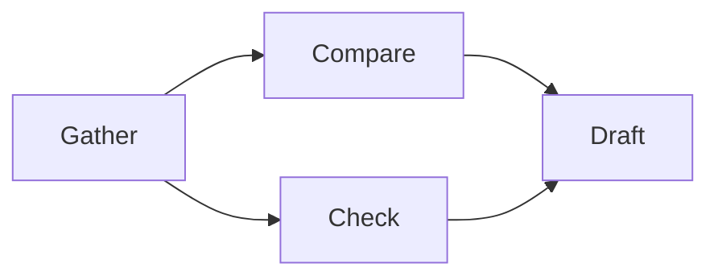
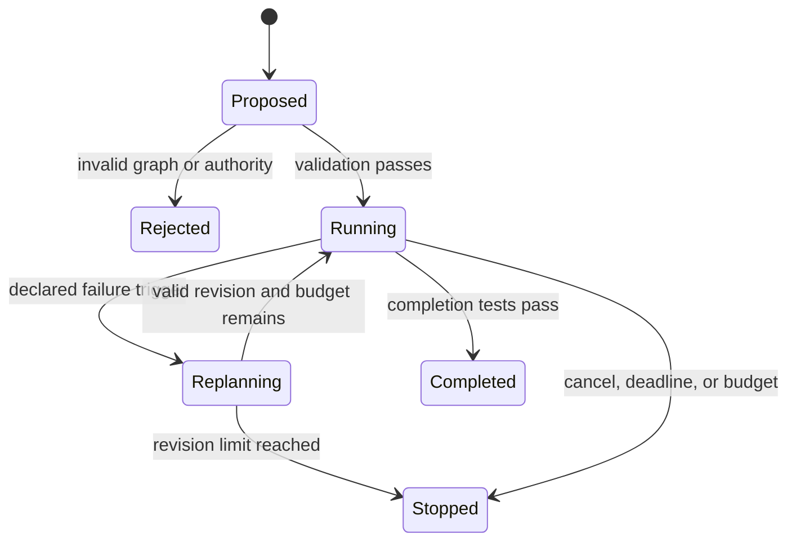
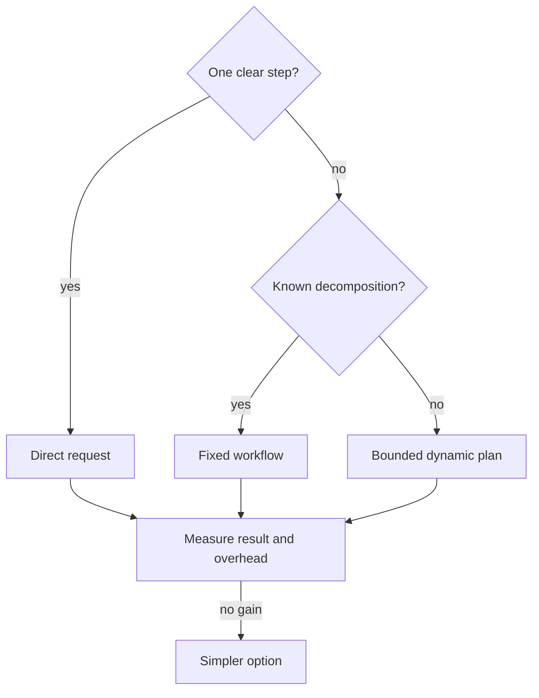

# Chapter 15: Planning and Reasoning

> Status: reviewing
> Owner: Agentic System Design maintainers
> Last verified: 2026-09-06

## The problem

Northstar receives a difficult question whose useful searches are not known in
advance. A single prompt may omit work. An unrestricted planner may create endless
tasks, circular dependencies, or steps with more authority than the original run.

Planning is useful only when the plan becomes a checked software artifact. We need
to name each task, show which tasks must finish first, define how to check completion,
and limit what each task may do. We do not need a hidden story about what a model
thought.

## Learning objectives

By the end of this chapter, the reader can:

- represent a goal as observable plan steps and dependencies;
- validate cycles, unknown dependencies, budgets, and authority before execution;
- distinguish a plan artifact from private chain-of-thought;
- replan after an observable failure within a hard revision limit;
- compare dynamic planning with a direct answer and fixed decomposition; and
- run an offline Python 3.11 failure and recovery test.

## First pass

Imagine organizing a school fair with task cards. "Put up posters" depends on
"approve poster." Each card has an owner, supplies, finish check, and deadline. If
the printer breaks, the group changes only the affected cards.

That card set is like a **plan artifact** (a versioned set of tasks, dependencies,
status, budgets, and uncertainty flags). **Replanning** is a bounded update after a
declared event such as a failed dependency. The group can inspect cards and results
without asking anyone to reveal every private thought.

The analogy stops here. A generated plan can be malformed or hostile, and software
can execute mistakes at scale. Code must validate the graph, authority, and budget
before any step runs.

## Picture the idea

### An observable plan graph



**Takeaway:** inspectable tasks, dependencies, budgets, uncertainty, and expected
artifacts are enough to operate a plan without storing hidden reasoning.

**Step by step:** gathering sources must finish before comparison and
citation checking. Both must finish before drafting. The plan record keeps each task's
ID, budget, uncertainty marker, and expected artifact even though the beginner diagram
shows only the action names.

### Validate, execute, or replan



**Takeaway:** replanning is one validated transition, not permission to think forever.

**Step by step:** a proposed plan is rejected or admitted by
deterministic checks. Execution may complete, stop, or enter replanning after a named
trigger. A validated revision resumes work; exhausted revisions stop.

### Decide whether planning helps



**Takeaway:** planning is an evaluated option for uncertain decomposition, not a
default wrapper around every request.

**Step by step:** use a direct request for one clear step, a fixed
workflow for known decomposition, and dynamic planning only when decomposition is
uncertain. Measure all candidates and return to the simpler one without a gain.

## Vocabulary

| Term | Plain-language meaning |
|---|---|
| Plan artifact | Versioned tasks, dependencies, status, budgets, and uncertainty. |
| Dependency | A task that must reach an allowed state before another can start. |
| Directed acyclic graph | One-way dependency links with no circular path. |
| Completion criterion | An observable test that says a step is finished. |
| Uncertainty flag | A bounded marker that evidence or decomposition may be weak. |
| Replanning | A limited plan update after a declared trigger. |
| Trigger | An observable event permitted to start replanning. |
| Structured rationale | Selected option, alternatives, evidence, uncertainty, and policy result. |
| Private chain-of-thought | Internal model reasoning that the system does not require or store. |
| Authority class | The maximum consequence a step is permitted to request. |

## How it works

1. Parse the goal, output contract, constraints, deadline, and parent budget.
2. Ask a planner or deterministic decomposer for closed-schema task records.
3. Reject duplicate IDs, missing dependencies, cycles, vague completion tests,
   excessive authority, and over-allocated budgets.
4. Execute only ready tasks and record typed events.
5. Replan only for named triggers such as failure, stale evidence, changed user
   constraint, deadline risk, low-confidence result, or no progress.
6. Increment the plan version and validate the entire changed plan.
7. Stop on completion, cancellation, deadline, budget, or replan limit.

A decision record may say: option selected, alternatives rejected, evidence used,
uncertainty, and policy result. It must not request private chain-of-thought.

## Engineering deep dive

A plan step needs `task_id`, `depends_on`, `status`, `expected_artifact`,
`completion_test`, `uncertainty`, `authority`, and `budget`. Stable IDs survive plan
versions. Removed or replaced tasks remain visible in events rather than disappearing.

Graph validation uses depth-first search or indegree counting. Budget validation sums
child allocations and checks every dimension against the parent. Authority validation
compares each task with the immutable task contract. Ready-task selection is
deterministic so replay produces the same order.

Search, critique, reflection, and tool-use techniques are candidates, not guarantees.
Their output must fit typed boundaries and earn value in evaluation. Direct prompting
often wins for short, clear tasks because planning adds model calls and failure modes.

## Build it in Python

This offline Python 3.11 program validates a plan and performs one bounded replan.

```python
from dataclasses import dataclass, replace


@dataclass(frozen=True)
class Step:
    task_id: str
    depends_on: tuple[str, ...]
    budget: int
    authority: str = "read"
    status: str = "pending"


@dataclass(frozen=True)
class Plan:
    version: int
    steps: tuple[Step, ...]
    parent_budget: int


def validate(plan: Plan) -> list[str]:
    errors: list[str] = []
    by_id = {step.task_id: step for step in plan.steps}
    if len(by_id) != len(plan.steps):
        errors.append("duplicate task id")
    if sum(step.budget for step in plan.steps) > plan.parent_budget:
        errors.append("budget exceeded")
    if any(step.authority != "read" for step in plan.steps):
        errors.append("forbidden authority")
    if any(dep not in by_id for step in plan.steps for dep in step.depends_on):
        errors.append("unknown dependency")

    visiting: set[str] = set()
    visited: set[str] = set()

    def visit(task_id: str) -> None:
        if task_id in visiting:
            errors.append("cycle")
            return
        if task_id in visited or task_id not in by_id:
            return
        visiting.add(task_id)
        for dependency in by_id[task_id].depends_on:
            visit(dependency)
        visiting.remove(task_id)
        visited.add(task_id)

    for task_id in by_id:
        visit(task_id)
    return sorted(set(errors))


plan = Plan(1, (Step("search", (), 2), Step("draft", ("search",), 1)), 4)
assert validate(plan) == []

# Observable failure trigger: search failed. One revision replaces its method.
failed = replace(plan.steps[0], status="failed")
replanned = Plan(2, (replace(failed, task_id="search-local", status="pending"),
                     Step("draft", ("search-local",), 1)), 4)
assert validate(replanned) == []
assert replanned.version == plan.version + 1

cycle = Plan(1, (Step("a", ("b",), 1), Step("b", ("a",), 1)), 2)
assert validate(cycle) == ["cycle"]
escalation = Plan(1, (Step("publish", (), 1, authority="publish"),), 2)
assert validate(escalation) == ["forbidden authority"]
print("PASS: plans validated; one bounded replan; cycle and escalation rejected")
```

Expected output:

```text
PASS: plans validated; one bounded replan; cycle and escalation rejected
```

## Microsoft implementation

This chapter's approved sources do not support a current Microsoft planner or SDK
selection. Keep `Plan`, `Step`, and event contracts vendor-neutral. A Microsoft
adapter may be evaluated later only with approved, freshly verified product evidence;
it must not require private reasoning or bypass deterministic validation.

## How leading teams approach it

Classical search and planning frame action selection around goals, states, and problem
structure (SRC-001, SRC-027). Published work shows task-dependent gains from reasoning
demonstrations, but does not require applications to collect private reasoning
(SRC-007). ReAct provides evidence for interleaving model output with observable
environment actions (SRC-008). Toolformer studies learned choices about when and how
to use tools (SRC-038). Northstar's closed plan schema and policy gate are engineering
controls built around those lessons.

## Failure lab

Change `parent_budget` in the valid plan from `4` to `2`. Validation returns `budget
exceeded`. Next, allow the invalid plan to execute anyway and note how a child would
create capacity the parent did not grant. Restore the check. The measurable correction
is 100 percent rejection of over-budget fixtures before any step starts.

Also test unknown dependencies, duplicate IDs, vague completion criteria, stale plan
versions, endless decomposition, and a second replan after the limit. Each must reject
or stop with a named event.

## Security and safety testing

The `escalation` fixture asks for `publish` authority inside a read-only task. Expected
behavior is `forbidden authority`, with no tool call. Add synthetic instruction text
to a task description and prove it cannot alter `authority`, budget, or dependencies.
Useful evidence is the rejected plan version and policy reason, not model reasoning.

## Evaluation

Compare direct prompting, fixed decomposition, and dynamic planning on identical
fixtures. Measure task success, valid-plan rate, dependency correctness, invalid-plan
rejection, recovery after failure, unnecessary steps, tool calls, simulated latency,
cost proxy, and budget compliance. Track plan versions and trigger codes. Planning is
retained only when outcome or recovery improves enough to justify its overhead.

## Production checklist

- [ ] Plan and event schemas are versioned and closed.
- [ ] Dependencies, cycles, completion tests, authority, and budgets validate first.
- [ ] Replan triggers and maximum revisions are explicit.
- [ ] Child constraints inherit tenant, identity, deadline, authority, and budget.
- [ ] Logs contain observable events, not sensitive free-form reasoning.
- [ ] Cancellation and stale-plan conflicts stop safely.
- [ ] Direct and fixed-workflow fallbacks remain available.
- [ ] Quality, latency, safety, and cost gates control rollout and rollback.

## Review questions

1. What makes a plan artifact observable?
2. Why must the full revised graph be validated?
3. Which events may trigger replanning?
4. Why is private chain-of-thought unnecessary for operation?
5. When does a fixed decomposition beat dynamic planning?

## Try it safely

Write four task cards with prerequisites and six budget tokens. Remove one pretend
resource and revise only affected cards. Record the trigger, changed IDs, new version,
and remaining budget. Explain the plan through cards and outcomes, not private thoughts.

## Common misunderstanding

> Better reasoning requires collecting private chain-of-thought.

No. Systems can inspect goals, plan tasks, dependencies, tool calls, uncertainty,
policy decisions, revisions, and outcomes. Those artifacts are more stable and safer
for debugging than unrestricted hidden-reasoning logs.

## Recap and next step

- Plans are versioned software artifacts, not prose wishes.
- Deterministic checks reject invalid graphs, budgets, and authority.
- Replanning begins only after observable triggers and has a hard limit.
- Planning must beat direct prompting or fixed decomposition.
- Chapter 16 makes plans and state survive process loss.

## Design exercise

Design a plan for comparing three approved sources before a deadline. Define task IDs,
dependencies, artifacts, uncertainty, authority, budgets, two replan triggers, and a
one-replan limit. Include one cycle and explain how validation detects it.

## Hands-on lab

Run the program, then add validation for duplicate IDs and a maximum of three tasks.
Add an event list containing `plan_proposed`, `plan_rejected`, `step_failed`, and
`plan_revised`. Assert exact versions and terminal status. The lab is deterministic,
offline, zero cost, and leaves no persistent files to clean up.

## Sources

- SRC-001, Pearson, *Artificial Intelligence: A Modern Approach*, 2020.
- SRC-007, NeurIPS, *Chain-of-Thought Prompting Elicits Reasoning in Large Language Models*, 2022.
- SRC-008, ICLR, *ReAct: Synergizing Reasoning and Acting in Language Models*, 2023.
- SRC-027, DeepMind, *Mastering Atari, Go, Chess and Shogi by Planning with a Learned Model*, 2020.
- SRC-038, Meta AI, *Toolformer: Language Models Can Teach Themselves to Use Tools*, 2023.

**Navigation:** [Previous: Chapter 14: Workflow Patterns](14-workflow-patterns.md) | [Module 04 overview](../README.md) | [Next: Chapter 16: Durable Execution](16-durable-execution.md)
