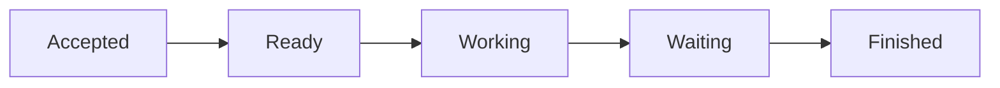
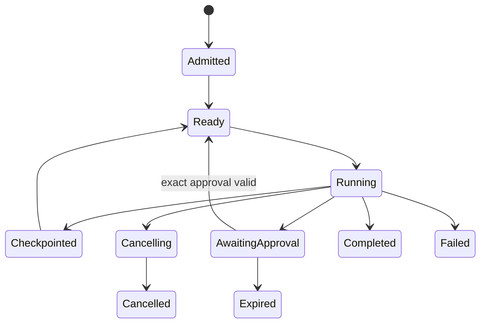
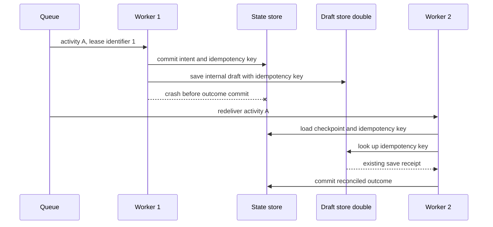
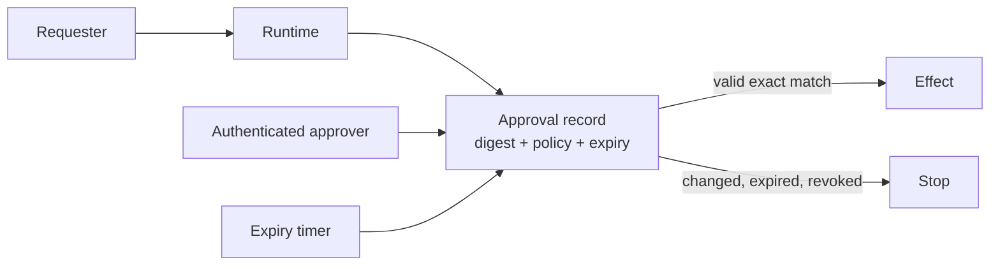

# Chapter 16: Durable Execution

> Status: drafting  
> Owner: Chapter 16 author  
> Last verified: 2026-09-06

## The problem

Northstar starts a report, waits overnight for approval, and loses its worker. A new
worker must continue without forgetting the cancellation deadline or saving the same
internal draft twice. Northstar does not publish reports; publication remains outside
this chapter's authority. Process memory and a chat transcript cannot provide that
guarantee.

**Durable execution** means logical state survives process loss and can be rebuilt
from committed records. The central question is not "How do we prevent every crash?"
It is "What record lets a different worker resume safely after one?"

## Learning objectives

By the end of this chapter, the reader can:

- separate durable logical state from disposable process memory;
- explain checkpoints, queues, leases, timers, and approval waits;
- design at-least-once processing without assuming exactly-once effects;
- use stable activity IDs, idempotency keys, intent records, and reconciliation;
- resume after an injected crash while respecting cancellation and deadlines; and
- run a deterministic offline Python 3.11 recovery simulation.

## First pass

Imagine a relay race where every runner updates a waterproof scorecard before passing
the baton. If one runner leaves, another reads the card and continues. A **checkpoint**
is that versioned scorecard. A **lease** is a time-limited right to hold the baton. A
queue may hand the same card to another runner after the lease expires.

The analogy stops here. A computer can fail between an outside effect and recording
its result. A repeated message may therefore describe work that already happened.
Safe recovery needs stable operation identity and an authoritative result lookup, not
the instruction "please do this only once."

## Picture the idea

### A beginner path



**Takeaway:** a durable run moves through named, saved states instead of relying on
one worker's memory.

**Step by step:** a request is accepted, becomes ready, starts working,
waits when it needs an outside event, and then finishes. The detailed model below adds
the alternate paths needed in a real runtime.

### Durable run states



**Takeaway:** waits, cancellation, checkpoints, and terminal outcomes are committed
states, not facts remembered by one worker.

**Step by step:** an admitted run becomes ready and running. It can
checkpoint and return to ready, wait for exact approval, cancel, complete, expire, or
fail. Every path reaches a named durable state.

### Crash and redelivery



**Takeaway:** redelivery is safe only when recovery can recognize or reconcile the
same logical effect.

**Step by step:** worker 1 records an intent, saves an internal draft, and crashes
before storing the outcome. The queue redelivers the stable activity to worker 2.
Worker 2 loads the intent, queries the draft store by idempotency key, receives the
existing receipt, and records it instead of saving the draft again. No publication
capability is present.

### Approval is a durable boundary



**Takeaway:** a chat phrase is not approval; the durable record must bind identity,
policy, exact payload digest, and expiry.

**Step by step:** the requester creates a run, the runtime creates an
approval record, an authenticated approver decides, and a timer may expire it. Only a
current exact match releases the effect; any mismatch stops it.

## Vocabulary

| Term | Plain-language meaning |
|---|---|
| Durable execution | Execution reconstructed from committed logical records after loss. |
| Checkpoint | Versioned run state from which work can safely resume. |
| Activity | Bounded work with typed input, timeout, retry policy, and stable identity. |
| Queue | A durable handoff that may deliver a message more than once. |
| Lease | A time-limited claim to process an activity. |
| At-least-once delivery | A message is retried until acknowledged and may repeat. |
| Idempotency key | Stable identity used to recognize repeated effect requests. |
| Intent record | Committed description of an effect before it is attempted. |
| Outcome record | Committed receipt or failure after an effect attempt. |
| Reconciliation | Comparing intended and observed outcomes when success is uncertain. |
| Optimistic version | Expected record version used to reject conflicting updates. |
| Durable wait | Saved waiting state resumed by an event, timer, or approval. |

## How it works

1. Admit an immutable request and create versioned run state.
2. Enqueue activities with stable IDs, deadlines, and retry classes.
3. Let a worker acquire a renewable lease.
4. Load the latest checkpoint and revalidate identity, policy, budget, approval,
   source access, cancellation, deadline, and component versions.
5. For an effect, commit an intent before calling the provider.
6. Call with an idempotency key where supported.
7. Commit the outcome with compare-and-set versioning.
8. On ambiguous failure, reconcile before retrying.
9. Checkpoint logical state and release or expire the lease.

Retries are valid only for declared temporary errors and within a fixed attempt limit.
A fake clock makes backoff, expiry, and deadlines deterministic in tests.

## Engineering deep dive

Exactly-once execution is usually an unsafe distributed-systems assumption. A worker
can fail after the provider accepts an effect but before the local outcome commits.
Transactions rarely span both systems. The practical contract combines at-least-once
delivery with idempotent activity design, provider deduplication, or reconciliation.

Checkpoint before dependent work proceeds, but do not mark an effect complete before
it is known. Compare-and-set rejects stale writers. Leases prevent active competition,
but an expired worker may still wake up, so every commit must also verify ownership or
version. Cancellation is durable and prevents new activities; running activities must
cooperate and effects need reconciliation.

Approval stores approver identity, role, action digest, policy version, issue time,
expiry, and revocation. Any changed payload, destination, principal, report version,
or policy invalidates it.

## Build it in Python

This Python 3.11 simulation injects a crash after an effect and recovers it without a
duplicate. It uses only in-memory deterministic doubles.

```python
from dataclasses import dataclass, replace


@dataclass(frozen=True)
class Run:
    version: int
    status: str
    intent_key: str | None = None
    receipt: str | None = None
    cancelled: bool = False


class DraftStore:
    def __init__(self) -> None:
        self.receipts: dict[str, str] = {}
        self.saves = 0

    def save(self, key: str) -> str:
        if key not in self.receipts:
            self.saves += 1
            self.receipts[key] = f"receipt-{self.saves}"
        return self.receipts[key]

    def lookup(self, key: str) -> str | None:
        return self.receipts.get(key)


def commit(current: Run, expected_version: int, updated: Run) -> Run:
    if current.version != expected_version:
        raise RuntimeError("checkpoint conflict")
    return replace(updated, version=current.version + 1)


def dispatch_draft_save(current: Run, store: DraftStore, key: str) -> Run:
    if current.cancelled or current.status == "cancelled":
        return current
    running = commit(
        current, current.version, replace(current, status="running", intent_key=key)
    )
    receipt = store.save(key)
    return commit(
        running,
        running.version,
        replace(running, status="completed", receipt=receipt),
    )


draft_store = DraftStore()
run = Run(version=0, status="ready")
key = "run-7:save-report-draft-v3"

# Worker 1 commits intent, saves the internal draft, then crashes.
run = commit(run, 0, replace(run, status="running", intent_key=key))
lost_receipt = draft_store.save(key)
assert lost_receipt == "receipt-1"

# Worker 2 receives the same activity and reconciles before any retry.
existing = draft_store.lookup(run.intent_key or "")
assert existing == "receipt-1"
run = commit(run, 1, replace(run, status="completed", receipt=existing))
assert draft_store.saves == 1
assert run.receipt == "receipt-1"

# Dispatch after cancellation performs no save, publication, or other effect and
# cannot advance durable state.
cancelled = Run(version=0, status="cancelled", cancelled=True)
saves_before = draft_store.saves
published_effects: list[str] = []  # Northstar has no publisher; this stays empty.
after_cancelled_dispatch = dispatch_draft_save(
    cancelled, draft_store, "run-8:save-report-draft-v1"
)
assert after_cancelled_dispatch == cancelled
assert after_cancelled_dispatch.version == 0
assert draft_store.saves == saves_before
assert published_effects == []

try:
    commit(run, 1, run)
    raise AssertionError("stale commit accepted")
except RuntimeError as error:
    assert str(error) == "checkpoint conflict"

print("PASS: draft recovered; cancellation blocked dispatch; stale commit rejected")
```

Expected output:

```text
PASS: draft recovered; cancellation blocked dispatch; stale commit rejected
```

## Microsoft implementation

As of 2026-09-06, Azure Service Bus documentation is an approved, volatile source for
current queue and messaging guidance (SRC-049). It may serve as a command-queue
adapter after its delivery, settlement, retry, identity, and Python SDK behavior are
verified for the chosen configuration. It does not by itself provide Northstar's
checkpoint, approval, idempotency, or reconciliation contract. Revalidate all product
semantics and APIs within 30 days of release.

## How leading teams approach it

AWS Step Functions documents evolving durable workflow, retry, service-integration,
and execution-history concepts (SRC-054). Temporal documents volatile workflow
history, activity, timer, and retry semantics (SRC-061). Azure Service Bus documents
volatile messaging capabilities (SRC-049). These are comparative adapter inputs. The
portable design begins with run, activity, checkpoint, intent, outcome, and approval
contracts, then tests each candidate against them.

## Failure lab

Replace the reconciliation lookup with another unconditional `save(key)` and then
remove deduplication from `DraftStore.save`. The save count becomes two. Restore
stable-key deduplication and lookup-before-retry. The measurable correction is one
internal draft save and one durable receipt after redelivery.

Also inject lease expiry, deadline expiry, retryable and terminal errors, approval
expiry, cancellation during work, and a stale checkpoint version. Every case must
reach a named state with bounded attempts.

## Security and safety testing

Use a synthetic approval for digest `report-v2`, then request `report-v3`. Expected
behavior is rejection before any approved consequential effect. Also resume a run with an expired principal
or changed policy version. Evidence is a `policy_denied` or `awaiting_approval` state,
no new provider effect, and a minimized audit event. Never use real credentials or
destinations.

## Evaluation

Measure resume success, duplicate effects, checkpoint conflicts, redeliveries, retry
attempts, cancellation latency, deadline compliance, stale-approval rejection,
reconciliation outcome, and deterministic replay. The fixture requires zero duplicate
effects and 100 percent respect for hard budgets and terminal states. Track p50 and
p95 recovery time only with a deterministic simulated clock in this lab.

## Production checklist

- [ ] Immutable requests and versioned run state are durable.
- [ ] Activities have stable IDs, deadlines, error classes, and retry limits.
- [ ] Leases expire and stale workers cannot commit.
- [ ] Effects use intent, idempotency, outcome, and reconciliation records.
- [ ] Approval binds exact payload, identity, policy, and expiry.
- [ ] Resume revalidates identity, authority, policy, budget, and source access.
- [ ] Cancellation prevents new work and reaches every child.
- [ ] Recovery, rollback, backup, and incident drills are tested.

## Review questions

1. Why is process memory not durable state?
2. Where can an unknown effect outcome occur?
3. Why is a lease insufficient without version checks?
4. What must an approval record bind?
5. When is reconciliation required before retry?

## Try it safely

Write each state transition on an index card. Stop halfway and give the cards to
another person. The second person resumes from the last committed version. If an
effect card repeats, return the same pretend receipt. No account or network is needed.

## Common misunderstanding

> A queue makes each action happen exactly once.

Queues commonly redeliver. Safe effects come from stable identity, idempotency,
commit ordering, and reconciliation, not from hoping delivery never repeats.

## Recap and next step

- Logical state must outlive workers.
- Queues may redeliver and leases may expire.
- Intent and outcome records close dangerous crash windows.
- Exact approval and cancellation are durable state transitions.
- Chapter 17 applies these controls to delegated agent workers.

## Design exercise

Design an internal report-draft-save activity that may crash at every line. Specify committed
records, versions, lease, deadline, approval digest, idempotency key, retry classes,
reconciliation query, cancellation behavior, and terminal states. Do not add a
publication capability.

## Hands-on lab

Run the program, then add a fake clock, lease expiry, approval record, and two-message
queue. Inject failure after intent, after effect, and before outcome commit. Assert one
effect after a fresh runtime instance resumes. The lab is offline and synthetic;
cleanup is in-memory object disposal.

## Sources

- SRC-049, Microsoft, *Azure Service Bus messaging documentation*, volatile.
- SRC-054, AWS, *AWS Step Functions Developer Guide*, evolving.
- SRC-061, Temporal, *Temporal Platform documentation*, volatile.

All product semantics and APIs require primary-source revalidation within 30 days of
release.