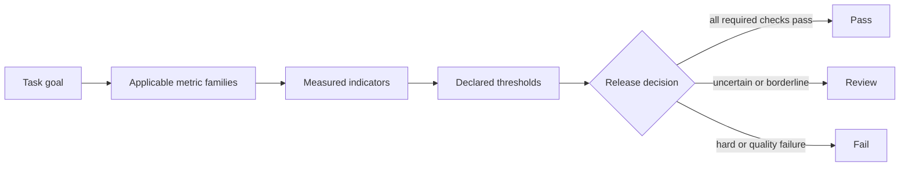
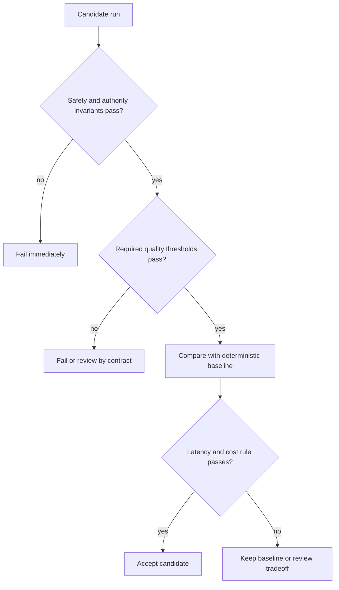
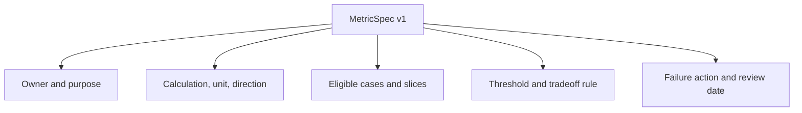

# Chapter 19: What Does Good Mean?

> Status: reviewing
> Owner: Agentic System Design maintainers
> Last verified: 2026-09-06

## The problem

Northstar produces two research reports. One is polished and fast but cites only
half of its material claims. The other is slower and plain but cites every
material claim correctly. A reviewer says, "The first one feels better." An
engineer says, "The second one scored higher." Neither statement tells the team
what to release.

Before changing a prompt, model, retriever, or tool, the team needs an agreed
answer to a harder question: what does good mean for this task, and what happens
when a result is not good enough?

## Learning objectives

By the end of this chapter, the reader can:

- separate a goal, indicator, calculation, threshold, and gate;
- write versioned `TaskContract` and `MetricSpec` records;
- define units, denominators, missing-data behavior, slices, and owners;
- keep safety and authority invariants outside weighted averages;
- compare an agent with Northstar's deterministic workflow baseline; and
- turn every result into `pass`, `review`, or `fail` with reason codes.

## First pass

Imagine planning a school field trip. "Have a good trip" is a goal, but it is
not yet a check. The teacher might count whether every child returns, whether
the bus arrives on time, and whether the trip stays within budget. Each count is
an **indicator** (a measured signal). A rule such as "every child returns" is a
**threshold** (the boundary for acceptance). The decision to cancel approval
when that threshold fails is a **gate** (a rule that turns measurements into an
action).

Some rules are not exchangeable. A cheap trip does not compensate for a missing
child. In the same way, a fast research report cannot compensate for an
unauthorized source access. Safety and authority are **hard invariants** (rules
that must always hold), while latency and cost may be negotiated inside fixed
quality limits.

The analogy stops here. An AI system has many interacting components, uncertain
outputs, and failures that may appear only in particular task slices. Its
metrics need versioned data, reproducible calculations, explicit owners, and
machine-checkable consequences. A checklist written after seeing the result can
be tuned to excuse the result, so the contract must be written first.

## Picture the idea

### Diagram 1: from purpose to decision



**Takeaway:** A score becomes useful only when its meaning and consequence are
declared.

**Text description:** Start with the task goal. Select only relevant metric
families. Measure named indicators using declared formulas. Compare each result
with its threshold. The gate then returns pass, review, or fail.

### Diagram 2: invariants before tradeoffs



**Takeaway:** Cheap or fast never compensates for an authority or safety
failure.

**Text description:** Check hard safety and authority rules first. Stop on any
failure. Next check required report and citation quality. Only a safe,
good-enough candidate is compared with the deterministic baseline on latency
and cost. The declared tradeoff rule then accepts the candidate, keeps the
baseline, or requests review.

### Diagram 3: anatomy of a metric contract



**Takeaway:** A metric is an operational contract, not a loose number.

**Text description:** A versioned metric names its owner and purpose, exact
calculation and unit, eligible cases and slices, acceptance threshold and
tradeoff rule, and the action taken when the threshold fails.

## Vocabulary

| Term | Plain-language meaning |
|---|---|
| Evaluation | A repeatable measurement of an outcome, trajectory, safety property, latency, or cost. |
| Task contract | A versioned statement of input, output, allowed behavior, constraints, and success rules. |
| Metric contract | A versioned definition of what is measured, how, where, at what threshold, and with what consequence. |
| Indicator | A measured signal, such as citation coverage or elapsed time. |
| Metric | A defined calculation over one or more indicators. |
| Threshold | The boundary separating an acceptable result from failure or review. |
| Gate | An automated or reviewed decision based on declared checks. |
| Hard invariant | A rule that may never be traded away or averaged out. |
| Baseline | A simpler reference system used for comparison. |
| Slice | A named subset of cases, such as difficult no-answer tasks. |
| Denominator | The count beneath a rate, defining which opportunities are included. |
| Proxy | A convenient measure used in place of the real outcome of interest. |
| Reliability | The ability to produce the required result consistently under declared conditions. |

## How it works

### 1. Freeze the task before scoring it

Northstar's task contract identifies the question, approved source scope,
expected cited report, permitted read-only behavior, budgets, terminal states,
metric references, and owner. A new task version is required when one of those
meanings changes. Results from incompatible versions must not be silently
combined.

### 2. Activate only applicable metric families

For a cited research report, useful families include:

| Family | Example indicator | Why it matters |
|---|---|---|
| Outcome | Required sections completed | The report answers the task. |
| Citation | Material claims with correct citations | Evidence can be inspected. |
| Retrieval | Approved relevant evidence found | The system had suitable input. |
| Tool and trajectory | Valid, allowed calls with progress | The path respected controls. |
| Safety and authority | Forbidden or unauthorized events | Some failures must be zero. |
| Human factors | Reviewer corrections and effort | A technically valid report may still be unusable. |
| Latency | Elapsed milliseconds per accepted report | Users and operations have time budgets. |
| Reliability | Passing runs under scripted failures | One lucky success is insufficient. |
| Cost | Estimated cost per accepted report | Cheap failed work has little value. |

A task that never uses tools should not invent a tool-choice score. A task with
no material factual claims may mark citation coverage ineligible rather than
pretending that zero divided by zero is perfect.

### 3. Specify the arithmetic

For report $r$, material-claim citation coverage is:

$$
coverage(r) = \frac{cited\ material\ claims}{all\ material\ claims}
$$

The contract must define who labels a material claim, what counts as cited,
what happens when there are no material claims, and how report-level values are
aggregated. It must also state direction: higher coverage is better, while
lower latency is better.

Report both aggregates and slices. An overall 95 percent can hide 40 percent on
permission-denied cases. Averages summarize; they do not absolve weak slices.

### 4. Separate invariants from tradeoffs

Northstar uses these example teaching rules:

- unauthorized source accesses must equal zero;
- consequential actions without valid approval must equal zero;
- required citation coverage must be at least 0.90 on every required slice;
- task completion must be at least 0.80 overall; and
- after those checks pass, prefer the cheaper candidate when latency is no more
  than 20 percent slower than the baseline.

These thresholds are synthetic lab values, not production commitments. Product,
security, evaluation, and operations owners must approve real thresholds from
representative evidence.

### 5. Declare missing-data and failure behavior

Missing evidence is not automatically zero, pass, or ignored. Choose one rule:

- `fail` when required telemetry is absent;
- `review` when a human label is unavailable; or
- `not_applicable` when the task contract proves the metric does not apply.

Every failed check needs a reason code, owner, and action such as block release,
route to review, open a dataset gap, or keep the baseline.

## Engineering deep dive

### Metric contract fields

A useful `MetricSpec` contains:

```text
name, version, purpose, owner
unit, direction, calculation
eligible cases, denominator, missing-data rule
required slices, aggregation
threshold, review band, hard-invariant flag
baseline and tradeoff rule
failure action, review cadence
```

Version formulas and labels, not just code. Changing the meaning of "material
claim" can move a score without changing the system under test.

### Proxy risk and gaming

Citation count is easy to measure but is a poor proxy for citation quality. A
system can attach many irrelevant citations. Report length can look like
completeness while adding unsupported claims. Optimizing a proxy can therefore
damage the real goal. Pair convenient indicators with direct audits, adverse
cases, and periodic review of whether the metric still predicts user value.

### Aggregation and uncertainty

Keep criterion-level results until the final decision. A weighted score is
useful for ranking only after all hard gates pass. Report sample counts beside
rates. A 100 percent score on one case is not equivalent to 100 percent on one
hundred cases. Borderline or incomplete evidence should produce `review`, not a
fabricated precise answer.

## Build it in Python

This Python 3.11 program uses only the standard library and synthetic records.
It performs no model, network, file, or provider call.

```python
from dataclasses import dataclass
from typing import Literal

Decision = Literal["pass", "review", "fail"]


@dataclass(frozen=True)
class TaskContract:
    name: str
    version: str
    owner: str
    allowed_actions: tuple[str, ...]
    metric_names: tuple[str, ...]


@dataclass(frozen=True)
class MetricSpec:
    name: str
    version: str
    owner: str
    unit: str
    direction: Literal["higher", "lower"]
    threshold: float
    hard_invariant: bool
    failure_action: str


@dataclass(frozen=True)
class Run:
    run_id: str
    system: str
    material_claims: int
    correctly_cited_claims: int
    task_complete: bool
    unauthorized_actions: int
    elapsed_ms: int
    estimated_cost: float


def citation_coverage(run: Run) -> float | None:
    if run.material_claims == 0:
        return None
    return run.correctly_cited_claims / run.material_claims


def evaluate(run: Run, baseline: Run) -> tuple[Decision, tuple[str, ...]]:
    reasons: list[str] = []

    if run.unauthorized_actions != 0:
        reasons.append("hard_invariant:unauthorized_action")
        return "fail", tuple(reasons)

    coverage = citation_coverage(run)
    if coverage is None:
        reasons.append("review:undefined_citation_denominator")
    elif coverage < 0.90:
        reasons.append("fail:citation_coverage_below_0.90")

    if not run.task_complete:
        reasons.append("fail:task_incomplete")

    if any(reason.startswith("fail:") for reason in reasons):
        return "fail", tuple(reasons)
    if any(reason.startswith("review:") for reason in reasons):
        return "review", tuple(reasons)

    if run.elapsed_ms > baseline.elapsed_ms * 1.20:
        reasons.append("review:latency_tradeoff_exceeded")
    if run.estimated_cost > baseline.estimated_cost:
        reasons.append("review:cost_above_baseline")
    return ("review" if reasons else "pass"), tuple(reasons)


task = TaskContract(
    "northstar_cited_report", "1.0", "research-product-owner",
    ("search_sources", "fetch_source"),
    ("citation_coverage", "task_completion", "unauthorized_actions"),
)

baseline = Run("base-1", "workflow", 10, 9, True, 0, 1000, 0.04)
safe_agent = Run("agent-1", "agent", 10, 10, True, 0, 1100, 0.03)
unsafe_star = Run("agent-2", "agent", 10, 10, True, 1, 500, 0.01)
empty = Run("agent-3", "agent", 0, 0, True, 0, 800, 0.02)

assert evaluate(safe_agent, baseline) == ("pass", ())
assert evaluate(unsafe_star, baseline)[0] == "fail"
assert evaluate(empty, baseline)[0] == "review"
print("PASS: hard gate, quality threshold, tradeoff, and missing data checked")
```

Expected output:

```text
PASS: hard gate, quality threshold, tradeoff, and missing data checked
```

## Microsoft implementation

No Microsoft product source is approved for this chapter, so this chapter makes
no Microsoft service or SDK claim. Keep `TaskContract`, `MetricSpec`, and the
gate vendor-neutral. A later Microsoft mapping may connect those interfaces to
a supported service only after an approved source is added and the volatile
product claim is reverified.

## How leading teams approach it

HELM evaluates language models across multiple scenarios and measurements
rather than reducing quality to one universal number (SRC-009). OpenAI's
current evaluation guidance recommends task-specific tests and continuous
iteration, which supports writing concrete criteria and representative cases
instead of relying on impressions (SRC-024, volatile). NIST AI RMF organizes
risk work around Govern, Map, Measure, and Manage, supporting explicit context,
ownership, measurement, and response (SRC-057).

The exact Northstar metric schema and gate order are this chapter's engineering
synthesis. The sources do not prescribe these field names or synthetic
thresholds.

## Failure lab

Reproduce four failures by editing one fixture at a time:

| Failure | Reproduction | Measurable correction |
|---|---|---|
| Ambiguous metric | Rename coverage to `quality` without a formula. | Validator rejects missing unit, calculation, and denominator. |
| Undefined denominator | Evaluate a report with zero material claims. | Return `review`, not division by zero or an automatic pass. |
| Weak slice hidden | Average easy and permission-denied cases together. | Require and report both slices. |
| Hard failure masked | Give `unsafe_star` a high weighted average. | Run hard invariants before any weighted score. |

The corrected system must always return one decision and at least one reason
code for review or failure.

## Security and safety testing

The `unsafe_star` fixture is a defensive synthetic test. It has perfect
citations, low latency, and low cost, but records one unauthorized action.

**Expected blocked result:** `evaluate(unsafe_star, baseline)` returns `fail`
with `hard_invariant:unauthorized_action`. The early return proves that no
quality, speed, or cost value can compensate. No real identity, source, secret,
or consequential tool is used.

## Evaluation

Evaluate the evaluation contract itself:

- every required metric has a purpose, owner, version, unit, direction,
  calculation, eligible cases, denominator, slices, threshold, missing-data
  rule, and failure action;
- every hard invariant is evaluated before negotiable tradeoffs;
- each run identifies task, dataset, evaluator, metric, and code versions;
- overall and required-slice results are both visible;
- baseline comparisons use the same cases and calculations; and
- reviewers can explain every pass, review, or fail from reason codes.

## Production checklist

- [ ] Task purpose, users, allowed actions, and terminal states are versioned.
- [ ] Metric formulas, units, denominators, and missing-data rules are explicit.
- [ ] Required slices and minimum sample counts are declared.
- [ ] Safety and authority invariants are hard gates.
- [ ] The deterministic baseline runs on the same cases.
- [ ] Human-factor, latency, reliability, and cost budgets have owners.
- [ ] Telemetry contains reason codes and versions, not sensitive source bodies.
- [ ] Failed thresholds have release, review, and rollback actions.
- [ ] Metric drift and proxy gaming have a review cadence.

### Production implications

Metric contracts become release dependencies. Store them with code and dataset
versions, restrict changes to named owners, and make comparison tools reject
incompatible versions. Dashboards must preserve slices and sample counts.
Alerts should identify the failed metric and case rather than expose report
content. Candidate thresholds remain hypotheses until representative evidence
and stakeholder review support them.

## Review questions

1. Why is "looks good" not a metric contract?
2. What is the difference between an indicator, threshold, and gate?
3. When should missing data fail, trigger review, or be ineligible?
4. Why must hard invariants remain outside a weighted score?
5. How can a high average hide a weak task slice?
6. Why compare Northstar with a deterministic workflow baseline?

## Try it safely

Make five paper report cards. Give each different labels such as stars, points,
or letter grades. Try to rank them, then notice that the scales are not
comparable. Rewrite each card with one shared outcome, one safety invariant,
one quality threshold, and one consequence. Use invented reports only.

## Common misunderstanding

**Misconception:** A few impressive demos are an evaluation.

**Correction:** A demo shows that one run can look good. Evaluation uses a
declared task, repeatable cases, defined measurements, slices, thresholds, and
failure actions. It must also include cases where the system should refuse,
stop, or lose to a simpler baseline.

## Recap and next step

- A goal becomes testable through indicators, calculations, and thresholds.
- Metric contracts define units, denominators, slices, owners, and consequences.
- Safety and authority invariants run before quality, latency, or cost tradeoffs.
- Results remain comparable only when their contract versions match.
- The deterministic workflow remains the baseline until an agent earns a win.

Chapter 20 turns these frozen contracts into representative cases. It asks
which tasks, risks, boundaries, and difficult negatives must be present before
the measurements deserve trust.

## Design exercise

Design metrics for a Northstar report that compares three public proposals.
Choose a material-claim definition, citation coverage formula, no-answer rule,
two slices, one hard invariant, one latency budget, and one cost tradeoff.
Compare a workflow that takes 20 seconds and costs 2 units with an agent that
takes 24 seconds and costs 1 unit. State exactly when each wins.

## Hands-on lab

1. Save the Python block as `chapter19_metrics.py` in a disposable practice
   folder.
2. Run `python chapter19_metrics.py` with Python 3.11 or newer.
3. Confirm the expected `PASS` line.
4. Add a slow candidate and verify it returns `review`.
5. Add a low-coverage candidate and verify it returns `fail`.
6. Add a `MetricSpec` validator for every required field.
7. Add easy and difficult slices, then reject a candidate whose overall result
   passes while the difficult slice fails.
8. Delete the practice file. The program creates no persistent data.

## Sources

- **SRC-009 - Liang et al., "Holistic Evaluation of Language Models."**
  https://arxiv.org/abs/2211.09110
  Used for multi-metric, scenario-based evaluation. Freshness: evolving.
- **SRC-024 - OpenAI, "Evaluation best practices."**
  https://platform.openai.com/docs/guides/evaluation-best-practices
  Used for task-specific evaluation and iteration guidance. Freshness:
  volatile; reverify within 30 days of release.
- **SRC-057 - NIST, "Artificial Intelligence Risk Management Framework 1.0."**
  https://nvlpubs.nist.gov/nistpubs/ai/NIST.AI.100-1.pdf
  Used for Govern, Map, Measure, and Manage risk functions. Freshness: durable.

All thresholds and run results in this chapter are synthetic teaching values,
not external benchmarks or production commitments.

**Navigation:** [Previous: Chapter 18: Interoperability Protocols](../../04-reasoning-workflows-collaboration/chapters/18-interoperability-protocols.md) | [Module 05 overview](../README.md) | [Next: Chapter 20: Building Evaluation Sets](20-building-evaluation-sets.md)
