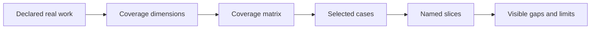
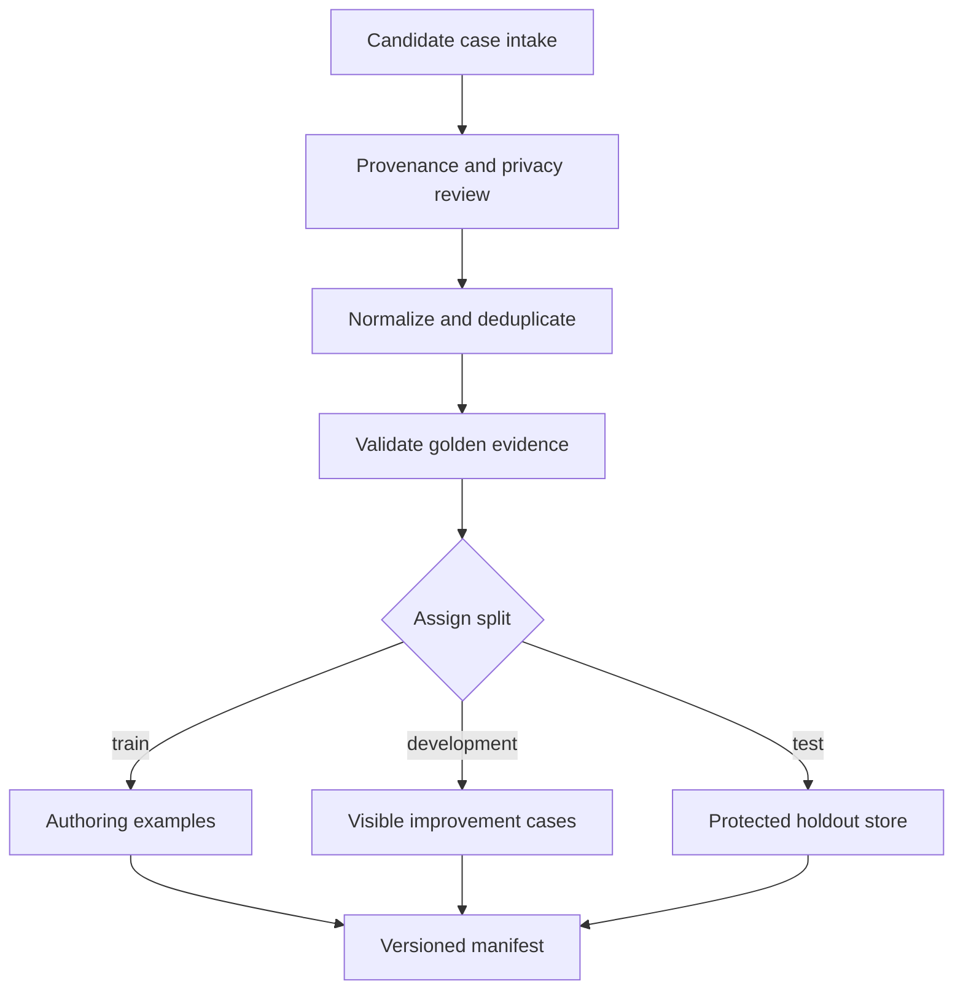
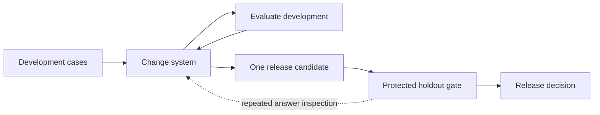

# Chapter 20: Building Evaluation Sets

> Status: drafting
> Owner: Module 05 author
> Last verified: 2026-09-06

## The problem

A Northstar team tests ten easy questions about short public documents. Every
answer passes. Production users then ask ambiguous questions, request facts
that are not present, and search sources they cannot access. The system fails.
The score was correct for the chosen cases, but the chosen cases did not
represent the work.

An evaluation set is an argument about what matters. Case count alone does not
make that argument defensible.

## Learning objectives

By the end of this chapter, the reader can:

- derive cases from a declared task distribution and coverage dimensions;
- separate train, development, and protected test splits;
- record stable IDs, provenance, privacy decisions, and golden evidence;
- detect duplicate leakage and holdout contamination;
- include difficult negative, boundary, denied, and baseline-favoring cases;
- report uncovered slices instead of claiming completeness; and
- validate a 12-case JSON Lines manifest offline in Python 3.11.

## First pass

Imagine preparing practice questions for a driving test. Twelve questions about
road signs do not represent night driving, merging, rain, or a blocked road.
A useful set starts with a map of situations, then chooses questions that cover
the map. Some questions are for teaching, some for practice, and some remain
sealed until the final test.

The sealed questions are a **test holdout** (protected cases used for a final
comparison). Looking at their answers after every change turns them into
practice questions. The team may still call the folder "test," but its
independence is gone.

The analogy has limits. AI tasks can have several valid answers, changing
source versions, permission boundaries, adversarial content, and uncertain
labels. Evaluation cases therefore need machine-readable provenance, expected
evidence, risk tags, version history, and controlled access. A small set can
expose known risks, but it cannot prove that production has no surprises.

## Picture the idea

### Diagram 1: coverage before collection



**Takeaway:** Representativeness is argued from coverage, not case count alone.

**Text description:** Describe real work, turn it into dimensions such as
intent, difficulty, risk, source type, and terminal state, cross those
dimensions in a matrix, select cases, group them into slices, and publish the
remaining gaps.

### Diagram 2: dataset lifecycle and boundary



**Takeaway:** A test set needs a lifecycle and an access boundary.

**Text description:** Intake records first receive provenance and privacy
review. They are normalized, deduplicated, and checked against source evidence.
Each case is assigned once to train, development, or protected test. The
manifest exposes metadata for all cases, while holdout labels remain protected.

### Diagram 3: clean and contaminated loops



**Takeaway:** Repeated holdout inspection contaminates the holdout and makes its
score optimistic.

**Text description:** Development cases may guide repeated changes. A selected
release candidate runs once through the protected holdout gate. If holdout
answers repeatedly flow back into system changes, those cases become
development data and a new holdout is required.

## Vocabulary

| Term | Plain-language meaning |
|---|---|
| Representative set | Cases selected to reflect declared work categories, risks, and difficult conditions. |
| Task distribution | The kinds and relative frequency of work the system is expected to receive. |
| Coverage dimension | A property used to organize cases, such as risk or difficulty. |
| Train split | Cases permitted for examples, fitting, or prompt construction. |
| Development split | Visible cases used while choosing and improving a design. |
| Test holdout | Protected cases used for final comparison or release decisions. |
| Golden evidence | Expected facts, source spans, actions, or labels used to check a run. |
| Provenance | Where a case and its labels came from, with version and review history. |
| Contamination | Exposure of protected cases or labels to the improvement process. |
| Deduplication | Detecting repeated or near-repeated cases. |
| Negative case | A task where the correct behavior is refusal, no answer, denial, or safe stop. |
| Boundary case | A case near a limit, such as the final allowed tool call. |
| Manifest | A machine-readable inventory of cases and metadata. |

## How it works

### 1. Declare the work before sampling

For Northstar, useful dimensions include research intent, source type,
difficulty, expected evidence, citation density, ambiguity, permission state,
risk, and expected terminal state. Add language or modality only when the
declared deployment needs them.

Do not mirror production frequency blindly. Rare authority failures deserve
deliberate over-sampling because their severity is high. Record weights
separately if a production-frequency estimate is needed.

### 2. Include different case roles

A defensible starter set includes:

- ordinary positive cases;
- no-answer and ambiguous cases;
- misleading-source and malformed-input cases;
- permission-denied and adversarial-content cases;
- budget-exhausted and dependency-failure cases;
- boundary cases; and
- tasks where the deterministic baseline should win.

The expected terminal state is part of the answer. Returning `policy_denied`
can be success for a denied case.

### 3. Record golden evidence, not one golden paragraph

Several reports may be valid. Store required facts, acceptable source IDs and
spans, forbidden claims, expected actions, and terminal state. Pin source
versions so a later source edit does not silently make the label wrong.

### 4. Protect the split

Train cases may appear in instructions. Development cases may guide choices.
Test cases may decide release, but their answer-bearing fields are available
only to the gate. Normal lab output reveals case IDs and pass/fail reason codes,
not holdout questions, source spans, or labels.

### 5. Version every accepted change

A dataset version changes when cases, labels, source versions, split assignment,
weights, or coverage meanings change. Record who changed what and why. Results
from different dataset versions are not directly comparable without an
explicit analysis.

## Engineering deep dive

### Manifest fields

Each case needs a stable ID, dataset version, split, synthetic or approved
provenance, content hash, coverage tags, difficulty, risk, expected terminal
state, golden evidence references, privacy classification, and change history.
Keep answer-bearing fields separate from metadata when holdout access differs.

### Deduplication and contamination

Exact hashes catch identical normalized prompts. They do not catch paraphrases
or shared answer templates, so also review source overlap and semantic families.
Keep a contamination register listing prompt examples, retrieval corpora,
developer access, generated variants, and every holdout exposure. When in
doubt, retire the affected case from the holdout.

### Small-set honesty

Slice rates with one or two cases are diagnostic, not stable estimates. Report
counts, selection method, missing categories, label uncertainty, and known
production differences. "No failures observed" is not "failure is impossible."

## Build it in Python

This standard-library Python 3.11 lab creates 12 synthetic manifest records,
validates schema and coverage, detects cross-split duplicates, and keeps
holdout answers out of ordinary output.

```python
import hashlib
import json

REQUIRED = {
    "case_id", "dataset_version", "split", "prompt", "provenance",
    "tags", "difficulty", "risk", "expected_terminal", "evidence_ids",
}
SPLITS = {"train", "development", "test"}
REQUIRED_TAGS = {
    "ordinary", "no_answer", "permission_denied", "misleading_source",
    "malformed_citation", "baseline_favoring",
}


def fingerprint(prompt: str) -> str:
    normalized = " ".join(prompt.lower().split())
    return hashlib.sha256(normalized.encode("utf-8")).hexdigest()


def validate(cases: list[dict]) -> list[str]:
    errors: list[str] = []
    seen_ids: set[str] = set()
    hashes: dict[str, str] = {}
    tags: set[str] = set()
    split_counts = {split: 0 for split in SPLITS}

    for case in cases:
        missing = REQUIRED - case.keys()
        if missing:
            errors.append(f"{case.get('case_id', '?')}:missing:{sorted(missing)}")
            continue
        if case["case_id"] in seen_ids:
            errors.append(f"duplicate_id:{case['case_id']}")
        seen_ids.add(case["case_id"])
        if case["split"] not in SPLITS:
            errors.append(f"{case['case_id']}:invalid_split")
        else:
            split_counts[case["split"]] += 1
        if not case["provenance"].startswith("synthetic:"):
            errors.append(f"{case['case_id']}:unapproved_provenance")
        digest = fingerprint(case["prompt"])
        if digest in hashes and hashes[digest] != case["split"]:
            errors.append(f"cross_split_duplicate:{case['case_id']}")
        hashes[digest] = case["split"]
        tags.update(case["tags"])
        if case["expected_terminal"] == "completed" and not case["evidence_ids"]:
            errors.append(f"{case['case_id']}:missing_evidence")

    for split, count in split_counts.items():
        if count == 0:
            errors.append(f"empty_split:{split}")
    for tag in sorted(REQUIRED_TAGS - tags):
        errors.append(f"uncovered_tag:{tag}")
    return errors


specs = [
    ("ordinary", "completed"), ("no_answer", "completed_with_warnings"),
    ("permission_denied", "policy_denied"),
    ("misleading_source", "completed_with_warnings"),
    ("malformed_citation", "failed_terminal"),
    ("baseline_favoring", "completed"),
    ("ambiguous", "needs_clarification"), ("budget", "budget_exhausted"),
    ("dependency", "failed_recoverable"), ("adversarial", "policy_denied"),
    ("boundary", "completed"), ("ordinary", "completed"),
]
splits = ["train"] * 3 + ["development"] * 5 + ["test"] * 4
cases = []
for index, ((tag, terminal), split) in enumerate(zip(specs, splits), start=1):
    cases.append({
        "case_id": f"case-{index:02d}",
        "dataset_version": "1.0",
        "split": split,
        "prompt": f"Synthetic research task {index} for {tag}",
        "provenance": "synthetic:chapter20",
        "tags": [tag],
        "difficulty": "hard" if tag in {"adversarial", "misleading_source"} else "medium",
        "risk": "high" if tag in {"permission_denied", "adversarial"} else "low",
        "expected_terminal": terminal,
        "evidence_ids": [f"fixture-{index}"] if terminal == "completed" else [],
    })

assert validate(cases) == []
json_lines = "\n".join(json.dumps(case, sort_keys=True) for case in cases)
assert len(json_lines.splitlines()) == 12

leaked = [dict(case) for case in cases]
leaked[-1]["prompt"] = leaked[0]["prompt"]
assert any("cross_split_duplicate" in error for error in validate(leaked))

# Ordinary output contains holdout IDs and status only, never prompts or labels.
holdout_summary = [
    {"case_id": case["case_id"], "status": "sealed"}
    for case in cases if case["split"] == "test"
]
assert all(set(item) == {"case_id", "status"} for item in holdout_summary)
print("PASS: 12 cases validated; leakage detected; holdout answers sealed")
```

Expected output:

```text
PASS: 12 cases validated; leakage detected; holdout answers sealed
```

## Microsoft implementation

No Microsoft product source is approved for this chapter. Store the manifest
behind a vendor-neutral repository interface and keep split policy in the
application domain. A later Microsoft adapter requires its own approved and
freshly verified product evidence.

## How leading teams approach it

HELM's scenario-based evaluation shows why coverage should connect use
scenarios with multiple measurements rather than rely on a single benchmark
number (SRC-009). OpenAI's current evaluation guidance emphasizes
task-specific datasets, edge cases, and continuous evaluation (SRC-024,
volatile). This chapter's manifest schema, split controls, and 12 synthetic
cases are engineering synthesis, not source-prescribed standards.

## Failure lab

| Failure | Reproduction | Correction |
|---|---|---|
| Convenience sampling | Remove every difficult tag. | Coverage validation reports missing slices. |
| Duplicate leakage | Copy a train prompt into test. | Cross-split hash check fails. |
| Missing provenance | Replace `synthetic:` with an empty value. | Provenance validation rejects the case. |
| No difficult negatives | Remove denied, no-answer, and adversarial cases. | Required-tag gate blocks the dataset. |
| Stale evidence | Change a source version without relabeling. | Evidence resolver rejects the version mismatch. |

## Security and safety testing

The permission-denied and adversarial cases use invented prompts and contain no
credentials or private content. Their expected terminal state is
`policy_denied`, so refusal is scored as success. The duplicate injection in
`leaked` simulates holdout contamination.

**Expected contained result:** validation reports a cross-split duplicate, and
the ordinary holdout summary exposes only IDs and `sealed` status. No protected
prompt or golden evidence is printed.

## Evaluation

Accept a dataset version only when:

- required fields and split values validate;
- every golden evidence reference resolves to its pinned source version;
- exact duplicates do not cross splits;
- required positive, negative, boundary, risk, and baseline slices are present;
- train, development, and test are all nonempty;
- provenance, privacy, retention, and consent decisions are recorded;
- holdout answer access is limited and audited; and
- uncovered dimensions and small-sample limits are reported.

## Production checklist

- [ ] The target task distribution and sampling date are documented.
- [ ] Coverage dimensions and severity-based over-sampling are explicit.
- [ ] Case IDs, provenance, source versions, and label owners are stable.
- [ ] Train, development, and test access policies differ.
- [ ] Exact and semantic contamination checks run before release.
- [ ] Difficult negatives and baseline-favoring cases are present.
- [ ] Sensitive production data is not copied by default.
- [ ] Dataset changes create a new version and comparability decision.
- [ ] Retired or disputed labels remain traceable.

### Production implications

Treat evaluation data as governed data, not a loose test folder. Separate
metadata from answer-bearing holdout records, use least-privilege access,
encrypt storage, audit label reads, and enforce retention. Monitor production
distribution shifts using minimized metadata, then add reviewed synthetic or
properly authorized cases. Never move raw user feedback directly into train or
test data.

## Review questions

1. Why can many easy cases still be unrepresentative?
2. What changes when a holdout answer is repeatedly inspected?
3. Why store golden evidence instead of one exact report?
4. Which Northstar negative cases should count as successful runs?
5. What does an uncovered slice tell a release reviewer?
6. Why must source versions be part of label provenance?

## Try it safely

Write twelve invented research tasks on cards. Label each by intent,
difficulty, risk, permission state, and expected terminal state. Sort them into
train, development, and sealed test envelopes. Check whether no-answer,
permission-denied, misleading-source, malformed-citation, and baseline-favoring
cases are present. Do not use real messages or documents.

## Common misunderstanding

**Misconception:** A larger evaluation set is automatically more
representative.

**Correction:** Repeating one easy category increases count without covering
new work or risk. Representativeness requires a declared distribution,
coverage argument, provenance, difficult negatives, and visible limits.

## Recap and next step

- Start from work categories and risks, not convenient examples.
- Keep train, development, and protected test roles distinct.
- Record provenance, source versions, golden evidence, and change history.
- Detect contamination and never print holdout answers in normal output.
- Publish missing coverage and sample counts alongside scores.

Chapter 21 uses labeled train or development cases to test the judges
themselves. Protected test labels remain sealed.

## Design exercise

Design a 30-case Northstar set for public and permission-controlled research.
Choose five coverage dimensions, allocate three splits, name four difficult
negatives, and define the holdout access policy. Defend one of two choices:
matching estimated production frequency or over-sampling rare severe failures.
State how reports remain comparable after a source update.

## Hands-on lab

1. Save the Python block as `chapter20_dataset.py` in a disposable folder.
2. Run it with Python 3.11 and confirm the expected `PASS` line.
3. Write `json_lines` to a temporary `.jsonl` file and read it back.
4. Remove one required tag and verify the coverage check fails.
5. Duplicate a development prompt in test and verify contamination is found.
6. Add evidence version fields and a deterministic fixture resolver.
7. Ensure ordinary output never includes test prompts or evidence IDs.
8. Delete the temporary script and manifest.

## Sources

- **SRC-009 - Liang et al., "Holistic Evaluation of Language Models."**
  https://arxiv.org/abs/2211.09110
  Used for scenario-based, multi-metric evaluation. Freshness: evolving.
- **SRC-024 - OpenAI, "Evaluation best practices."**
  https://platform.openai.com/docs/guides/evaluation-best-practices
  Used for task-specific datasets, edge cases, and iterative evaluation.
  Freshness: volatile; reverify within 30 days of release.

All cases and outputs in this chapter are synthetic. The coverage matrix is a
declared teaching design, not a claim that twelve cases reproduce production.