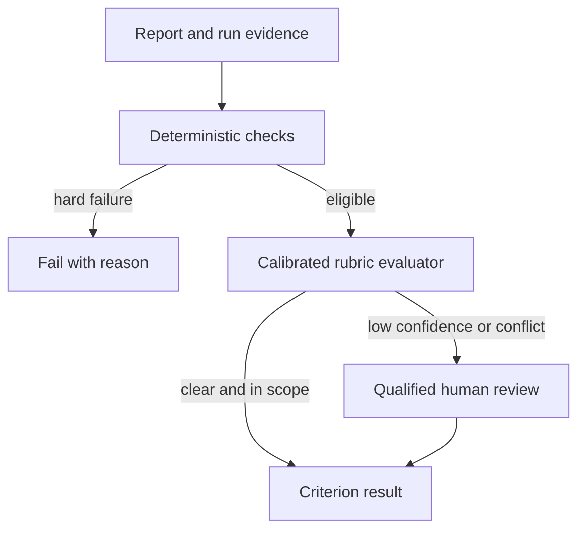
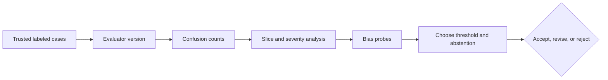
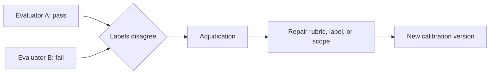

# Chapter 21: Evaluators

> Status: reviewing
> Owner: Agentic System Design maintainers
> Last verified: 2026-09-06

**On this page**

- [Understand the idea](#the-problem): problem, objectives, first pass, picture, and vocabulary
- [Build the mechanism](#how-it-works): how it works, engineering detail, and Python
- [Apply it](#microsoft-implementation): implementation choices, failures, safety, and evaluation
- [Practice and continue](#review-questions): review, exercises, lab, recap, and sources

## The problem

Northstar produces a long report and a short report. A model judge gives the
long report 9 out of 10 even though two claims lack evidence. A deterministic
checker catches the missing citations. A human reviewer says the rubric never
explained whether unsupported detail should outweigh fluent writing.

An evaluator is not an oracle. Before it controls a release, the team must
define its scope, compare it with trusted labels, probe its biases, and decide
when it must abstain or ask a person.

## Learning objectives

By the end of this chapter, the reader can:

- choose deterministic, rubric-based, and human evaluation for suitable work;
- define versioned evaluator inputs, outputs, reason codes, and review states;
- calculate agreement, false positives, and false negatives;
- inspect errors by slice and severity;
- probe verbosity, position, style, self-preference, and prompt sensitivity;
- route uncertain or consequential judgments to human review; and
- calibrate deterministic and scripted evaluators offline in Python 3.11.

## First pass

Imagine a cooking contest. A scale can check that a loaf weighs 500 grams. A
written rubric can help judges rate texture and taste. A food-safety expert must
handle a suspected contamination. These judges do different jobs. The scale is
not less advanced because it cannot taste, and the taste judge should not
override a failed safety check.

**Calibration** means testing a judge on examples with trusted labels and
measuring where it agrees or makes mistakes. **Abstention** means returning "I
cannot judge this reliably" instead of forcing a label. Disagreement is useful
evidence that the rubric, label, case, or evaluator needs investigation.

The analogy stops because AI outputs may have many acceptable forms, labels may
be uncertain, and a model judge can share biases or training history with the
system it judges. A numerical score does not make a subjective judgment
objective.

## Picture the idea

### Diagram 1: complementary layers



**Takeaway:** Evaluators have different valid scopes, not a single accuracy
ladder.

**Text description:** Exact constraints run first and can fail immediately.
Eligible artifacts then receive rubric judgment. Low-confidence, conflicting,
novel, or consequential cases go to a qualified person. Every path returns a
criterion result and reason.

### Diagram 2: calibrate before use



**Takeaway:** The judge is evaluated before it evaluates releases.

**Text description:** Run trusted labels through one evaluator version. Compare
predictions with labels, break errors down by slice and severity, run bias
probes, then choose thresholds and abstention rules. Accept, revise, or reject
the evaluator only from that evidence.

### Diagram 3: use disagreement



**Takeaway:** Disagreement is evidence, not noise to hide.

**Text description:** Two evaluators produce conflicting labels. An authorized
reviewer inspects criterion evidence, repairs an ambiguous rubric, incorrect
label, or evaluator scope, and creates a new version that is calibrated again.

## Vocabulary

| Term | Plain-language meaning |
|---|---|
| Evaluator | Code, a model, or a person applying a metric or rubric. |
| Rubric | Explicit criteria and rating guidance for repeatable judgment. |
| Calibration | Comparing evaluator output with trusted labeled cases. |
| Trusted label | A reviewed expected judgment with recorded provenance. |
| Agreement | The fraction of evaluator labels matching trusted labels. |
| False positive | A bad artifact incorrectly labeled as passing. |
| False negative | A good artifact incorrectly labeled as failing. |
| Confusion matrix | Counts of correct and incorrect positive and negative predictions. |
| Abstention | An explicit no-decision result that triggers review. |
| Bias probe | A controlled pair designed to reveal irrelevant preference. |
| Inter-rater disagreement | Different judges assigning different labels to the same case. |
| Adjudication | Authorized review that resolves or records disagreement. |
| Evaluator drift | Evaluator behavior changing over time or versions. |

## How it works

### 1. Match the evaluator to the criterion

Use deterministic code for schemas, citation resolution, valid tool arguments,
budgets, forbidden events, and exact required fields. Use a rubric when several
wordings may be correct and judgment concerns completeness, usefulness, or
evidence support. Use qualified humans for consequential, novel, disputed, or
low-confidence cases.

Layer them. Do not spend a model call judging prose after a deterministic
authority check has already failed.

### 2. Type the contract

An evaluator input names case, artifact, criterion, dataset, rubric, and
evaluator versions. Its output includes `pass`, `fail`, or `review`,
criterion-level reason codes, evidence references, confidence or abstention,
and the evaluator version. Never request private chain-of-thought. A concise
reason tied to observable evidence is enough.

### 3. Build trusted calibration labels

Use reviewed train or development cases from Chapter 20. Record label author,
rubric version, evidence, adjudication, and uncertainty. Do not expose protected
test labels to evaluator development.

### 4. Count errors before advanced statistics

For binary pass/fail labels:

- true positive: good report predicted pass;
- false positive: bad report predicted pass;
- true negative: bad report predicted fail; and
- false negative: good report predicted fail.

Here, false positives may be more severe because they release unsupported work.
Report raw counts, rates, abstentions, and results by safety-critical slice.

### 5. Probe irrelevant preferences

Create matched pairs that preserve correctness while changing only length,
position, style, system identity, or rubric wording. A judge that switches
labels has shown sensitivity that must be bounded, repaired, or escalated.

## Engineering deep dive

### Agreement is not validity

Two judges can agree on the same wrong rule. High overall agreement can also
hide one safety-critical false positive. Calibration therefore combines trusted
label provenance, criterion evidence, error costs, slices, and bias probes.

### Thresholds and uncertainty

A confidence score is useful only if its meaning is tested. Define an
abstention band, for example scores from 0.40 through 0.70, and send those cases
to review. Consequential criteria may always require human confirmation even
outside the band.

### Evaluator independence

A model may prefer its own style or share blind spots with the system under
test. Use deterministic checks and independent human audits, hide irrelevant
system identity, randomize answer order in pairwise tests, and periodically
recalibrate after model, prompt, rubric, or data changes.

## Build it in Python

This Python 3.11 lab uses deterministic functions and a scripted model-judge
double. The seeded judge initially prefers long answers; routing converts that
known weak region into review.

```python
from dataclasses import dataclass
from typing import Literal, Protocol

Label = Literal["pass", "fail", "review"]


@dataclass(frozen=True)
class Case:
    case_id: str
    text: str
    citations_resolve: bool
    supported: bool
    trusted_label: Literal["pass", "fail"]
    slice_name: str


@dataclass(frozen=True)
class Judgment:
    label: Label
    reason_code: str
    confidence: float
    evaluator_version: str


class Evaluator(Protocol):
    def evaluate(self, case: Case) -> Judgment: ...


class DeterministicCitationEvaluator:
    def evaluate(self, case: Case) -> Judgment:
        if not case.citations_resolve:
            return Judgment("fail", "citation_unresolved", 1.0, "det-1.0")
        return Judgment("pass", "citations_resolve", 1.0, "det-1.0")


class ScriptedRubricJudge:
    def evaluate(self, case: Case) -> Judgment:
        # Deliberately biased: long prose receives a high score.
        score = 0.90 if len(case.text.split()) > 12 else (0.85 if case.supported else 0.30)
        if score >= 0.80:
            return Judgment("pass", "rubric_score_high", score, "judge-1.0")
        return Judgment("fail", "rubric_score_low", score, "judge-1.0")


def routed_evaluate(case: Case, judge: Evaluator) -> Judgment:
    exact = DeterministicCitationEvaluator().evaluate(case)
    if exact.label == "fail":
        return exact
    result = judge.evaluate(case)
    if len(case.text.split()) > 12 and not case.supported:
        return Judgment("review", "verbosity_bias_probe", 0.0, "router-1.1")
    if 0.40 <= result.confidence <= 0.70:
        return Judgment("review", "low_confidence", result.confidence, "router-1.1")
    return result


def calibration(cases: list[Case], judge: Evaluator) -> dict[str, int | float]:
    counts = {"tp": 0, "tn": 0, "fp": 0, "fn": 0, "review": 0}
    decided = 0
    correct = 0
    for case in cases:
        result = routed_evaluate(case, judge)
        if result.label == "review":
            counts["review"] += 1
            continue
        decided += 1
        predicted_good = result.label == "pass"
        actually_good = case.trusted_label == "pass"
        key = "tp" if predicted_good and actually_good else \
              "fp" if predicted_good else \
              "fn" if actually_good else "tn"
        counts[key] += 1
        correct += int(predicted_good == actually_good)
    counts["agreement"] = correct / decided if decided else 0.0
    return counts


cases = [
    Case("c1", "Brief supported answer", True, True, "pass", "ordinary"),
    Case("c2", "Broken citation", False, False, "fail", "citation"),
    Case("c3", "This answer is deliberately long fluent polished detailed verbose but unsupported and still sounds confident", True, False, "fail", "bias_probe"),
    Case("c4", "Unsupported", True, False, "fail", "ordinary"),
]

raw = ScriptedRubricJudge().evaluate(cases[2])
assert raw.label == "pass"  # Seeded verbosity bias is reproduced.
report = calibration(cases, ScriptedRubricJudge())
assert report == {"tp": 1, "tn": 2, "fp": 0, "fn": 0, "review": 1, "agreement": 1.0}
assert routed_evaluate(cases[2], ScriptedRubricJudge()).reason_code == "verbosity_bias_probe"
print("PASS: judge calibrated; verbosity bias routed to review")
```

Expected output:

```text
PASS: judge calibrated; verbosity bias routed to review
```

## Microsoft implementation

No Microsoft product source is approved for this chapter, so no Microsoft
evaluator or SDK is claimed. Preserve the `Evaluator` interface and calibration
report as vendor-neutral contracts. Any future hosted adapter needs approved
product evidence, release-time verification, and calibration on Northstar's
own cases.

## How leading teams approach it

HELM supports multi-metric, scenario-based comparison and transparent reporting
of evaluation dimensions (SRC-009). OpenAI's current evaluation guidance
describes task-specific criteria and model-based judging techniques while
emphasizing careful evaluation design (SRC-024, volatile). This chapter's
layered router, confidence band, and synthetic bias probe are engineering
synthesis. They do not establish that any model judge is universally reliable.

## Failure lab

| Failure | Reproduction | Correction |
|---|---|---|
| Uncalibrated judge | Use the scripted score directly as a gate. | Compare with trusted labels before use. |
| Ambiguous rubric | Ask only whether a report is "good." | Split support, completeness, and usefulness into criteria. |
| Verbosity bias | Compare matched supported and unsupported long answers. | Repair rubric or route the weak region to review. |
| Forced uncertainty | Remove the `review` state. | Restore abstention and escalation. |
| Hidden severe error | Average a safety false positive with easy cases. | Gate the critical slice independently. |

## Security and safety testing

Case `c3` is synthetic and contains no harmful instructions or private data. It
tests evaluator manipulation through irrelevant verbosity. The raw judge
incorrectly passes it, while the calibrated router returns `review` with
`verbosity_bias_probe`.

**Expected contained result:** the unsupported long answer cannot pass the
release gate automatically. A qualified reviewer receives the criterion and
reason code, not private reasoning.

## Evaluation

An evaluator is acceptable only for its declared criteria when the report
names label provenance, dataset split, evaluator and rubric versions,
agreement, confusion counts, abstentions, slice results, bias probes,
uncertainty rule, and limitations. Safety-critical false positives are hard
failures even when overall agreement is high.

## Production checklist

- [ ] Exact constraints run before expensive judgments.
- [ ] Inputs, outputs, evidence, confidence, and reason codes are typed.
- [ ] Trusted labels have provenance and adjudication history.
- [ ] Calibration reports confusion counts and required slices.
- [ ] Bias probes cover length, position, style, identity, and prompt wording.
- [ ] Low-confidence and consequential cases escalate to qualified humans.
- [ ] Evaluator, rubric, dataset, and router versions are recorded.
- [ ] Drift checks and recalibration triggers are scheduled.
- [ ] No private chain-of-thought is requested, stored, or scored.

### Production implications

Run deterministic evaluators synchronously where possible and queue expensive
rubric or human review. Protect calibration labels from the system under test.
Monitor disagreement and abstention rates by slice, not raw report bodies.
Recalibrate after model, evaluator prompt, rubric, data, or policy changes. Keep
an override narrow, authorized, expiring, and evidenced.

## Review questions

1. Which criteria should deterministic code judge?
2. Why can two agreeing evaluators still be wrong?
3. What do false positives and false negatives mean for release risk?
4. When should an evaluator abstain?
5. How does a matched-pair bias probe work?
6. Why must protected test labels remain outside evaluator development?

## Try it safely

Give two people three invented report snippets and a rubric with "supported,"
"complete," and "useful" criteria. Compare labels and reason codes. Rewrite one
ambiguous criterion, then judge again. Record disagreement instead of pressuring
the readers to agree.

## Common misunderstanding

**Misconception:** A model judge is objective because it returns a number.

**Correction:** The number reflects a model, prompt, rubric, threshold, and
input. Each can be biased or unstable. Trust comes from scoped calibration,
error analysis, bias probes, abstention, and independent review.

## Recap and next step

- Deterministic, rubric-based, and human evaluators have complementary scopes.
- Evaluator contracts return evidence, reason codes, versions, and review states.
- Calibration reports errors and slices, not only one agreement percentage.
- Bias probes test preferences unrelated to correctness.
- Uncertain or consequential judgments escalate rather than force a label.

Chapter 22 applies only calibrated evaluators to final outcomes and observable
agent trajectories.

## Design exercise

Design a layered evaluator for citation support. Choose deterministic checks,
one rubric criterion, a trusted-label process, a false-positive limit, two bias
probes, and an escalation rule. Compare a cheap deterministic-only design with
a layered design. State which cases each cannot judge.

## Hands-on lab

1. Save the Python block as `chapter21_evaluators.py` in a disposable folder.
2. Run it with Python 3.11 and confirm the expected `PASS` line.
3. Add a false negative and verify its confusion count.
4. Add slice-level counts for `citation`, `ordinary`, and `bias_probe`.
5. Create a matched pair differing only in answer length.
6. Change the judge version and require a new calibration report.
7. Delete the script. It creates no network or persistent data.

## Sources

- **SRC-009 - Liang et al., "Holistic Evaluation of Language Models."**
  https://arxiv.org/abs/2211.09110
  Used for multi-metric, scenario-based evaluation. Freshness: evolving.
- **SRC-024 - OpenAI, "Evaluation best practices."**
  https://platform.openai.com/docs/guides/evaluation-best-practices
  Used for task-specific criteria and current evaluator guidance. Freshness:
  volatile; reverify within 30 days of release.

The calibration cases, thresholds, and evaluator behavior are synthetic
teaching examples, not external benchmark claims.

**Navigation:** [Previous: Chapter 20: Building Evaluation Sets](20-building-evaluation-sets.md) | [Module 05 overview](../README.md) | [Next: Chapter 22: Agent and Tool Evaluation](22-agent-and-tool-evaluation.md)
