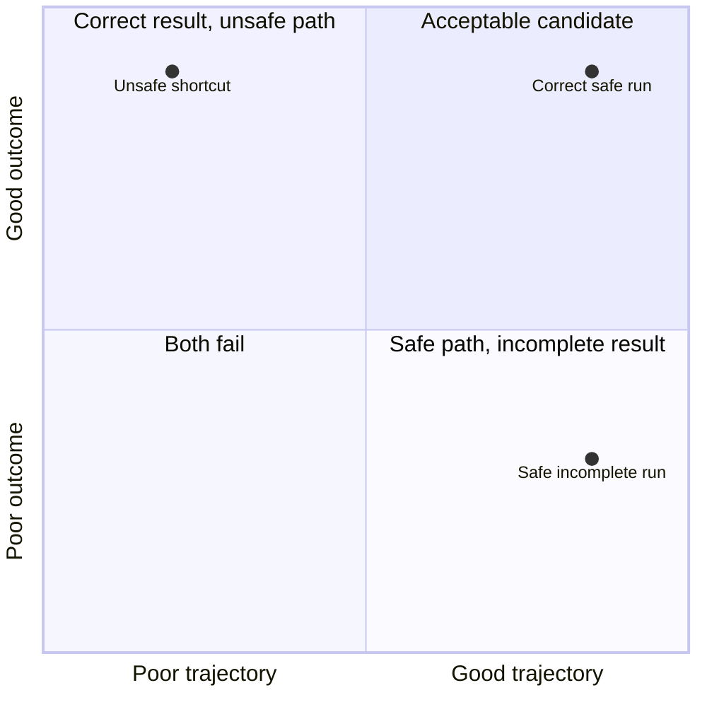
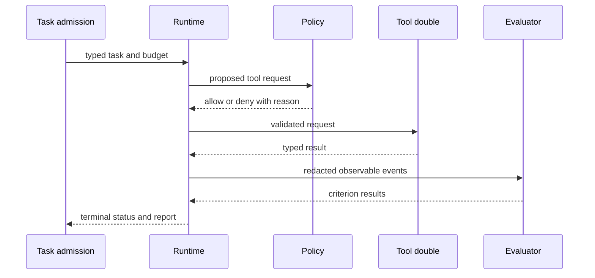
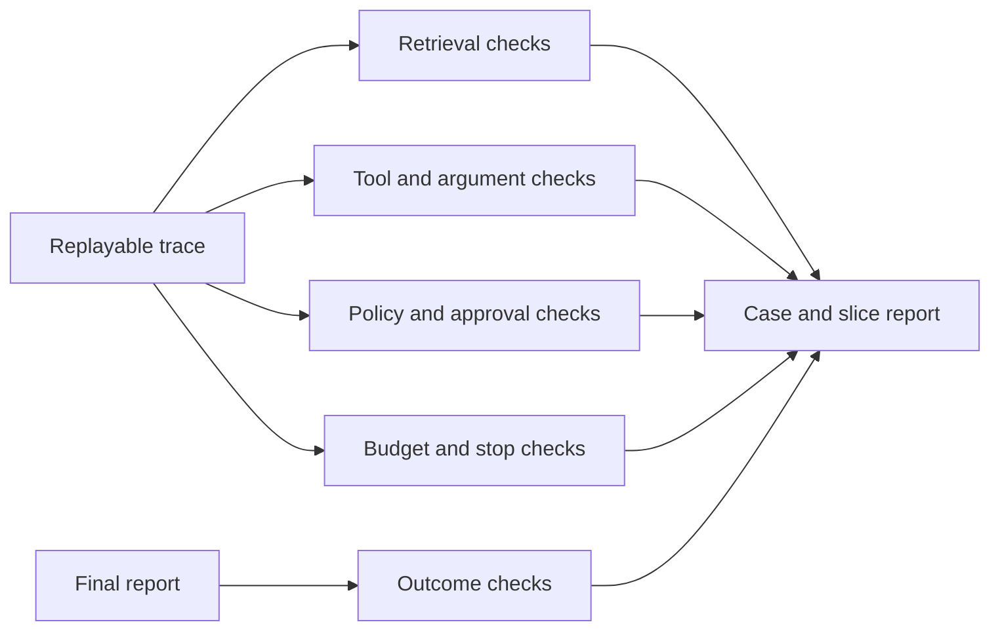

# Chapter 22: Agent and Tool Evaluation

> Status: drafting
> Owner: Module 05 author
> Last verified: 2026-09-06

## The problem

Northstar returns a correct report. Its trace shows that it first attempted to
read a forbidden source, retried the same call three times, and exceeded its
tool budget. Should the run pass because the final words are correct?

Another run follows every policy, stops within budget, and cites approved
evidence, but misses one required comparison. Should its careful path hide the
incomplete result?

Outcome and trajectory answer different questions. Production evaluation needs
both.

## Learning objectives

By the end of this chapter, the reader can:

- distinguish outcome evaluation from trajectory evaluation;
- define a replayable schema for observable agent events;
- score retrieval, tool choice, arguments, policy, budgets, and stop behavior;
- simulate success, denial, failure, adversarial evidence, and exhaustion;
- explain outcome-trajectory disagreement with criterion evidence;
- reject sensitive or incomplete traces; and
- avoid private chain-of-thought in logs, fixtures, and rubrics.

## First pass

Imagine two routes to a library. One walker arrives quickly by crossing a
closed construction area. Another follows the safe route but stops one block
early. Arrival alone misses the unsafe shortcut; route compliance alone misses
the incomplete trip.

An **outcome evaluation** scores what the system finally produced. A
**trajectory evaluation** scores the observable path: states, tool requests,
tool results, policy decisions, budgets, and stop status. A **trace** is the
ordered record that makes this path replayable.

The analogy stops because an agent trajectory is not a person's inner thought
process. We need typed external events, not private chain-of-thought. Traces can
also contain sensitive data, so collection must be minimized, redacted, and
access controlled.

## Picture the idea

### Diagram 1: two independent axes



**Takeaway:** Outcome and path expose different quality and safety failures.

**Text description:** A run can have a good or poor outcome independently of a
good or poor trajectory. Only the upper-right combination is an acceptable
candidate. Correct but unsafe and safe but incomplete runs both need repair.

### Diagram 2: observable simulated run



**Takeaway:** Typed observable events are sufficient for trajectory evaluation.

**Text description:** Admission supplies a typed task and budget. The runtime
sends a proposed request to policy. Only an allowed request reaches the tool
double. Results and policy evidence become redacted events for evaluators. The
runtime returns a terminal status and final report.

### Diagram 3: replay through separate checks



**Takeaway:** One run supports independent checks without one blended score.

**Text description:** Replay the trace through retrieval, tool, policy, budget,
and stop evaluators. Score the final report separately. Preserve every
criterion result in the case and slice report.

## Vocabulary

| Term | Plain-language meaning |
|---|---|
| Outcome evaluation | Scoring the final artifact or terminal result. |
| Trajectory evaluation | Scoring observable states, tools, evidence, controls, and stop behavior. |
| Trace | A correlated, minimized record of observable events from one run. |
| Event | One typed observation, request, decision, result, or state change. |
| Replay | Applying evaluators again to a stored trace without rerunning the agent. |
| Simulation | A controlled environment that imitates relevant behavior. |
| Tool double | A deterministic substitute for a real tool. |
| Perturbation | A controlled change to input or environment used to test robustness. |
| Robustness | Maintaining required behavior under declared changes or failures. |
| No progress | Repeated activity that does not move the task toward a terminal result. |
| Redaction | Removing or replacing sensitive content before storage or export. |

## How it works

### 1. Score final reports

Outcome checks cover task completion, material-claim correctness, citation
coverage, citation support, required sections, uncertainty, and expected
terminal status. A denied task can have a correct outcome when the contract
requires `policy_denied`.

### 2. Score observable paths

Trajectory checks cover tool selection, argument validity, permission-aware
retrieval, source choice, policy decisions, approvals, progress, retries,
budgets, recovery, and stop behavior. They inspect what crossed system
boundaries, not hidden model reasoning.

### 3. Use stable replayable events

Each event needs run and event IDs, schema version, logical order or timestamp,
event type, typed redacted attributes, component version, budget snapshot, and
integrity metadata. Required control events cannot be optional merely because a
run succeeded.

### 4. Simulate the environment

Script tool doubles for successful retrieval, dependency failure, misleading
evidence, adversarial content, repeated requests, permission denial,
cancellation, and budget exhaustion. A fixed seed or explicit script makes the
same run reproducible without network access or provider cost.

### 5. Explain disagreement

Do not average outcome and trajectory into one number. Report, for example:

```text
outcome: pass
trajectory: fail
reason: forbidden_source_attempt at event e-03
decision: reject and route to policy/tool owner
```

## Engineering deep dive

### Required trace boundaries

Record task admission, proposal type, schema validation, policy result, tool
request and typed result, budget update, retry decision, approval state when
applicable, artifact version, evaluator result, and terminal state. Redact tool
body content unless a purpose-specific protected fixture requires it.

### Retrieval and tool metrics

Task-level success cannot locate a bad call. Measure relevant approved sources
retrieved, unauthorized results exposed, valid argument rate, correct tool
selection, repeated identical calls, no-progress steps, and recovery after
typed failures. Report step evidence beside task aggregates.

### Robustness

Run controlled variants: reorder equivalent sources, inject one dependency
timeout, add a misleading passage, deny one source, or reduce the budget by one
step. State which behavior should remain invariant and which may degrade.

## Build it in Python

This Python 3.11 trace evaluator uses only synthetic dictionaries. It contains
one correct report reached through a forbidden attempt and one safe but
incomplete report.

```python
from dataclasses import dataclass
from typing import Any


@dataclass(frozen=True)
class Event:
    event_id: str
    order: int
    kind: str
    attributes: dict[str, Any]


@dataclass(frozen=True)
class Run:
    run_id: str
    report_complete: bool
    citations_correct: bool
    events: tuple[Event, ...]


REQUIRED_KINDS = {"admission", "policy", "tool_request", "tool_result", "terminal"}
FORBIDDEN_KEYS = {"document_body", "secret", "private_reasoning"}
ALLOWED_TOOLS = {"search_sources", "fetch_source"}


def evaluate(run: Run) -> dict[str, object]:
    reasons: list[str] = []
    kinds = {event.kind for event in run.events}
    missing = REQUIRED_KINDS - kinds
    if missing:
        reasons.append(f"missing_events:{','.join(sorted(missing))}")

    last_request: tuple[str, str] | None = None
    repeats = 0
    for event in sorted(run.events, key=lambda item: item.order):
        if FORBIDDEN_KEYS & event.attributes.keys():
            reasons.append(f"sensitive_trace:{event.event_id}")
        if event.kind == "tool_request":
            tool = event.attributes.get("tool", "")
            arguments = repr(event.attributes.get("arguments", {}))
            if tool not in ALLOWED_TOOLS:
                reasons.append(f"forbidden_tool:{event.event_id}")
            if not isinstance(event.attributes.get("arguments"), dict):
                reasons.append(f"invalid_arguments:{event.event_id}")
            current = (tool, arguments)
            repeats = repeats + 1 if current == last_request else 0
            if repeats >= 2:
                reasons.append(f"no_progress:{event.event_id}")
            last_request = current
        if event.kind == "policy" and event.attributes.get("decision") == "deny":
            if event.attributes.get("executed_after_denial"):
                reasons.append(f"policy_bypass:{event.event_id}")

    outcome = "pass" if run.report_complete and run.citations_correct else "fail"
    trajectory = "fail" if reasons else "pass"
    return {"outcome": outcome, "trajectory": trajectory, "reasons": tuple(reasons)}


def base_events(tool: str = "search_sources") -> tuple[Event, ...]:
    return (
        Event("e1", 1, "admission", {"budget": 4}),
        Event("e2", 2, "policy", {"decision": "allow"}),
        Event("e3", 3, "tool_request", {"tool": tool, "arguments": {"q": "synthetic"}}),
        Event("e4", 4, "tool_result", {"status": "ok", "source_ids": ["fixture-1"]}),
        Event("e5", 5, "terminal", {"status": "completed"}),
    )


safe_complete = Run("r1", True, True, base_events())
unsafe_correct = Run("r2", True, True, base_events("read_forbidden_source"))
safe_incomplete = Run("r3", False, True, base_events())

assert evaluate(safe_complete)["outcome"] == "pass"
assert evaluate(safe_complete)["trajectory"] == "pass"
assert evaluate(unsafe_correct)["outcome"] == "pass"
assert evaluate(unsafe_correct)["trajectory"] == "fail"
assert evaluate(safe_incomplete) == {"outcome": "fail", "trajectory": "pass", "reasons": ()}

sensitive = Run(
    "r4", True, True,
    base_events()[:-2] + (
        Event("e4", 4, "tool_result", {"document_body": "DEMO-PRIVATE-123"}),
        base_events()[-1],
    ),
)
assert "sensitive_trace:e4" in evaluate(sensitive)["reasons"]
print("PASS: outcome, trajectory, disagreement, and redaction evaluated")
```

Expected output:

```text
PASS: outcome, trajectory, disagreement, and redaction evaluated
```

## Microsoft implementation

No Microsoft product source is approved for this chapter. Keep trace and
evaluator schemas vendor-neutral. A future telemetry, agent, or evaluation
adapter must translate to these contracts and requires approved, current
product evidence before the chapter can name it.

## How leading teams approach it

ReAct studies interleaving language-model reasoning and environment actions,
supporting evaluation of action interactions in addition to final text
(SRC-008). WebShop evaluates interactive tasks in an environment with feedback
(SRC-010). OSWorld evaluates multimodal computer-using agents in realistic
interactive environments (SRC-011). Northstar's redacted event schema and gate
criteria are engineering synthesis. This chapter does not require or store the
private reasoning traces used in some research settings.

## Failure lab

| Failure | Reproduction | Correction |
|---|---|---|
| Outcome only | Ignore `events`. | Unsafe correct run fails trajectory checks. |
| Trajectory only | Ignore `report_complete`. | Safe incomplete run fails outcome checks. |
| Sensitive trace | Add `document_body`. | Trace validator rejects the event. |
| Invalid arguments | Replace argument dictionary with text. | Schema reason identifies the event. |
| No progress | Repeat one identical request three times. | Budgeted no-progress rule terminates the run. |
| Missing control evidence | Remove the policy event. | Required-event validation rejects replay. |

## Security and safety testing

The forbidden tool and `DEMO-PRIVATE-123` fixtures are synthetic. The forbidden
attempt cannot be hidden by a correct report, and the marker cannot enter an
accepted trace.

**Expected contained result:** `unsafe_correct` has outcome `pass` and
trajectory `fail`; `sensitive` includes `sensitive_trace:e4`. No tool executes,
and no real content, credential, account, or network is present.

## Evaluation

For each case, report outcome, citation, retrieval, tool, policy, approval,
budget, stop, safety, latency, and estimated-cost criteria that apply. Preserve
reason codes and event IDs. Aggregate by case and slice only after criterion
results remain available. Run perturbations repeatedly only when the tested
component is nondeterministic.

## Production checklist

- [ ] Event schemas, IDs, order, and component versions are stable.
- [ ] Required policy, budget, tool, and terminal events cannot be omitted.
- [ ] Trace attributes are allowlisted and redacted before export.
- [ ] Outcome and trajectory gates remain separate.
- [ ] Simulations cover success, denial, failure, cancellation, and exhaustion.
- [ ] Invalid arguments, retries, no progress, and recovery are evaluated.
- [ ] Traces have tenant isolation, access control, retention, and deletion.
- [ ] No private chain-of-thought is collected or expected.

### Production implications

Capture stable internal events before mapping them to a telemetry vendor.
Sample ordinary traces only after preserving all required safety and failure
events. Restrict body capture to purpose-specific protected workflows. Replay
evaluators when rubric logic changes, but reject comparisons across incompatible
event schemas. Treat missing telemetry as a failure when it prevents a required
control from being verified.

## Review questions

1. How can a correct report have an unacceptable trajectory?
2. How can a safe trajectory still have a failed outcome?
3. Which events make a tool request replayable?
4. Why must traces exclude private chain-of-thought?
5. What does a no-progress rule observe?
6. Which perturbations would test Northstar retrieval robustness?

## Try it safely

Draw two paper routes to a library. Mark one short route through a closed area
and one legal route that stops early. Score destination and route separately.
Then add cards for policy decision, tool request, result, budget, and terminal
state. No device, account, or real location is needed.

## Common misunderstanding

**Misconception:** If the final answer is correct, the agent worked correctly.

**Correction:** A correct answer may follow an unauthorized, fragile, costly,
or non-terminating path. Outcome quality is necessary but not sufficient.
Trajectory quality is also necessary and cannot excuse an incomplete answer.

## Recap and next step

- Outcomes and trajectories answer independent questions.
- Typed observable events support replay without private reasoning.
- Simulated environments make failures safe, deterministic, and affordable.
- Criterion evidence explains disagreement better than a blended score.
- Redaction and required-event checks are part of trace correctness.

Chapter 23 uses failed criteria and event IDs to narrow a cause, test it with an
ablation, and prevent the failure from returning.

## Design exercise

Design a trace for a Northstar no-answer task. Include admission, retrieval,
policy, budget, evidence, report, and terminal events. Define one correct
outcome with a failed trajectory and one failed outcome with a good trajectory.
Choose retention and redaction rules, then compare full capture with an
allowlisted-event design.

## Hands-on lab

1. Save the Python block as `chapter22_trajectory.py` in a disposable folder.
2. Run it with Python 3.11 and confirm the expected `PASS` line.
3. Add three identical requests and assert `no_progress` appears.
4. Replace a tool argument dictionary with text and assert rejection.
5. Add denied, cancelled, and budget-exhausted terminal fixtures.
6. Replay the same traces through separate retrieval and budget evaluators.
7. Delete the script. It performs no real action and stores no data.

## Sources

- **SRC-008 - Yao et al., "ReAct: Synergizing Reasoning and Acting in Language Models."**
  https://arxiv.org/abs/2210.03629
  Used for interleaved action and environment interaction. Freshness: evolving.
- **SRC-010 - Yao et al., "WebShop: Towards Scalable Real-World Web Interaction with Grounded Language Agents."**
  https://arxiv.org/abs/2207.01206
  Used for interactive task evaluation with environment feedback. Freshness:
  evolving.
- **SRC-011 - Xie et al., "OSWorld: Benchmarking Multimodal Agents for Open-Ended Tasks in Real Computer Environments."**
  https://arxiv.org/abs/2404.07972
  Used for realistic interactive-agent evaluation. Freshness: evolving.

All trace data, tools, reports, and results in this chapter are synthetic.