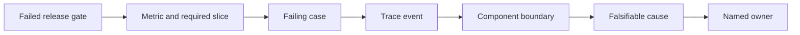
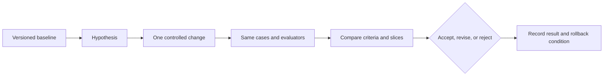
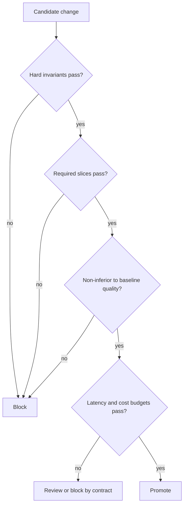

# Chapter 23: Debugging and Optimization

> Status: reviewing
> Owner: Agentic System Design maintainers
> Last verified: 2026-09-06

## The problem

Northstar misses a required citation. One engineer rewrites the prompt, another
changes retrieval depth, and a third changes the evaluator. The next run
passes, but nobody knows why. A later latency optimization brings the failure
back.

Evaluation says where a requirement failed. Debugging narrows that evidence to
a testable cause. Optimization changes one controlled factor and proves that
the gain does not break accepted behavior.

## Learning objectives

By the end of this chapter, the reader can:

- classify failures by contract, data, evaluator, model, retrieval, tool,
  runtime, policy, environment, or infrastructure;
- trace a failed indicator to a case, event, component, and owner;
- write a falsifiable hypothesis rather than a plausible story;
- use an ablation to test one suspected cause;
- compare compatible versions before and after one change;
- add diagnosed failures to development regression tests without leaking the
  protected holdout;
- handle production feedback with minimization and provenance; and
- block a faster candidate that regresses citation quality.

## First pass

Imagine an assembly line with four stations. A finished toy has no wheels. If
you change every station at once and the next toy has wheels, you cannot tell
which change mattered. Instead, inspect the line, form a hypothesis, replace or
remove one station, and compare the same input before and after.

An **ablation** is a controlled experiment that removes or replaces one
component to test its contribution. A **regression** is behavior that used to
pass and now fails. A **regression gate** blocks promotion when required checks
fail.

The analogy stops because AI components interact, labels can be wrong, and
outputs may vary across runs. Removing one component can alter inputs to later
components. The experiment must name versions, uncertainty, confounders, and a
rollback condition. Correlation in a trace suggests a cause; it does not prove
one.

## Picture the idea

### Diagram 1: diagnostic funnel



**Takeaway:** Debugging narrows evidence before changing the system.

**Text description:** Start at the failed gate, identify its metric and slice,
then one failing case and its relevant trace event. Map that event to a
component boundary, state a cause that an experiment can disprove, and route it
to the owning team.

### Diagram 2: controlled experiment loop



**Takeaway:** An improvement is a measured result, not a plausible edit.

**Text description:** Freeze a baseline and hypothesis, change one factor, run
the same dataset and evaluator versions, compare criterion and slice results,
make a decision, and record a rollback condition.

### Diagram 3: regression gate



**Takeaway:** Release gates preserve accepted behavior across several
dimensions.

**Text description:** Check hard invariants, required slices, and quality
against the baseline before considering latency or cost. Any required failure
blocks promotion. Only a safe, non-inferior, budget-compliant candidate can
promote.

## Vocabulary

| Term | Plain-language meaning |
|---|---|
| Failure taxonomy | Named failure classes used to route evidence and ownership. |
| Localization | Narrowing a failure to the smallest supported component boundary. |
| Hypothesis | A testable statement that predicts an observable result. |
| Falsifiable | Able to be shown wrong by a defined observation. |
| Ablation | Removing or replacing one component to test its contribution. |
| Controlled comparison | Before and after runs that differ in one intended factor. |
| Confounder | Another difference that could explain the observed result. |
| Regression | Previously passing behavior that now fails. |
| Regression suite | Cases retained to detect diagnosed failures returning. |
| Regression gate | A promotion decision enforcing required checks and thresholds. |
| Non-inferiority | A requirement that a candidate is not worse than a baseline beyond an allowed margin. |
| Rollback condition | Evidence that requires restoring the previous accepted version. |
| Experiment record | Versioned hypothesis, change, result, decision, and limits. |

## How it works

### 1. Classify before editing

Use a taxonomy spanning task contract, dataset, evaluator, prompt or model,
context, retrieval, tool, workflow or runtime, policy, environment, and
infrastructure. Classification is provisional. Its purpose is to identify the
next discriminating check and owner.

### 2. Walk backward from evidence

Suppose citation coverage fails on difficult comparison tasks. Find the case,
then the missing claim, retrieval events, source candidates, permission
decisions, context assembly, and final citation record. Stop at the narrowest
boundary supported by evidence.

### 3. State competing hypotheses

Bad: "Retrieval seems weak."

Better: "The top-1 selector drops the only source containing fact B; replacing
top-1 with top-2 on the same fixture will restore evidence B without changing
the evaluator label for fact A."

A competing hypothesis might be that the source was retrieved but omitted by
context assembly. One ablation can distinguish them.

### 4. Change one factor

Keep task, dataset, evaluator, rubric, policy, and trace versions fixed. Change
retrieval depth only. If nondeterminism exists, use fixed seeds where valid and
repeat runs. Record uncertainty instead of selecting the luckiest result.

### 5. Turn diagnosed failures into regressions

Create a minimized synthetic development case preserving the failure mechanism,
its provenance, and expected result. Do not copy protected holdout answers into
development. A holdout failure may motivate a new independently authored case
and a replacement holdout version.

### 6. Gate the whole contract

Run hard invariants and required slices first. Compare candidate quality with
the accepted baseline, then latency and cost. A speed win does not excuse lower
citation support.

## Engineering deep dive

### Experiment record

Record experiment ID, hypothesis, one intended change, frozen versions,
baseline results, candidate results, repeated-run notes, slice differences,
decision, limitations, owner, and rollback condition. Without compatible
versions, mark the comparison invalid rather than forcing a conclusion.

### Evaluator and dataset bugs

The system under test is not always wrong. A stale golden source, changed rubric,
or biased judge can create a false regression. Diagnose evaluation components
with the same discipline and version them independently.

### Privacy-safe feedback

Production feedback is a new purpose, not free training data. Collect the
smallest event and reason code needed, retain provenance and consent or other
valid authority, restrict access, redact source bodies and identities, set
retention, and review representativeness. Never promote raw feedback directly
into train, development, or test sets.

## Build it in Python

This offline Python 3.11 lab starts with a seeded retrieval failure, tests a
top-k hypothesis, applies one fix, and blocks a faster candidate that loses
citation quality.

```python
from dataclasses import dataclass, asdict
import json


@dataclass(frozen=True)
class Result:
    version: str
    retrieved: tuple[str, ...]
    citation_coverage: float
    unauthorized_actions: int
    latency_ms: int
    estimated_cost: float


@dataclass(frozen=True)
class Experiment:
    experiment_id: str
    hypothesis: str
    dataset_version: str
    evaluator_version: str
    single_change: str
    baseline: Result
    candidate: Result
    decision: str
    rollback_condition: str


SOURCES = {
    "source-a": {"facts": {"A"}, "score": 0.90},
    "source-b": {"facts": {"B"}, "score": 0.80},
    "source-noise": {"facts": set(), "score": 0.10},
}


def run_system(version: str, top_k: int, latency_ms: int = 100) -> Result:
    ranked = sorted(SOURCES, key=lambda key: SOURCES[key]["score"], reverse=True)
    retrieved = tuple(ranked[:top_k])
    supported = set().union(*(SOURCES[key]["facts"] for key in retrieved))
    coverage = len(supported & {"A", "B"}) / 2
    return Result(version, retrieved, coverage, 0, latency_ms, 0.01 * top_k)


def gate(candidate: Result, baseline: Result) -> dict[str, object]:
    reasons: list[str] = []
    if candidate.unauthorized_actions != 0:
        reasons.append("hard_invariant:unauthorized_action")
    if candidate.citation_coverage < 1.0:
        reasons.append("quality:citation_coverage_below_1.0")
    if candidate.citation_coverage < baseline.citation_coverage:
        reasons.append("regression:worse_than_baseline")
    if candidate.latency_ms > 150:
        reasons.append("budget:latency_above_150ms")
    return {"decision": "block" if reasons else "promote", "reasons": reasons}


baseline = run_system("retriever-1.0", top_k=1)
assert baseline.citation_coverage == 0.5

# Ablation: retrieval depth is the only changed factor.
fixed = run_system("retriever-1.1", top_k=2)
assert fixed.citation_coverage == 1.0
assert set(fixed.retrieved) - set(baseline.retrieved) == {"source-b"}

experiment = Experiment(
    "exp-23-01",
    "top-1 drops source-b; top-2 restores fact B",
    "dataset-1.0",
    "evaluator-1.0",
    "retrieval top_k: 1 -> 2",
    baseline,
    fixed,
    "accept",
    "rollback if citation coverage falls below 1.0",
)
assert json.loads(json.dumps(asdict(experiment)))["decision"] == "accept"
assert gate(fixed, fixed)["decision"] == "promote"

# A seeded optimization is faster but drops the required second source.
too_fast = run_system("retriever-1.2", top_k=1, latency_ms=40)
blocked = gate(too_fast, fixed)
assert blocked["decision"] == "block"
assert "regression:worse_than_baseline" in blocked["reasons"]
print(json.dumps(blocked, sort_keys=True))
print("PASS: cause isolated; fix accepted; faster regression blocked")
```

Expected output includes:

```text
{"decision": "block", "reasons": ["quality:citation_coverage_below_1.0", "regression:worse_than_baseline"]}
PASS: cause isolated; fix accepted; faster regression blocked
```

## Microsoft implementation

No Microsoft product source is approved for this chapter, so this chapter does
not name a Microsoft tracing, evaluation, or deployment product. Keep
experiment records and gates vendor-neutral. A later adapter requires approved
product evidence and must preserve version checks, redaction, and rollback.

## How leading teams approach it

OpenAI's current evaluation guidance connects task-specific evaluation with an
iterative improvement cycle (SRC-024, volatile). OpenAI Agents SDK tracing
documentation describes current trace and span concepts that can support
localization when that SDK is actually chosen (SRC-025, volatile); this chapter
does not depend on it. Code Llama reports specialization and evaluation of a
code model, illustrating that improvement claims require measured task results
rather than model labels alone (SRC-039). The diagnostic funnel and regression
gate are Northstar engineering synthesis.

## Failure lab

| Failure | Reproduction | Correction |
|---|---|---|
| Random prompt tweaking | Make edits without a hypothesis. | Record a falsifiable prediction first. |
| Several changes | Change top-k and evaluator together. | Restore one controlled factor per experiment. |
| Version mismatch | Compare different dataset or rubric versions. | Reject or explicitly qualify comparison. |
| Holdout overfitting | Copy a failed holdout answer into development. | Author an independent regression and replace holdout if exposed. |
| Average-only optimization | Improve easy-case latency while a critical slice fails. | Gate hard invariants and required slices first. |
| Evaluator regression | Change judge prompt during system comparison. | Freeze and separately calibrate evaluator versions. |

## Security and safety testing

Add a candidate with `unauthorized_actions=1` and excellent quality, latency,
and cost. The first gate reason must be
`hard_invariant:unauthorized_action`, and the decision must be `block`.

The fixtures contain only invented source names and facts. Feedback records in
this lab should contain case ID, reason code, version, and synthetic trace event
ID, never source bodies or identities.

**Expected contained result:** no unsafe or quality-regressing candidate can be
promoted, and gate output identifies machine-readable reasons.

## Evaluation

A debugging result is acceptable only when it includes a failed metric and
slice, case and trace evidence, component boundary, competing hypotheses, one
controlled change, compatible versions, before-and-after results, uncertainty
or repeat notes, decision, and rollback condition. The regression suite must
reproduce the failure independently of protected holdout answers.

## Production checklist

- [ ] Failure taxonomy maps classes to evidence, owners, and escalation.
- [ ] Trace IDs connect failed gates to component boundaries.
- [ ] Hypotheses predict observations that can disprove them.
- [ ] Experiments freeze dataset, evaluator, rubric, policy, and code versions.
- [ ] One intended factor changes at a time.
- [ ] Required slices and hard invariants precede aggregate optimization.
- [ ] Regression fixtures have provenance without holdout leakage.
- [ ] Feedback is minimized, redacted, access controlled, and retained briefly.
- [ ] Gate output contains case and metric reason codes.
- [ ] Rollback and override conditions are explicit and tested.

### Production implications

Store experiment records beside release evidence. Automate compatibility
checks before comparison. Route failures to component owners using stable
reason codes, then monitor the accepted fix by required slice. Overrides should
be exceptional, authorized, time limited, and unable to waive hard safety or
authority invariants. Rollback must restore code, configuration, prompt,
retriever, evaluator, and dataset references consistently.

## Review questions

1. How does a trace suggest a cause without proving it?
2. What makes a hypothesis falsifiable?
3. Why should one intended factor change at a time?
4. When is a before-and-after comparison invalid?
5. How can a holdout failure become a regression without leaking its answer?
6. Why can a faster system still fail optimization?

## Try it safely

Draw a four-stage paper assembly line. Mark one output defective. Write two
competing causes, then remove or replace one stage and predict the result before
revealing it. Discuss why interacting software components make this test less
conclusive than a toy line.

## Common misunderstanding

**Misconception:** If a change improves the average score, it is an
optimization.

**Correction:** A useful optimization preserves hard invariants, required
slices, and accepted quality while improving a declared objective. Averages can
hide severe regressions, and a plausible change is not a causal result.

## Recap and next step

- Narrow failures from gate to metric, slice, case, event, and component.
- Test falsifiable hypotheses with one controlled change.
- Compare only compatible dataset, evaluator, rubric, and system versions.
- Convert diagnosed failures into independent development regressions.
- Block speed or cost gains that break quality, safety, or authority.

Module 06 adds formal threat, identity, privacy, safety, and governance evidence
as hard gates. Module 05 supplies the versioned evaluation and regression
machinery but does not claim its current fixtures complete that work.

## Design exercise

A Northstar candidate improves median latency by 30 percent, reduces citation
coverage from 96 to 92 percent overall, and reduces the permission-denied slice
from 100 to 80 percent. Design the diagnostic experiment and release gate.
Name two competing causes, one ablation, compatible versions, a rollback
condition, and the exact machine-readable block reasons.

## Hands-on lab

1. Save the Python block as `chapter23_debugging.py` in a disposable folder.
2. Run it with Python 3.11 and confirm both expected lines.
3. Add a trace event showing selected source IDs and connect it to the failure.
4. Test the competing context-omission hypothesis with a separate one-factor
   experiment.
5. Add the seeded failure as a synthetic development regression case.
6. Add an unauthorized candidate and verify the hard invariant blocks it.
7. Serialize the experiment and gate reports as JSON, then delete all lab files.

## Sources

- **SRC-024 - OpenAI, "Evaluation best practices."**
  https://platform.openai.com/docs/guides/evaluation-best-practices
  Used for current task-specific evaluation and iteration guidance. Freshness:
  volatile; reverify within 30 days of release.
- **SRC-025 - OpenAI, "Tracing in the Agents SDK."**
  https://openai.github.io/openai-agents-python/tracing/
  Used only for current trace and span concepts. Freshness: volatile; reverify
  within 30 days of release.
- **SRC-039 - Meta AI, "Code Llama: Open Foundation Models for Code."**
  https://arxiv.org/abs/2308.12950
  Used for specialization and task evaluation context. Freshness: evolving.

All failures, traces, metrics, and optimization results in this chapter are
synthetic teaching examples.

**Navigation:** [Previous: Chapter 22: Agent and Tool Evaluation](22-agent-and-tool-evaluation.md) | [Module 05 overview](../README.md) | [Next: Chapter 24: Threat Modeling Agentic Systems](../../06-security-safety-governance/chapters/24-threat-modeling-agentic-systems.md)
