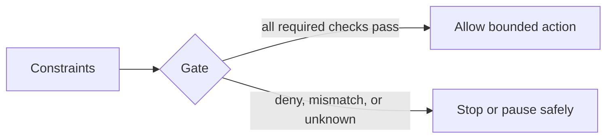
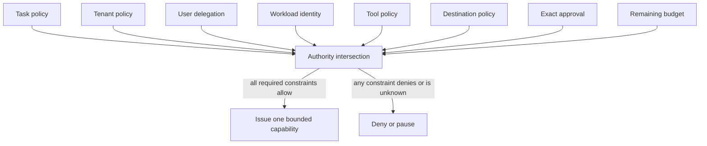
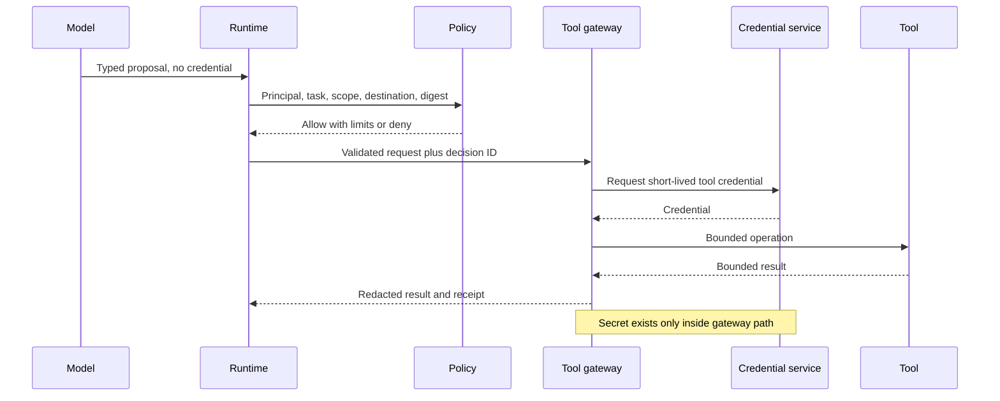
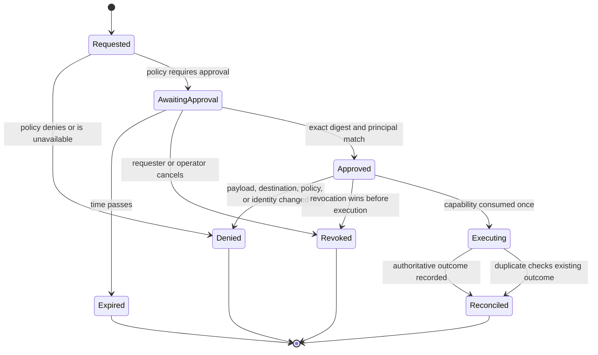

# Chapter 25: Secure Tools and Sandboxes

> Status: drafting  
> Owner: Chapter 25 author  
> Last verified: 2026-09-06

## The problem

Northstar needs tools to search sources, save drafts, and sometimes publish an approved
report. A convenient dispatcher such as `execute(tool_name, arguments)` can quietly give every
model proposal access to every tool, credential, and destination. If an injected document
causes a bad proposal, that convenience becomes ambient authority.

The safer question is not, "Does the model seem trustworthy?" It is, "What exact operation may
this request perform, for which user and tenant, on which data and destination, for how long,
under which limits, and with what evidence?"

## Learning objectives

By the end of this chapter, you can:

1. Compute effective authority as the intersection of independent constraints.
2. Define narrow capabilities with typed inputs, destinations, duration, and budgets.
3. Keep secrets outside prompts, model output, tool arguments, and evidence.
4. Bind approval to one exact consequential action and invalidate stale or changed approval.
5. Explain when a sandbox is required and what it cannot guarantee by itself.
6. Test malformed requests, excess scope, egress, replay, revocation, protocol mismatch, and
   unavailable policy with deterministic Python 3.11 code.

## First pass

### A key for one room

A building manager does not hand a visitor the master key. The visitor receives a key for one
room, during one appointment, and the key can be cancelled. The loading dock separately checks
which packages may leave. A signature for one package cannot approve a different package.

A tool capability is similar. It permits one typed operation within a narrow scope. A
publication approval identifies the report, destination, user, policy version, expiry, and
request key. If any of those change, the approval no longer matches.

### Where the analogy stops

Digital capabilities can be copied, replayed, retried, delegated, or used at machine speed.
They cross protocol and process boundaries, and a tool may return hostile content. A room key
also says little about CPU, storage, network, process isolation, or data leakage. Software needs
schema validation, identity checks, transaction limits, secret isolation, egress policy,
revocation, idempotency, evidence, and sometimes a sandbox working together.

## Picture the idea

### Beginner view: constraints decide action



**Takeaway:** constraints enter a deterministic gate, which either allows a bounded action or
stops safely.

**Equivalent text description:** applicable constraints enter a deterministic gate. If every
required check passes, the gate allows one bounded action. A denial, mismatch, or unknown result
stops or pauses the request safely.

### Authority is an intersection



**Takeaway:** the most restrictive applicable constraint wins; no model output, retrieval,
protocol message, or retry can add authority.

**Equivalent text description:** task, tenant, delegated user, workload, tool, destination,
approval, and budget constraints enter one decision. The gateway issues a bounded capability
only when every required constraint permits the same operation. A denial, expiry, mismatch, or
unknown result causes denial or a safe pause.

### Engineering deep dive D2: a secretless tool call



**Takeaway:** generated text proposes a typed action, while the gateway obtains and uses a
short-lived credential only after policy allows the request.

**Equivalent text description:** the model sends a credential-free proposal to the runtime.
The runtime validates it and asks policy using authenticated context. After an allow decision,
the gateway obtains a short-lived credential and calls the tool. The runtime receives a bounded,
redacted result and receipt. Credentials may exist in the credential service and gateway memory,
but never in prompts, proposal arguments, model output, traces, or evidence.

### Engineering deep dive D3: consequential action states



**Takeaway:** approval is a versioned state transition, and replay or cancellation cannot be
resolved by a chat phrase.

**Equivalent text description:** a request is denied or waits for approval. Waiting approval
can expire or be revoked. Exact approval permits one transition, but any changed payload,
destination, policy, or identity returns to denial. Revocation before execution wins. Execution
records an authoritative result, and duplicate delivery reconciles to that same result.

## Vocabulary

| Term | Plain-language meaning |
|---|---|
| Least authority | Giving only the permissions, data, destinations, time, and budget needed for one task. |
| Capability | A narrow, explicit permission to perform a typed operation. |
| Allowlist | The closed set of operations or destinations that policy permits. |
| Deny by default | Refusing an operation unless all required facts produce an explicit allow. |
| Sandbox | An isolation boundary that restricts code, processes, files, network, identity, and resources. |
| Egress | Data or traffic leaving a component or controlled environment. |
| Secret isolation | Keeping credentials away from model-visible and unnecessary application data. |
| Transaction limit | A ceiling on calls, bytes, records, value, destinations, or consequences. |
| Approval binding | Tying approval to the exact principal, action, payload, destination, policy, and expiry. |
| Revocation | Removing permission before it can be used again. |
| Protocol peer | Another process or service communicating through a defined protocol. |
| Audit evidence | A minimized record of requests, decisions, state changes, and outcomes. |
| Idempotency | Making repeated delivery produce one authoritative effect. |

## How it works

### Define capabilities, not a universal dispatcher

Northstar's capability matrix should be explicit:

| Tool | Class | Scope and destination | Limits | Approval | Revocation and evidence |
|---|---|---|---|---|---|
| `search_sources` | Read | Delegated tenant and approved source set | 20 calls, bounded page and bytes | No | Identity expiry; query and decision IDs |
| `store_draft` | Reversible write | One run in tenant draft store | 2 writes, version match | Task consent | Cancel run; draft receipt |
| `publish_report` | Consequential | Exact allowlisted destination | One payload and one outcome | Exact fresh approval | Approval or operator revocation; publication receipt |

Each capability closes unknown fields, normalizes identifiers, bounds strings and collections,
and states what happens on timeout. A generic protocol adapter may transport these operations,
but remote discovery cannot silently add one.

### Validate in a fixed order

For each proposal:

1. parse a closed schema and reject unknown fields;
2. authenticate the delegated principal and separate workload identity;
3. match tenant, task, purpose, and tool scope;
4. apply data classification and destination egress rules;
5. check call, byte, time, and consequence budgets;
6. verify exact approval when required;
7. check revocation immediately before execution;
8. reserve or look up the idempotency key;
9. issue a short-lived credential inside the gateway;
10. execute, bound the result, and record a redacted outcome.

An unavailable policy decision is not an allow. A protocol peer's authentication proves a
peer identity, not the user's authorization for the proposed operation.

### Sandbox only when the task needs it

Northstar's required lab does not execute arbitrary code or attempt a real escape. If a later
design adds code execution or computer use, require a sandbox with:

- disposable compute and filesystem state;
- no host mounts or inherited credentials;
- denied network by default with narrow egress proxies;
- dedicated low-privilege identity;
- CPU, memory, process, time, storage, and output limits;
- patched runtime and dependency provenance;
- syscall, process, and file restrictions appropriate to the platform;
- termination, cleanup, evidence, and escape-regression tests.

A sandbox reduces blast radius. It does not replace authorization, destination policy, input
validation, approval, or monitoring. Treat an escape as a design case to contain and detect,
not as an instruction to attack a real isolation product.

## Engineering deep dive

### Approval must describe one immutable intent

Compute a digest over canonical action data:

```text
principal | tenant | tool | destination | payload_digest |
policy_version | expiry | idempotency_key
```

The approver sees understandable context and may reject, edit, narrow, or cancel. Approval for
one digest cannot authorize another. An expired, revoked, self-approved when separation is
required, or policy-version-mismatched record is denied.

### Resolve retries using state, not hope

Before a consequential call, store intent under an idempotency key. After the call, store the
outcome. If a timeout leaves the outcome unknown, query the authoritative destination or
reconcile by the same key. Do not publish again merely because no response arrived.

### Treat results as untrusted

Validate tool and protocol results for schema, size, lifecycle state, tenant, authorization,
and content. Instruction-like result text remains data. It cannot select a new tool, expand
scope, or mint a budget.

## Build it in Python

This offline Python 3.11 gateway uses fake tools and a temporary directory. It has no network
path and no real credential. A fake token exists only inside the gateway function and never
enters evidence.

```python
from dataclasses import dataclass
from hashlib import sha256
from pathlib import Path
from tempfile import TemporaryDirectory


@dataclass(frozen=True)
class Request:
    tenant: str
    principal: str
    tool: str
    destination: str
    payload: str
    idempotency_key: str


@dataclass(frozen=True)
class Approval:
    digest: str
    expires_at: int
    revoked: bool = False


def digest(request: Request, policy_version: str) -> str:
    canonical = "|".join(
        (request.tenant, request.principal, request.tool, request.destination,
         sha256(request.payload.encode()).hexdigest(), policy_version,
         request.idempotency_key)
    )
    return sha256(canonical.encode()).hexdigest()


def authorize(request: Request, approval: Approval | None, *, now: int) -> tuple[bool, str]:
    if request.tenant != "tenant-a" or request.principal != "user-a":
        return False, "delegation_mismatch"
    if request.tool not in {"search_sources", "store_draft", "publish_report"}:
        return False, "tool_not_allowed"
    allowed_destinations = {
        "store_draft": {"tenant-a/drafts"},
        "publish_report": {"tenant-a/reviewed"},
    }
    if request.tool in allowed_destinations:
        if request.destination not in allowed_destinations[request.tool]:
            return False, "egress_denied"
    if len(request.payload.encode()) > 128:
        return False, "byte_limit_exceeded"
    if request.tool == "publish_report":
        if approval is None:
            return False, "approval_required"
        if approval.revoked:
            return False, "approval_revoked"
        if approval.expires_at <= now:
            return False, "approval_expired"
        if approval.digest != digest(request, "policy-v1"):
            return False, "approval_mismatch"
    return True, "allowed"


def publish_once(request: Request, root: Path, outcomes: dict[str, str]) -> str:
    if request.idempotency_key in outcomes:
        return outcomes[request.idempotency_key]
    short_lived_fake_credential = "GATEWAY-ONLY-FAKE"
    assert short_lived_fake_credential not in request.payload
    receipt = f"published:{sha256(request.payload.encode()).hexdigest()}"
    (root / "publication.txt").write_text(request.payload, encoding="utf-8")
    outcomes[request.idempotency_key] = receipt
    return receipt


request = Request("tenant-a", "user-a", "publish_report", "tenant-a/reviewed",
                  "Synthetic approved report", "key-25-1")
approval = Approval(digest(request, "policy-v1"), expires_at=20)
allowed, reason = authorize(request, approval, now=10)
assert allowed, reason

with TemporaryDirectory() as directory:
    outcomes: dict[str, str] = {}
    first = publish_once(request, Path(directory), outcomes)
    second = publish_once(request, Path(directory), outcomes)
    assert first == second
    assert len(outcomes) == 1

changed = Request(**{**request.__dict__, "destination": "outside.example"})
assert authorize(changed, approval, now=10) == (False, "egress_denied")
assert authorize(request, approval, now=20) == (False, "approval_expired")
assert authorize(request, Approval(approval.digest, 20, True), now=10) == (
    False, "approval_revoked"
)
substituted = Request(**{**request.__dict__, "payload": "Changed payload"})
assert authorize(substituted, approval, now=10) == (False, "approval_mismatch")
cross_scope = Request(**{**request.__dict__, "tenant": "tenant-b"})
assert authorize(cross_scope, None, now=10) == (False, "delegation_mismatch")

evidence = {"tool": request.tool, "decision": reason, "digest": approval.digest}
assert "GATEWAY-ONLY-FAKE" not in repr(evidence)
print("PASS: scoped publication, replay safety, revocation, and secret isolation verified")
```

Expected output:

```text
PASS: scoped publication, replay safety, revocation, and secret isolation verified
```

## Microsoft implementation

This chapter has no Microsoft-specific source in its approved evidence set, so it makes no
Microsoft product claim. A future adapter may use Microsoft identity, gateway, sandbox, or
monitoring services only after current sources are approved for that mapping. The vendor-neutral
capability matrix, policy function, egress boundary, approval digest, revocation check,
idempotency behavior, and negative tests remain mandatory regardless of product choice.

## How leading teams approach it

The Model Context Protocol specification defines current protocol roles, lifecycle, and
capabilities, which supports explicit peer boundaries and lifecycle validation while not
granting authorization by itself (SRC-016). Incremental agent guidance favors bounded tools and
guardrails over unnecessary autonomy (SRC-020). Current agent and LLM application security
guidance emphasizes prompt-injection, excessive-agency, data-leakage, and tool-boundary risks
(SRC-026, SRC-059). Published cloud security guidance reinforces identity, data protection,
network, and monitoring questions without transferring accountability to a provider (SRC-053).
These current claims are volatile or evolving and require release-time verification.

## Failure lab

Create a fake broad dispatcher in memory that accepts any tool and wildcard destination. Give
its trace a fake shared-secret marker. Do not connect it to a shell, network, or real file. Feed
it the Chapter 24 injected proposal and observe that the design has no independent reason to
deny publication.

Replace it with the typed gateway. The correction passes when:

- every unauthorized variant is denied for a specific policy reason;
- the valid report still publishes once inside a temporary directory;
- no fake credential enters the request, result, or evidence;
- revocation is checked immediately before execution;
- repeated delivery returns one authoritative outcome;
- false denials are counted rather than hidden.

## Security and safety testing

Add these cases to the cumulative security suite:

| Case | Expected result |
|---|---|
| Unknown field or malformed request | Reject before authorization |
| Excess result count or byte request | Deny with transaction-limit reason |
| Cross-tenant or cross-scope read | Deny at delegated authorization |
| Unapproved destination | Deny at egress policy |
| Stale or revoked approval | Deny before credential acquisition |
| Payload or destination substitution | Approval digest mismatch |
| Duplicate publication | One outcome for one idempotency key |
| Protocol version or lifecycle mismatch | Reject locally; peer cannot override |
| Policy unavailable | Fail closed and preserve recoverable state |
| Simulated sandbox escape request | No host, network, credential, or execution capability exists |

The sandbox case is a harmless policy simulation. It asserts that a proposal asking for host
access receives no such capability. It does not provide escape techniques or target a real
sandbox.

## Evaluation

| Area | Measure and gate |
|---|---|
| Authority | 100% of issued capabilities equal the permitted intersection. |
| Misuse containment | 100% of the fixed excess-scope, egress, stale, replay, and mismatch cases are denied. |
| Secret isolation | Zero credential markers in model-visible inputs, outputs, traces, and evidence. |
| Consequential effects | Zero effects without exact fresh approval; one outcome per idempotency key. |
| Revocation | Revoked capability cannot begin execution. |
| Availability | Policy uncertainty fails closed with an explicit recoverable status. |
| Utility | Allowed search, draft, and approved publication fixtures still complete. |
| False denials | Report legitimate requests denied by policy, by reason. |
| Efficiency | Record policy and gateway latency, bounded result bytes, and cost per accepted task. |

Evaluate typed proposals, decisions, approvals, state transitions, receipts, and outcomes. Do
not collect private chain-of-thought or unrestricted payload bodies.

## Production checklist

- [ ] Every tool has a capability row with identity, scope, destination, limits, approval, revocation, and evidence.
- [ ] Unknown tools, fields, destinations, and policy outcomes deny by default.
- [ ] User delegation and workload identity remain separate at every call.
- [ ] Credentials are short-lived and isolated inside the gateway path.
- [ ] Tool and protocol results are schema, size, tenant, lifecycle, and content checked.
- [ ] Consequential approval binds exact immutable intent and is rechecked before execution.
- [ ] Idempotency, unknown outcomes, reconciliation, cancellation, and revocation are tested.
- [ ] Future code execution or computer use requires a reviewed, disposable, resource-bounded sandbox.
- [ ] Evidence is minimized and access-controlled; false denials and latency are measured.
- [ ] Rollout, rollback, incident, and kill paths preserve the Chapter 24 threat controls.

### Production implications

Capability issuance and credential acquisition belong in a small, reviewable control plane.
Keep policy versions and decision IDs with durable state so resumed work cannot inherit stale
authority. Reauthorize after queue delivery and before each effect. Monitor denial reasons,
revocation delay, duplicate reconciliation, unexpected destinations, protocol mismatch, and
credential exposure markers. Product sandbox claims and protocol behavior change, so pin
versions, stage updates, rerun escape-containment simulations, and retain rollback evidence.

## Review questions

1. Why is a tool allowlist insufficient without identity and destination constraints?
2. Where may a short-lived credential exist, and where must it never appear?
3. Which fields must bind a consequential approval?
4. How does revocation interact with durable queues and retries?
5. Why does an authenticated protocol peer remain untrusted for authorization?
6. What does a sandbox contain that a prompt cannot?

## Try it safely

Use paper keys for `search_sources`, `store_draft`, and `publish_report`. Give a visitor only the
first two. Put destination, expiry, and call-count labels on each key. Then change one label at a
time and ask whether the key still fits. The publication key must also match an exact approval
card. Success means no card or spoken request can widen a key's printed scope.

## Common misunderstanding

> **Misconception:** A sandbox makes a powerful tool safe.

A sandbox can restrict processes, files, network, identity, and resources. It does not decide
whether the user may read a document, publish a report, or send data to a destination. Least
authority, authorization, egress policy, exact approval, and evidence remain necessary outside
the sandbox.

## Design exercise

Northstar needs to summarize a new file format. Compare:

1. a parser library inside the normal retrieval service;
2. a disposable no-network sandbox for an isolated conversion worker;
3. rejecting the format until a reviewed parser exists.

Choose using data sensitivity, parser provenance, required privileges, resource bounds,
latency, operability, and failure containment. Specify capabilities, identities, inputs,
outputs, egress, cleanup, tests, and rollback for the chosen option.

## Hands-on lab

Run the Python gateway in a temporary practice directory with Python 3.11. Convert each inline
assertion into `unittest` cases and add malformed schema, byte-limit, protocol mismatch, policy
outage, and cancellation fixtures. Use a fake publisher that can write only one temporary file.
Delete the directory after the test.

The lab deliverables are the capability matrix, policy fixtures, secret-flow diagram, exact
approval format, minimized evidence record, and passing negative and legitimate-use tests.

## Recap and next step

- Effective authority is the intersection of task, identity, tool, destination, approval, and budget constraints.
- Models and protocol peers propose operations but cannot mint authority.
- Credentials stay inside a short-lived gateway path.
- Exact approval, revocation, idempotency, and reconciliation control consequential effects.
- Sandboxes contain risky execution but do not replace authorization or egress policy.

Chapter 26 carries this capability context through delegated identity, tenant isolation, data
lifecycle, content-safety decisions, and accessible human interactions.

## Sources

- SRC-016, Model Context Protocol specification for current roles, lifecycle, capabilities, and messages. Volatile; reverify before release.
- SRC-020, practical agent guidance on components, guardrails, and incremental adoption. Evolving; reverify before release.
- SRC-026, current agent safety guidance on injection, leakage, isolation, and approval. Volatile; reverify before release.
- SRC-053, current cloud security guidance on identity, data, network, and monitoring. Volatile; reverify before release.
- SRC-059, OWASP LLM application risk taxonomy. Volatile; reverify before release.

These sources inform design and testing. They do not prove that a capability, sandbox, protocol,
cloud service, or deployment is secure or compliant.