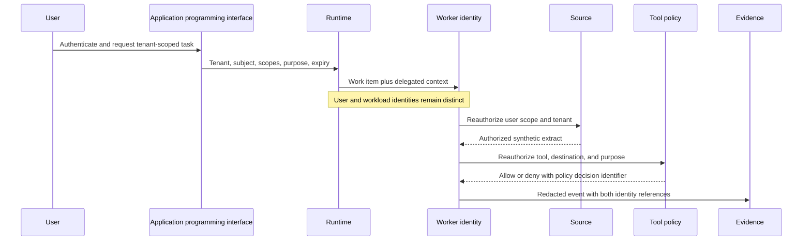
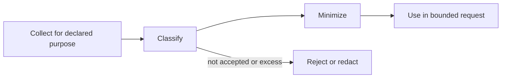
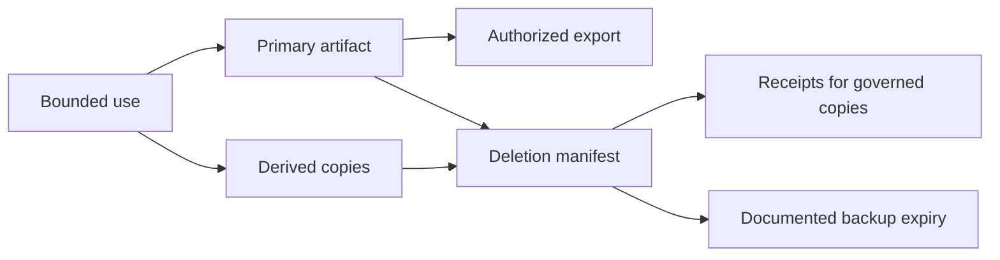
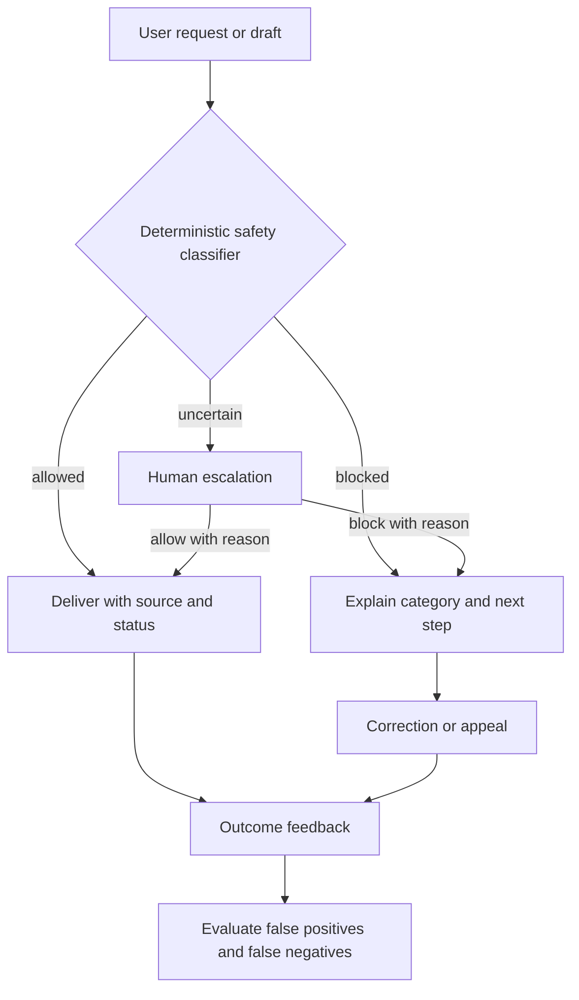

# Chapter 26: Identity, Privacy, and Content Safety

> Status: drafting  
> Owner: Chapter 26 author  
> Last verified: 2026-09-06

## The problem

Two Northstar users ask about a document with the same local identifier, `doc-7`. One belongs
to tenant A and the other to tenant B. A cache keyed only by `doc-7` can return the wrong
tenant's extract. A background worker with broad application access can make the problem worse
if it silently substitutes its own authority for the user's delegated authority.

Correct authentication is only the beginning. Northstar must carry the right principal,
tenant, purpose, scope, and expiry through retrieval, caches, queues, tools, state, evidence,
and administration. It must also minimize data, support retention and deletion, handle harmful
content with measured errors and escalation, and keep approval and recovery usable for people
who navigate by keyboard or assistive technology.

## Learning objectives

By the end of this chapter, you can:

1. Distinguish delegated user identity from workload identity.
2. Reauthorize at each source and destination rather than trusting prompt text or a peer claim.
3. Design tenant-scoped cache, queue, state, tool, and evidence keys.
4. Build a data inventory covering purpose, minimization, retention, export, and deletion.
5. Evaluate content-safety false positives and false negatives separately.
6. Test labels, status announcements, focus order, cancellation, and understandable approval.
7. Record encryption and legal assumptions without treating them as proof of compliance.

## First pass

### Two badges, two jobs

At a secure office, a visitor has a badge showing who they are and which rooms they may enter.
A delivery cart has a separate service badge showing that the cart belongs to the office. The
cart's badge does not let it enter every room on behalf of every visitor. At each door, the
office checks both what the visitor may do and what the cart is built to do.

Northstar similarly carries a **delegated identity**, which says which user it acts for and
within which scope, and a separate **workload identity**, which identifies the application or
worker. Both are necessary. Neither prompt text nor an email-like string is a badge.

### Where the analogy stops

Digital identity expires, crosses queues, and is copied into cache keys and evidence. Data can
also be duplicated into indexes, drafts, evaluations, and backups. Content-safety classifiers
make uncertain decisions, while accessible interaction depends on behavior that a badge cannot
represent. The system needs end-to-end context propagation, reauthorization, lifecycle
controls, measured classifiers, and human review.

## Picture the idea

### Delegated identity through one request



**Takeaway:** every boundary carries both identities, and the source and destination make fresh
authorization decisions for the delegated user.

**Equivalent text description:** the user authenticates at the application programming
interface. The application programming interface admits a task with tenant, subject, scopes,
purpose, and expiry. The runtime sends that context to a worker while retaining the worker's
separate workload identity. The source reauthorizes the delegated user. Tool policy reauthorizes
the operation and destination and returns a policy decision identifier. Evidence stores redacted
references to both identities and that decision, not credentials or unnecessary content.

### Collection and bounded use



**Takeaway:** collect for a declared purpose, classify, and minimize before bounded use; reject
or redact data that is unaccepted or excessive.

**Equivalent text description:** collect only for a declared purpose, classify the data, and
minimize it before bounded use. Excess or unaccepted data is rejected or redacted before model
exposure.

### Derived copies and deletion



**Takeaway:** deletion must find primary and derived copies, while backup removal follows a
documented expiry rather than an unsupported promise of immediate erasure.

**Equivalent text description:** bounded use may create a primary artifact and separately
governed indexes, caches, memory, or evaluation copies. Authorized export has its own check. A
deletion manifest covers primary and derived copies and records receipts. Backup media follows a
documented expiry and exception process.

### Accessible content-safety decisions



**Takeaway:** safety decisions need understandable outcomes, correction and escalation paths,
and equivalent keyboard and nonvisual status behavior.

**Equivalent text description:** a request or draft enters a declared classifier. Allowed work
is delivered with its status. Blocked work receives a category and next step. Uncertain work
goes to an authorized human who can allow or block it with a reason. Affected users can correct
or appeal where policy permits. Outcomes feed separate false-positive and false-negative
measurement. Every branch is keyboard reachable, keeps focus in a logical order, uses labels,
and announces status without relying only on color or sound.

## Vocabulary

| Term | Plain-language meaning |
|---|---|
| Principal | An authenticated person or workload whose identity can be used in a policy decision. |
| Delegated identity | Evidence that a workload acts for a particular user within a limited scope and time. |
| Workload identity | The application's own identity, separate from the user it serves. |
| Authentication | Establishing which principal is making a request. |
| Authorization | Deciding what that principal may do in the current context. |
| Tenant | An organizational security and data boundary served by an application. |
| Tenant isolation | Preventing one tenant's identity, data, policy, keys, state, or evidence from crossing into another tenant. |
| Purpose limitation | Using data only for a declared and reviewed purpose. |
| Data minimization | Collecting, exposing, and retaining only what the purpose needs. |
| Retention | How long a data class remains before deletion or review. |
| Deletion | Removing governed primary and derived copies through a testable process. |
| Encryption | Protecting data cryptographically in transit or storage under declared key assumptions. |
| Content safety | Controls and evaluations for harmful, disallowed, or inappropriate input and output behavior. |
| Accessible interaction | An interaction people can understand and operate through multiple input and output modes. |
| Data subject request | A request concerning a person's data whose applicability and handling require qualified review. |

## How it works

### Carry a principal context, not a user-shaped string

A request context should include:

```text
tenant_id, subject_id, delegated_scopes, workload_id,
authentication_context, purpose, policy_version, issued_at, expiry
```

The application programming interface validates it at admission. Retrieval checks it against
the source. Cache keys include tenant and authorization-relevant versioning. Queue messages
carry a protected reference or a short-lived context, and workers revalidate expiry. Tools check
it at the destination. State, evidence, and administration remain tenant scoped.

Never infer authorization from a model claim, prompt field, display name, email-like string,
document content, or protocol peer assertion alone.

### Build a data inventory before adding storage

| Data | Purpose and class | Model exposure | Retention assumption | Deletion path | Owner |
|---|---|---|---|---|---|
| Request question | Produce one report; internal or confidential | Minimized text | Run policy assumption | Request and checkpoint stores | Product data owner |
| Source extract | Support cited claim; source classification | Bounded authorized span | Active run only by default | Working context, cache, index reference | Source owner |
| Draft report | User review; internal | Yes, bounded | Initial 30-day assumption | Artifact store and derived previews | Artifact owner |
| Optional memory | Evaluated user-approved fact | Only when purpose permits | Explicit expiry | Memory, index, cache, provenance link | Memory owner |
| Evidence | Prove decisions and outcomes; security record | No raw body by default | Initial 90 or 365-day class assumption | Evidence store and backup expiry | Evidence owner |
| Evaluation copy | Separate approved evaluation purpose | Synthetic or minimized | Dataset version policy | Corpus, derived features, backup expiry | Evaluation owner |

These durations are architecture assumptions, not legal conclusions. Qualified privacy, legal,
records, security, accessibility, and domain reviewers must determine applicable obligations,
exceptions, notices, rights, and transfer conditions before deployment.

### Encryption supports, but does not replace, boundaries

Record assumptions for transport encryption, storage encryption, key ownership, rotation,
tenant context, backup encryption, and administrative access. Encryption cannot fix an
authorized process reading the wrong tenant, an over-broad key holder, unnecessary collection,
or a log that should never have stored the value.

### Content safety needs declared behavior

Define categories, expected action, uncertainty range, escalation role, correction path, and
error cost before selecting a classifier. Use representative, synthetic cases. Report:

- false positives, where allowed content is blocked;
- false negatives, where disallowed content is allowed;
- uncertain and escalated rates;
- outcome differences across relevant languages, modalities, and accessibility paths;
- task completion after block, correction, or appeal.

A classifier is a fallible signal. Consequential or uncertain decisions need policy and human
handling appropriate to the deployment context.

### Accessibility is a safety control

For task entry, progress, approval, cancellation, errors, and report delivery, check keyboard
operation, logical focus order, programmatic labels, status announcements, text alternatives,
error recovery, zoom and reflow, and understandable consequence descriptions. An approval that
cannot be perceived or operated is not meaningful oversight.

## Engineering deep dive

### Partition every derived key

At minimum, a cache key needs tenant, source, version, and policy-relevant context. Whether it
also includes subject or permission-set identity depends on the source model. A shared cache is
acceptable only when its key, encryption context, invalidation, telemetry, and negative tests
prove equivalent isolation. Start with simpler tenant-local state when uncertain.

### Deletion is a distributed workflow

Create a deletion manifest listing request state, artifacts, indexes, caches, memory,
evaluation copies, evidence exceptions, and backup expiry. Each store returns a receipt or a
documented exception. A retry remains idempotent. Holds and legally required records are
qualified-review decisions, not hidden code defaults.

### Export and redaction are authorized operations

Export must reauthenticate, reauthorize the subject and tenant, select an approved scope,
redact unrelated people or secrets, and emit evidence. Evidence itself should use allowlisted
attributes and synthetic markers in tests. Hashing an identifier may still leave linkable data,
so minimization and access control remain necessary. Private chain-of-thought is never an
evidence, export, logging, or evaluation requirement.

## Build it in Python

This Python 3.11 pipeline uses two fake tenants, synthetic documents, a short-lived delegated
context, a fake workload identity, deletion receipts, redacted evidence, and a deterministic
classifier. Encryption is represented only as metadata because implementing cryptography is not
the lesson.

```python
from dataclasses import dataclass


@dataclass(frozen=True)
class PrincipalContext:
    tenant: str
    subject: str
    scopes: frozenset[str]
    workload: str
    purpose: str
    expires_at: int


DOCUMENTS = {
    ("tenant-a", "doc-7"): "A-SYNTHETIC-REPORT",
    ("tenant-b", "doc-7"): "B-SYNTHETIC-REPORT",
}
cache: dict[tuple[str, str, str], str] = {}
derived: dict[tuple[str, str], str] = {}


def fetch(context: PrincipalContext, document_id: str, *, now: int) -> str:
    if context.expires_at <= now:
        raise PermissionError("identity_expired")
    if "documents.read" not in context.scopes:
        raise PermissionError("scope_denied")
    key = (context.tenant, context.subject, document_id)
    if key not in cache:
        cache[key] = DOCUMENTS[(context.tenant, document_id)]
    return cache[key]


def export(context: PrincipalContext, document_id: str, *, now: int) -> str:
    if "documents.export" not in context.scopes:
        raise PermissionError("export_denied")
    return fetch(context, document_id, now=now)


def classify(text: str) -> str:
    if "SYNTHETIC-DISALLOWED" in text:
        return "blocked"
    if "SYNTHETIC-UNCERTAIN" in text:
        return "escalate"
    return "allowed"


def delete_tenant_document(tenant: str, document_id: str) -> tuple[str, ...]:
    receipts: list[str] = []
    for key in list(cache):
        if key[0] == tenant and key[2] == document_id:
            del cache[key]
            receipts.append("cache_deleted")
    if (tenant, document_id) in derived:
        del derived[(tenant, document_id)]
        receipts.append("derived_deleted")
    receipts.append("backup_expiry_scheduled")
    return tuple(receipts)


context_a = PrincipalContext(
    "tenant-a", "user-a", frozenset({"documents.read"}),
    "northstar-worker", "research-report", 20,
)
context_b = PrincipalContext(
    "tenant-b", "user-b", frozenset({"documents.read"}),
    "northstar-worker", "research-report", 20,
)
assert fetch(context_a, "doc-7", now=10) == "A-SYNTHETIC-REPORT"
assert fetch(context_b, "doc-7", now=10) == "B-SYNTHETIC-REPORT"
assert len(cache) == 2

expired = PrincipalContext(**{**context_a.__dict__, "expires_at": 10})
try:
    fetch(expired, "doc-7", now=10)
    raise AssertionError("expired identity was accepted")
except PermissionError as error:
    assert str(error) == "identity_expired"

try:
    export(context_a, "doc-7", now=10)
    raise AssertionError("unauthorized export was accepted")
except PermissionError as error:
    assert str(error) == "export_denied"

assert classify("ordinary synthetic text") == "allowed"
assert classify("SYNTHETIC-DISALLOWED fixture") == "blocked"
assert classify("SYNTHETIC-UNCERTAIN fixture") == "escalate"

derived[("tenant-a", "doc-7")] = "A-SYNTHETIC-SUMMARY"
receipts = delete_tenant_document("tenant-a", "doc-7")
assert set(receipts) == {"cache_deleted", "derived_deleted", "backup_expiry_scheduled"}
assert all(key[0] != "tenant-a" for key in cache)
assert ("tenant-a", "doc-7") not in derived

evidence = {
    "tenant": "tenant-a",
    "subject": "user-[REDACTED]",
    "decision": "export_denied",
    "encryption_at_rest_assumption": "provider-managed-key-review-required",
}
assert "A-SYNTHETIC-REPORT" not in repr(evidence)

interface = {
    "task_label": "Research question",
    "status_text": "Export denied. Review permissions or cancel.",
    "cancel_label": "Cancel research task",
    "approval_summary": "Publish one synthetic report to tenant-a/reviewed",
}
assert all(value.strip() for value in interface.values())
print("PASS: tenant isolation, expiry, export, deletion, safety, redaction, and labels verified")
```

Expected output:

```text
PASS: tenant isolation, expiry, export, deletion, safety, redaction, and labels verified
```

## Microsoft implementation

For a Microsoft-oriented identity adapter, the current Azure Identity client library for
Python can obtain credentials through supported credential mechanisms, including managed
identity in appropriate hosted environments (SRC-044). Keep credential acquisition behind the
workload adapter. The `PrincipalContext` still carries the separately authenticated delegated
user and is reauthorized by each source and destination. A workload credential must never be
treated as proof of user authorization.

Credential behavior, supported environments, defaults, and application programming interfaces
are volatile. Reverify
SRC-044 before release, configure an explicit production credential path, and test expiry,
audience, scope, tenant mismatch, and denial. This chapter's approved sources do not support a
Microsoft-specific content-safety product claim, so the classifier interface remains
vendor-neutral.

## How leading teams approach it

Current Azure Identity documentation defines supported Python credential integration and is a
product implementation source, not an authorization design (SRC-044). Published cloud security
guidance reinforces explicit identity, data-protection, network, and monitoring boundaries
(SRC-053). Purple Llama provides current public safety tools, evaluations, and model-card
practices that can inform a measured classifier track without proving suitability (SRC-037).
WCAG 2.2 supplies testable accessibility criteria for web interactions (SRC-066).

The GDPR text is a primary legal source for data-protection principles, rights, security, and
transfers (SRC-063). Applicability, roles, lawful basis, rights handling, retention, transfer,
and required records are deployment-specific legal questions. Record them for qualified review;
do not turn this chapter into a compliance finding.

## Failure lab

Reproduce two failures with synthetic data:

1. Replace the cache key with `document_id` only. Fetch tenant A, then tenant B. The second
   request can receive tenant A's marker.
2. Replace `context.tenant` inside `fetch` with a fixed workload tenant. The worker has silently
   substituted its own authority.

Restore the tenant, subject, and document key plus source reauthorization. The correction
passes when there are zero unauthorized fixture disclosures, both tenant markers remain
separate, expired identity and unauthorized export are denied, evidence contains no document
body, and deletion receipts cover primary derived state plus scheduled backup expiry.

## Security and safety testing

Add these cases to the Module 6 suite:

| Case | Expected result and evidence |
|---|---|
| Cross-tenant cache hit | Correct tenant marker only; tenant-scoped cache key |
| Expired delegated identity | `identity_expired`; no workload substitution |
| Excess scope or unauthorized export | Denied before data leaves the boundary |
| Source permission changed after queueing | Fresh source reauthorization denies stale work |
| Deletion request | Receipts for each primary and derived store; backup expiry recorded |
| Evidence redaction | Synthetic document and identity markers absent |
| Harmful fixture | Declared block result and category |
| Uncertain fixture | Human escalation, not silent allow or deny |
| Classifier confusion set | False positives and false negatives reported separately |
| Accessible operation | Labels and status text present; manual keyboard and nonvisual checklist completed |

Use only fake tenants, synthetic identities, and synthetic documents. Automated semantic checks
cannot prove accessibility. Pair them with manual keyboard operation, focus-order inspection,
screen-reader-oriented status checks, error recovery, and approval comprehension.

## Evaluation

| Area | Measure and gate |
|---|---|
| Tenant isolation | Zero unauthorized synthetic disclosures across cache, queue, source, tool, state, and evidence tests. |
| Identity | 100% tenant-key propagation and fresh authorization at source and destination. |
| Expiry and scope | All expired and excess-scope fixtures denied before access. |
| Minimization | Only declared fields and bounded extracts reach model and evidence interfaces. |
| Deletion | Every governed primary and derived copy has a receipt or qualified exception; backup expiry is tracked. |
| Content safety | False-positive, false-negative, uncertain, escalation, correction, and appeal outcomes reported separately. |
| Accessibility | Keyboard task completion, logical focus, labels, status announcements, error recovery, and approval comprehension pass review. |
| Utility | Authorized users still retrieve and use their own synthetic documents. |
| Efficiency | Record authorization and classifier latency, storage copies, and review workload. |

Encryption assumptions are reviewed as architecture evidence, not scored as a substitute for
authorization or minimization. Legal compliance is not an evaluation metric in this lab.

## Production checklist

- [ ] Delegated user and workload identities remain separate through every boundary.
- [ ] Tenant, subject, scope, purpose, policy version, and expiry propagate and are revalidated.
- [ ] Cache, queue, store, index, memory, evaluation, telemetry, and admin paths pass isolation tests.
- [ ] Data inventory names purpose, class, access, model exposure, retention assumption, deletion, and owner.
- [ ] Encryption and key assumptions are documented and reviewed without replacing least authority.
- [ ] Export, deletion, correction, redaction, and evidence access are authenticated and tested.
- [ ] Content-safety categories, uncertainty, escalation, and both error rates have release gates.
- [ ] Task entry, progress, approval, cancellation, errors, and delivery pass accessibility review.
- [ ] Unresolved jurisdiction, privacy, records, transfer, sector, and accessibility duties have qualified-review owners.
- [ ] Rollback and incident paths can contain unauthorized disclosure or classifier regression.

### Production implications

Centralize context construction but decentralize authorization to each authoritative source and
destination. Rotate and expire workload credentials independently from user sessions. Avoid
global caches and memory. Treat policy, identity library, classifier, model, index, and UI
changes as security-relevant releases. Monitor isolation denials, missing context, deletion age,
classifier errors, appeal outcomes, inaccessible states, and review workload using minimized
telemetry. Regional expansion or new data classes require renewed qualified review.

## Review questions

1. Why can a valid workload identity not replace delegated user authorization?
2. Which fields belong in a tenant-safe cache key?
3. Why is backup expiry different from immediate deletion?
4. What privacy problem remains after storage encryption?
5. Why must classifier false positives and false negatives be separate?
6. How can inaccessible approval weaken safety and oversight?

## Try it safely

Use two colors of paper for tenant A and tenant B. Give each user badge one read permission and
give a differently shaped card to the service. Pass a request through cards labeled application
programming interface, queue, cache, source, tool, and evidence. At each card, verify both tenant
color and user scope. Remove the user's read permission halfway through; the source card must
deny the request even though the service card remains valid.

## Common misunderstanding

> **Misconception:** Once the application authenticates, its worker may use application access
> for any user's task.

Authentication identifies the worker but does not grant every user's authority. The worker
must carry and revalidate delegated context. Broad application authority can turn the worker
into a confused deputy and bypass tenant or source permissions.

## Design exercise

Choose a cache design for a permission-aware source:

1. no shared content cache;
2. tenant-local cache with subject and source-version keys;
3. shared encrypted cache with policy-version partitioning and per-read reauthorization.

Compare latency, cost, invalidation, permission changes, key ownership, deletion, operator
access, and test burden. Select the simplest design that meets measured performance while
passing isolation and lifecycle gates.

## Hands-on lab

Run the embedded Python with Python 3.11 in a temporary directory. Convert assertions into
`unittest` tests and add permission revocation after queueing, excess scope, authorized export,
redaction markers, repeated deletion, and classifier confusion cases. Add an HTML-free semantic
fixture for labels and status text, then perform the manual keyboard and screen-reader-oriented
checklist described above. Delete all temporary data after the run.

Deliver the principal trace, data inventory, isolation and lifecycle tests, content-safety
matrix, accessibility review record, and unresolved qualified-review register.

## Recap and next step

- User delegation and workload identity answer different authorization questions.
- Tenant and principal context must survive and be checked at every boundary.
- Minimize before model input, logs, memory, evaluation copies, and approvals.
- Deletion covers primary and derived copies while documenting backup expiry and exceptions.
- Content safety and accessibility require measurable behavior, escalation, and correction.
- Legal and regulatory conclusions belong to qualified review, not code assumptions.

Chapter 27 turns these artifacts into named accountability, meaningful oversight, incident and
stop authority, vendor and change review, evidence freshness, and release decisions.

## Sources

- SRC-037, Purple Llama safety tools, evaluations, and model-card practices. Volatile; reverify before release.
- SRC-044, Azure Identity client library for Python. Volatile; reverify supported behavior before release.
- SRC-053, current cloud security guidance for identity, data protection, network, and monitoring. Volatile; reverify before release.
- SRC-063, official GDPR text concerning data-protection principles, rights, security, and transfers. Evolving interpretation; applicability requires qualified legal review.
- SRC-066, WCAG 2.2 testable web accessibility criteria. Durable versioned publication.

These sources inform engineering and qualified-review questions. They do not establish legal
applicability, compliance, conformity, accessibility, privacy, or safety for Northstar.