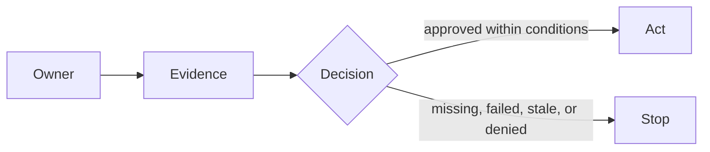
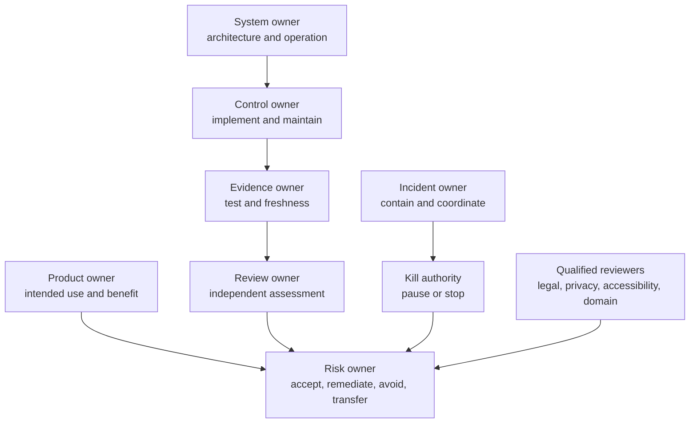
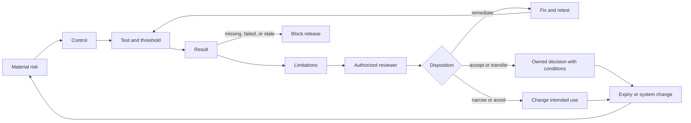
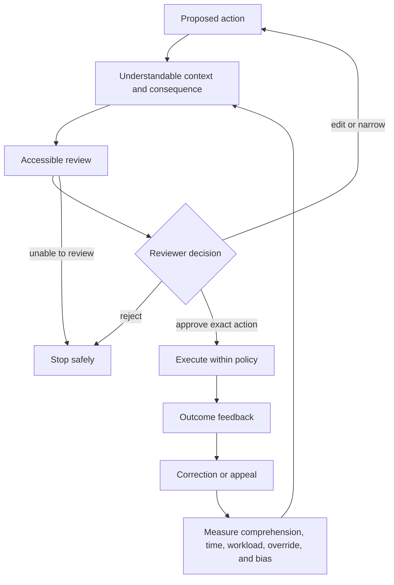

# Chapter 27: Responsible AI and Governance

> Status: drafting  
> Owner: Chapter 27 author  
> Last verified: 2026-09-06

## The problem

A Northstar release candidate arrives with two warnings: a report-quality regression and an
unresolved indirect-injection finding. Its governance document says, "Compliant. Human
reviewed." It does not say who reviewed what, which evidence was current, who can block the
release, how a user can reject an action, or who may stop and restart the service.

Broad principles do not make an operating decision. Governance must connect intended use and
foreseeable misuse to named owners, controls, tests, limitations, review dates, incidents,
change gates, and stop authority. Legal, regulatory, privacy, records, accessibility, and sector
conclusions remain questions for qualified reviewers with the relevant authority.

## Learning objectives

By the end of this chapter, you can:

1. Build an intended-use inventory and identify excluded decisions and foreseeable misuse.
2. Distinguish risk, control, evidence, incident, review, and kill-authority owners.
3. Link each material risk to current evidence, limitations, and a disposition.
4. Measure whether human oversight is understandable, accessible, independent, and effective.
5. Define incident, stop, restart, vendor-review, change-control, and retirement paths.
6. Validate a governance record offline without scoring legal compliance.

## First pass

### A school trip permission board

Before a school trip, one board shows the destination, travelers, weather risks, bus check,
permission slips, responsible adults, emergency contacts, and who may cancel the trip. A note
that merely says "safe" is not enough. A failed bus check cannot be erased by a signed lunch
form, and a person without cancellation authority cannot make the final call.

Northstar needs a similarly connected record. Each material risk has an owner, a control, a
test result, known limits, a review date, and a decision. A named person can pause the system,
and restart requires stated evidence.

### Where the analogy stops

AI system behavior can change through models, prompts, indexes, policies, libraries, vendors,
and data. Affected people may not be in the release meeting. Oversight can fail through
inaccessible interfaces, high workload, or automation bias. Incident disclosure and legal
obligations vary by deployment context. Governance therefore operates continuously and needs
qualified review, measurable evidence, change control, appeal, and retirement criteria.

## Picture the idea

### Beginner view: accountable action



**Takeaway:** a named owner uses current evidence to decide whether the system may act or must
stop.

**Equivalent text description:** a named owner reviews current evidence and records a decision.
Approval within stated conditions permits action. Missing, failed, stale, or denied evidence
leads to a stop.

### Engineering deep dive: accountability roles



**Takeaway:** consultation can inform a decision, but accountability requires a named role with
clear authority to decide and act.

**Equivalent text description:** the product owner defines intended use, while the system owner
operates the architecture. A control owner maintains each control, an evidence owner produces
current results, and a review owner assesses them. The risk owner decides the disposition. The
incident owner coordinates containment, and the kill authority can pause or stop the system.
Qualified reviewers advise and decide within their legal, privacy, accessibility, or domain
mandates. Committee membership alone does not supply decision rights.

### Engineering deep dive: evidence and decision loop



**Takeaway:** missing, failed, or stale evidence blocks acceptance until an authorized owner
records a supported disposition.

**Equivalent text description:** a material risk maps to a control, test, and threshold. The
result includes limitations. An authorized reviewer assesses it, and the risk owner remediates,
narrows or avoids the use, accepts with conditions, or transfers part of the risk where valid.
Missing, failed, or stale evidence blocks release. Decisions expire and are reassessed when the
system or context changes.

### Engineering deep dive: meaningful oversight loop



**Takeaway:** a human in the loop matters only when that person can understand, access, change,
reject, stop, and learn from the outcome.

**Equivalent text description:** an action proposal presents understandable context and
consequences through an accessible review path. The reviewer can edit, narrow, reject, or
approve the exact action. Rejection or inability to review stops safely. Execution returns an
outcome with correction or appeal. The team measures comprehension, time available, workload,
rejection and override behavior, accessibility, and automation-bias indicators, then improves
the review context.

## Vocabulary

| Term | Plain-language meaning |
|---|---|
| Intended use | The declared users, purpose, data, decisions, and deployment context the system is designed to support. |
| Foreseeable misuse | A plausible use outside the intended path that the design should consider. |
| Risk owner | The person with authority to decide how a risk is treated. |
| Control owner | The person responsible for implementing and maintaining a control. |
| Evidence owner | The person responsible for producing and refreshing decision evidence. |
| Risk acceptance | An authorized, time-bounded decision to operate with stated residual risk and conditions. |
| Meaningful oversight | A person's practical ability to understand, question, change, reject, stop, and recover from an action. |
| Incident | An event that may harm confidentiality, integrity, availability, safety, rights, or intended operation. |
| Red team | An authorized group that safely challenges a system to find weaknesses. |
| Vendor review | Assessment of a supplier's capabilities, limits, changes, data handling, dependencies, and exit path. |
| Change control | Evidence-based authorization, rollout, rollback, and recording of system changes. |
| Kill authority | A named role with the ability and procedure to pause or stop the system. |
| Retirement | Planned removal of a system, model, tool, dataset, or capability and its governed data. |
| Qualified legal review | Context-specific review by authorized people with relevant legal expertise; this chapter does not provide it. |

## How it works

### Start with intended use and exclusions

Northstar's initial inventory should name:

- authorized knowledge workers and people affected by reports;
- advisory research reports as the benefit and output;
- approved enterprise and public sources;
- models, retrieval, tools, memory, evaluators, and vendors;
- one organization, one tenant, and one primary region as the initial context;
- excluded employment, credit, healthcare, legal, safety-critical, and other high-impact
  decisions;
- excluded arbitrary browsing, code execution, purchasing, messaging, and external publication
  by default;
- foreseeable injection, permission bypass, data leakage, automation bias, overreliance,
  inaccessible approval, and out-of-context reuse.

Changing any of these facts triggers reassessment. A benefit statement does not cancel harm.

### Build a governance record that can drive a release

For each material risk, record:

```text
risk_id, intended_use, affected_parties, classification_assumption,
risk_owner, control_owner, evidence_owner, control_id, test_id,
threshold, result, limitation, evidence_link, evidence_date,
review_date, reviewer, disposition, conditions, incident_route,
kill_path, accessibility_status, qualified_review_flags
```

The record also links the Chapter 24 threat model, Chapter 25 capability matrix, Chapter 26
identity and data lifecycle evidence, Module 5 evaluation gate, red-team findings, vendor
review, rollout, rollback, and retirement criteria.

### Assign decision rights, not decorative names

| Role | Decision right |
|---|---|
| Product owner | Defines and narrows intended use; does not waive security evidence. |
| Risk owner | Accepts, remediates, avoids, or transfers residual risk within delegated authority. |
| Control owner | Implements and maintains a named control. |
| Evidence owner | Runs tests, protects records, and refreshes stale evidence. |
| Independent reviewer | Challenges evidence and records limitations or dissent. |
| Incident owner | Declares and coordinates containment and recovery. |
| Kill authority | Pauses or stops operation without waiting for normal release flow. |
| Restart authority | Restarts only after stated containment, test, review, and monitoring criteria pass. |
| Qualified reviewer | Determines issues within legal, privacy, accessibility, records, or domain authority. |

One person may hold several roles in a small team, but conflicts and required independence must
be explicit.

### Make oversight measurable

For each consequential review, measure whether the reviewer received the exact action,
destination, data class, source and citation summary, warnings, reversibility, expiry, and
alternatives. Then measure comprehension, time to decide, accessible task completion, edit and
rejection ability, escalation, workload, override and rejection rates, repeated approvals, and
recovery. High approval rates are not automatically success; they can indicate easy work or
rubber-stamping.

### Prepare incident and stop paths

An incident runbook covers intake, classification, immediate containment, kill decision,
evidence preservation, internal escalation, correction, affected-party communication inputs,
learning, and restart. Specific notification duties and timelines require qualified legal and
policy review. The technical record should flag that review, not invent an answer.

### Review vendors and changes

Record vendor purpose, data handling, identity path, limitations, model or policy changes,
availability, dependency chain, test evidence, notification mechanisms, portability, and exit
plan. An attestation is evidence to assess, not transferred accountability.

Every model, prompt, policy, tool, index, dependency, UI, and vendor change carries a version,
evaluation and security regression results, approval, staged rollout, rollback, and retirement
criteria. Unresolved red-team findings remain visible until an authorized disposition.

## Engineering deep dive

### Evidence quality beats document volume

Good evidence is relevant to the actual version and context, reproducible where practical,
protected from tampering, minimized, access-controlled, dated, and linked to a threshold and
owner. A screenshot of a green dashboard without test identity, data version, or limitations is
weak evidence. Evidence expires when its review date passes or when a relevant component or
deployment assumption changes.

### Keep legal claims qualified

Laws, standards, and principles provide review inputs, vocabulary, and management questions.
They do not by themselves determine Northstar's role, legal basis, risk category, obligations,
conformity, certification, or compliance. Record an issue, relevant deployment facts, source,
qualified owner, due date, and decision status. Do not encode an unresolved interpretation as a
silent product requirement.

### Retirement is a controlled change

Retirement revokes capabilities and credentials, stops new work, resolves or cancels active
runs, exports authorized artifacts, applies retention and deletion policy, preserves required
evidence, notifies owners, removes routes and dependencies, and verifies that the old component
cannot be called. A model or tool can be retired independently from the entire application.

## Build it in Python

This Python 3.11 validator checks a fictional governance record. It does not decide whether a
system is legally compliant or ethically acceptable. It rejects vague assertions and missing,
failed, or stale evidence.

```python
from dataclasses import dataclass
from datetime import date


@dataclass(frozen=True)
class GovernanceRecord:
    risk_id: str
    risk_owner: str
    control_owner: str
    evidence_link: str
    evidence_date: date
    review_date: date
    test_result: str
    disposition: str
    kill_path: str
    accessibility_status: str
    qualified_review_flags: tuple[str, ...]
    summary: str


VAGUE_ASSERTIONS = {"compliant", "human reviewed", "safe", "approved"}


def validate(record: GovernanceRecord, *, today: date) -> tuple[str, ...]:
    errors: list[str] = []
    required = {
        "risk_owner": record.risk_owner,
        "control_owner": record.control_owner,
        "evidence_link": record.evidence_link,
        "disposition": record.disposition,
        "kill_path": record.kill_path,
        "accessibility_status": record.accessibility_status,
    }
    errors.extend(f"missing:{name}" for name, value in required.items() if not value.strip())
    if record.summary.strip().lower() in VAGUE_ASSERTIONS:
        errors.append("vague_assertion")
    if record.test_result != "pass":
        errors.append("failed_or_missing_test")
    if record.evidence_date > today:
        errors.append("invalid_evidence_date")
    if record.review_date < today:
        errors.append("stale_review")
    if not record.qualified_review_flags:
        errors.append("qualified_review_not_recorded")
    return tuple(errors)


today = date(2026, 9, 6)
valid = GovernanceRecord(
    risk_id="R-24-01",
    risk_owner="research-product-risk-owner",
    control_owner="tool-policy-owner",
    evidence_link="evidence://security-suite/run-2701",
    evidence_date=today,
    review_date=date(2026, 10, 6),
    test_result="pass",
    disposition="remediate encoded-injection gap before release",
    kill_path="on-call incident lead pauses publication capability",
    accessibility_status="keyboard and status-announcement checks passed",
    qualified_review_flags=("privacy applicability pending",),
    summary="Release blocked until named remediation evidence is attached",
)
assert validate(valid, today=today) == ()

paper_governance = GovernanceRecord(
    risk_id="R-24-01",
    risk_owner="",
    control_owner="",
    evidence_link="",
    evidence_date=today,
    review_date=date(2026, 9, 5),
    test_result="unknown",
    disposition="",
    kill_path="",
    accessibility_status="",
    qualified_review_flags=(),
    summary="Human reviewed",
)
errors = validate(paper_governance, today=today)
assert "vague_assertion" in errors
assert "failed_or_missing_test" in errors
assert "stale_review" in errors
assert "qualified_review_not_recorded" in errors
assert any(error.startswith("missing:") for error in errors)
print("PASS: complete record accepted; paper governance rejected")
```

Expected output:

```text
PASS: complete record accepted; paper governance rejected
```

## Microsoft implementation

This chapter's approved evidence set contains no Microsoft product source, so it makes no
Microsoft-specific governance service claim. Keep the governance schema, evidence links,
decision rights, incident and kill paths, accessibility status, and qualified-review flags
portable. A later Microsoft implementation must map products to these accepted requirements
using current approved evidence. Product adoption, certification, or a vendor framework does
not establish Northstar's compliance or transfer accountability.

## How leading teams approach it

NIST AI RMF connects governance, context mapping, measurement, and risk management, supporting
an evidence-to-decision operating loop (SRC-057). ISO/IEC 42001 describes an AI management
system and provides management-system questions, but this chapter does not claim conformity or
certification (SRC-064). OECD AI Principles provide evolving international principles that can
inform accountable and human-centered review questions (SRC-068).

Constitutional AI is published research on training with principles and model feedback; it can
inform discussion of model behavior but does not replace system governance or human
accountability (SRC-015). The official EU AI Act text supplies roles, categories, and
obligations for qualified applicability analysis (SRC-062). Regulatory interpretation and
deployment-specific duties require current primary-source verification and qualified legal
review.

## Failure lab

Seed a fictional release packet with:

- broad principles but no intended-use exclusions;
- no risk, control, or evidence owner;
- a failed injection result and stale quality evidence;
- an inaccessible approval path;
- unmeasured reviewer workload;
- an unresolved red-team finding;
- no kill or restart authority;
- the sentence "Compliant. Human reviewed."

Run the validator and a tabletop review. The release must be blocked. Correct the packet by
naming decision rights, linking fresh test results and limitations, recording accessibility and
oversight measures, assigning the red-team finding, defining stop and restart criteria, and
flagging legal questions for qualified review. Do not "fix" the failure by changing the summary
to another unsupported conclusion.

## Security and safety testing

Add governance cases to the cumulative security suite:

| Case | Expected result |
|---|---|
| Material risk has no owner | Release blocked |
| Evidence missing, failed, stale, or for another version | Acceptance blocked |
| Red-team finding unresolved | Block, narrow, remediate, or record authorized residual-risk disposition |
| Approval path inaccessible | Consequential action unavailable |
| Reviewer cannot reject or edit | Oversight test fails |
| Reviewer workload exceeds declared bound | Escalate staffing or narrow automation |
| Incident drill has no kill authority | Drill and release gate fail |
| Restart lacks containment and regression evidence | Service remains stopped |
| Vendor changes model or data handling | Reassessment and regression required |
| Record says only `compliant` or `human reviewed` | Validator rejects vague assertion |

These are tabletop and offline record tests with fictional roles and synthetic evidence. Do
not perform unauthorized red-team activity or test a live provider. Preserve dissent and
limitations without including secrets, personal data, source bodies, or private reasoning.

## Evaluation

| Area | Measure and gate |
|---|---|
| Completeness | Every material risk has required owners, controls, evidence, limitations, review date, disposition, and stop path. |
| Traceability | Evidence resolves to the tested system, policy, model, data, and test version. |
| Freshness | Missing or expired evidence blocks acceptance. |
| Decision rights | Owners can demonstrate accept, remediate, block, stop, and restart authority. |
| Oversight | Measure comprehension, accessible completion, edit and rejection ability, time, workload, escalation, and override patterns. |
| Incident readiness | Tabletop containment and kill decision meet the declared time target; restart criteria are met before recovery. |
| Change safety | Evaluation and security regression gates block seeded failures and support rollback. |
| Vendor review | Limitations, changes, data handling, dependencies, and exit path are current. |
| Qualified review | Applicability questions have an authorized owner and status; legal compliance is not scored by this lab. |

Do not optimize for document count. Track whether evidence changed a decision and whether
controls work in drills and tests.

## Production checklist

- [ ] Intended use, affected people, excluded decisions, data, tools, vendors, context, benefits, harms, and misuse are current.
- [ ] Risk, control, evidence, incident, accessibility, privacy, security, product, kill, and restart roles have decision rights.
- [ ] Every material risk links to a threshold, result, limitation, owner, review date, and disposition.
- [ ] Oversight measures comprehension, accessibility, edit and rejection ability, workload, escalation, recovery, and automation bias.
- [ ] Incident intake, containment, evidence preservation, escalation, correction, communication inputs, learning, and restart are rehearsed.
- [ ] Vendor review covers changes, data handling, dependencies, limitations, evidence, portability, and exit.
- [ ] Model, prompt, tool, policy, index, dependency, UI, and vendor changes pass evaluation and security gates.
- [ ] Red-team findings remain tracked until an authorized disposition.
- [ ] Qualified-review flags cover legal applicability, privacy, records, transfers, accessibility duties, sector rules, notices, and disclosure.
- [ ] Retirement revokes authority, resolves active work, handles data, preserves required evidence, and verifies removal.

### Production implications

Store governance records as versioned, access-controlled operating data rather than a static
publication. Automate evidence freshness and release blocking, but keep risk decisions with
authorized people. Separate evidence production from independent review where consequence
requires it. Monitor oversight workload, rejection and override patterns, incident drill time,
stale records, unresolved findings, vendor changes, and kill-path health. Test pause and restart
without relying on one unavailable person. Reassess after incidents and material context changes.

## Review questions

1. What is the difference between a risk owner and a control owner?
2. Why can stale passing evidence block a release?
3. Which observations indicate rubber-stamping or automation bias?
4. Who may stop Northstar, and what evidence permits restart?
5. Why does a vendor attestation not transfer accountability?
6. How should an unresolved legal question appear in the governance record?

## Try it safely

Run a tabletop with fictional roles: product owner, risk owner, evidence owner, accessibility
reviewer, incident lead, and kill authority. Present a quality regression and Chapter 24
injection finding before a pretend release. The group must block, narrow, remediate, or accept
residual risk within stated authority; identify who may stop and restart; record dissent; and
name the next evidence required. No live system or real personal data is involved.

## Common misunderstanding

> **Misconception:** Governance is a final compliance document owned by someone else.

Governance is the recurring work of assigning decisions, measuring controls, preserving
evidence, handling incidents, reviewing changes, enabling oversight, and stopping or retiring
the system. A document can carry that work, but a label without operating evidence and decision
rights does not perform it.

## Design exercise

An indirect-injection regression fails one release test, while ordinary report quality improves.
Compare four options: block, remediate, narrow the feature by disabling publication, or accept
residual risk. For each option, state the authorized owner, evidence, user effect, rollback,
incident path, expiration, and qualified-review flags. A quality gain cannot trade away a
security invariant.

## Hands-on lab

Run the embedded validator with Python 3.11. Convert assertions into `unittest` cases for
missing owner, stale evidence, failed test, vague assertion, missing accessibility status,
missing kill path, and absent qualified-review flags. Extend the fictional record with a
red-team register and vendor review, then conduct the tabletop release and incident drill.

Deliver the governance record, meaningful-oversight plan, incident and kill runbook, restart
criteria, red-team register, vendor review, qualified-review register, and a cumulative Module 6
evidence index mapping controls to threats, tests, results, owners, dates, and limitations.

## Recap and next step

- Governance connects intended use and material risk to named decisions and current evidence.
- Meaningful oversight requires accessible understanding, edit, rejection, stop, and recovery.
- Incidents need prepared containment, kill, evidence, communication-input, and restart paths.
- Vendor and system changes reopen evaluation and security questions.
- Laws, standards, and principles inform qualified review but do not prove compliance.

Module 7 receives the accepted threat boundaries, capabilities, identity and lifecycle
requirements, evidence schemas, owners, incident routing, oversight measures, kill authority,
and unresolved review conditions. Production architecture may distribute these responsibilities,
but it may not weaken them.

## Sources

- SRC-015, Constitutional AI research on principles and model feedback. Durable research source.
- SRC-057, NIST AI RMF 1.0 Govern, Map, Measure, and Manage functions. Durable versioned publication.
- SRC-062, official EU AI Act text for roles, categories, and obligations. Volatile in applicability and interpretation; requires qualified legal review.
- SRC-064, ISO/IEC 42001:2023 AI management-system requirements. Evolving implementation context; no conformity claim is made.
- SRC-068, OECD AI Principles. Evolving; reverify before release.

These sources guide governance questions and evidence design. They do not establish legal
applicability, certification, conformity, compliance, or the adequacy of Northstar's controls.