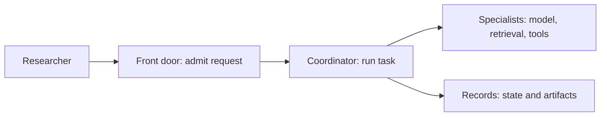
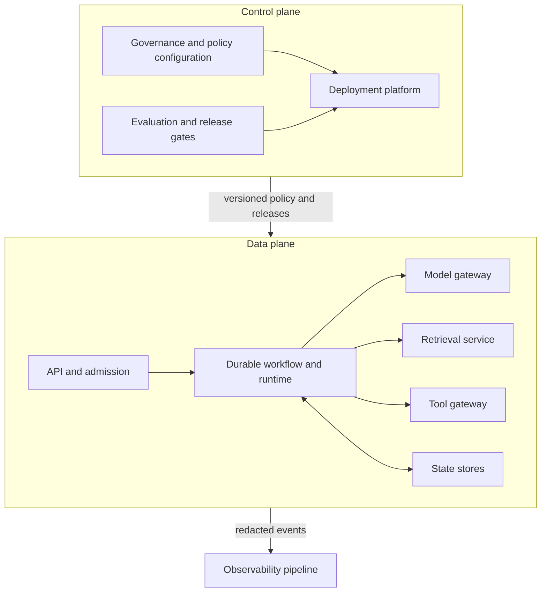
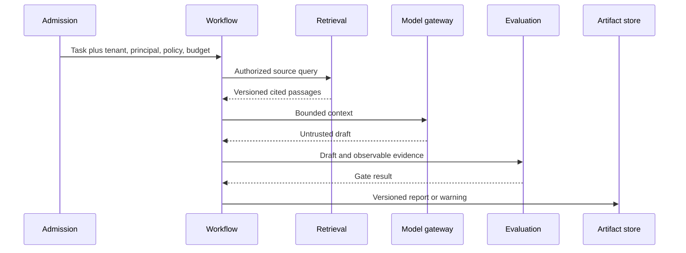

# Chapter 28: Reference Architecture

> Status: drafting  
> Owner: Module 07 author  
> Last verified: 2026-09-06

## The problem

Northstar has a tested runtime, retrieval, tools, policy, and durable workflow. A production
system still fails if two parts both assume the other owns authorization, or if no part owns
retention. A product diagram cannot answer who is responsible when a report crosses a trust
boundary.

## Learning objectives

By the end of this chapter, the reader can:

- separate Northstar's data plane from its control plane;
- assign every production responsibility to exactly one boundary;
- compare consolidated and separated deployments; and
- validate ownership, context propagation, trust, and replacement contracts offline.

## First pass

Think of a well-run library. A front desk accepts requests, librarians coordinate research,
specialists find material, archives keep records, and managers set rules. Each station has a
clear job. The analogy stops here: software needs typed interfaces, machine identities,
tenant context, failure isolation, and measurable replacement rules. A friendly label on a
box enforces none of those things.

## Picture the idea



**Takeaway:** begin with one request path and one plain responsibility per boundary.

**Equivalent text description:** (1) a researcher submits a request; (2) admission checks it;
(3) the runtime coordinates work; (4) specialist gateways provide bounded capabilities; and
(5) stores preserve authoritative state and artifacts.



**Takeaway:** administrative decisions enter through a versioned control plane; untrusted
request content stays in the data plane and reaches telemetry only after redaction.

**Equivalent text description:** (1) governance owns configuration; (2) evaluation controls
release; (3) the API admits data-plane work; (4) a durable runtime calls model, retrieval, and
tool gateways; (5) stores hold state; (6) redacted events go to observability; and (7) no
model or retrieved document can change control-plane policy.



**Takeaway:** context and evidence cross typed boundaries while authority remains outside the
model.

**Equivalent text description:** admission supplies scoped context, the workflow retrieves
authorized passages, the model returns an untrusted draft, evaluation checks observable
evidence, and the workflow stores a versioned result.

## Vocabulary

| Term | Plain-language meaning |
|---|---|
| Responsibility boundary | Where one component's duty ends and a typed contract begins. |
| Data plane | Components that process requests, documents, model calls, tools, and run state. |
| Control plane | Components that set policy, configuration, ownership, and releases. |
| Gateway | A narrow boundary that validates and mediates access to a capability. |
| Adapter | Replaceable translation between a domain contract and a provider interface. |
| Workload identity | The machine identity used by a running component. |
| Trust boundary | A crossing where identity, data, and policy must be rechecked. |
| Failure domain | Work that can fail together because it shares a dependency. |

## How it works

Trace the synchronous request path first. Add asynchronous workflow, administrative, and
evidence paths separately. Every applicable call carries `tenant_id`, `principal_id`,
`run_id`, `trace_id`, `policy_version`, classification, region, and remaining budget. Model
output and retrieved text are untrusted data. They cannot select credentials, rewrite policy,
or invoke a tool directly.

A component catalog records owner, interface, principal, data class, trust boundary, failure
mode, and replacement path. Ownership is not hosting: a managed service may run code while
Northstar still owns domain policy and evidence. Split a component only for a measured
security, scaling, ownership, lifecycle, or isolation reason. A consolidated deployment is a
valid starting point when its logical boundaries remain testable.

## Engineering deep dive

The minimum deployable set is an experience adapter, admission control, task service,
runtime, policy decision point, model gateway, retrieval service, tool gateway, workflow
service, stores, approval service, evaluation service, observability pipeline, governance
control plane, and deployment platform. For each dependency, record deadline, failure domain,
and degraded behavior. For each adapter, record a contract test so replacement feasibility is
evidence rather than a promise.

Northstar starts single-tenant and single-primary-region. The deployment decision record must
leave final capacity, product, isolation tier, SLO, RPO, and RTO choices unresolved until
representative evidence exists.

## Build it in Python

This Python 3.11 lab is offline and deterministic:

```python
from dataclasses import dataclass


@dataclass(frozen=True)
class Component:
    name: str
    owns: tuple[str, ...]
    interface: str
    principal: str
    data_class: str
    replacement: str


REQUIRED = {"runtime", "model", "tools", "policy", "data", "evaluation",
            "telemetry", "deployment", "administration"}


def validate(components: tuple[Component, ...], edges: tuple[tuple[str, str], ...]) -> None:
    owners = {item: [] for item in REQUIRED}
    for component in components:
        assert all((component.interface, component.principal, component.replacement))
        for item in component.owns:
            owners[item].append(component.name)
    assert all(len(names) == 1 for names in owners.values()), owners
    assert ("model", "tools") not in edges
    assert ("telemetry", "control") not in edges


catalog = tuple(
    Component(name, (duty,), f"{duty}.v1", f"id-{duty}", "D1", "adapter-test")
    for name, duty in ((f"c-{duty}", duty) for duty in sorted(REQUIRED))
)
validate(catalog, (("runtime", "model"), ("runtime", "tools")))
print("PASS: single ownership and forbidden edges validated")
```

Expected output: `PASS: single ownership and forbidden edges validated`.

## Microsoft implementation

As of 2026-09-06, Microsoft Foundry is a volatile candidate platform surface for model,
agent, evaluation, and operations projects (SRC-040). Azure Architecture Center is evolving
design guidance, not Northstar's architecture contract (SRC-045). Reverify product names,
scope, SDK support, identity, regions, and data handling within 30 days of release. Keep the
Python lab and domain interfaces independent of these choices.

## How leading teams approach it

Current managed runtime examples expose useful hosting boundaries (SRC-033, SRC-040,
SRC-050), while published ML-systems research warns that hidden dependencies create
production debt (SRC-070). The synthesis is to make responsibility and replacement explicit,
not to copy any provider's product graph.

## Failure lab

Seed four defects: remove `administration`, give `policy` to two components, add a direct
`("model", "tools")` edge, and route telemetry to control without redaction. Each must fail
the catalog or graph check. Recovery restores one owner and routes all capability calls
through the runtime and gateways.

## Security and safety testing

Use synthetic D1 records. Attempt to let retrieved text change `policy_version` and let a
shared workload identity call both retrieval and administration. Expected result: both paths
are denied. Evidence is a typed denial event containing IDs and policy version, never source
body or private reasoning.

## Evaluation

Acceptance requires 100% required-responsibility coverage, exactly one owner per duty, 100%
required context propagation, zero forbidden edges, one replacement test per adapter, and no
regression against Chapter 19 quality, safety, latency, or cost gates. Candidate service
targets remain unmeasured.

## Production checklist

- [ ] Data and control planes are separate.
- [ ] User and workload identities are distinct.
- [ ] Every duty has one owner and typed interface.
- [ ] Trust boundaries, data classes, and failure domains are labeled.
- [ ] Telemetry is redacted before export.
- [ ] Consolidated and separated deployments are compared.
- [ ] Product, capacity, SLO, RPO, and RTO decisions have owners.

### Production implications

Architecture ownership becomes an operating obligation: boundary owners maintain contract
tests, review access, respond to failures, and approve replacement. New components are not
admitted until their scaling, security, lifecycle, and failure-isolation benefit is measured.

## Review questions

1. Why is ownership different from hosting?
2. Which context must cross a tool boundary?
3. When does splitting a component improve the design?

## Try it safely

Write each Northstar responsibility on a card and each component on an envelope. Put every
card in exactly one envelope, then mark interfaces and trust crossings. Success means no card
is missing or duplicated. Use no account, provider, or real data.

## Common misunderstanding

A cloud service diagram is not a reference architecture. Product boxes do not establish
responsibility, identity, data handling, or failure contracts.

## Recap and next step

- Start from a request and add boundaries only for explicit requirements.
- Keep authority and administration outside untrusted data paths.
- Make ownership, context, failure, and replacement testable.
- Hand the dependency graph and failure domains to Chapter 29 for resilience design.

## Design exercise

Compare one-process and separated deployments for Northstar. Score security isolation,
operational cost, scaling, replacement, and failure blast radius. Choose the simpler option
unless a measured requirement justifies separation, and list unresolved decisions.

## Hands-on lab

Run the Python catalog, add trust-boundary and required-context fields, then create tests for
an orphaned retention duty, shared identity, direct model-to-tool call, and unredacted
telemetry. Cleanup means deleting only the local synthetic practice file.

## Sources

- SRC-033, Google Cloud, *Vertex AI Agent Engine overview*. Volatile; accessed 2026-09-05.
- SRC-040, Microsoft, *Microsoft Foundry documentation*. Volatile; accessed 2026-09-05.
- SRC-045, Microsoft, *Azure Architecture Center*. Evolving; accessed 2026-09-05.
- SRC-050, AWS, *Amazon Bedrock AgentCore developer guide*. Volatile; accessed 2026-09-05.
- SRC-070, NeurIPS, *Hidden Technical Debt in Machine Learning Systems*. Durable.
