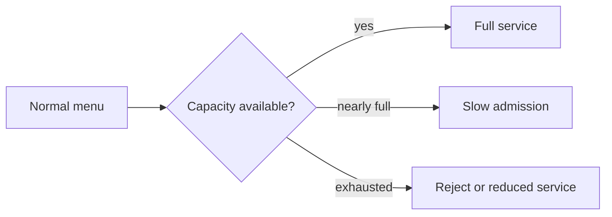
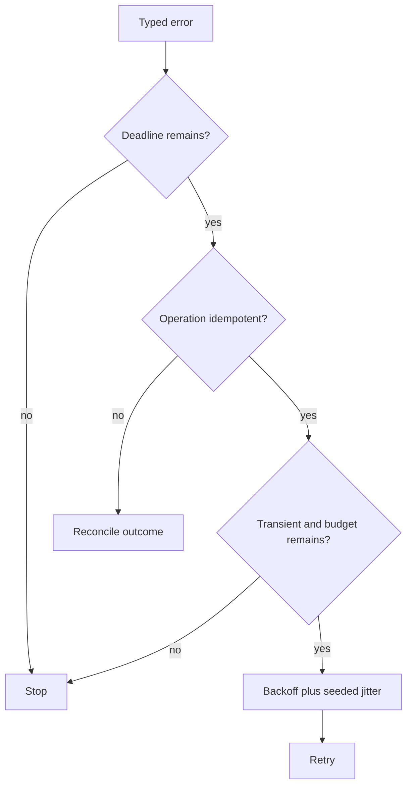
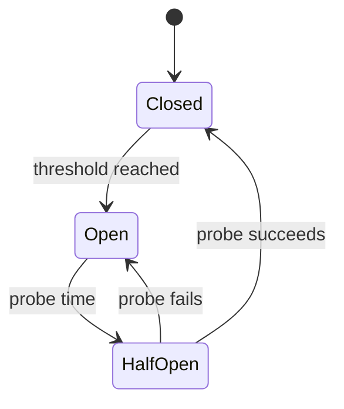

# Chapter 29: Reliability Engineering

> Status: drafting  
> Owner: Module 07 author  
> Last verified: 2026-09-06

## The problem

A model gateway slows down. Workers retry, the queue grows, and a publish message arrives
twice. Without explicit policy, one dependency failure can become an outage or duplicate an
effect.

## Learning objectives

The reader can classify failures, derive timeouts from a deadline, apply bounded retries with
jitter, explain breakers and bulkheads, control overload, and prove duplicate delivery safe.

## First pass

A restaurant limits incoming orders, separates cooking stations, and offers a smaller menu
when one station closes. That prevents a crowded kitchen from collapsing. The analogy stops
because distributed messages can be delayed, reordered, duplicated, partly committed, and
resumed after the original worker disappears.

## Picture the idea



**Takeaway:** overload is controlled before all work becomes slow or fails.

**Equivalent text description:** normal traffic receives full service; rising load triggers
backpressure; exhausted capacity causes explicit rejection or a labeled reduced mode.



**Takeaway:** retry is a budgeted decision, not a default response to failure.

**Equivalent text description:** classify the error, check deadline and idempotency, reconcile
unknown effects, retry only transient errors within budget, and stop otherwise.



**Takeaway:** a circuit breaker pauses calls and uses a limited probe before recovery.

**Equivalent text description:** calls flow while closed; repeated failure opens the breaker;
after a delay one half-open probe runs; success closes it and failure opens it again.

## Vocabulary

| Term | Plain-language meaning |
|---|---|
| Timeout | Maximum wait assigned to one operation. |
| Retry budget | Limits on attempts, time, and resources spent repeating work. |
| Jitter | Randomized delay that prevents synchronized retry waves. |
| Circuit breaker | Stateful guard that pauses calls to an unhealthy dependency. |
| Bulkhead | Separate capacity that contains one workload's failure. |
| Backpressure | Signal that slows or rejects work before capacity is exhausted. |
| Compensation | A new action that addresses a prior effect; it is not time travel. |
| Graceful degradation | Smaller useful service with reduced capability clearly declared. |
| RPO / RTO | Maximum acceptable data-loss window / target restoration time. |

## How it works

Set an end-to-end deadline, then allocate dependency timeouts inside it. Classify errors as
transient, persistent, overload, caller defect, policy denial, conflict, or unknown. Retry
only declared transient failures when the operation is idempotent and attempt, elapsed-time,
and budget limits remain. Policy denials and invalid requests are terminal.

Scope breakers and bulkheads to the dependency and failure domain. Apply queue limits and
per-tenant concurrency before saturation. A fallback must preserve authorization,
provenance, quality labels, and safety. Stale sources or a smaller model are not automatically
acceptable.

## Engineering deep dive

Record one policy per dependency: criticality, objective, timeout, retryable errors, maximum
attempts, backoff, jitter seed, breaker threshold, concurrency, queue age, degradation, and
recovery owner. Use intent and durable outcome records around effects. On unknown outcomes,
query or reconcile by idempotency key instead of repeating blindly. Rollback restores a prior
version; compensation performs a later business action and may be impossible.

Candidate availability, RPO, and RTO values are unmeasured until load and recovery tests
ratify them. Error budget never permits an authorization or tenant-isolation violation.

## Build it in Python

```python
from dataclasses import dataclass
from random import Random


@dataclass(frozen=True)
class Policy:
    attempts: int = 3
    deadline: int = 20
    base_delay: int = 2


def run(outcomes: tuple[str, ...], key: str, receipts: set[str]) -> tuple[str, list[int]]:
    if key in receipts:
        return "duplicate_suppressed", []
    clock, delays = 0, []
    random = Random(7)
    for attempt, outcome in enumerate(outcomes[:Policy().attempts], 1):
        if outcome == "ok":
            receipts.add(key)
            return "completed", delays
        if outcome in {"policy_denied", "invalid"}:
            return "terminal", delays
        delay = Policy().base_delay * 2 ** (attempt - 1) + random.randrange(2)
        if clock + delay >= Policy().deadline:
            return "deadline", delays
        delays.append(delay)
        clock += delay
    return "degraded", delays


receipts: set[str] = set()
assert run(("timeout", "timeout", "ok"), "publish-1", receipts) == ("completed", [3, 4])
assert run(("ok",), "publish-1", receipts)[0] == "duplicate_suppressed"
assert run(("policy_denied",), "publish-2", receipts)[0] == "terminal"
print("PASS: bounded retry, terminal stop, and deduplication")
```

This Python 3.11 fixture uses no sleep, network, provider, or real effect.

## Microsoft implementation

Azure Architecture Center provides evolving pattern guidance (SRC-045), and Azure Service
Bus is a volatile messaging candidate (SRC-049). Reverify delivery behavior, SDK support,
limits, regions, and identity within 30 days of release. Northstar's idempotency, deadline,
and recovery contracts remain provider neutral.

## How leading teams approach it

SRE publications connect reliability to explicit objectives, overload controls, and practiced
response (SRC-028, SRC-029). Current durable workflow and messaging documentation illustrates
delivery and retry mechanisms (SRC-049, SRC-061), but application effects still require
Northstar-owned deduplication and reconciliation.

## Failure lab

Reproduce a retry storm, queue redelivery, hot tenant, partial publish, and permission-breaking
fallback. Expected containment is bounded retries, duplicate suppression, tenant bulkhead,
reconciliation, and fallback denial. Measure attempts, queue age, rejected work, recovery
time, and degraded-result labels.

## Security and safety testing

Inject `policy_denied` between transient failures and propose a fallback source outside the
principal's permissions. Neither may retry or degrade around policy. Evidence is a terminal
typed event and zero effect receipts.

## Evaluation

Require 100% duplicate suppression in fixtures, zero retry of terminal errors, bounded queue
age and attempts, deterministic breaker transitions, per-tenant capacity isolation, labeled
degradation, and recovery within candidate RTO. Availability and RPO/RTO remain unmeasured
candidate objectives until representative drills pass.

## Production checklist

- [ ] Deadlines bound every dependency wait.
- [ ] Retry policy checks error type, idempotency, jitter, and budget.
- [ ] Breakers, bulkheads, and backpressure match failure domains.
- [ ] Unknown effects reconcile by durable key.
- [ ] Fallback preserves permissions, provenance, quality, and safety.
- [ ] Restore and recovery objectives are tested.

### Production implications

Operators need per-dependency policy ownership, capacity limits, breaker and queue signals,
and practiced recovery. Policy changes require canaries because a larger retry budget can
increase latency, cost, and outage amplification even when individual calls appear safer.

## Review questions

1. When does retry amplify an outage?
2. Why is compensation different from rollback?
3. What must a safe fallback preserve?

## Try it safely

Use supplied cards labeled healthy, slow, overload, denial, conflict, and failure. Draw one
per dependency call and apply the policy table. Success means no terminal error is retried and
all work stops inside deadline and attempt budgets.

## Common misunderstanding

Retries do not make distributed actions reliable by themselves. They can amplify overload or
repeat an effect unless durable records and idempotency make repetition safe.

## Recap and next step

- Classify before recovering.
- Bound time, attempts, queues, and concurrency.
- Isolate failures and label reduced service.
- Chapter 30 turns these states into privacy-safe operational signals.

## Design exercise

For model, retrieval, and publish dependencies, write a policy matrix and defend different
timeouts, bulkheads, and fallbacks. Include one irreversible effect and its reconciliation
plan.

## Hands-on lab

Extend the fixture with a fake-clock circuit breaker and bounded queues. Test closed, open,
half-open, failed probe, successful probe, hot tenant, queue redelivery, and unauthorized
fallback. Cleanup requires only deleting local synthetic files.

## Sources

- SRC-028, Google, *Site Reliability Engineering*. Durable.
- SRC-029, Google, *The Site Reliability Workbook*. Durable.
- SRC-045, Microsoft, *Azure Architecture Center*. Evolving; accessed 2026-09-05.
- SRC-049, Microsoft, *Azure Service Bus messaging documentation*. Volatile; accessed 2026-09-05.
- SRC-061, Temporal, *Temporal Platform documentation*. Volatile; accessed 2026-09-05.
