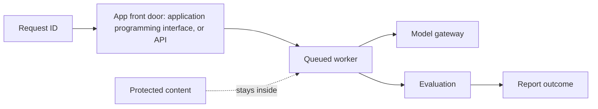
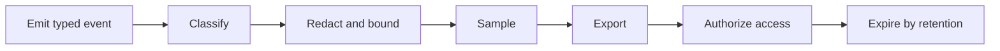
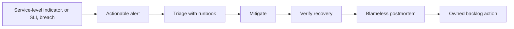

# Chapter 30: Observability and site reliability engineering (SRE)

> Status: drafting  
> Owner: Module 07 author  
> Last verified: 2026-09-06

## The problem

A fast application programming interface (API) returns a report with missing citations.
Infrastructure is green, but the user outcome failed. Copying prompts and documents into logs
would add privacy risk without necessarily explaining the failure.

## Learning objectives

The reader can design minimized events, correlate queued work, derive user-centered SLIs and
candidate SLOs, trigger actionable alerts, follow a runbook, and prove redaction offline.

## First pass

Package tracking uses a small identifier and checkpoints to show where a parcel stopped. It
does not copy the package contents at every stop. The analogy stops because telemetry can
expose prompts, documents, identities, approvals, and credentials unless schemas, access,
sampling, and retention are enforced.

## Picture the idea



**Takeaway:** correlation follows the request while protected content stays inside its
authorized boundary.

**Equivalent text description:** one tenant-safe request ID crosses the application programming
interface (API), queue, worker, model, evaluation, and outcome checkpoints; source bodies are
not copied into telemetry.



**Takeaway:** privacy controls run before export, not after storage.

**Equivalent text description:** a typed event is classified, allowlisted, redacted, length
bounded, sampled, exported, access controlled, and expired on schedule.



**Takeaway:** an alert is useful only when it leads to owned action and verified recovery.

**Equivalent text description:** in site reliability engineering (SRE), a service-level
indicator (SLI) breach pages an owner, the runbook guides diagnosis, mitigation is verified,
evidence feeds a postmortem, and an improvement receives an owner.

## Vocabulary

| Term | Plain-language meaning |
|---|---|
| Metric | Numeric signal aggregated over events. |
| Log | Discrete structured record of an event. |
| Trace / span | Correlated request journey / one timed operation within it. |
| Cardinality | Number of distinct label values a signal can contain. |
| SLI / SLO | Measured behavior / target range over a stated window. |
| Error budget | Allowed service-level gap, never permission to violate safety. |
| Burn rate | Speed at which an error budget is being consumed. |
| Runbook | Tested response steps for a known operational condition. |

## How it works

Start with operator questions and user outcomes. Define a stable internal event schema before
mapping it to a backend: schema version, tenant-safe IDs, run, trace, actor class, event type,
timestamp, component version, outcome, duration, and allowlisted attributes. Carry
correlation across queue delivery and resume.

Exclude raw prompts, documents, credentials, personal data, approval payloads, and private
reasoning by default. Prefer hashes, versions, classifications, counts, and policy decision
IDs. Bound lengths and cardinality; redact before export; apply role-based access, encryption,
sampling, and expiry.

## Engineering deep dive

Measure availability, latency, citation quality, accepted-report outcome, durable resume,
queue age, saturation, and dependency health. A fast failed report is not success. Candidate
SLOs state window, population, exclusions, owner, threshold, and action, and remain unmeasured
until representative evidence ratifies them. Safety invariants have no spendable budget.

Alerts name user impact, urgency, owner, and first runbook action. Dashboards support a
question; they are not collections of every available chart. Incident records preserve
minimized evidence and lead to blameless corrective actions.

## Build it in Python

```python
from dataclasses import dataclass, replace


ALLOWED = {"queue_age_ms", "duration_ms", "outcome"}
FORBIDDEN_MARKERS = ("SECRET-", "document body")


@dataclass(frozen=True)
class Event:
    trace: str
    span: str
    parent: str | None
    attributes: dict[str, str | int]


def process(event: Event) -> Event:
    clean = {key: value for key, value in event.attributes.items() if key in ALLOWED}
    assert not any(marker in str(clean) for marker in FORBIDDEN_MARKERS)
    return replace(event, attributes=clean)


events = [
    process(Event("trace-1", "api", None, {"duration_ms": 40, "secret": "SECRET-123"})),
    process(Event("trace-1", "worker", "api", {"outcome": "failed", "body": "document body"})),
]
availability = sum(e.attributes.get("outcome") != "failed" for e in events[1:]) / 1
burn_alert = availability < 0.995
assert burn_alert and all(e.trace == "trace-1" for e in events)
assert "SECRET-123" not in repr(events) and "document body" not in repr(events)
print("PASS: trace reconstructed, alert fired, protected fields rejected")
```

The deterministic Python 3.11 lab uses synthetic values and no telemetry service.

## Microsoft implementation

As of 2026-09-06, Azure Monitor OpenTelemetry export is a volatile Python integration
candidate (SRC-047). Preserve Northstar's internal event schema and map at the adapter. Pin
the external convention version (SRC-056), and reverify SDK, configuration, sampling, and
supported fields within 30 days of release.

## How leading teams approach it

SRE guidance begins with objectives, actionable monitoring, and incident learning (SRC-028).
Current Python agent tracing examples show spans and traces (SRC-021, SRC-025), but their SDK
schemas are not domain contracts. Northstar records observable state, tool calls, policy
decisions, and outcomes, never private chain-of-thought.

## Failure lab

Seed broken queue correlation, a secret in an exception, an unbounded document-ID label,
alert noise, and an SLO that counts fast failed reports as success. Correct them with context
propagation, pre-export rejection, bounded labels, multi-window actionable alerts, and an
outcome SLI.

## Security and safety testing

Insert synthetic API keys, names, document text, oversized values, and unique document IDs.
Expected result: reject, transform, or truncate according to the allowlist before export.
Evidence is zero forbidden markers and cardinality within its declared budget.

## Evaluation

Require complete correlation across queue resume, zero seeded-secret redaction misses, 100%
required spans, bounded label cardinality, useful diagnosis from minimized signals, and an
alert that detects the seeded outcome failure. Track time to detect and mitigate. Candidate
availability of 99.5% monthly and other targets remain unmeasured until ratified.

## Production checklist

- [ ] Events use a versioned internal schema.
- [ ] Classification, redaction, and bounds run before export.
- [ ] Correlation survives queues, retries, and resume.
- [ ] SLIs include quality and user outcomes.
- [ ] Alerts name owner, impact, and action.
- [ ] Runbook, incident, postmortem, access, and expiry are tested.

### Production implications

Telemetry is a protected production data product with schema owners, access reviews,
retention enforcement, cost budgets, and change compatibility. On-call staffing and runbook
drills must exist before an alert can be considered an operational control.

## Review questions

1. Why can green infrastructure hide a failed user outcome?
2. Which fields answer an operator question without source text?
3. Why is a safety invariant not an error budget?

## Try it safely

Sort synthetic fields into allow, transform, or reject bins. Include a trace ID, duration,
document body, credential, policy version, and user name. Success means every field has a
purpose and protected values never reach the export bin.

## Common misunderstanding

Logging everything does not guarantee observability. It can make diagnosis slower, costlier,
and less safe while still omitting the signal that explains user impact.

## Recap and next step

- Ask operational questions before choosing signals.
- Correlate typed, minimized events across durable work.
- Tie objectives and alerts to user outcomes and action.
- Chapter 31 uses these signals as mandatory release gates.

## Design exercise

Specify one quality SLI, one reliability SLI, one safety invariant, and one burn-rate alert.
For each, name population, window, threshold, owner, runbook, and privacy-safe fields.

## Hands-on lab

Extend the fixture with queue redelivery, resumed-worker spans, cardinality budgets, two SLO
windows, and a local runbook lookup. Test each seeded leak and false-success case. No service
runs after the script exits.

## Sources

- SRC-021, OpenAI, *OpenAI Agents SDK for Python documentation*. Volatile; accessed 2026-09-05.
- SRC-025, OpenAI, *Tracing in the Agents SDK*. Volatile; accessed 2026-09-05.
- SRC-028, Google, *Site Reliability Engineering*. Durable.
- SRC-047, Microsoft, *Azure Monitor OpenTelemetry*. Volatile; accessed 2026-09-05.
- SRC-056, OpenTelemetry, *Semantic conventions for generative AI systems*. Volatile; accessed 2026-09-05.
