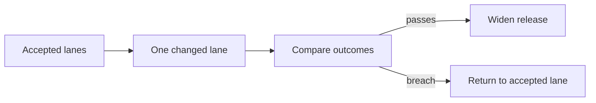
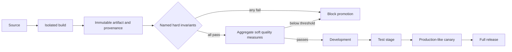
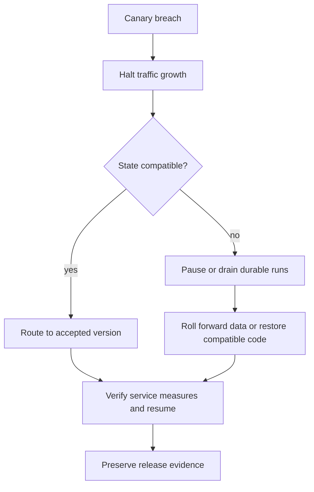

# Chapter 31: Deployment and Delivery

> Status: reviewing
> Owner: Agentic System Design maintainers
> Last verified: 2026-09-06

**On this page**

- [Understand the idea](#the-problem): problem, objectives, first pass, picture, and vocabulary
- [Build the mechanism](#how-it-works): how it works, engineering detail, and Python
- [Apply it](#microsoft-implementation): implementation choices, failures, safety, and evaluation
- [Practice and continue](#review-questions): review, exercises, lab, recap, and sources

## The problem

A build reaches production, but its checkpoint reader cannot resume runs created by the old
worker. Deployment succeeded while service recovery failed. Northstar must release code,
configuration, models, prompts, policy, evaluators, connectors, and infrastructure as one
compatible, evidenced change.

## Learning objectives

The reader can define a reproducible artifact, version a release manifest, promote through
gates, compare a canary with an accepted version, and roll back without stranding durable
runs or hiding evidence.

## First pass

A store replaces one checkout lane and compares it with lanes that still use the accepted
process. Only a good result permits wider replacement. The analogy stops because software
releases include stored state, in-flight work, identities, secrets, compatibility windows,
and several independently versioned artifacts.

## Picture the idea



**Takeaway:** expose a change narrowly and promote only from measured user outcomes.

**Step by step:** keep an accepted version, send a controlled slice to the
canary, compare required measures, widen only on acceptance, and return traffic on breach.



**Takeaway:** build once, attach evidence, and promote the same identified artifact.

**Step by step:** source enters an isolated build; one immutable artifact gets
provenance. Safety, security, privacy, redaction, compatibility, operations, and authorization
must each pass. Only then may soft quality measures aggregate. The same digest moves through
development, test, canary, and full release only when both stages pass.



**Takeaway:** rollback is a compatibility procedure, not merely changing a traffic pointer.

**Step by step:** detect a breach, stop expansion, classify state
compatibility, route back when safe or pause work and repair compatibility, verify recovery,
then preserve the decision record.

## Vocabulary

| Term | Plain-language meaning |
|---|---|
| Reproducible artifact | Identified output that can be rebuilt and verified from declared inputs. |
| Provenance | Evidence of where an artifact came from and which checks it passed. |
| Infrastructure as code | Reviewed, declarative description of infrastructure. |
| Release manifest | Versions and evidence that define one releasable system. |
| Compatibility window | Period in which old and new producers and consumers interoperate. |
| Canary | Small controlled release used before wider promotion. |
| Rollback / roll-forward | Return to an accepted version / repair by advancing safely. |

## How it works

Build once in isolation and promote by immutable digest, never by mutable tag. The release
manifest identifies application, infrastructure, configuration, model, prompt, policy,
evaluator, event, schema, and tool-contract versions plus test, scan, evaluation, approval,
and provenance evidence. Configuration is separate from code but versioned and validated.

Use workload identity or approved secret injection. Credentials never enter source, images,
prompts, fixtures, telemetry, or manifests. Infrastructure changes include compute, identity,
network, data, telemetry, and policy boundaries and receive review.

## Engineering deep dive

Promotion gates cover deterministic tests and representative evaluation plus named hard
invariants for safety, security, privacy, redaction, data compatibility, operational readiness,
and authorized approval. Every hard invariant is evaluated separately; one failure blocks
promotion and cannot be hidden by averaging it with passing checks. A canary states its
hypothesis, population, minimum evidence, thresholds, comparison method, and automatic stop.
Soft quality measures such as task success and latency may aggregate only after every hard gate
passes. Missing telemetry or failed redaction blocks promotion.

Define old-worker and in-flight-run behavior for every event, checkpoint, API, prompt, model,
policy, and schema version. Some changes roll back; others need expand-and-contract,
dual-read, drain, pause, restore, or roll-forward. Deployment rollback cannot undo an
external consequential action.

## Build it in Python

```python
from dataclasses import dataclass
from hashlib import sha256


@dataclass(frozen=True)
class Release:
    version: str
    payload: bytes
    checkpoint_readers: tuple[int, ...]
    gates: tuple[str, ...]

    @property
    def digest(self) -> str:
        return sha256(self.payload).hexdigest()


@dataclass(frozen=True)
class HardInvariants:
    safety: bool
    security: bool
    privacy: bool
    redaction: bool
    compatibility: bool
    operations: bool
    authorization: bool

    def failed(self) -> tuple[str, ...]:
        return tuple(name for name, passed in self.__dict__.items() if not passed)

    def all_pass(self) -> bool:
        return not self.failed()


REQUIRED = {"tests", "evaluation", "security", "privacy", "operations"}


def promote(
    accepted: Release,
    canary: Release,
    hard: HardInvariants,
    soft_quality: tuple[float, ...],
) -> Release:
    assert REQUIRED <= set(canary.gates)
    assert 1 in canary.checkpoint_readers
    if not hard.all_pass():
        return accepted
    assert len(soft_quality) >= 4
    if sum(soft_quality) / len(soft_quality) < 0.85:
        return accepted
    return canary


accepted = Release("1", b"accepted", (1,), tuple(sorted(REQUIRED)))
canary = Release("2", b"candidate", (1, 2), tuple(sorted(REQUIRED)))
failed_safety = HardInvariants(False, True, True, True, True, True, True)
# Regression: six passing booleans once averaged above 0.85 and hid failed safety.
assert sum(failed_safety.__dict__.values()) / 7 > 0.85
assert failed_safety.failed() == ("safety",)
result = promote(accepted, canary, failed_safety, (1.0, 1.0, 1.0, 1.0))
assert result.digest == accepted.digest
passing = HardInvariants(True, True, True, True, True, True, True)
assert promote(accepted, canary, passing, (0.9, 0.9, 0.9, 0.9)) == canary
print("PASS: hard invariants block independently before soft quality aggregation")
```

This Python 3.11 simulation is deterministic, creates no service, and uses no secret.

## Microsoft implementation

Azure Architecture Center supplies evolving deployment guidance (SRC-045). Current managed
runtime, model artifact, and container hosting surfaces are volatile examples (SRC-033,
SRC-036, SRC-048), not selected Northstar products. Reverify names, regions, SDK support,
identity, data handling, and limits within 30 days of release.

## How leading teams approach it

Production-readiness guidance emphasizes evidence, staged change, operational preparation,
and recovery practice (SRC-029). Provider surfaces can host the design, but the manifest,
compatibility, gate, and rollback decisions remain owned by Northstar.

## Failure lab

Reproduce a mutable tag, configuration drift, missing redaction gate, incompatible checkpoint
reader, undersized canary, and rollback that strands a run. Every defect must block promotion
or trigger a tested pause. The correction is a digest-bound manifest, complete gates,
minimum evidence, and explicit compatibility handling.

## Security and safety testing

Seed a credential-like marker in configuration and omit the privacy gate. Also run a candidate
with six passing hard invariants and failed safety. Expected result: each candidate fails before
canary traffic regardless of aggregate soft quality. Evidence names the failed invariant and
artifact digest, never the synthetic marker value.

## Evaluation

Require reproducible digest, complete provenance and gates, zero promotion with any failed hard
invariant, zero incompatible resume in the fixture matrix, seeded-regression detection,
false-promotion rate within the declared bound, logical rollback within candidate RTO, and 100%
resumable or safely paused durable runs. Soft quality, latency, and cost may aggregate only after
hard safety, security, privacy, redaction, compatibility, operations, and authorization pass.
RPO and RTO targets remain candidate until measured.

## Production checklist

- [ ] Build once and promote by digest.
- [ ] Code, configuration, policy, model, evaluator, and schemas are versioned.
- [ ] Secrets use identity or approved injection.
- [ ] Evaluation, security, privacy, compatibility, and operations gate release.
- [ ] Canary thresholds and minimum evidence are declared.
- [ ] Rollback, roll-forward, drain, pause, and durable-run paths are tested.

### Production implications

Release authority, artifact custody, environment access, emergency change, and rollback
ownership must be explicit. Delivery capacity includes time to evaluate canaries and recover
state, not only build throughput or deployment speed.

## Review questions

1. Why is deployment success weaker than user success?
2. Which changes cannot be handled by traffic rollback alone?
3. Why must missing release telemetry stop promotion?

## Try it safely

Order paper cards for source, build, provenance, tests, evaluation, security, privacy,
approval, canary, and release. Remove one card and decide whether promotion can continue.
Success means no required evidence can be bypassed.

## Common misunderstanding

A successful deployment proves only that an artifact reached an environment. It does not
prove reports remain correct, safe, private, reliable, or recoverable.

## Recap and next step

- Promote one immutable, evidenced artifact.
- Treat configuration and compatibility as release inputs.
- Canary on user, safety, reliability, latency, and cost measures.
- Chapter 32 integrates data evolution and restore with these gates.

## Design exercise

Choose rollback, roll-forward, dual-read, drain, or pause for changes to an API, checkpoint,
prompt, policy, and data schema. Defend each choice and specify the canary evidence required.

## Hands-on lab

Extend the simulation with manifests in temporary directories, environment promotion,
configuration validation, synthetic traffic routing, and durable-run versions. Seed each
failure above and assert cleanup removes the temporary directory and leaves no process.

## Sources

- SRC-029, Google, *The Site Reliability Workbook*. Durable.
- SRC-033, Google Cloud, *Vertex AI Agent Engine overview*. Volatile; accessed 2026-09-05.
- SRC-036, Meta, *Llama models repository*. Volatile; accessed 2026-09-05.
- SRC-045, Microsoft, *Azure Architecture Center*. Evolving; accessed 2026-09-05.
- SRC-048, Microsoft, *Azure Container Apps documentation*. Volatile; accessed 2026-09-05.

**Navigation:** [Previous: Chapter 30: Observability and site reliability engineering (SRE)](30-observability-and-sre.md) | [Module 07 overview](../README.md) | [Next: Chapter 32: Data and State at Scale](32-data-and-state-at-scale.md)
