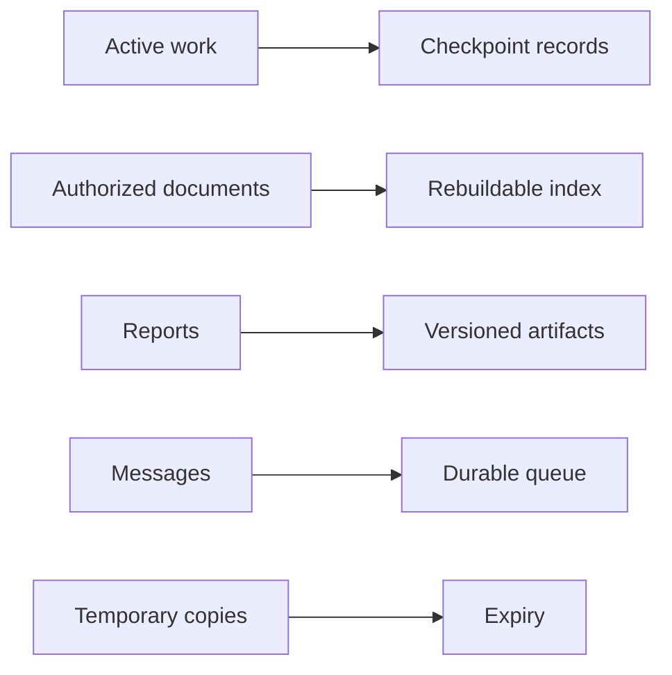
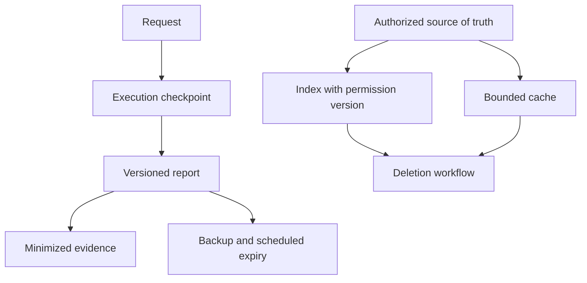
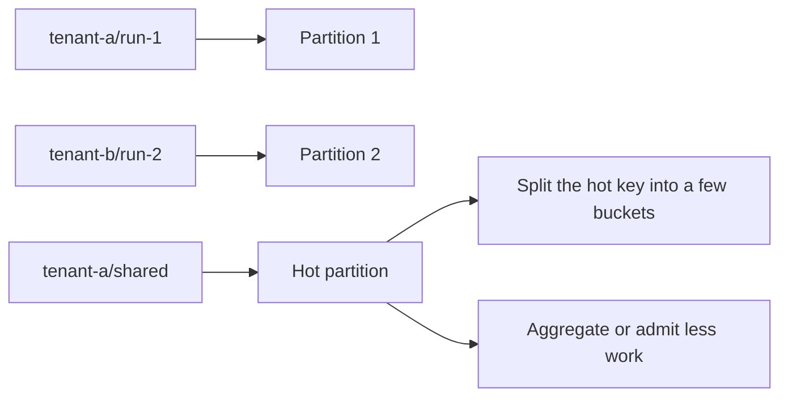
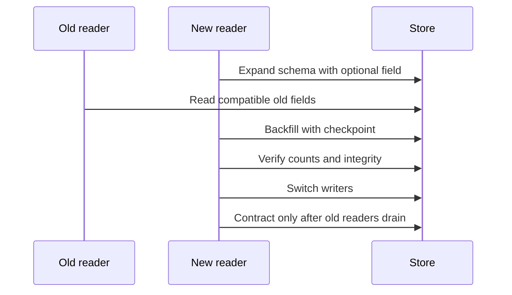

# Chapter 32: Data and State at Scale

> Status: drafting  
> Owner: Module 07 author  
> Last verified: 2026-09-06

## The problem

Northstar stores requests, checkpoints, documents, indexes, reports, messages, optional
memory, and evidence. Putting everything in one scalable database does not give these records
the same truth, consistency, lifetime, permission, or recovery needs.

## Learning objectives

The reader can classify state, choose store categories and keys, explain consistency and
concurrency, evolve schemas, cover derived-copy deletion, test restore, and detect hot keys.

## First pass

A school uses a sign-in sheet, active work folders, a library catalog, locked records, and a
delivery tray. Each place serves a different purpose. The analogy stops because distributed
stores replicate asynchronously, divide load, redeliver messages, retain derived copies, and
change schemas while old code is still running.

## Picture the idea



**Takeaway:** state belongs where its truth, access, lifetime, and recovery requirements fit.

**Equivalent text description:** active work uses checkpoints; documents remain authoritative
while indexes are derived; reports are versioned artifacts; messages use a durable queue;
temporary copies expire.



**Takeaway:** derived state has lineage, deletion coverage, and a rebuild path.

**Equivalent text description:** authorized sources create permission-aware indexes and
caches; requests create checkpoints and reports; reports create minimized evidence; deletion
covers derivatives; backups expire on a documented schedule.



**Takeaway:** tenant scope protects isolation, but distribution may require an additional
small set of buckets or a load-control strategy.

**Equivalent text description:** tenant and run keys distribute ordinary work; one shared key
becomes hot; splitting it into a few buckets, aggregation, admission control, or dedicated
isolation can reduce skew.

**Diagram D4 — Engineering migration view: change stored data without breaking old readers.**



**Takeaway:** expand, backfill, verify, switch, and only then contract.

**Equivalent text description:** add a backward-compatible field, keep old readers working,
backfill resumably, verify, switch writers, drain old readers, then remove the old shape or
roll forward when rollback is no longer compatible.

## Vocabulary

| Term | Plain-language meaning |
|---|---|
| Source of truth | Authoritative record used to resolve disagreement. |
| Materialized view | Derived data stored to make reads faster. |
| Partition key / hot key | Field distributing records / one value receiving excessive load. |
| Optimistic concurrency | Update only when the version read is still current. |
| Compare-and-set | Atomic write conditioned on an expected version. |
| Eventual consistency | Copies may temporarily disagree before convergence. |
| Tombstone | Durable marker that a record was deleted. |
| RPO / RTO | Maximum data-loss window / target restoration time. |

## How it works

Inventory request, execution, working context, artifact, optional memory, evidence, source,
index, cache, and message state before choosing products. Record access pattern, atomicity,
consistency, query, size, latency, isolation, retention, deletion, and recovery. Working
context is disposable; an index or cache is rebuildable; neither is a source of truth.

Every key includes tenant scope. Add run, source, version, time, or bounded shard components
for access and distribution. Concurrent workers use leases and compare-and-set. Duplicate
messages use stable IDs, durable receipts, and reconciliation. Stale policy, permission, or
citation metadata must fail closed or trigger reauthorization.

## Engineering deep dive

Use strong consistency where users could observe conflicting approvals, effects, or report
versions. Eventual consistency may suit rebuildable views when stale behavior is bounded and
labeled. Schema changes use versioned readers and writers, expand-and-contract, resumable
backfill, compatibility gates, and explicit rollback or roll-forward.

Retention and deletion cover primary rows, indexes, caches, optional memory, evaluation
copies, and scheduled backup expiry. An immutable backup may expire later; do not promise
instant erasure. Restore tests verify keys, policy dependencies, integrity, consistency point,
candidate RPO, and candidate RTO.

## Build it in Python

```python
import sqlite3
from collections import Counter


db = sqlite3.connect(":memory:")
db.execute("create table runs (tenant text, run text, version integer, status text, primary key (tenant, run))")
db.execute("insert into runs values ('tenant-a', 'run-1', 1, 'active')")


def compare_and_set(tenant: str, run: str, expected: int, status: str) -> bool:
    cursor = db.execute(
        "update runs set version=version+1, status=? where tenant=? and run=? and version=?",
        (status, tenant, run, expected),
    )
    return cursor.rowcount == 1


assert compare_and_set("tenant-a", "run-1", 1, "complete")
assert not compare_and_set("tenant-a", "run-1", 1, "stale-writer")
messages = ["m1", "m1", "m2"]
assert list(dict.fromkeys(messages)) == ["m1", "m2"]
keys = ["tenant-a/shared"] * 8 + ["tenant-b/run-1", "tenant-c/run-2"]
counts = Counter(key.split("/")[0] for key in keys)
assert max(counts.values()) / sum(counts.values()) == 0.8
backup = "\n".join(",".join(map(str, row)) for row in db.execute("select * from runs"))
assert "complete" in backup and "stale-writer" not in backup
print("PASS: conflict, duplicate, hot-key, and restore fixture checks")
```

The Python 3.11 lab uses standard-library SQLite, synthetic tenant IDs, and no network.

## Microsoft implementation

Azure Service Bus is a volatile messaging candidate (SRC-049). Reverify delivery semantics,
SDK support, limits, regions, and identity within 30 days of release. No database product is
selected here. Store choices must satisfy Northstar's provider-neutral state contract.

## How leading teams approach it

Distributed-data literature explains replication, partitioning, consistency, and recovery
tradeoffs (SRC-072). Official data-protection principles are qualified-review input for
purpose, minimization, retention, security, and rights, not legal advice or an automatic
compliance claim (SRC-063).

## Failure lab

Reproduce cross-tenant cache collision, stale permission metadata, lost update, duplicate
message, incompatible reader, incomplete derived deletion, unusable backup, and hot
partition. Expected controls are tenant keys, reauthorization, compare-and-set, deduplication,
compatibility gates, lineage deletion, restore verification, and skew mitigation.

## Security and safety testing

Attempt to read `tenant-a/run-1` with `tenant-b`, and delete only the primary record while an
index fixture remains. Both tests must fail acceptance. Evidence lists location IDs, versions,
and deletion status without source content or personal data.

## Evaluation

Require zero cross-tenant reads, 100% detected write conflicts and duplicate messages,
backward-compatible migration, complete primary and derived deletion coverage, restored
integrity at the declared consistency point, data loss within candidate RPO, restore within
candidate RTO, and partition skew below the workload's measured threshold. All targets remain
unmeasured candidates until representative tests ratify them.

## Production checklist

- [ ] Every state type has a source of truth and store rationale.
- [ ] Tenant, partition, consistency, and concurrency rules are explicit.
- [ ] Derived data has lineage, freshness, permission, rebuild, and deletion controls.
- [ ] Schema migration supports old readers and resumable backfill.
- [ ] Backup expiry is honest and restore is tested.
- [ ] Hot keys and duplicate messages have measured controls.

### Production implications

Store ownership includes capacity forecasts, migration windows, access reviews, retention
jobs, restore drills, and derivative rebuilds. Growth or regional expansion is blocked until
measured partition and recovery evidence supports it.

## Review questions

1. Why is an index not the source of truth?
2. When is eventual consistency visible or unsafe?
3. Why must deletion and restore tests cover derived state?

## Try it safely

Sort synthetic record cards by purpose, consistency, lifetime, and rebuild cost. Assign a
store category, key, source of truth, deletion path, and recovery rule. Success means no
record is placed merely because one database is convenient.

## Common misunderstanding

One scalable database does not remove the need to classify state. Different records still
need different consistency, authorization, retention, indexing, and recovery behavior.

## Recap and next step

- Place state by behavior, not product convenience.
- Treat caches and indexes as permission-aware derivatives.
- Test concurrency, migration, deletion, partitioning, and restore.
- Module 08 receives measured access patterns, skew, saturation, and recovery evidence.

## Design exercise

For each Northstar state type, choose a source of truth, store category, tenant key,
consistency rule, concurrency rule, retention, deletion path, and recovery behavior. Compare
salting, aggregation, admission control, and dedicated isolation for one hot key.

## Hands-on lab

Extend the SQLite fixture with schema versions, expand-and-contract migration, tombstones,
derived-index rows, temporary-file backup and restore, integrity hashes, and 1,000 seeded
partition keys. Test cleanup of temporary files and scheduled backup expiry metadata.

## Sources

- SRC-049, Microsoft, *Azure Service Bus messaging documentation*. Volatile; accessed 2026-09-05.
- SRC-063, European Union, *Regulation (EU) 2016/679*. Evolving; qualified-review input, not legal advice.
- SRC-072, O'Reilly Media, *Designing Data-Intensive Applications*. Durable.
