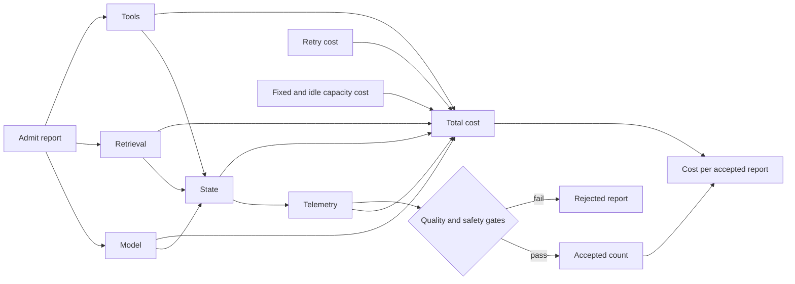
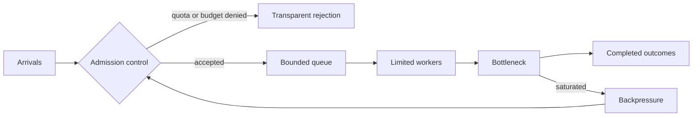
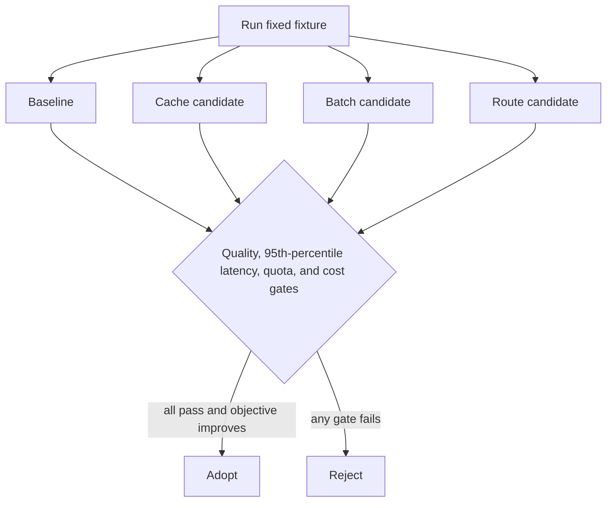

# Chapter 33: Performance and Cost Engineering

> Status: reviewing
> Owner: Agentic System Design maintainers
> Last verified: 2026-09-06

**On this page**

- [Understand the idea](#the-problem): problem, objectives, first pass, picture, and vocabulary
- [Build the mechanism](#how-it-works): how it works, engineering detail, and Python
- [Apply it](#microsoft-implementation): implementation choices, failures, safety, and evaluation
- [Practice and continue](#review-questions): review, exercises, lab, recap, and sources

## The problem

### The checkout line

A grocery store can open more checkout lanes when a crowd arrives. That helps
until payment approval, bagging, or restocking becomes the slowest step. The
store also has not succeeded by selling a damaged item cheaply. A low price is
useful only when the customer receives an acceptable item.

Northstar has the same basic question: what will each accepted research report
cost, and where will load create delay? A cheap model call can still produce an
expensive report if it causes retries, poor citations, long queues, or rejected
work.

The analogy stops at the intuition. Requests are not identical shoppers.
Distributed services have variable service times, quotas, failures, shared
dependencies, and work that may be retried or cancelled. Capacity and cost must
therefore be measured with representative workloads.

## Learning objectives

By the end of this chapter, you can:

1. Describe a workload using arrival rate, service time, concurrency, and bursts.
2. Calculate full cost per accepted report and reject a run with zero accepted reports.
3. Measure p50, p95, and p99 latency, throughput, queue time, saturation, and acceptance rate.
4. Enforce bounded queues, per-run and per-tenant quotas, and a hard monetary budget.
5. Compare baseline, cache, batch, and route strategies without relaxing quality or safety gates.
6. Diagnose retry storms, noisy neighbors, unsafe cache keys, and latency-heavy batching.

## First pass

### Count useful outcomes, not cheap attempts

A **workload model** is a measurable description of the work that arrives. It
records request shapes, timing, size, and growth assumptions. **Capacity** is
the useful work the system can finish while still meeting its thresholds.

The important denominator is not model calls or requests. It is accepted
reports: completed reports that pass the quality and safety gates established
in Chapter 19.

```text
cost_per_accepted_report = total_run_cost / accepted_report_count
```

If `accepted_report_count` is zero, the experiment failed. Returning zero or
quietly accepting infinity would hide a system that spent money without
producing a useful result.

## Picture the idea

### The full unit-economics boundary



**Takeaway:** total cost, including retries and idle capacity, is divided by the
count of reports that pass the quality and safety gates.

**Step by step:** Follow the cost from admission to the accepted-report denominator.

1. Admission starts one report and records its scope.
2. Model, retrieval, tool, state, telemetry, retry, fixed, and idle-capacity
   costs all feed the total-cost numerator.
3. Quality and safety evaluation classifies the report.
4. Only a passing report increases the accepted-count denominator.
5. Dividing total cost by accepted count produces cost per accepted report.

### Capacity needs a stopping boundary



**Takeaway:** bounded admission turns overload into an explicit decision rather
than unbounded waiting or accidental spending.

**Step by step:** Follow each arrival through admission, waiting, service, and outcome.

1. Requests reach an admission gate.
2. The gate rejects work that exceeds quota or budget and records why.
3. Admitted work enters a bounded queue and then a limited worker pool.
4. A saturated bottleneck sends backpressure to admission.
5. Completed and rejected outcomes remain visible in the report.

### Adopt only measured improvements



**Takeaway:** an optimization is optional until the same controlled fixture
shows an improvement without crossing another threshold.

**Step by step:** The baseline and each candidate run the same
fixture. Their quality, 95th-percentile latency, quota behavior, and cost per
accepted report are checked. A candidate is adopted only when every gate passes
and the declared objective improves; otherwise it is rejected.

## Vocabulary

| Term | Plain-language meaning |
|---|---|
| Workload model | A measured description of request types, arrival patterns, sizes, and growth assumptions. |
| Accepted result | A completed task that passes previously frozen quality and safety gates. |
| Unit economics | Value and full cost expressed per meaningful unit, such as one accepted report. |
| Arrival rate | Requests arriving per unit of time. |
| Service time | Time a worker actively spends on one task. |
| Queue time | Time a task waits before service starts. |
| Utilization | Fraction of available worker time that is busy. |
| Saturation | The point where a constrained resource is fully occupied and queues grow quickly. |
| Throughput | Completed work per unit of time. |
| Concurrency | Work items allowed to execute at the same time. |
| Quota | An enforced allowance over a stated scope and interval. |
| Backpressure | A signal or control that slows admission when downstream work cannot keep up. |
| Cache hit | Reuse of an authorized, fresh result instead of recomputing it. |
| Batching | Grouping work for one operation, often trading efficiency for waiting time. |
| Model routing | Choosing among model contracts according to task requirements and policy. |
| Sensitivity analysis | Changing assumptions to see which ones materially change the decision. |

## How it works

### Start with explicit workload classes

Northstar uses synthetic classes before production measurements exist:

| Class | Shape | Normal arrivals | Peak burst | Assumption status |
|---|---|---:|---:|---|
| `brief` | Short report, fixed retrieval | 4 per minute | 8 in one minute | Assumed for lab |
| `standard` | Multi-source report | 2 per minute | 5 in one minute | Assumed for lab |
| `deep` | Larger source set and evaluation | 0.5 per minute | 3 in one minute | Assumed for lab |

Each number needs a unit, window, source, and status of measured, estimated, or
assumed. Production owners replace assumptions with traces that have been
minimized and aggregated without retaining private content.

### Attribute the complete cost

For a run, sum model input and output, retrieval, tools, state, telemetry,
retries, fixed charges, and allocated idle or reserved capacity:

$$
C_{accepted} =
\frac{C_{model}+C_{retrieval}+C_{tools}+C_{state}+C_{telemetry}+C_{retry}+C_{fixed}+C_{idle}}
{N_{accepted}}
$$

The fake lab prices are teaching fixtures, not vendor prices. Cost allocation
must state whether shared capacity is assigned by task count, service time,
reserved share, or another reviewed rule.

### Measure distributions and outcomes

An average hides tail delay. Sort observed latencies and report p50, p95, and
p99 with the sample count and window. Also report:

- throughput and acceptance rate;
- queue time and queue rejections;
- worker utilization and saturation periods;
- quota, cancellation, and budget denials;
- retries and cost by category;
- cost per accepted report.

A small fixture makes percentile estimates coarse. It verifies calculation and
policy behavior, not production capacity.

## Engineering deep dive

### Capacity estimates are hypotheses

For stable independent work, a first estimate is:

$$
concurrency \approx arrival\ rate \times mean\ service\ time
$$

This is a planning approximation, not a sizing guarantee. Bursts, tail service
times, dependency quotas, and correlated failures can dominate. Record a range,
then load-test the same release configuration.

### Admission and degradation

Apply limits at several scopes:

- **Run:** steps, tokens, calls, elapsed time, and money.
- **Tenant:** concurrency, request rate, storage, and money.
- **Global:** bounded queue, worker capacity, and dependency quota.

On exhaustion, return an honest status and retry hint only when retrying can
help. Degradation may choose a shorter report or the deterministic baseline,
but it must label the output and preserve authorization, citation, and safety
requirements. Never hide a rejection as success.

### Cache, batch, route, or do nothing

A cache needs tenant and authorization scope, source and policy versions,
freshness, invalidation, and quality tests. A batch can reduce per-item work but
increase p95 latency. Routing can reduce model cost but may lower acceptance.
Each mechanism adds failure modes, so `no cache`, `no batch`, and `no alternate
model` are valid recommendations.

Fair queuing prevents one hot tenant from occupying every worker. It improves
resource allocation but is not an authorization boundary. Tenant checks still
apply to every store, cache, queue, trace, and evaluator.

## Build it in Python

The following Python 3.11 simulation is offline, deterministic, and synthetic.
It uses a fake clock, fake prices, fixed task quality, bounded admission,
per-tenant quotas, and a hard run budget.

```python
from dataclasses import dataclass
import heapq
from statistics import median


@dataclass(frozen=True)
class Task:
    task_id: str
    tenant_id: str
    arrival: int
    service: int
    quality: float
    model_cost: int
    retrieval_cost: int
    tools_cost: int
    state_cost: int
    telemetry_cost: int
    retry_cost: int

    def variable_cost(self) -> int:
        return (
            self.model_cost + self.retrieval_cost + self.tools_cost
            + self.state_cost + self.telemetry_cost + self.retry_cost
        )


TASKS = (
    Task("a1", "tenant-a", 0, 3, 0.91, 5, 2, 1, 1, 1, 0),
    Task("b1", "tenant-b", 0, 2, 0.88, 4, 1, 1, 1, 1, 0),
    Task("a2", "tenant-a", 1, 4, 0.93, 5, 2, 1, 1, 1, 1),
    Task("a3", "tenant-a", 1, 2, 0.90, 4, 1, 1, 1, 1, 0),
    Task("b2", "tenant-b", 2, 2, 0.70, 2, 1, 1, 1, 1, 1),
)
QUALITY_GATE = 0.85
TENANT_QUOTA = 2
QUEUE_LIMIT = 3
WORKERS = 2
FIXED_COST = 3
IDLE_COST_PER_WORKER_TICK = 1
BUDGET = 45


def percentile(values: list[int], fraction: float) -> int:
    ordered = sorted(values)
    index = max(0, int((len(ordered) - 1) * fraction + 0.999))
    return ordered[index]


def simulate(tasks: tuple[Task, ...]) -> dict[str, object]:
    admitted_by_tenant: dict[str, int] = {}
    waiting: list[Task] = []
    running: list[tuple[int, int, Task, int]] = []
    rejected: list[tuple[str, str]] = []
    cost = {
        "model": 0, "retrieval": 0, "tools": 0, "state": 0,
        "telemetry": 0, "retry": 0, "fixed": FIXED_COST, "idle": 0,
    }
    committed = FIXED_COST
    sequence = 0
    max_waiting_depth = 0
    busy_ticks = 0
    latencies: list[int] = []
    queue_times: list[int] = []
    completed: list[Task] = []

    def start(task: Task, now: int) -> None:
        nonlocal sequence, busy_ticks
        sequence += 1
        queue_times.append(now - task.arrival)
        busy_ticks += task.service
        heapq.heappush(running, (now + task.service, sequence, task, now))

    def complete_until(now: int) -> None:
        while running and running[0][0] <= now:
            finished, _, task, _ = heapq.heappop(running)
            latencies.append(finished - task.arrival)
            completed.append(task)
            if waiting:
                start(waiting.pop(0), finished)

    for task in sorted(tasks, key=lambda item: item.arrival):
        complete_until(task.arrival)
        used = admitted_by_tenant.get(task.tenant_id, 0)
        if used >= TENANT_QUOTA:
            rejected.append((task.task_id, "tenant_quota"))
        elif len(waiting) >= QUEUE_LIMIT:
            rejected.append((task.task_id, "queue_full"))
        elif committed + task.variable_cost() > BUDGET:
            rejected.append((task.task_id, "hard_budget"))
        else:
            committed += task.variable_cost()
            admitted_by_tenant[task.tenant_id] = used + 1
            for name in ("model", "retrieval", "tools", "state", "telemetry", "retry"):
                cost[name] += getattr(task, f"{name}_cost")
            if len(running) < WORKERS:
                start(task, task.arrival)
            else:
                waiting.append(task)
                max_waiting_depth = max(max_waiting_depth, len(waiting))

    while running:
        complete_until(running[0][0])
    clock = max(task.arrival + latency for task, latency in zip(completed, latencies))
    available_worker_ticks = WORKERS * clock
    cost["idle"] = (available_worker_ticks - busy_ticks) * IDLE_COST_PER_WORKER_TICK
    total_cost = sum(cost.values())
    if total_cost > BUDGET:
        raise RuntimeError("hard budget exceeded")
    accepted = sum(task.quality >= QUALITY_GATE for task in completed)

    if accepted == 0:
        raise ValueError("failed experiment: zero accepted reports")
    return {
        "accepted": accepted,
        "acceptance_rate": accepted / len(completed),
        "rejected": rejected,
        "p50": median(latencies),
        "p95": percentile(latencies, 0.95),
        "p99": percentile(latencies, 0.99),
        "max_queue_time": max(queue_times),
        "throughput_per_tick": len(completed) / clock,
        "max_waiting_depth": max_waiting_depth,
        "worker_utilization": busy_ticks / available_worker_ticks,
        "saturated": max_waiting_depth == QUEUE_LIMIT,
        "cost_by_category": cost,
        "total_cost": total_cost,
        "cost_per_accepted": total_cost / accepted,
    }


report = simulate(TASKS)
assert report["accepted"] == 3
assert report["total_cost"] <= BUDGET
assert ("a3", "tenant_quota") in report["rejected"]
assert report["p95"] == report["p99"] == 5
assert set(report["cost_by_category"]) == {
    "model", "retrieval", "tools", "state", "telemetry", "retry", "fixed", "idle"
}
assert all(amount > 0 for amount in report["cost_by_category"].values())
assert report["total_cost"] == sum(report["cost_by_category"].values())

# Four admitted tasks do not imply a three-place waiting queue was saturated.
assert report["max_waiting_depth"] == 1
assert report["saturated"] is False
assert report["worker_utilization"] == 11 / 12

# A cache key without tenant scope is rejected before use.
def cache_key(tenant_id: str, query: str) -> tuple[str, str]:
    if not tenant_id:
        raise ValueError("tenant scope required")
    return tenant_id, query


assert cache_key("tenant-a", "market") != cache_key("tenant-b", "market")
print("PASS: bounded load, tenant quota, budget, and unit cost verified")
```

Expected output:

```text
PASS: bounded load, tenant quota, budget, and unit cost verified
```

## Microsoft implementation

The design remains vendor-neutral. Azure Well-Architected Framework guidance
can inform cost and performance review questions for a Microsoft deployment
(SRC-046). This is evolving guidance, not proof of Northstar capacity or cost.
Product prices, quotas, limits, regions, SDK behavior, and data handling are
volatile and must be reverified at release time. The required lab uses no
Microsoft service or SDK.

## How leading teams approach it

Azure Well-Architected Framework treats performance efficiency and cost
optimization as workload review concerns rather than isolated model choices
(SRC-046). The AWS Generative AI Lens likewise supplies evolving workload
design questions (SRC-052). This chapter interprets those sources as support
for full-system measurement. Neither source supplies Northstar's measurements
or selects a provider.

## Failure lab

Run each fault against the same fixture and change one policy at a time.

| Seeded failure | Observable evidence | Measurable correction |
|---|---|---|
| Retry storm | Retry cost and attempts rise while accepted count does not. | Bound retries, add jitter in a real scheduler, and stop on budget exhaustion. |
| Hot tenant | Other tenants wait or are rejected. | Apply per-tenant admission and fair scheduling. |
| Cross-tenant cache | Same query returns another tenant's value. | Include tenant, authorization, source, and policy versions in the key. |
| Slow batch | p95 crosses its threshold despite lower unit work. | Reduce the batch wait or reject batching. |
| Cheap route | Cost falls but acceptance drops below its gate. | Reject the route and retain the baseline. |

## Security and safety testing

The `cache_key` assertions are a synthetic isolation test. The expected result
is that equal query text for different tenants creates different keys and a
missing tenant is denied. Additional tests must prove that a hot tenant cannot
spend another tenant's allowance and that budget exhaustion stops new work.
The evidence is an explicit denial reason, bounded queue length, unchanged
other-tenant budget, and no cross-tenant cache hit.

No test requests private chain-of-thought. Inspect task IDs, policy decisions,
cost events, queue transitions, evaluator results, and outcomes.

## Evaluation

Freeze thresholds before comparing strategies. A candidate passes only when:

| Measure | Example lab gate |
|---|---|
| Acceptance rate | At least 85% on the representative accepted workload |
| Safety invariants | 100% of fixed forbidden cases blocked |
| p95 latency | At or below the declared fixture threshold |
| Throughput | At or above the baseline requirement |
| Queue | Never exceeds its configured bound |
| Hard budget | 100% of runs stop before exceeding it |
| Tenant cache isolation | Zero cross-tenant hits in the negative suite |
| Unit cost | Lower only after all prior gates pass |
| Replay | Same fixture and configuration produce the same report |

Report confidence ranges and sensitivity to arrival rate, service time, price,
acceptance threshold, and idle-capacity allocation. A cheaper failed report is
not an improvement.

## Production checklist

- [ ] Workload classes include units, windows, sources, and confidence.
- [ ] Cost includes model, retrieval, tools, state, telemetry, retries, and idle capacity.
- [ ] Zero accepted reports fails the experiment.
- [ ] p50, p95, p99, throughput, queue time, and saturation are reported.
- [ ] Run, tenant, and global quotas are code-enforced.
- [ ] Rejections, cancellations, and degraded results are labeled honestly.
- [ ] Cache authorization, tenant partitioning, freshness, and invalidation are tested.
- [ ] Baseline, candidate, rollback, and alert thresholds are versioned.

### Production implications

Separate admission, scheduling, execution, evaluation, and cost attribution so
each can be tested. Autoscaling cannot repair a downstream quota or an unsafe
cache. Scaling decisions need dependency limits, warm-up time, queue age,
cancel propagation, and regional capacity. Preserve the deterministic baseline
as a fallback when it meets the task contract more efficiently.

## Review questions

1. Why can cost per model call hide an expensive system?
2. What does a zero accepted-report count mean?
3. Why are p95 and p99 useful beside the average?
4. When should batching or caching be rejected?
5. Why is throttling not a tenant security boundary?
6. Which assumptions most affect the capacity recommendation?

## Try it safely

Use twelve paper task cards for three fictional tenants. Give each card an
arrival time, service time, quality score, and fake cost. Use three queue
spaces and two worker spaces. Admit cards only while tenant quota and budget
remain. Record completed, rejected, and accepted cards. No account, payment,
provider, or personal data is involved.

## Common misunderstanding

> **Misconception:** the cheapest model produces the cheapest useful system.

A low call price can increase retries, tool use, latency, or rejection. Compare
full cost per accepted report after quality, safety, reliability, and latency
gates. The correct recommendation may be the baseline with no optimization.

## Recap and next step

- Capacity means useful work within thresholds, not raw call volume.
- Cost per accepted report exposes rejected work and retries.
- Bounded queues, quotas, backpressure, and budgets make overload explicit.
- Cache, batch, and routing changes must earn adoption through measurement.
- Tenant dimensions belong in performance, cost, and isolation evidence.

Chapter 34 carries those tenant dimensions into identity, data, quota, region,
recovery, and administration boundaries.

## Design exercise

Northstar expects a five-minute burst for three tenants. Choose one of these:

1. a shared worker pool with fair queues;
2. reserved concurrency per tenant;
3. a dedicated stamp for the largest tenant.

Define workload assumptions, quota scopes, queue bound, rejection behavior,
cost allocation, four release gates, and evidence that would reverse your
choice. Include the deterministic baseline.

## Hands-on lab

Run the fenced Python with Python 3.11. Then add one strategy at a time:

1. A retry that adds cost but not acceptance.
2. A tenant-partitioned cache with explicit freshness.
3. A batch wait that changes p95.
4. A cheaper route whose quality is below the gate.

Keep the seed and fixtures fixed. Store `workload.json`, `cost_model.json`,
`capacity_policy.json`, the metrics report, and expected trace in a temporary
practice directory. Cleanup is deletion of that synthetic directory.

## Sources

Only this frozen chapter set is cited:

1. **SRC-046**: Microsoft, *Azure Well-Architected Framework*.
   <https://learn.microsoft.com/azure/well-architected/>. Evolving guidance;
   verify current content before use.
2. **SRC-052**: AWS, *Generative AI Lens*.
   <https://docs.aws.amazon.com/wellarchitected/latest/generative-ai-lens/generative-ai-lens.html>.
   Evolving guidance; verify current content before use.

**Navigation:** [Previous: Chapter 32: Data and State at Scale](../../07-production-architecture-operations/chapters/32-data-and-state-at-scale.md) | [Module 08 overview](../README.md) | [Next: Chapter 34: Multi-Tenant and Multi-Region Design](34-multi-tenant-multi-region-design.md)
