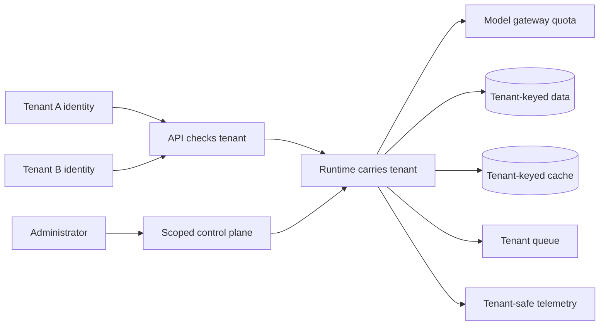
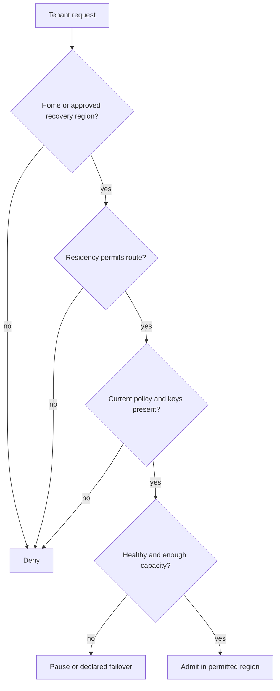
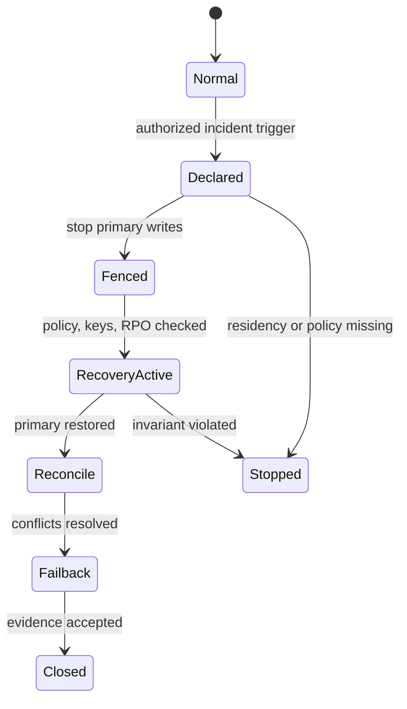

# Chapter 34: Multi-Tenant and Multi-Region Design

> Status: drafting  
> Owner: Chapter 34 author  
> Last verified: 2026-09-06

## The problem

### Lockers and a fire drill

A school gives each student a labeled locker. During a fire drill, each class
also has a named meeting place. The labels organize belongings, and the meeting
place tells people where to recover.

Labels alone are not locks. A student should not open another locker merely
because both lockers are in the same hall. A meeting place also does not make
lost work reappear. The school needs locks, authority, attendance records, and
a practiced recovery procedure.

Northstar faces the same design problem when it serves several organizations
and regions. A tenant label must become an enforced boundary at identity, data,
compute, policy, quota, telemetry, and administration. A second region becomes
useful only when data, ownership, policy, keys, and recovery have been tested.

The analogy stops there. Distributed systems replicate state over time, redeliver
messages, cache data, rotate keys, and can accept conflicting writes. Residency
and transfer constraints also require qualified legal and privacy review.

## Learning objectives

By the end of this chapter, you can:

1. Trace tenant context through every Northstar data and control boundary.
2. Compare shared, partitioned, and dedicated isolation tiers using evidence.
3. Route a tenant only to a permitted, healthy region with current policy and keys.
4. Define and measure recovery point objective (RPO) and recovery time objective (RTO).
5. Execute failover with write fencing, single-writer ownership, idempotency, and reconciliation.
6. Test missing tenant predicates, noisy neighbors, stale policy, duplicate delivery, and residency denial.

## First pass

A **tenant** is an administratively isolated customer or organization. Tenant
context is the tenant identifier plus the policy, identity, region, and usage
information needed to enforce that isolation.

A **home region** is the approved primary region for a tenant's workload and
data. **Failover** is a controlled move to a recovery region after a declared
failure. It is not ordinary load balancing.

Northstar begins with one tenant and one primary region. Expansion is earned by
negative isolation tests and a measured recovery game day, not by adding a
tenant column and drawing a second box.

## Picture the idea

### Tenant boundaries across shared components



**Takeaway:** shared infrastructure is acceptable only when every path enforces
the tenant context, including administration and telemetry.

**Equivalent text description:**

1. Tenant A and Tenant B enter through authenticated identities.
2. The API resolves and checks tenant context.
3. The runtime carries that context to model quota, data, cache, queue, and telemetry.
4. Data and cache keys remain tenant-partitioned.
5. Administrators use a separately authorized, tenant-scoped control plane.

### Region routing is a policy decision



**Takeaway:** spare capacity never overrides residency, policy, identity, or key requirements.

**Equivalent text description:** the router checks whether the region is the
tenant's home or approved recovery region, whether residency permits it,
whether current policy and keys are present, and only then whether health and
capacity permit admission. A failed governance check denies the route; a
capacity or health problem pauses or enters the declared failover procedure.

### Failover has owned states



**Takeaway:** recovery proceeds through explicit gates and stops when tenant or
region invariants cannot be proven.

**Equivalent text description:** normal operation moves to a declared incident
under named authority. Primary writes are fenced before recovery becomes the
single writer. Policy, keys, and RPO are checked. After restoration, records
are reconciled before failback and closure. Missing policy, residency denial,
or an invariant violation stops the procedure.

## Vocabulary

| Term | Plain-language meaning |
|---|---|
| Tenant | An organization whose identity, data, policy, usage, and cost are isolated. |
| Tenant context | Identity and policy facts carried with every tenant operation. |
| Isolation tier | A documented level of shared or dedicated infrastructure. |
| Noisy neighbor | A tenant whose demand harms another tenant's service or cost. |
| Deployment stamp | A repeatable, independently deployable service and data unit. |
| Home region | The approved primary region for a tenant. |
| Residency constraint | A rule limiting where data may be stored, processed, copied, or observed. |
| Replication | Copying state between locations with declared timing and consistency. |
| Failover | Controlled activation of recovery service after a failure. |
| Failback | Controlled return to the restored primary region. |
| Single writer | The one region currently authorized to accept writes for a record set. |
| Split brain | Two regions incorrectly accept conflicting writes as owners. |
| RPO | Maximum declared data loss measured in time. |
| RTO | Maximum declared time to restore acceptable service. |
| Reconciliation | Comparing and resolving state after interruption or replication. |
| Game day | A planned exercise that measures recovery behavior. |

## How it works

### Carry context through every boundary

Tenant identity is part of every domain key and request. Do not infer it from a
record returned by an unscoped query. Checks apply at the API, runtime, model
gateway, tools, stores, indexes, caches, queues, traces, evaluators, encryption
context, billing records, and administrative operations.

| Boundary | Required tenant evidence | Deny example |
|---|---|---|
| API | Authenticated principal and resolved tenant | Missing or conflicting tenant |
| Runtime | Immutable tenant context and policy version | Context lost on resume |
| Store and index | Tenant in partition key and predicate | Query lacks tenant predicate |
| Cache | Tenant, authorization, source, and policy versions | Global query-text key |
| Queue | Tenant-scoped message and consumer authorization | Worker tenant mismatch |
| Telemetry | Tenant-safe dimension or restricted opaque reference | Content or tenant mislabeled |
| Cost and quota | Tenant ledger and allowance | Charge or throttle another tenant |
| Administration | Named role, tenant scope, and evidence | Global operator reads content |

### Choose an isolation tier

| Tier | Shape | Suitable evidence | Promotion trigger |
|---|---|---|---|
| Shared partitioned | Shared compute and stores with enforced tenant keys | Negative tests and bounded interference pass | Sensitivity, recovery, or scale exceeds controls |
| Shared compute, dedicated data | Common runtime with tenant-specific stores or indexes | Data isolation needs exceed shared store | Compute interference or policy requires more |
| Dedicated stamp | Independent compute and data for one tenant or group | Risk and cost justify separate operations | Exceptional needs; avoid as an unmeasured default |

Throttling limits noisy neighbors but does not authorize access. Promotion and
demotion criteria include sensitivity, scale, recovery, operational burden,
and full cost from Chapter 33.

### Region policy before routing

A tenant-region policy records home region, permitted recovery regions,
prohibited transfers, policy version, key availability, replication target,
RPO, RTO, and failover authority. Missing or stale policy fails closed.

Legal applicability is not inferred from a country name. Qualified reviewers
must decide contractual, sector, jurisdictional, privacy, and transfer rules.
The engineering system records and enforces the approved result.

## Engineering deep dive

### Replication is delayed, not magical

At incident time, measure the age of the newest durable recovery copy:

$$
observed\ data\ loss = failure\ time - latest\ replicated\ write\ time
$$

Failover meets RPO when that duration is within the declared objective. RTO is
measured from the authorized incident trigger until acceptable recovery service
is ready. A diagram cannot create either guarantee.

### Fence before changing writers

Active-active operation is not assumed. Before recovery accepts writes:

1. declare the incident under named authority;
2. stop or fence primary writes;
3. establish queue ownership and the last replicated position;
4. verify tenant policy, keys, approvals, and dependencies;
5. make recovery the single writer;
6. deduplicate redelivered work using durable idempotency records.

An approval bound to old policy, region, payload, or expiry may be stale after
failover. Revalidate it rather than replaying it.

### Failback is another migration

Do not route back as soon as the primary answers a health check. Replicate
recovery writes, compare versions, resolve conflicts under a declared rule,
test reads, fence recovery, then transfer single-writer ownership. Retain a
minimized evidence trace for the incident policy period.

## Build it in Python

This Python 3.11 lab uses fictional tenants, two regions, in-memory state, a
fake clock, replication lag, a write fence, and idempotency records. It makes no
network call and uses no account or provider SDK.

```python
from dataclasses import dataclass, field


@dataclass(frozen=True)
class TenantPolicy:
    tenant_id: str
    version: int
    home: str
    recovery: str
    allowed_regions: frozenset[str]
    rpo: int
    rto: int


@dataclass
class Simulator:
    clock: int = 0
    active_writer: dict[str, str] = field(default_factory=dict)
    fenced: set[tuple[str, str]] = field(default_factory=set)
    state: dict[tuple[str, str, str], tuple[str, int]] = field(default_factory=dict)
    effects: set[tuple[str, str]] = field(default_factory=set)
    trace: list[str] = field(default_factory=list)

    def write(self, policy: TenantPolicy, region: str, record: str, value: str) -> None:
        if region not in policy.allowed_regions:
            raise PermissionError("residency_denied")
        if self.active_writer.get(policy.tenant_id) != region:
            raise PermissionError("not_single_writer")
        if (policy.tenant_id, region) in self.fenced:
            raise PermissionError("writes_fenced")
        self.state[(policy.tenant_id, region, record)] = (value, self.clock)
        self.trace.append(f"write:{policy.tenant_id}:{region}:{record}")

    def read(self, tenant: str, region: str, record: str) -> str:
        return self.state[(tenant, region, record)][0]

    def replicate(self, policy: TenantPolicy, record: str, lag: int) -> None:
        value, written = self.state[(policy.tenant_id, policy.home, record)]
        self.clock += lag
        self.state[(policy.tenant_id, policy.recovery, record)] = (value, written)
        self.trace.append(f"replicate:{policy.tenant_id}:{lag}")

    def failover(self, policy: TenantPolicy, policy_version: int) -> tuple[int, int]:
        started = self.clock
        if policy_version != policy.version:
            raise PermissionError("stale_policy")
        latest = max(
            timestamp for (tenant, region, _), (_, timestamp) in self.state.items()
            if tenant == policy.tenant_id and region == policy.recovery
        )
        observed_rpo = started - latest
        if observed_rpo > policy.rpo:
            raise RuntimeError("rpo_exceeded")
        self.fenced.add((policy.tenant_id, policy.home))
        self.clock += 2
        self.active_writer[policy.tenant_id] = policy.recovery
        observed_rto = self.clock - started
        if observed_rto > policy.rto:
            raise RuntimeError("rto_exceeded")
        self.trace.append(f"failover:{policy.tenant_id}")
        return observed_rpo, observed_rto

    def apply_message(self, tenant: str, message_id: str) -> bool:
        key = (tenant, message_id)
        if key in self.effects:
            return False
        self.effects.add(key)
        return True


alpha = TenantPolicy("tenant-a", 3, "east", "west", frozenset({"east", "west"}), 5, 3)
beta = TenantPolicy("tenant-b", 7, "west", "west", frozenset({"west"}), 5, 3)
sim = Simulator(active_writer={"tenant-a": "east", "tenant-b": "west"})
sim.write(alpha, "east", "report-1", "alpha draft")
sim.write(beta, "west", "report-1", "beta draft")

# Tenant-keyed reads cannot return the other tenant's same record ID.
assert sim.read("tenant-a", "east", "report-1") == "alpha draft"
assert sim.read("tenant-b", "west", "report-1") == "beta draft"

sim.replicate(alpha, "report-1", lag=2)
rpo, rto = sim.failover(alpha, policy_version=3)
assert rpo == 2 and rto == 2
assert sim.read("tenant-a", "west", "report-1") == "alpha draft"

# Duplicate delivery produces one consequential effect.
assert sim.apply_message("tenant-a", "message-9") is True
assert sim.apply_message("tenant-a", "message-9") is False

# Tenant B cannot be routed to east under its residency policy.
try:
    sim.write(beta, "east", "report-2", "blocked")
except PermissionError as error:
    assert str(error) == "residency_denied"
else:
    raise AssertionError("residency violation was not denied")

print("PASS: isolation, residency, RPO, RTO, fencing, and dedupe verified")
```

Expected output:

```text
PASS: isolation, residency, RPO, RTO, fencing, and dedupe verified
```

## Failure lab

| Seeded failure | Evidence | Containment or recovery |
|---|---|---|
| Missing tenant predicate | Same record ID can return another tenant's value. | Require tenant in key and query; run negative reads and writes. |
| Unpartitioned cache | One tenant receives another tenant's cached report. | Key and authorize by tenant and policy version. |
| Shared quota | A hot tenant consumes all concurrency. | Enforce per-tenant admission and measure other-tenant latency. |
| Stale recovery policy | Recovery route has an old policy version. | Fail closed until the required version is verified. |
| Replication beyond RPO | Recovery copy timestamp is too old. | Stop failover or enter an approved data-loss procedure. |
| Duplicate queue delivery | One message creates two effects. | Use tenant-scoped durable idempotency records. |
| Stale approval | Approval binds the old region or policy. | Revalidate exact payload, region, policy, identity, and expiry. |
| Residency violation | Router selects spare but prohibited capacity. | Deny before health and capacity selection. |

For a safe failure exercise, increase `lag=2` to `lag=6`. The expected result
is `rpo_exceeded`; recovery must not silently activate. Restore the lag and
confirm the original output.

## Security and safety testing

Use two fictional tenants with the same record IDs and query text. Negative
tests attempt reads, writes, cache hits, queue consumption, telemetry
association, quota charging, and administrative actions under the wrong
tenant. The expected result is denial with no changed state.

The fixture's residency denial and tenant-keyed reads are two such tests.
Production evidence also checks encryption context, indexes, evaluation data,
backups, and operator roles. Zero cross-tenant events in this finite suite is
evidence for tested cases, not proof of universal isolation.

## Evaluation

| Measure | Required interpretation |
|---|---|
| Cross-tenant reads and writes | Zero in the fixed negative suite |
| Cache and telemetry association | Zero cross-tenant associations in fixtures |
| Resource interference | Other-tenant latency and admission remain within declared bounds |
| Policy and key readiness | Missing or stale values always fail closed |
| RPO | Measured data age at incident activation is within objective |
| RTO | Measured time from declaration to acceptable recovery is within objective |
| Duplicate effects | Zero after seeded redelivery |
| Failback | Versions reconcile and only one writer remains |
| Replay | Same fake clock and events produce the same trace |

Record sample size, topology, policy versions, replication schedule, outage
time, and assumptions. A recovery exercise that meets RTO by violating
residency or tenant isolation fails.

## Microsoft implementation

Azure Architecture Center can provide evolving design patterns and regional
architecture review input for a Microsoft implementation (SRC-045). It does
not establish that a particular product, region, replication mode, service
limit, or recovery target meets Northstar's requirements. Those claims are
volatile and require current product evidence and a measured game day. The
required lab remains vendor-neutral and uses no SDK.

## How leading teams approach it

Azure Architecture Center publishes current cloud architecture guidance that
can inform deployment-stamp and regional design reviews (SRC-045). *Designing
Data-Intensive Applications* explains durable tradeoffs among partitioning,
replication, consistency, and failure recovery (SRC-072). This chapter combines
those inputs into a Northstar-specific policy and test plan; neither source
proves isolation or recovery for this system.

## Production checklist

- [ ] Every identity, data, cache, queue, quota, cost, trace, and admin path carries tenant context.
- [ ] Negative isolation tests cover shared and dedicated components.
- [ ] Isolation-tier promotion and demotion criteria are measurable.
- [ ] Home region and residency policy are versioned and fail closed.
- [ ] Recovery verifies policy, keys, approvals, dependencies, and capacity.
- [ ] RPO and RTO are measured in a game day.
- [ ] Single-writer ownership, fencing, dedupe, and queue ownership are tested.
- [ ] Failback reconciliation and incident evidence retention are defined.

### Production implications

Use deployment stamps to limit blast radius only when their operational and
cost burden is justified. Keep region-local data planes and replicate only
approved state. Control metadata still needs versioning, availability, and
access controls. Backups must have tested restore and expiry behavior.

Operators need scoped break-glass procedures, independent audit, and a stop
path. Active-active processing requires proven conflict semantics; it is not a
default availability upgrade.

## Review questions

1. Why is a tenant column not sufficient isolation?
2. Which boundaries are often omitted from tenant tests?
3. Why does spare capacity not authorize a regional route?
4. How are RPO and RTO measured differently?
5. Why must writes be fenced before recovery becomes active?
6. What must be reconciled before failback?

## Try it safely

Use cards for two fictional tenants, two regions, three messages, and two policy
versions. Move a copied record to recovery after advancing a paper clock. One
person acts as router and must deny a prohibited region or stale policy. Deliver
one message twice and use an idempotency card to allow only one effect. No real
data, account, or infrastructure is used.

## Common misunderstanding

> **Misconception:** a shared application layer automatically isolates tenants.

Shared code can omit a predicate, cache globally, charge the wrong quota, or
expose telemetry. Isolation is an end-to-end invariant enforced and tested at
every data and control boundary.

## Design exercise

Choose an isolation tier for three fictional tenants: one small internal team,
one high-volume tenant, and one tenant with stricter approved data boundaries.
Produce:

1. a tenant-boundary matrix;
2. promotion and demotion criteria;
3. a home and recovery region policy;
4. RPO and RTO objectives labeled as assumptions;
5. a failover authority and stop conditions;
6. negative tests and evidence that would change the topology.

Do not make a legal conclusion or select a product.

## Hands-on lab

Run the fenced program with Python 3.11. Extend it with a per-tenant quota,
tenant-partitioned cache, synthetic queue ownership, stale approval, and
deterministic failback. Produce `tenant_region_policy.json`, a boundary matrix,
an isolation-tier decision, expected trace, and game-day report in a temporary
practice directory. Cleanup is deletion of that synthetic directory.

## Recap and next step

- Tenant identity must survive every data and control boundary.
- Isolation tiers are evidence-based choices, not labels.
- Region routing checks residency, policy, keys, health, and capacity in order.
- Failover needs fencing, one writer, measured RPO and RTO, and dedupe.
- Failback requires reconciliation and another ownership transfer.

Chapter 35 preserves these tenant and region rules while models, prompts,
indexes, schemas, and other components change or retire.

## Sources

Only this frozen chapter set is cited:

1. **SRC-045**: Microsoft, *Azure Architecture Center*.
   <https://learn.microsoft.com/azure/architecture/>. Evolving guidance;
   verify product and regional claims at release time.
2. **SRC-072**: O'Reilly Media, Martin Kleppmann, *Designing Data-Intensive
   Applications*. <https://dataintensive.net/>. Durable distributed-data
   concepts; system-specific claims still require Northstar evidence.