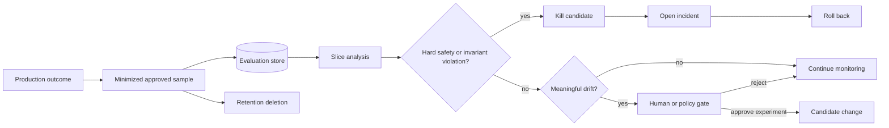
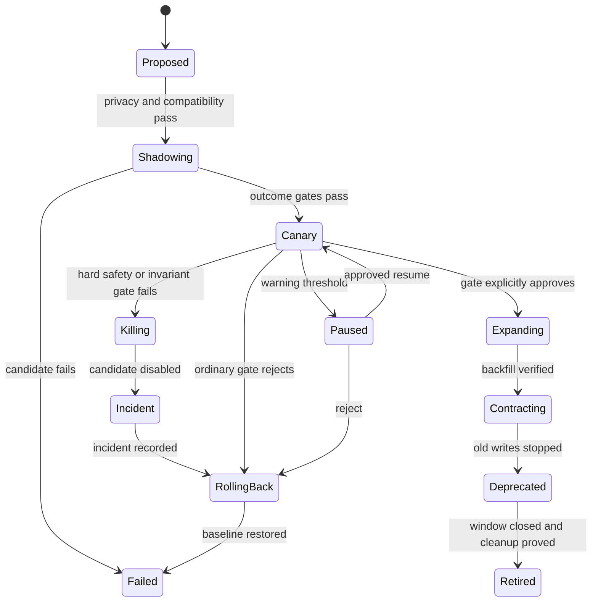
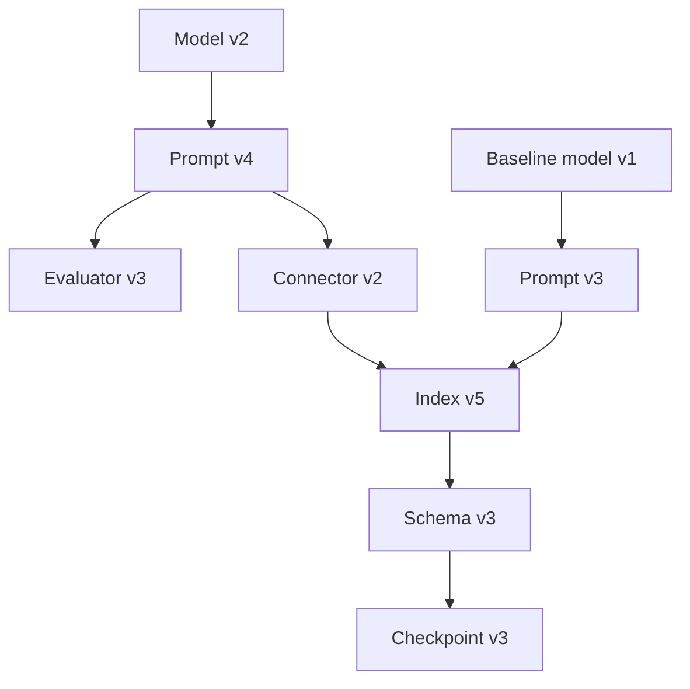

# Chapter 35: Continuous Improvement

> Status: reviewing
> Owner: Agentic System Design maintainers
> Last verified: 2026-09-06

**On this page**

- [Understand the idea](#the-problem): problem, objectives, first pass, picture, and vocabulary
- [Build the mechanism](#how-it-works): how it works, engineering detail, and Python
- [Apply it](#microsoft-implementation): implementation choices, failures, safety, and evaluation
- [Practice and continue](#review-questions): review, exercises, lab, recap, and sources

## The problem

### Changing a bus route

A city wants to improve a bus route while people still depend on the old
stops. It can test a proposed route, tell riders what may change, watch a small
trial, and keep a way back. Removing old signs and schedules comes last.

Production AI systems also change while work continues. A new model can need a
new prompt. A new index can require a backfill. A schema can make old
checkpoints unreadable. Feedback may overrepresent one group or contain data
that was never approved for evaluation.

The analogy stops at the basic migration shape. Software changes involve
concurrent state, hidden dependencies, privacy, tenant and region policy,
credentials, delayed labels, and cleanup that may become irreversible.

The engineering question is not, "How do we update often?" It is:

> How can Northstar detect a real regression, test a candidate without side
> effects, migrate or roll back safely, and prove that retired components are gone?

## Learning objectives

By the end of this chapter, you can:

1. Specify purpose-limited, minimized, retained, and deletion-tested feedback.
2. Detect drift across outcomes, inputs, safety, latency, cost, tenants, and regions.
3. Use a component registry to check model, prompt, evaluator, index, schema, and checkpoint compatibility.
4. Separate shadow traffic from user-visible and consequential effects.
5. Gate canary, backfill, rollback, deprecation, kill, and retirement transitions.
6. Prove that a retired version has no route, credential, job, data copy, or unsupported dependency.

## First pass

A **feedback loop** observes outcomes and uses approved evidence to decide
whether a change should be tested. Feedback is not automatically training data
or even a valid evaluation set.

**Drift** is a measured change from an approved baseline. It can occur in
inputs, retrieval, behavior, quality, safety, latency, cost, capacity, or one
tenant and region slice. An alert starts an investigation. It does not prove
that a candidate is better.

A safe lifecycle moves through named stages with entry and exit evidence.
Shadowing observes a candidate without affecting users. A canary exposes a
small approved slice. Rollback restores the last compatible version. Retirement
removes the old version only after the rollback window and dependencies close.

## Picture the idea

### Governed feedback loop



**Takeaway:** purpose and privacy controls come before analysis. Hard safety
and invariant violations bypass scores and go directly through kill, incident,
and rollback; ordinary drift can lead to explicit approval or rejection.

**Step by step:** Follow approved feedback through hard gates before ordinary drift decisions.

1. Production produces observable outcomes.
2. Only approved, minimized samples enter a separate evaluation store.
3. Analysis compares declared tenant, region, and task slices with a baseline.
4. A hard safety or invariant violation immediately kills the candidate, opens
   an incident, and rolls back; an aggregate score cannot hide it.
5. No meaningful drift continues monitoring.
6. Meaningful drift reaches a human or policy gate, which explicitly approves a
   candidate experiment or rejects it and continues monitoring.
7. Retained samples reach deletion.

### Migration engineering deep dive: a gated state machine



**Takeaway:** every transition requires evidence, and rollback remains possible
until destructive cleanup intentionally closes its window.

**Step by step:** A proposal enters privacy and compatibility
checks before shadowing. A successful shadow can become a small canary. Warning
signals pause it; regression or a kill switch rolls it back. Passing canaries
expand, complete and verify backfill, stop old writes, deprecate the old
version, and retire it only after cleanup proof.

### Compatibility engineering deep dive: a version graph



**Takeaway:** rollback works only when the chosen versions and stored state are compatible.

**Step by step:** The candidate model depends on a candidate
prompt, evaluator, connector, index, schema, and checkpoint representation. The
baseline model follows its own prompt but may share the index. Each edge is a
tested compatibility claim, so changing one node can invalidate rollout or rollback.

## Vocabulary

| Term | Plain-language meaning |
|---|---|
| Feedback loop | A controlled process that uses observed outcomes to inform a candidate change. |
| Sampling | Selecting a defined subset for analysis. |
| Drift | A measured change from an approved baseline. |
| Baseline | The frozen comparison behavior and metrics. |
| Slice | A declared subset, such as task class, tenant, or region. |
| Shadow traffic | Eligible copied or replayed input whose candidate result cannot affect the user. |
| Canary | A small controlled production exposure before wider rollout. |
| Compatibility | Evidence that versions can safely work together. |
| Backfill | Creating the new representation for existing records. |
| Expand-and-contract | Add the new representation, migrate, then remove the old one. |
| Dual-read | Temporarily reading two representations to compare or transition. |
| Dual-write | Temporarily writing two representations under explicit consistency rules. |
| Rollback window | The period during which the prior version can still be restored. |
| Deprecation | Time-bounded notice and compatibility before support ends. |
| Kill switch | Authorized control that disables a risky capability through a tested path. |
| Retirement | Verified removal of a version, route, credential, data copy, and dependency. |
| Orphaned dependency | A supposedly unused component still needed by an undiscovered consumer. |

## How it works

### Govern feedback before collecting it

A feedback specification names purpose, approved basis, fields, minimization,
redaction, sampling, access roles, retention, deletion, expected slices, bias
checks, owners, and incident action. Raw prompts, source bodies, and private
chain-of-thought are not collected by default. Production feedback stays
separate from release evaluation until provenance and use are approved.

Delayed labels require a declared observation window. Missing outcomes are not
silently counted as success. Sample rates are compared across relevant slices
so high-volume or highly engaged users do not define the whole system.

### Detect practical, not merely numerical, change

Monitor task acceptance, citation quality, safety denials, latency, cost,
capacity, retrieval, and evaluator agreement. A monitor defines:

- baseline window and candidate window;
- minimum sample size;
- absolute and relative threshold;
- tenant, region, task, and risk slices;
- false-alarm handling and delayed-label policy;
- owner and action for warning, regression, or invariant violation.

A tiny change can be statistically detectable but operationally irrelevant. A
large apparent change can be noise in a tiny sample. Require both a stated
comparison rule and practical consequence.

### Register versions and relationships

The component registry records model, prompt, policy, evaluator, connector,
index, schema, fixture, checkpoint, routes, credentials, owners, status, and
compatibility edges. A release references an immutable registry snapshot.
Hidden dependencies turn rollback assumptions into production failures.

## Engineering deep dive

### Shadow traffic has no hands

Shadow only approved minimized or synthetic inputs. Candidate outputs go to an
isolated evaluation sink. They cannot publish, notify, write user state, invoke
consequential tools, consume another tenant's budget, or alter the response.
Shadow cost is still charged and bounded.

### Canary gates preserve earlier contracts

A canary checks Chapter 19 quality and safety thresholds, Module 07 reliability
signals, Chapter 33 cost and latency, and Chapter 34 tenant and region rules.
Error budgets may control rollout speed, but they never authorize a safety,
privacy, approval, or isolation violation.

Represent those checks as separate, structured gate outcomes. Evaluate hard
safety and invariant gates before quality or an aggregate score. Pause on
ambiguous warnings and explicitly approve or reject ordinary outcomes. A hard
failure immediately invokes the kill switch, opens an incident, and rolls back
under named authority. Record typed decisions and outcomes, not private model
reasoning.

### Expand, backfill, contract

For a schema or index migration:

1. add a backward-compatible representation;
2. write new data using the reviewed transition rule;
3. backfill old records with checkpoints and counts;
4. verify completeness, authorization, and quality by slice;
5. move reads under canary control;
6. stop old writes;
7. wait through the rollback and retention windows;
8. remove old routes, code, data, jobs, credentials, and alerts.

Dual-read or dual-write adds complexity and is used only when justified.
Destructive cleanup is irreversible, so rollback after that point needs a
separate restoration plan rather than a hopeful route change.

## Build it in Python

This offline Python 3.11 controller uses synthetic, minimized scores, fictional
tenant-region slices, a fake registry, deterministic drift, and no model or
network. Shadow outputs have no effect callback.

```python
from dataclasses import dataclass, field
from enum import Enum


class Stage(str, Enum):
    PROPOSED = "proposed"
    SHADOWING = "shadowing"
    CANARY = "canary"
    EXPANDING = "expanding"
    ROLLING_BACK = "rolling_back"
    FAILED = "failed"
    DEPRECATED = "deprecated"
    RETIRED = "retired"


class GateDecision(str, Enum):
    APPROVE = "approve"
    REJECT = "reject"
    INCIDENT = "incident"


@dataclass(frozen=True)
class GateResults:
    quality_score: float
    quality_minimum: float
    safety_pass: bool
    invariants_pass: bool
    reliability_pass: bool
    latency_pass: bool
    cost_pass: bool
    tenant_region_pass: bool

    def ordinary_gates_pass(self) -> bool:
        return (
            self.quality_score >= self.quality_minimum
            and self.reliability_pass
            and self.latency_pass
            and self.cost_pass
            and self.tenant_region_pass
        )


@dataclass
class Component:
    name: str
    version: str
    compatible_prompt: str
    routed: bool = False
    credential: bool = False
    status: str = "candidate"


@dataclass
class Controller:
    baseline: Component
    candidate: Component
    stage: Stage = Stage.PROPOSED
    effects: list[str] = field(default_factory=list)
    trace: list[str] = field(default_factory=list)

    def start_shadow(self, prompt_version: str, privacy_approved: bool) -> None:
        if not privacy_approved:
            raise PermissionError("feedback_not_approved")
        if self.candidate.compatible_prompt != prompt_version:
            raise ValueError("incompatible_prompt_model")
        self.stage = Stage.SHADOWING
        self.trace.append("shadow_started")

    def shadow(self, scores: tuple[float, ...]) -> float:
        if self.stage != Stage.SHADOWING:
            raise RuntimeError("not_shadowing")
        # Scores are evaluated, but no effect method is reachable here.
        result = sum(scores) / len(scores)
        self.trace.append(f"shadow_score:{result:.2f}")
        return result

    def start_canary(self, gates: GateResults) -> GateDecision:
        decision = self._gate_decision(gates, "shadow")
        if decision != GateDecision.APPROVE:
            return decision
        self.candidate.routed = True
        self.candidate.credential = True
        self.stage = Stage.CANARY
        self.trace.append("canary_started:tenant-a:west")
        return decision

    def canary_result(self, gates: GateResults) -> GateDecision:
        decision = self._gate_decision(gates, "canary")
        if decision == GateDecision.APPROVE:
            self.stage = Stage.EXPANDING
        elif decision == GateDecision.REJECT:
            self._rollback()
        return decision

    def _gate_decision(self, gates: GateResults, phase: str) -> GateDecision:
        # Hard gates are checked first and never folded into the quality score.
        if not gates.safety_pass or not gates.invariants_pass:
            self.trace.append("kill:candidate")
            self.candidate.routed = False
            self.candidate.credential = False
            self.trace.append("incident:opened")
            self._rollback()
            self.trace.append(f"gate_incident:{phase}")
            return GateDecision.INCIDENT
        if not gates.ordinary_gates_pass():
            self.trace.append(f"gate_reject:{phase}")
            return GateDecision.REJECT
        self.trace.append(f"gate_approve:{phase}")
        return GateDecision.APPROVE

    def _rollback(self) -> None:
        self.stage = Stage.ROLLING_BACK
        self.candidate.routed = False
        self.candidate.credential = False
        self.baseline.routed = True
        self.stage = Stage.FAILED
        self.trace.append("rollback_complete")

    def retire(self, component: Component) -> None:
        if component.routed or component.credential:
            raise RuntimeError("retirement_cleanup_incomplete")
        component.status = "retired"
        self.stage = Stage.RETIRED
        self.trace.append(f"retired:{component.name}:{component.version}")


def drift(baseline: tuple[float, ...], current: tuple[float, ...]) -> float:
    if len(baseline) != len(current) or len(baseline) < 3:
        raise ValueError("matched slices and minimum sample required")
    return sum(current) / len(current) - sum(baseline) / len(baseline)


old = Component("report-model", "1", "prompt-3", routed=True, status="active")
new = Component("report-model", "2", "prompt-4")
controller = Controller(old, new)

# A seeded acceptance regression triggers investigation.
change = drift((0.90, 0.88, 0.91), (0.80, 0.79, 0.81))
assert change < -0.05

controller.start_shadow("prompt-4", privacy_approved=True)
shadow_score = controller.shadow((0.91, 0.90, 0.89))
assert controller.effects == []
passing = GateResults(shadow_score, 0.85, True, True, True, True, True, True)
assert controller.start_canary(passing) == GateDecision.APPROVE
assert "gate_approve:shadow" in controller.trace

# Regression test: excellent aggregate quality cannot hide a safety incident.
safety_incident = GateResults(0.99, 0.85, False, True, True, True, True, True)
assert controller.canary_result(safety_incident) == GateDecision.INCIDENT
assert controller.stage == Stage.FAILED
assert old.routed is True and new.routed is False
assert new.credential is False
kill = controller.trace.index("kill:candidate")
incident = controller.trace.index("incident:opened")
rollback = controller.trace.index("rollback_complete")
assert kill < incident < rollback

# Ordinary gates also expose explicit reject and approve outcomes.
rejecting_controller = Controller(old, Component("report-model", "2b", "prompt-4"))
rejecting_controller.start_shadow("prompt-4", privacy_approved=True)
ordinary_reject = GateResults(0.72, 0.85, True, True, True, True, True, True)
assert rejecting_controller.start_canary(ordinary_reject) == GateDecision.REJECT
assert rejecting_controller.candidate.routed is False

approving_controller = Controller(old, Component("report-model", "2c", "prompt-4"))
approving_controller.start_shadow("prompt-4", privacy_approved=True)
assert approving_controller.start_canary(passing) == GateDecision.APPROVE
assert approving_controller.canary_result(passing) == GateDecision.APPROVE
assert approving_controller.stage == Stage.EXPANDING

# A never-routed candidate can be retired after cleanup proof.
controller.retire(new)
assert new.status == "retired"
assert new.routed is False and new.credential is False
print("PASS: drift, hard gates, explicit decisions, rollback, and retirement verified")
```

Expected output:

```text
PASS: drift, hard gates, explicit decisions, rollback, and retirement verified
```

## Microsoft implementation

This chapter does not select a Microsoft product. Its frozen sources contain no
approved claim-level Microsoft product mapping for lifecycle orchestration,
registries, or migration SDKs. Chapter 36 owns final Microsoft synthesis.
Product names, APIs, regional support, quotas, and data handling must not be
asserted without an approved ledger entry and current verification. The domain
registry and migration state machine remain replaceable and vendor-neutral.

## How leading teams approach it

Sutton and Barto describe policies, rewards, and feedback from environment
interaction (SRC-012). This chapter distinguishes those learning concepts from
automatic online learning: Northstar uses governed production change.

Site Reliability Engineering provides durable principles for service levels,
monitoring, automation, incidents, and error budgets (SRC-028). ISO/IEC 42001
offers evolving AI management-system requirements as governance input, not a
compliance declaration (SRC-064). *Hidden Technical Debt in Machine Learning
Systems* documents hidden dependencies and surrounding system risks
(SRC-070). The state machine here is a Northstar engineering synthesis, not a
workflow prescribed by any one source.

## Failure lab

| Seeded failure | Observable evidence | Required response |
|---|---|---|
| Biased sampling | Slice inclusion rates differ materially. | Rebuild or weight the approved sample; do not claim broad improvement. |
| Sensitive trace reuse | Disallowed field reaches evaluation storage. | Block ingestion, delete derived copies, and open the incident path. |
| Evaluator drift | Evaluator agreement changes across versions. | Recalibrate and rerun held-out human review. |
| Incompatible pair | Prompt version lacks a registry edge to model. | Deny shadow and traffic. |
| Partial backfill | Migrated count or hash differs from authorized source. | Pause reads, resume from checkpoint, and verify by slice. |
| Checkpoint mismatch | New runtime cannot decode durable state. | Keep compatible reader or roll back before migration. |
| Late rollback | Old representation was destructively removed. | Use restoration plan; do not claim instant rollback. |
| Region mismatch | Candidate policy differs in recovery region. | Stop rollout and restore approved regional policy. |
| Safety hidden by average | A high quality score accompanies a failed hard safety gate. | Kill, open an incident, and roll back before considering ordinary gates. |
| Retired traffic | Route, job, or credential still reaches old version. | Kill route, revoke credential, investigate, and repeat cleanup proof. |

To reproduce incompatibility, call `start_shadow("prompt-3", True)`. The
expected result is `incompatible_prompt_model`. To reproduce incomplete
retirement, set `new.credential = True` before `retire`; the expected result is
`retirement_cleanup_incomplete`.

## Security and safety testing

The lab proves that shadow evaluation cannot append to `effects`, a hard safety
failure cannot hide inside a high score, kill precedes incident and rollback,
ordinary gates expose approve or reject, and retirement refuses a component
with live access. Extend the suite with synthetic secret markers and assert they
never enter feedback storage or traces. Verify tenant and region on every
sample, route, registry record, and migration job.

Expected blocked or contained results are explicit exceptions, zero shadow
effects, restored baseline routing, no cross-tenant sample, and no traffic or
credential for a retired version. No real personal data, credentials, malware,
or provider traffic is used.

## Evaluation

| Area | Gate |
|---|---|
| Feedback privacy | Only approved minimized fields enter; deletion removes primary and derived copies |
| Representation | Required tenant, region, task, and risk slices meet declared sample floors |
| Drift | Threshold, minimum sample, false-alarm rule, and action are versioned |
| Shadow safety | Zero user-visible writes and consequential tool effects |
| Compatibility | Every routed version tuple has tested registry edges |
| Canary | Quality, safety, reliability, latency, cost, tenant, and region gates pass |
| Rollback | Baseline is restored within the declared window and objectives |
| Backfill | Authorized source and migrated counts, hashes, and slice checks agree |
| Retirement | Zero routes, credentials, jobs, data copies, and unsupported dependencies |

A monitor alert alone is not improvement evidence. Compare the controlled
candidate with the deterministic baseline and current production version. Use
both statistical and practical thresholds, inspect delayed labels, and require
qualified human review for consequential judgments.

## Production checklist

- [ ] Feedback purpose, fields, sampling, access, retention, and deletion are approved.
- [ ] Drift monitors name baseline, slices, thresholds, owners, and actions.
- [ ] Registry versions all components, fixtures, schemas, checkpoints, and compatibility edges.
- [ ] Shadow traffic cannot invoke tools or modify user-visible state.
- [ ] Canary gates preserve quality, safety, operations, cost, tenant, and region thresholds.
- [ ] Migration supports pause, kill, rollback, and deterministic reconciliation.
- [ ] Backfill completeness and checkpoint compatibility are tested.
- [ ] Retirement proves route, credential, data, job, alert, documentation, and dependency cleanup.

### Production implications

Lifecycle controls need separation of duties: change proposer, approver,
operator, privacy owner, and incident authority may differ. Keep immutable
change records linking hypothesis, evidence, affected tenants and regions,
thresholds, observations, decisions, and cleanup.

Run shadow and migration work under quotas from Chapter 33. Preserve home
region, residency, RPO, RTO, and single-writer rules from Chapter 34. A rollback
is only credible while compatible code, data, credentials, and operational
knowledge remain available.

## Review questions

1. Why is production feedback not automatically an evaluation dataset?
2. What makes a drift alert actionable?
3. Why must shadow outputs be unable to call consequential tools?
4. Which compatibility edges determine whether rollback works?
5. When is dual-write justified, and what new failure does it add?
6. What evidence proves retirement rather than deprecation?

## Try it safely

Use index cards for model, prompt, evaluator, index, schema, and checkpoint
versions. Draw compatibility edges. Move a candidate through proposed, shadow,
and canary states only when another person can show the required edge and gate
card. Seed a failed quality card and perform rollback. Remove route and
credential cards before marking a version retired.

## Common misunderstanding

> **Misconception:** production feedback can be reused automatically to improve the model.

Feedback can be sensitive, biased, incomplete, delayed, or collected for a
different purpose. Govern collection and reuse, evaluate representative slices,
and test a candidate behind privacy, compatibility, outcome, and rollback gates.

## Recap and next step

- Feedback needs purpose, minimization, representation, access, and deletion controls.
- Drift starts investigation; it does not prove a candidate is better.
- Compatibility and rollback are properties of a version graph, not one model.
- Shadowing has no user-visible or consequential effects.
- Migration and retirement require measurable gates and complete cleanup proof.

Module 08 now supplies workload economics, tenant and region boundaries, and a
controlled component lifecycle. Chapter 36 can map those requirements to
Microsoft targets without changing the vendor-neutral contracts.

## Design exercise

Northstar must migrate `index-v4/schema-v2` to `index-v5/schema-v3` while
durable reports remain resumable. Design:

1. registry nodes and compatibility edges;
2. expand, backfill, verify, read-canary, and contract stages;
3. tenant and region slicing;
4. checkpoint compatibility and reconciliation;
5. warning, rollback, and kill thresholds;
6. a rollback-window closure decision;
7. retirement evidence and an owner for every item.

Compare dual-read with a maintenance window. State evidence that would make
you choose the simpler option.

## Hands-on lab

Run the fenced controller with Python 3.11. Add an index and schema component,
checkpointed backfill, fictional tenant-region slices, a false alarm, and a
successful candidate after the seeded failed one. Produce
`component_registry.json`, `migration_plan.json`, a privacy-safe feedback
specification, drift-monitor catalog, change record, expected traces, and
retirement checklist in a temporary practice directory. Cleanup is deletion of
that synthetic directory.

## Sources

Only this frozen chapter set is cited:

1. **SRC-012**: Richard S. Sutton and Andrew G. Barto, *Reinforcement Learning:
   An Introduction, Second Edition*. <http://incompleteideas.net/book/the-book-2nd.html>.
   Durable feedback and policy concepts.
2. **SRC-028**: Google, *Site Reliability Engineering*.
   <https://sre.google/sre-book/table-of-contents/>. Durable SLO, monitoring,
   automation, and incident principles.
3. **SRC-064**: ISO, *ISO/IEC 42001:2023*.
   <https://www.iso.org/standard/81230.html>. Evolving management-system
   requirements; this citation is not a compliance declaration.
4. **SRC-070**: NeurIPS, *Hidden Technical Debt in Machine Learning Systems*.
   <https://papers.nips.cc/paper/5656-hidden-technical-debt-in-machine-learning-systems>.
   Durable evidence about hidden dependencies and surrounding system controls.

**Navigation:** [Previous: Chapter 34: Multi-Tenant and Multi-Region Design](34-multi-tenant-multi-region-design.md) | [Module 08 overview](../README.md) | [Next: Chapter 36: Northstar on the Microsoft Stack](../../09-microsoft-synthesis-capstone/chapters/36-northstar-on-microsoft-stack.md)
