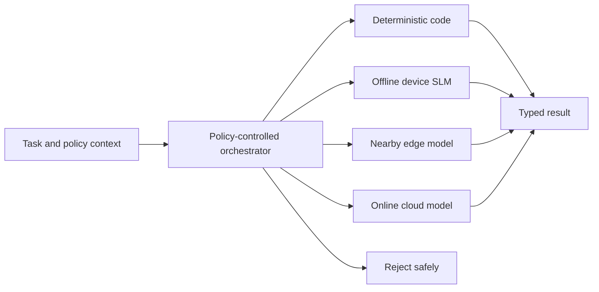
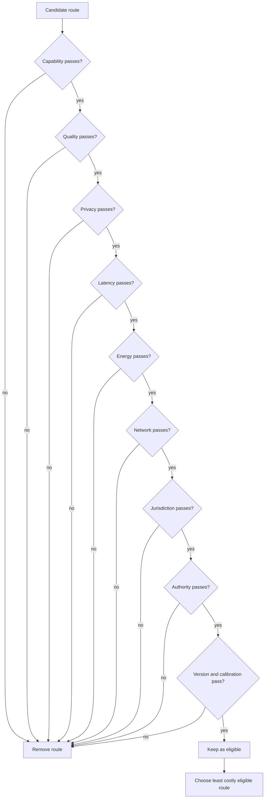
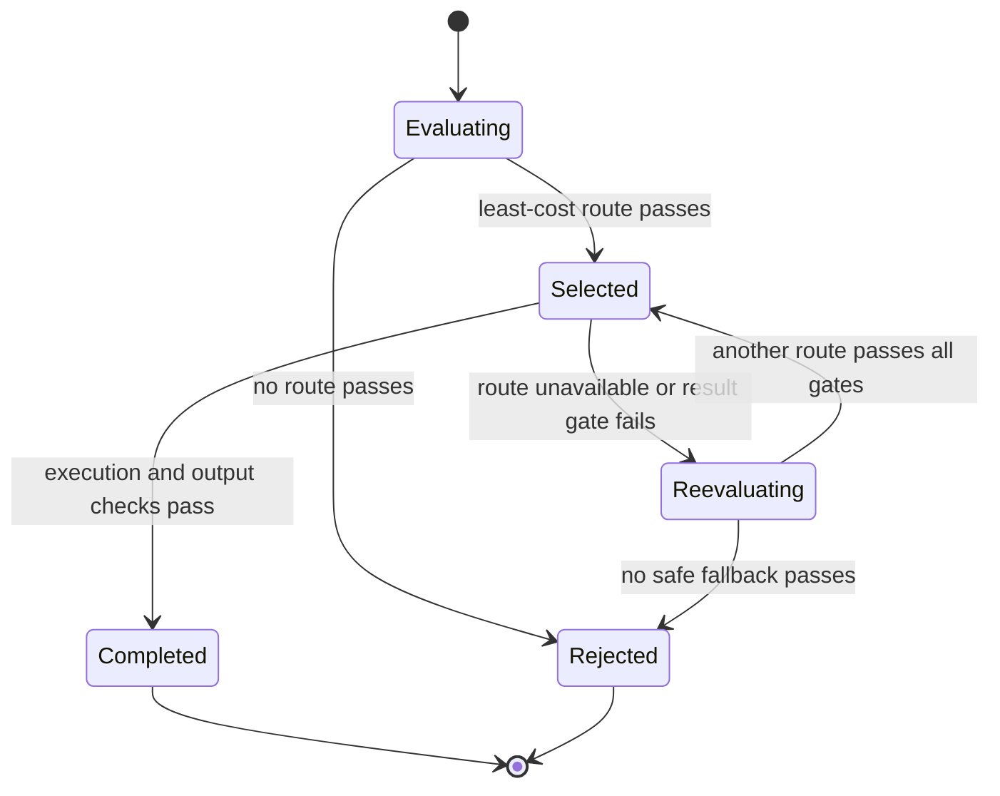

# Chapter 36: Hybrid AI and Model Orchestration

> Status: reviewing
> Owner: Agentic System Design maintainers
> Last verified: 2026-09-06

**On this page**

- [Understand the idea](#the-problem): problem, objectives, first pass, picture, and vocabulary
- [Build the mechanism](#how-it-works): gates, routing, engineering detail, and Python
- [Apply it](#microsoft-implementation): implementation, failures, safety, and evaluation
- [Practice and continue](#review-questions): review, exercises, lab, recap, and sources

## The problem

A field engineer asks an assistant to summarize a restricted maintenance note.
The device has a small local model, a nearby edge server, and access to a large
cloud model when the network works. Sending every request to the cloud may
break privacy or residency rules. Keeping every request on the device may miss
the required quality. Retrying routes without policy may leak the same data
after the first route fails.

The system needs one explicit decision point. A **model orchestrator** (policy
code that chooses an approved execution path for each task) must reject unsafe
paths first, then choose the least costly remaining path. Cost is not only
money. The decision also has to pass capability, quality, privacy, latency,
energy, network, jurisdiction, authority, and version-compatibility gates.

Northstar can use four route classes:

1. deterministic code for work with a precise non-model solution;
2. an offline, on-device small language model;
3. a model on a nearby managed edge computer; and
4. an online cloud model.

Hybrid AI is worse when one fixed route already meets the requirements, when
the routing evidence is weak, or when operating several runtimes costs more
than the saved latency, energy, or provider spend. More routes create more
versions, fallback states, privacy boundaries, and failure combinations.

## Learning objectives

By the end of this chapter, you can:

1. Distinguish a policy-controlled orchestrator from a model gateway.
2. Specify hard routing gates and a least-cost selection rule.
3. Design fallback that rechecks every gate and fails closed when no safe route passes.
4. Trace data movement, authority, calibration, and model-version compatibility.
5. Reproduce cloud, calibration, quality, and privacy failures offline.
6. Compare fixed-cloud, fixed-local, and hybrid strategies with operational metrics.
7. Identify workloads for which hybrid routing adds more risk than value.

## First pass

Think of a school trip. Walking is cheap and private for a short distance. A
bus handles a longer trip. A train handles a route the bus cannot. A teacher
first checks where the class is allowed to go, how soon it must arrive, and who
approved the trip. Only then does the teacher choose among the valid options.
The cheapest ticket is irrelevant if it goes to the wrong place.

The analogy stops at selection. Software routes move data, load model and
tokenizer versions, consume battery or server energy, and produce uncertain
answers. A model score is not a guarantee for one request. A fallback is a new
decision, not permission to bypass the rules that blocked the first path.

A **small language model (SLM)** (a language model designed to use fewer
parameters and computing resources than a large cloud model) can run on a
phone or laptop. An **edge model** (a model running on computing infrastructure
near the user or data source) can offer more capacity without a distant cloud
round trip. An online cloud model can offer capabilities unavailable locally.
A deterministic path uses ordinary code, such as a parser or formula, when the
answer should not depend on model sampling.

The safe rule is simple:

> Filter routes with hard policy and engineering gates. Among the routes that
> remain, choose the least costly one. If none remain, reject the task.

## Picture the idea

### Four execution routes behind one policy decision



**Takeaway:** One policy decision can select code, device, edge, or cloud, but rejection remains a valid result.

**Step by step:**

1. The task arrives with its data class, jurisdiction, authority, and service budgets.
2. The orchestrator evaluates every registered route against those facts.
3. It selects one passing route or returns a typed rejection.
4. The selected route returns a result through the same output contract.

### Gates before optimization



**Takeaway:** Optimization happens only after every hard gate passes; a low price cannot compensate for a policy violation.

**Step by step:**

1. Each candidate starts at the capability gate.
2. A failed gate removes that route and records a reason code.
3. Version and calibration checks stop incompatible or stale candidates.
4. The orchestrator sorts only eligible routes by the declared cost rule.

### Failure, fallback, and fail-closed behavior



**Takeaway:** A fallback repeats policy evaluation with the failed route excluded and rejects when no safe alternative exists.

**Step by step:**

1. Evaluation either rejects or selects the least-cost eligible route.
2. Successful execution completes only after output checks pass.
3. Unavailability or route-quality failure starts a fresh evaluation.
4. The failed route stays excluded, and all gates apply to every fallback.
5. Exhausting safe routes produces a controlled rejection, not an ungoverned cloud call.

## Vocabulary

| Term | Plain-language meaning |
|---|---|
| Hybrid AI | A system that can use more than one execution location or mechanism under explicit policy. |
| Model orchestrator | Policy code that evaluates task requirements and chooses or rejects an execution route. |
| Model gateway | A controlled network boundary that normalizes access, credentials, quotas, and provider calls after a route is chosen. |
| SLM | A small language model designed for lower resource use than a large cloud model. |
| On-device inference | Running a model on the user's device without sending the request to a remote service. |
| Edge inference | Running a model on nearby infrastructure rather than on the user device or a distant cloud region. |
| Deterministic path | Ordinary code that gives the same result for the same valid input. |
| Hard gate | A condition that must pass and cannot be traded against another score. |
| Route | A versioned execution target plus its policy, runtime, and data-movement contract. |
| Fail closed | Reject when required safety evidence or an eligible route is absent. |
| Fallback | A new policy evaluation after a selected route fails. |
| Calibration | Evidence relating a confidence score to observed correctness on a defined evaluation set. |
| Routing drift | A change in route choices or their outcomes relative to an approved baseline. |
| Compatibility | Tested evidence that model, tokenizer, runtime, prompt, input, and output versions work together. |
| Jurisdiction | The legal or organizational territory whose rules apply to data or execution. |
| Authority | The permission held by the caller and orchestrator to use a route for a task. |

## How it works

### Start with a typed task envelope

The orchestrator should receive facts, not infer policy from free text. A task
envelope names the required capability, minimum measured quality, data class,
jurisdiction, caller authority, maximum latency, maximum energy, network state,
and input-contract version. Consequential tasks also carry an approval state.

Do not send the task body to every model to ask which model should handle it.
That design moves data before privacy and jurisdiction checks. Route on
metadata and policy facts first. Send the minimized body only to the selected
target.

### Register complete routes

A route registry records more than a model name. It includes:

- route class and execution location;
- capabilities and measured quality by task slice;
- accepted data classes and jurisdictions;
- required caller authority;
- latency, monetary cost, and energy estimates;
- network requirements and current health;
- model, tokenizer, runtime, prompt, adapter, and schema versions;
- calibration artifact, evaluation-set identifier, age, and limits;
- gateway endpoint or local execution provider; and
- owner, rollout status, and rollback target.

The estimates need uncertainty ranges in production. A single average hides
tail latency, thermal throttling, radio energy, and task-slice failures.

### Evaluate gates in a fixed order

The order makes decisions explainable and avoids needless checks. First reject
a route that cannot perform the capability. Then check the quality floor for
the relevant task slice. Apply privacy before data movement. Check latency and
energy budgets, network state, jurisdiction, authority, compatibility, and
calibration freshness. Teams may put privacy, jurisdiction, and authority
first for defense in depth, but no hard gate may be omitted.

After filtering, rank eligible routes by an approved objective. This chapter
uses monetary cost, then energy, latency, and a stable route name. A production
objective might include amortized device cost or carbon intensity, but weights
must never turn hard policy into a soft preference.

### Execute and validate

The orchestrator emits a route decision containing route ID, registry version,
policy version, gate outcomes, reason codes, and a correlation ID. The model
gateway or local runtime then executes the chosen route. Output validation
checks the typed result, safety invariants, and route-specific quality signal.

On failure, exclude the failed route and reevaluate the original task against
the current policy snapshot. Never change the data class, jurisdiction, caller
authority, or quality floor to make fallback succeed. Cap attempts and total
latency. Reject when no route remains.

## Engineering deep dive

### Orchestrator and gateway are different controls

The orchestrator decides whether and where work may run. A model gateway
enforces access to remote models after that decision. A gateway can normalize
provider APIs, authenticate service identities, apply quotas, meter tokens,
and collect transport telemetry. It does not automatically know the task's
privacy basis, energy budget, device state, or business authority.

Combining both components is possible, but keep the logical contracts
separate. Otherwise a retry policy in the gateway can silently become an
orchestration policy and send data to an unapproved provider or region.

### Uncertainty is evidence, not permission

Uncertainty routing uses a confidence or risk estimate to decide whether a
weaker model should defer to a stronger one. Calibration is limited to the
model version, prompt, decoding settings, task distribution, labels, and time
period tested. A score calibrated on short English questions does not prove
correctness for medical notes or another language.

Reject stale or mismatched calibration artifacts. Monitor reliability diagrams
and error by slice. Use uncertainty as one quality signal, never as a reason to
override privacy, authority, or jurisdiction. Even well-calibrated confidence
describes frequencies over comparable cases; it does not certify one answer.

### Data movement is part of the route

An on-device route can keep request and response bytes local, but telemetry,
crash dumps, model downloads, or cloud-based safety checks may still move data.
An edge route may cross a building, tenant, network, or national boundary. A
cloud route may create provider logs, caches, abuse-monitoring records, or
regional replicas according to its contract.

Document request, retrieved context, embeddings, intermediate artifacts,
response, telemetry, and retained diagnostics separately. Minimize before
transfer, encrypt in transit and at rest, redact logs, and prove deletion where
required. Record policy facts and reason codes rather than private model
reasoning or raw restricted content.

### Version compatibility is a graph

A route is a tested tuple: model, tokenizer, runtime, execution provider,
adapter, prompt, tool schema, input schema, and output schema. Device and edge
runtimes may support different operators, quantization formats, context sizes,
or hardware accelerators. A model file that loads is not proof that outputs
remain acceptable.

Maintain explicit compatibility edges and fixtures. Reject an unknown tuple.
Roll out registry and model changes with shadow tests and canaries. Keep a
compatible rollback set, including downloadable artifacts and local storage
space, until the rollback window closes.

### Observe decisions without exposing data

Useful orchestration telemetry includes task class, policy and registry
versions, eligible routes, per-gate reason codes, chosen route, fallback count,
latency, estimated and measured energy, cost, result status, quality outcome,
model version, device class, network class, and jurisdiction. Use bounded
cardinality and approved coarse slices.

Watch route share, acceptance, wrong-route rate, quality, fallback, and reject
reasons by slice. **Routing drift** is a material change in those decisions or
outcomes relative to an approved baseline. It can come from workload change,
network conditions, thermal throttling, price updates, calibration decay,
model rollout, or a policy bug. Route-share drift is an investigation signal,
not proof of harm by itself. **Route-share drift (a change in the proportion of
tasks sent to each route)** is one measurable form of routing drift.

### Know when hybrid is worse

Prefer one fixed route or deterministic workflow when it meets every gate and
the measured savings from routing are small. Hybrid may be worse when:

- the workload is uniform and one route dominates on all meaningful metrics;
- evaluation labels are too weak to set route-specific quality floors;
- route classification costs more time or energy than it saves;
- device fragmentation makes compatibility and support unmanageable;
- duplicated models exceed storage, update, or memory budgets;
- fallback increases tail latency beyond the service objective;
- multiple jurisdictions or vendors expand the audit surface; or
- the team cannot operate registry, telemetry, incident, and rollback controls.

Complexity needs measured rent. If hybrid does not improve accepted outcomes,
latency, cost, energy, privacy, or resilience enough to pay that rent, remove it.

Set project-specific removal thresholds before rollout. For example, a team may
remove the router when its decision time consumes more than 5 percent of the
latency it saves, fallback pushes p95 beyond the service objective, duplicate
model artifacts exceed the device storage budget, or hybrid fails to improve
cost per accepted task by the minimum declared margin. These are teaching
examples, not universal constants. The workload owner must derive and approve
the actual thresholds from measured baselines.

After hard gates filter the routes, this chapter's deterministic tie-breaker
ranks by cost, then energy, then latency, then route name. The final name sort
does not claim one route is better; it only makes equal measured choices stable.

## Build it in Python

The following Python 3.11 program is self-contained, standard-library only,
offline, and deterministic. It routes synthetic tasks among deterministic,
device, edge, and cloud paths. Hard gates filter candidates. Execution failure
causes a fresh gated decision. No passing route produces `RouteRejected`.

```python
from __future__ import annotations

from dataclasses import dataclass, replace
from math import ceil
from statistics import mean


DATA_RANK = {"public": 0, "internal": 1, "restricted": 2}


class RouteRejected(RuntimeError):
    pass


@dataclass(frozen=True)
class Task:
    task_id: str
    capability: str
    minimum_quality: float
    data_class: str
    maximum_latency_ms: int
    maximum_energy_j: float
    network_available: bool
    jurisdiction: str
    authority: str
    input_version: str = "task-v1"
    expected_route: str = ""


@dataclass(frozen=True)
class Route:
    name: str
    kind: str
    capabilities: frozenset[str]
    quality: dict[str, float]
    maximum_data_rank: int
    latency_ms: int
    cost: float
    energy_j: float
    needs_network: bool
    jurisdictions: frozenset[str]
    authorities: frozenset[str]
    input_versions: frozenset[str]
    calibration_age_days: int
    available: bool = True


@dataclass(frozen=True)
class Decision:
    route: Route
    rejected: dict[str, tuple[str, ...]]


@dataclass(frozen=True)
class Result:
    task_id: str
    route_name: str
    latency_ms: int
    cost: float
    energy_j: float
    fallbacks: int


def failed_gates(task: Task, route: Route, maximum_calibration_age: int) -> tuple[str, ...]:
    failures: list[str] = []
    if task.capability not in route.capabilities:
        failures.append("capability")
    if route.quality.get(task.capability, 0.0) < task.minimum_quality:
        failures.append("quality")
    if DATA_RANK[task.data_class] > route.maximum_data_rank:
        failures.append("privacy")
    if route.latency_ms > task.maximum_latency_ms:
        failures.append("latency")
    if route.energy_j > task.maximum_energy_j:
        failures.append("energy")
    if route.needs_network and not task.network_available:
        failures.append("network")
    if task.jurisdiction not in route.jurisdictions:
        failures.append("jurisdiction")
    if task.authority not in route.authorities:
        failures.append("authority")
    if task.input_version not in route.input_versions:
        failures.append("version")
    if route.kind != "deterministic" and route.calibration_age_days > maximum_calibration_age:
        failures.append("calibration")
    if not route.available:
        failures.append("availability")
    return tuple(failures)


def choose_route(
    task: Task,
    routes: tuple[Route, ...],
    excluded: frozenset[str] = frozenset(),
    maximum_calibration_age: int = 30,
) -> Decision:
    rejected: dict[str, tuple[str, ...]] = {}
    eligible: list[Route] = []
    for route in routes:
        if route.name in excluded:
            rejected[route.name] = ("excluded_after_failure",)
            continue
        failures = failed_gates(task, route, maximum_calibration_age)
        if failures:
            rejected[route.name] = failures
        else:
            eligible.append(route)
    if not eligible:
        reasons = ", ".join(f"{name}:{'/'.join(values)}" for name, values in sorted(rejected.items()))
        raise RouteRejected(f"{task.task_id}: no safe route; {reasons}")
    selected = min(eligible, key=lambda item: (item.cost, item.energy_j, item.latency_ms, item.name))
    return Decision(selected, rejected)


def execute(
    task: Task,
    routes: tuple[Route, ...],
    injected_failures: dict[tuple[str, str], str] | None = None,
) -> Result:
    failures = injected_failures or {}
    excluded: set[str] = set()
    total_latency = 0
    total_cost = 0.0
    total_energy = 0.0
    attempts = 0
    while attempts < len(routes):
        decision = choose_route(task, routes, frozenset(excluded))
        route = decision.route
        attempts += 1
        total_latency += route.latency_ms
        total_cost += route.cost
        total_energy += route.energy_j
        failure = failures.get((task.task_id, route.name))
        if failure in {"offline", "route_quality"}:
            excluded.add(route.name)
            continue
        return Result(
            task.task_id,
            route.name,
            total_latency,
            total_cost,
            total_energy,
            attempts - 1,
        )
    raise RouteRejected(f"{task.task_id}: fallback budget exhausted")


ROUTES = (
    Route(
        "deterministic",
        "deterministic",
        frozenset({"structured_sum"}),
        {"structured_sum": 1.0},
        2,
        2,
        0.0,
        0.01,
        False,
        frozenset({"US", "EU"}),
        frozenset({"reader", "operator"}),
        frozenset({"task-v1"}),
        0,
    ),
    Route(
        "device-slm",
        "device",
        frozenset({"summarize"}),
        {"summarize": 0.79},
        2,
        35,
        0.001,
        1.8,
        False,
        frozenset({"US", "EU"}),
        frozenset({"reader", "operator"}),
        frozenset({"task-v1"}),
        7,
    ),
    Route(
        "edge-model",
        "edge",
        frozenset({"summarize", "classify"}),
        {"summarize": 0.89, "classify": 0.91},
        1,
        70,
        0.006,
        3.2,
        True,
        frozenset({"US", "EU"}),
        frozenset({"reader", "operator"}),
        frozenset({"task-v1"}),
        10,
    ),
    Route(
        "cloud-model",
        "cloud",
        frozenset({"summarize", "classify", "reason"}),
        {"summarize": 0.96, "classify": 0.97, "reason": 0.95},
        1,
        180,
        0.03,
        8.0,
        True,
        frozenset({"US"}),
        frozenset({"operator"}),
        frozenset({"task-v1"}),
        12,
    ),
)


TASKS = (
    Task("t1", "structured_sum", 1.0, "restricted", 20, 0.1, False, "EU", "reader", expected_route="deterministic"),
    Task("t2", "summarize", 0.75, "restricted", 80, 3.0, False, "EU", "reader", expected_route="device-slm"),
    Task("t3", "classify", 0.85, "internal", 300, 12.0, True, "US", "operator", expected_route="edge-model"),
    Task("t4", "reason", 0.93, "internal", 250, 10.0, True, "US", "operator", expected_route="cloud-model"),
    Task("t5", "summarize", 0.90, "internal", 250, 10.0, True, "US", "operator", expected_route="cloud-model"),
)


def percentile_95(values: list[float]) -> float:
    ordered = sorted(values)
    return ordered[max(0, ceil(0.95 * len(ordered)) - 1)] if ordered else 0


def evaluate(strategy: str, failures: dict[tuple[str, str], str] | None = None) -> dict[str, float]:
    route_sets = {
        "fixed_cloud": tuple(route for route in ROUTES if route.name == "cloud-model"),
        "fixed_local": tuple(route for route in ROUTES if route.name == "device-slm"),
        "hybrid": ROUTES,
    }
    results: list[Result] = []
    rejected = 0
    for task in TASKS:
        try:
            results.append(execute(task, route_sets[strategy], failures if strategy == "hybrid" else None))
        except RouteRejected:
            rejected += 1
    expected = {task.task_id: task.expected_route for task in TASKS}
    wrong = sum(result.route_name != expected[result.task_id] for result in results)
    accepted = len(results)
    return {
        "acceptance_rate": accepted / len(TASKS),
        "p95_latency_ms": float(percentile_95([result.latency_ms for result in results])),
        "cost_per_accepted": sum(result.cost for result in results) / accepted if accepted else 0.0,
        "energy_estimate_j": sum(result.energy_j for result in results),
        "fallback_rate": sum(result.fallbacks > 0 for result in results) / len(TASKS),
        "wrong_route_rate": wrong / accepted if accepted else 0.0,
        "rejected": float(rejected),
    }


# Security test: restricted data must never reach the disallowed cloud route.
restricted = TASKS[1]
restricted_decision = choose_route(restricted, ROUTES)
assert restricted_decision.route.name == "device-slm"
assert "privacy" in restricted_decision.rejected["cloud-model"]
try:
    execute(restricted, ROUTES, {("t2", "device-slm"): "offline"})
    raise AssertionError("restricted data must not fall back to cloud")
except RouteRejected as error:
    assert "cloud-model" in str(error) and "privacy" in str(error)

# Failure injection 1: the only capable cloud route is offline, so fail closed.
try:
    execute(TASKS[3], ROUTES, {("t4", "cloud-model"): "offline"})
    raise AssertionError("offline cloud should not succeed")
except RouteRejected:
    pass

# Failure injection 2: stale device calibration removes the private local route.
stale_routes = tuple(
    replace(route, calibration_age_days=90) if route.name == "device-slm" else route
    for route in ROUTES
)
try:
    choose_route(restricted, stale_routes)
    raise AssertionError("stale calibration should leave no safe route")
except RouteRejected as error:
    assert "calibration" in str(error)

# Failure injection 3: an edge quality failure falls back to eligible cloud.
fallback = execute(TASKS[2], ROUTES, {("t3", "edge-model"): "route_quality"})
assert fallback.route_name == "cloud-model" and fallback.fallbacks == 1

evaluation_failure = {("t3", "edge-model"): "route_quality"}
for name in ("fixed_cloud", "fixed_local", "hybrid"):
    metrics = evaluate(name, evaluation_failure)
    print(name, {key: round(value, 4) for key, value in metrics.items()})

print("PASS: gates, fail-closed behavior, fallback, privacy, and evaluation verified")
```

The exact metric values are deterministic for this synthetic fixture. The key
result is the final line:

```text
PASS: gates, fail-closed behavior, fallback, privacy, and evaluation verified
```

## Microsoft implementation

As verified on 2026-09-06, ONNX Runtime GenAI is an official Microsoft
repository for generative AI execution with documented model builders,
runtime APIs, and execution-provider options (SRC-111, volatile). Execution
providers connect ONNX Runtime to supported hardware backends. Its repository
also documents benchmark fields useful for comparing prompt processing,
token generation, memory, and device configurations. Exact supported models,
operators, hardware, APIs, and benchmark commands can change, so verify the
current repository and release notes before implementation.

Use a provider-neutral `Route` and `Task` contract like the Python example.
An on-device or edge adapter can invoke a tested ONNX Runtime GenAI model
bundle. A cloud adapter can invoke an approved managed endpoint through a model
gateway. Keep route policy outside both adapters. Pin model, tokenizer,
runtime, execution-provider, prompt, and schema versions in the registry.

Microsoft product selection is deployment-specific. Do not infer that every
model, accelerator, region, or data class is supported merely because a common
runtime API exists. Verify service availability, regional processing,
identity, networking, logging, quotas, content controls, and data-retention
terms at release time. Product features do not replace application authority,
quality evaluation, or fail-closed routing.

## How leading teams approach it

The approved sources support bounded claims, not a universal winning router:

- **RouteLLM** reports preference-data routing between two language models and
  studies cost-quality tradeoffs on its evaluated tasks (SRC-103, 2024,
  evolving). It is evidence that learned routing can reduce use of a stronger
  model under tested conditions. It does not establish privacy, edge, energy,
  authority, or multi-route production controls.
- The **Phi-3 Technical Report** describes a 3.8B-parameter model intended for
  phone-class deployment and reports selected benchmarks (SRC-104, 2024,
  evolving). Benchmark results and reported device feasibility do not prove
  fitness for a specific device, task, language, safety boundary, or thermal
  envelope.
- **MobileLLM** studies architecture choices for sub-billion-parameter models
  intended for resource-constrained devices (SRC-105, 2024, evolving). It
  supports the feasibility of specialized on-device model design, not the
  claim that smaller always means cheaper or better end to end.
- **Confident or Seek Stronger** evaluates uncertainty-based routing across
  more than 1,500 tested settings and analyzes when a weaker model should defer
  (SRC-106, 2025, evolving). Its breadth strengthens empirical evidence for
  uncertainty routing while also reinforcing that calibration depends on the
  tested models, tasks, scores, and distributions.
- **CR^2** proposes device-edge routing across latency, energy, and risk
  objectives (SRC-107, 2026, evolving preprint). Treat its results as recent
  preprint evidence for the reported setup, not a settled production standard.
- **ONNX Runtime GenAI** provides evolving implementation evidence about local
  and cloud-capable execution-provider surfaces and benchmark fields
  (SRC-111, volatile). Repository capabilities can change between releases.

The hard-gate sequence, typed rejection, authority model, compatibility graph,
and four-route Northstar design are this chapter's engineering synthesis. No
single source prescribes the whole architecture.

## Failure lab

Run the fenced Python program unchanged, then inspect its three seeded faults.
All data and route records are synthetic.

| Injection | What happens | Evidence | Correct response |
|---|---|---|---|
| Cloud offline | The only route capable of `reason` fails during execution. | `RouteRejected` after cloud exclusion | Reject; do not lower quality or invent a local route. |
| Stale calibration | Device calibration age changes from 7 to 90 days. | Rejection text contains `calibration`; cloud and edge remain privacy-blocked or incapable. | Re-evaluate the exact model and task slice before restoring eligibility. |
| Route-quality failure | The selected edge result fails its output quality gate. | Cloud is selected with `fallbacks == 1`. | Record the failed route, repeat every gate, and include both attempts in latency and energy. |

Diagnosis proceeds in order:

1. Confirm the task envelope and policy snapshot did not change during fallback.
2. Inspect reason codes for every rejected route.
3. Confirm the failed route was excluded rather than immediately retried.
4. Confirm latency and energy include failed attempts.
5. Confirm no fallback crossed privacy, jurisdiction, or authority boundaries.
6. Correct availability, calibration, or quality evidence, then rerun the same fixture.

A measurable correction restores a route only when its calibration is within
the 30-day fixture limit or its measured quality meets the unchanged floor.
Changing the threshold merely to make the test pass is not a correction.

## Security and safety testing

The realistic boundary failure is a retry that sends restricted content to a
cloud route after a device failure. The offline security test prevents that
without using real content or credentials:

```python
restricted = TASKS[1]
decision = choose_route(restricted, ROUTES)
assert decision.route.name == "device-slm"
assert "privacy" in decision.rejected["cloud-model"]
try:
    execute(restricted, ROUTES, {("t2", "device-slm"): "offline"})
    raise AssertionError("restricted data must not fall back to cloud")
except RouteRejected as error:
    assert "cloud-model" in str(error) and "privacy" in str(error)
```

The expected blocked result is explicit: the cloud candidate has a `privacy`
failure and cannot be selected. The injected device failure must reject because
fallback does not widen the cloud data allowance.
Evidence consists of the typed rejection, per-route reason codes, zero cloud
execution attempts, and a telemetry record containing no task body.

Also test synthetic cases for cross-jurisdiction routing, insufficient caller
authority, an unknown input version, malicious registry modification, and
telemetry containing a planted secret marker. Fail the build if a disallowed
route executes or the marker enters logs. Keep route policy signed or otherwise
integrity-protected, restrict changes by role, and audit policy publication.

## Evaluation

Compare the router with simple baselines on the same frozen task set. A fixed
cloud strategy tries only the cloud route. A fixed local strategy tries only
the device SLM. Hybrid uses all registered routes and the same hard gates.
Do not count policy rejection as a model error, but report it in acceptance.

| Metric | Definition | Why it matters |
|---|---|---|
| Acceptance rate | Tasks completed through an eligible route divided by all submitted tasks | Reveals whether policy and capability permit useful work. |
| p95 latency | The nearest-rank 95th percentile of end-to-end latency for accepted tasks | Exposes slow tails and fallback penalties. |
| Cost per accepted | Total route monetary cost divided by accepted tasks | Prevents cheap rejection from looking efficient. |
| Energy estimate | Sum of route energy estimates, including failed attempts | Compares device, edge, radio, and cloud assumptions. |
| Fallback rate | Tasks requiring at least one second route divided by all tasks | Tracks instability and hidden tail cost. |
| Wrong-route rate | Accepted tasks whose final route differs from the frozen expected route divided by accepted tasks | Detects policy or registry routing errors. |

The expected route is the least-cost route known to pass the frozen fixture,
not a label produced by the router under test. Review disagreements rather
than assuming the label is perfect. Add outcome quality by task slice,
calibration error, privacy violations, reject-reason distribution, and route
share to a production evaluation.

Set release thresholds before running the comparison. One example is: zero
privacy, jurisdiction, authority, and version violations; hybrid acceptance no
worse than the best compliant fixed baseline; p95 within its service objective;
lower cost per accepted or energy at equal quality; fallback below 5 percent;
and wrong-route rate below 1 percent. The tiny teaching fixture demonstrates
calculation, not statistically defensible threshold compliance.

Evaluate trajectory as well as outcome. Verify the original policy snapshot,
gate sequence, selected route, attempts, output checks, and final state. Repeat
by device class, thermal state, network class, jurisdiction, data class,
language, task difficulty, and model version. Run long enough to detect routing
drift and confidence decay.

## Production checklist

- [ ] Task envelopes carry capability, quality, data, latency, energy, network, jurisdiction, authority, and version facts.
- [ ] Hard gates cannot be traded against price or an aggregate score.
- [ ] Deterministic code is preferred when it precisely solves the task.
- [ ] Orchestrator and model-gateway responsibilities are explicit.
- [ ] Data movement is documented for requests, context, outputs, telemetry, caches, and diagnostics.
- [ ] Route tuples pin model, tokenizer, runtime, provider, prompt, adapter, and schemas.
- [ ] Calibration artifacts name evaluation set, slice, version, age, and known limits.
- [ ] Fallback excludes failed routes, repeats all gates, and has attempt and time budgets.
- [ ] No eligible route produces a typed fail-closed rejection.
- [ ] Telemetry uses reason codes and redaction rather than raw content or private reasoning.
- [ ] Route share, quality, acceptance, rejects, latency, cost, energy, fallback, and wrong routes are monitored by approved slice.
- [ ] Registry and policy publication have integrity, authorization, audit, rollout, and rollback controls.
- [ ] Fixed-route baselines show that hybrid complexity earns measurable value.
- [ ] Device storage, memory, thermal, battery, update, and offline recovery behavior are tested.
- [ ] Incident playbooks cover cloud outage, stale calibration, bad rollout, policy corruption, and privacy breach.

## Review questions

1. Why must privacy be checked before sending a prompt to a route classifier?
2. What decision belongs to an orchestrator but not automatically to a gateway?
3. Why is fallback a new policy evaluation rather than a provider retry?
4. What does a calibrated confidence score fail to guarantee?
5. Which artifacts make two deployments of the same named model incompatible?
6. How can route-share drift occur without a router code change?
7. When would a fixed local or fixed cloud design be safer than hybrid?
8. Why is cost per submitted task a misleading metric when rejection rates differ?

## Try it safely

Make four route cards labeled deterministic, device, edge, and cloud. On each,
write capabilities, maximum data class, latency, energy, network need,
jurisdiction, authority, quality, and cost. Make five synthetic task cards.

For each task, cross out routes one gate at a time. Circle the least costly
remaining route. Then mark that route unavailable and repeat without changing
the task card. If no route remains, write `REJECT`. Compare decisions with a
partner and resolve differences by pointing to a specific gate, not intuition.

## Common misunderstanding

> **Misconception:** hybrid AI means sending easy tasks to a small model and hard tasks to a large model.

Difficulty is only one possible signal. A hard task may have to remain on a
device because its data is restricted. An easy sum should use deterministic
code. A cloud model may be too slow, unavailable, outside the jurisdiction, or
beyond the caller's authority. Hybrid AI is governed route selection across
different mechanisms and locations, not merely model-size escalation.

## Recap and next step

- Filter with hard gates before optimizing cost.
- Treat deterministic, device, edge, and cloud execution as versioned routes.
- Keep the policy orchestrator logically separate from the model gateway.
- Recheck every gate on fallback and reject when no safe route passes.
- Measure acceptance, quality, latency, cost, energy, fallback, wrong routes, and drift.
- Remove hybrid complexity when a fixed compliant route performs as well.

Chapter 37 examines performance, energy, and thermal engineering in greater
depth. Its measurements turn route estimates into device-class budgets and
show how sustained workloads change latency, battery use, and eligibility.

## Design exercise

Design routing for an emergency-response tablet with these constraints:

- restricted incident notes must remain on the device;
- public map classification may use an in-country edge site;
- cloud reasoning is available only to incident commanders;
- the tablet may be offline for six hours;
- battery reserve must remain above 25 percent;
- a deterministic parser handles standardized supply codes; and
- device model updates can be delayed across hardware generations.

Produce a task envelope, route registry, ordered gate policy, compatibility
graph, data-movement table, fallback state machine, telemetry schema, and
evaluation plan. Compare three defensible options: device-first hybrid,
edge-first hybrid, and fixed device plus deterministic code. State the evidence
that would cause you to choose the simpler design.

## Hands-on lab

1. Save the fenced program as `hybrid_router.py` in a temporary practice directory.
2. Run `python hybrid_router.py` with Python 3.11 or later; no packages or network are required.
3. Confirm the final `PASS` line and retain the three printed metric dictionaries as the expected trace.
4. Change only one task field at a time and predict the rejected gate before running it.
5. Inject device unavailability for `t2` and prove that restricted data fails closed.
6. Add a `task-v2` input without adding a compatibility edge and confirm `version` rejection.
7. Add a synthetic telemetry collector and assert that a planted marker from a task body is absent.
8. Write the fixed-cloud, fixed-local, and hybrid results to a comparison table.
9. Restore the original fixture and rerun it to prove deterministic cleanup.
10. Delete the temporary practice directory; the lab creates no remote resources.

Expected tests are the assertions embedded in the program. The expected trace
contains one offline-cloud rejection, one stale-calibration rejection, one
quality-triggered edge-to-cloud fallback, a privacy reason for the cloud route,
three metric dictionaries, and the final `PASS` line.

## Sources

Only these planned sources are used for this chapter:

1. **SRC-103**: RouteLLM, arXiv:2406.18665, 2024.
   <https://arxiv.org/abs/2406.18665>. Evolving empirical evidence about
   preference routing and cost-quality tradeoffs between two models.
2. **SRC-104**: *Phi-3 Technical Report*, arXiv:2404.14219, 2024.
   <https://arxiv.org/abs/2404.14219>. Evolving report of a phone-capable 3.8B
   model and selected benchmarks; deployment and benchmark generality are limited.
3. **SRC-105**: *MobileLLM: Optimizing Sub-billion Parameter Language Models for On-Device Use Cases*, arXiv:2402.14905, 2024.
   <https://arxiv.org/abs/2402.14905>. Evolving architecture evidence for
   sub-billion-parameter on-device models.
4. **SRC-106**: *Confident or Seek Stronger: Exploring Uncertainty-Based On-device LLM Routing From Benchmarking to Generalization*, arXiv:2502.04428, 2025.
   <https://arxiv.org/abs/2502.04428>. Evolving routing evidence across more
   than 1,500 reported settings, with calibration and generalization limits.
5. **SRC-107**: CR^2, arXiv:2605.12001, 2026.
   <https://arxiv.org/abs/2605.12001>. Evolving preprint evidence about
   device-edge routing across latency, energy, and risk objectives.
6. **SRC-111**: Microsoft, ONNX Runtime GenAI official repository.
   <https://github.com/microsoft/onnxruntime-genai>. Volatile implementation
   source for execution providers, on-device and cloud-capable runtimes, and
   benchmark fields; verify the current release before use.

**Navigation:** [Previous: Chapter 35: Continuous Improvement](../../08-scale-economics-lifecycle/chapters/35-continuous-improvement.md) | [Module 09 overview](../README.md) | [Next: Chapter 37: Performance, Energy, and Thermal Engineering](37-performance-energy-thermal-engineering.md)