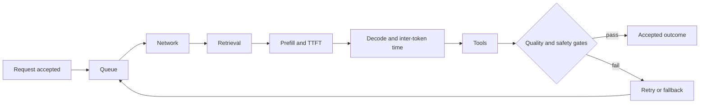
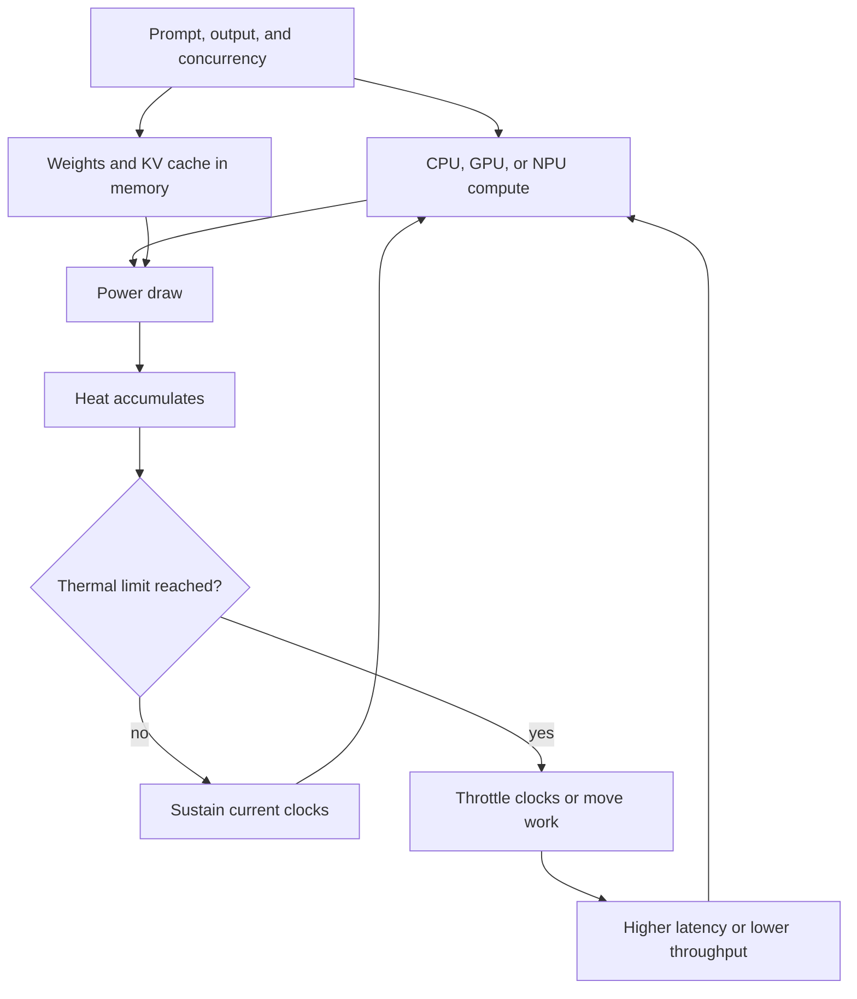
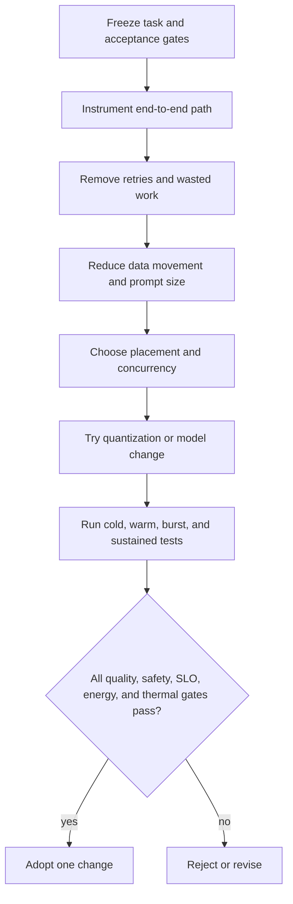

# Chapter 37: Performance, Energy, and Thermal Engineering

> Status: reviewing
> Owner: maintainers
> Last verified: 2026-09-06

**On this page**

- [Understand the idea](#the-problem): useful speed, end-to-end delay, and device limits
- [Build the mechanism](#how-it-works): measurement, thermal behavior, and deterministic Python
- [Apply it](#microsoft-implementation): implementation choices, failure, safety, and evaluation
- [Practice and continue](#review-questions): questions, exercises, lab, recap, and sources

## The problem

### The fast first lap

A phone runs Northstar's local model quickly during a short demonstration. Ten
minutes later, the same request is slower, the case feels warm, and the battery
has dropped noticeably. A server test reports excellent tokens per second, but
users still wait because retrieval, tools, and a queue dominate the task. Both
tests measured something real. Neither measured the accepted user outcome.

Performance engineering asks how long useful work takes. Energy engineering
asks how much energy that useful work consumes. Thermal engineering asks
whether the device can keep doing it after heat accumulates. These are one
system problem because processors turn electrical energy into work and heat.

Northstar needs a benchmark that follows a task from admission through queue,
network, retrieval, model prefill, model decode, tools, and evaluation. It must
compare cold and warm runs, short bursts and sustained runs, representative
devices and networks, and only count an outcome after quality and safety gates
accept it.

This chapter extends the observability and service-level objective (SLO, a
measurable reliability target) practices from Chapter 30. It also uses Chapter
33's workload and full-cost model. It does not repeat telemetry design,
incident response, general queuing theory, or cloud cost allocation.

## Learning objectives

By the end of this chapter, you can:

1. Decompose end-to-end latency into queue, network, retrieval, prefill,
   decode, and tool time.
2. Report p50, p95, p99, throughput, concurrency, saturation, time to first
   token, inter-token latency, memory, energy, temperature, and acceptance.
3. Explain how CPU, GPU, NPU, memory, quantization, and the key-value cache
   affect latency, energy, quality, and device compatibility.
4. Distinguish cold from warm runs and burst from sustained performance.
5. Calculate energy and full cost per accepted task, including idle work,
   retries, and fallback.
6. Apply a controlled optimization order without weakening quality or safety.
7. Test thermal throttling, device variation, and resource-exhaustion controls
   with deterministic offline fixtures.

## First pass

### Measure the whole trip

Imagine timing a trip to school. Timing only the moving bus ignores waiting at
the stop, traffic, and the walk at each end. Reporting only model tokens per
second makes the same mistake.

An AI task can wait in a queue, cross a network, retrieve documents, process
its prompt, generate tokens, call tools, and pass an evaluator. **End-to-end
latency** is the time from accepted request to final accepted result. **Time to
first token**, or TTFT, is the wait until generation begins. **Inter-token
latency** is the delay between generated tokens. A fast inter-token rate can
feel responsive, but it cannot erase a long queue or a slow failed attempt.

The trip analogy stops where computer hardware becomes stateful. A processor
can heat up, reduce its own speed, evict cached data, share memory bandwidth,
or switch power modes. Two devices sold under one product name can also have
different memory, cooling, battery age, software, and background load.

### Count accepted tasks

The useful denominator is an **accepted task**: a completed task that passes
frozen quality and safety gates. If a faster model creates more failed answers,
retries, or cloud fallbacks, its tokens can be faster while accepted outcomes
become slower and more expensive.

$$
energy\ per\ accepted\ task =
\frac{total\ measured\ energy}{accepted\ task\ count}
$$

If the accepted count is zero, the benchmark fails. It must not report zero or
hide the result behind an undefined average.

## Picture the idea

### End-to-end latency has several clocks



**Takeaway:** model generation is one part of the user-visible path, and failed
attempts add another trip through some or all of it.

**Step by step:** A request first waits for capacity. It may cross a
network and retrieve context. Prefill processes the prompt and ends when the
first generated token appears. Decode produces later tokens. Tools add their
own service time. Quality and safety gates either accept the result or send
the task to a bounded retry or fallback path. The final clock includes every
step taken before acceptance.

### Load, memory, power, and heat form a loop



**Takeaway:** a configuration that wins a short burst can lose after heat
forces lower clocks or less favorable placement.

**Step by step:** Prompt length, output length, and concurrency determine
compute and memory traffic. Model weights and the key-value cache occupy
memory. Compute and memory consume power, which becomes heat. Below the
thermal limit, the device can sustain its operating point. Above it, hardware
or the operating system reduces clocks, power, or accelerator use. Latency
rises or throughput falls, which changes how long resources remain active.

### Optimize through controlled gates



**Takeaway:** remove avoidable work before tuning hardware, then adopt one
change only after outcome and sustained-device gates pass.

**Step by step:** First freeze the representative tasks and acceptance
rules. Instrument the whole path. Remove retries, duplicate retrieval, and
unused output. Reduce unnecessary prompt and data movement. Then tune
placement and concurrency. Quantization or a model change comes later because
it can alter quality. Re-run cold, warm, burst, and sustained cases. Adopt the
single change only when every declared gate passes.

## Vocabulary

| Term | Plain-language meaning |
|---|---|
| End-to-end latency | Time from request acceptance to the final accepted outcome. |
| TTFT | Time to first token, measured from model-request start until the first output token. |
| Prefill | Processing the input prompt and building model state before generation. |
| Decode | Generating output tokens after prefill. |
| Inter-token latency | Time between successive generated tokens. |
| Percentile | A boundary below which a stated fraction of observations falls. |
| p50, p95, p99 | The 50th, 95th, and 99th percentile values. |
| Throughput | Completed or accepted work per unit of time. |
| Concurrency | Work items executing at the same time. |
| Saturation | A condition where a limiting resource is fully occupied and added load creates delay. |
| CPU | Central processing unit, a general-purpose processor. |
| GPU | Graphics processing unit, a processor suited to wide parallel numerical work. |
| NPU | Neural processing unit, specialized hardware for supported neural-network operations. |
| Quantization | Storing or computing numbers with fewer bits to reduce memory or work, with possible quality loss. |
| KV cache | Key-value cache, stored attention state reused while decoding later tokens. |
| Working set | Memory actively needed by the model, runtime, cache, and request. |
| Cold run | A run before model, code, or data caches are warm. |
| Warm run | A run after declared initialization and cache warmup. |
| Burst performance | Performance during a short interval before sustained limits necessarily appear. |
| Sustained performance | Performance maintained over a declared longer duration and thermal state. |
| Thermal throttling | Automatic performance reduction used to keep temperature or power within a limit. |
| Energy per accepted task | Total benchmark energy divided by outcomes that pass quality and safety gates. |

## How it works

### Decompose the path before aggregating it

For task $i$, record components with one clock and one trace identifier:

$$
L_i = L_{queue} + L_{network} + L_{retrieval} + L_{prefill}
    + L_{decode} + L_{tools} + L_{evaluation}
$$

TTFT for the model request normally includes model-side queue and prefill, but
teams must state the exact boundary. End-to-end TTFT may also include earlier
network and retrieval. Do not compare two TTFT values until their start and
stop events match.

Decode time depends on generated-token count, so report both total decode time
and inter-token latency. Also retain prompt tokens, output tokens, tool calls,
retry count, route, device, accelerator, thermal state, and network state.

### Read percentiles together

Sort repeated samples and report p50, p95, and p99 with sample count and test
window. p50 describes a typical observation. p95 and p99 expose tail delay
that an average can hide. A tiny deterministic lab can verify calculations,
but it cannot estimate a production p99 with useful confidence.

Throughput needs a numerator. Generated tokens per second measures decode.
Completed tasks per second measures workflow capacity. Accepted tasks per
second measures useful capacity. Report all three only when each answers a
real decision.

### Concurrency has a knee

Increasing concurrency can fill idle accelerator capacity and raise
throughput. Beyond the **saturation knee** (the load where an important
resource becomes fully occupied), queue time and tail latency rise sharply.
The limiting resource may be compute, memory capacity, memory bandwidth,
thermal headroom, a network, or a downstream tool. More workers do not repair
a saturated dependency.

### Cold, warm, burst, and sustained are separate experiments

A cold run includes model loading, graph compilation, memory allocation, and
empty caches. A warm run excludes only the initialization steps declared in
the protocol. Warmup samples are executed and recorded but excluded from the
measured percentile set.

A burst test answers whether brief demand can meet a target. A sustained test
continues long enough for temperature, power policy, garbage collection, and
cache pressure to stabilize. Record initial, maximum, and final temperature,
ambient conditions when available, external power state, and cooling mode.

## Engineering deep dive

### CPU, GPU, and NPU are placement choices

A CPU offers broad operator support and predictable control logic but may
decode large models slowly. A GPU can provide high parallel throughput, yet
moving tensors to it and keeping its memory fed costs time and energy. An NPU
can be efficient for supported graphs and numeric formats, but unsupported
operators may fall back to CPU. A split graph can be slower than one fully
supported placement because transfers and synchronization dominate.

Measure the actual execution provider and fallback operators. Hardware labels
alone do not prove where every operation ran.

### Memory can be the real limit

The working set includes weights, runtime buffers, prompt state, the KV cache,
and concurrent requests. KV-cache use grows with context length, generated
tokens, layers, representation size, and active sequences. When the working
set exceeds fast memory, allocation can fail or data can spill across a slower
boundary. Latency and energy can then jump rather than degrade smoothly.

Test short and long prompts separately. Report peak resident memory and the
point where concurrency or context causes allocation failure, eviction, or
fallback. Do not use average memory as the admission limit.

### Quantization trades several things at once

Quantization can reduce weight size, memory traffic, and energy. It can also
change output quality, require device-specific kernels, add conversion work,
or move unsupported operations to a slower processor. Lower bit width is not
automatically faster. Compare the same model task, prompt set, runtime,
accelerator, thermal protocol, and acceptance gates.

### Faster tokens can produce slower accepted outcomes

The following numbers are a hypothetical teaching example, not a measured
hardware claim. Suppose route A decodes in 400 ms and passes 95 of 100 tasks. Route B decodes
in 250 ms but passes only 75. If each failed B task needs an 800 ms fallback,
the expected model-path time is:

$$
E[L_B] = 250\ ms + 0.25(800\ ms) = 450\ ms
$$

Route B has faster tokens but slower accepted outcomes even before counting
another queue, network trip, retrieval, or tool call. The same effect raises
energy and cost per accepted task.

### Use a controlled optimization order

1. Freeze representative fixtures plus quality and safety gates.
2. Verify clocks, event boundaries, warmup, and sample count.
3. Remove failed work, duplicate work, unnecessary output, retries, and idle
   residency.
4. Reduce avoidable prompt, retrieval, copy, and serialization work.
5. Tune queue bounds, batching, concurrency, and accelerator placement.
6. Test KV-cache policy and memory limits.
7. Test quantization or a smaller model against the frozen acceptance gates.
8. Compare cold, warm, burst, sustained, battery, and plugged-in runs.
9. Adopt one change, preserve rollback, and watch the linked SLO indicators.

This order is not a universal ranking. It is a control against optimizing a
local kernel while waste or rejected outcomes dominate the system.

### Link measurements to SLOs

Chapter 30 defines telemetry, SLOs, alerts, and incident practice. Here, add
hardware and inference attributes to those existing signals: device class,
accelerator, quantization, prompt bucket, concurrency, thermal state, power
state, route, TTFT, inter-token latency, peak memory, and accepted outcome.
Use bounded labels rather than serial numbers or raw prompts. An SLO might
require p95 accepted-task latency below a threshold for each supported device
class while temperature and energy budgets remain within policy.

## Build it in Python

The following Python 3.11 program is standard-library only, offline,
deterministic, and parseable. It warms the simulated runtime, takes repeated
samples, calculates nearest-rank percentiles, includes idle, retry, and
fallback energy, enforces an acceptance denominator, models heat and thermal
throttling, and emits explicit gate results.

```python
from dataclasses import dataclass
import json
import math
from statistics import median


@dataclass(frozen=True)
class Device:
    name: str
    accelerator: str
    max_concurrency: int
    memory_limit_mb: int
    thermal_throttle_c: float
    thermal_budget_c: float
    decode_ms_per_token: float


DEVICE = Device(
    name="synthetic-laptop-npu",
    accelerator="NPU",
    max_concurrency=4,
    memory_limit_mb=4096,
    thermal_throttle_c=40.0,
    thermal_budget_c=44.0,
    decode_ms_per_token=5.5,
)
WARMUP_SAMPLES = 3
MAX_SAMPLES = 100
MAX_CONCURRENCY = 8
QUALITY_GATE = 0.85
SAFETY_GATE = True
P95_LATENCY_BUDGET_MS = 720
ENERGY_BUDGET_J_PER_ACCEPTED = 17.0


def percentile(values: list[float], percent: int) -> float:
    if not values:
        raise ValueError("percentile requires samples")
    ordered = sorted(values)
    rank = max(1, math.ceil(percent / 100 * len(ordered)))
    return ordered[rank - 1]


def validate_request(sample_count: int, concurrency: int) -> None:
    if not 1 <= sample_count <= MAX_SAMPLES:
        raise ValueError("sample cap exceeded")
    if not 1 <= concurrency <= MAX_CONCURRENCY:
        raise ValueError("concurrency cap exceeded")


def run_benchmark(name: str, sample_count: int, concurrency: int) -> dict:
    validate_request(sample_count, concurrency)
    prompt_tokens = 640
    output_tokens = 96
    quantization = "int4"
    temperature_c = 25.0
    samples = []
    warmup = []

    def one_sample(index: int, measured: bool) -> dict:
        nonlocal temperature_c
        throttled = temperature_c >= DEVICE.thermal_throttle_c
        thermal_factor = 1.65 if throttled else 1.0
        queue_ms = max(0, concurrency - DEVICE.max_concurrency) * 35
        network_ms = 18 + 3 * (index % 3)
        retrieval_ms = 26 + 4 * (index % 3)
        prefill_ms = prompt_tokens / 20 * thermal_factor
        decode_ms = output_tokens * DEVICE.decode_ms_per_token * thermal_factor
        tools_ms = 42 + 3 * (index % 2)
        evaluation_ms = 18

        base_energy_j = (1.5 + prompt_tokens * 0.01 + output_tokens * 0.10) * 0.75
        idle_energy_j = 0.8
        retry_energy_j = 0.0
        fallback_energy_j = 0.0
        retry_ms = 0.0
        fallback_ms = 0.0

        quality = 0.90
        accepted = True
        if measured and index % 13 == 12:
            quality = 0.80
            retry_energy_j = 3.0
            retry_ms = 80.0
            if index % 26 == 12:
                fallback_energy_j = 4.0
                fallback_ms = 110.0
                quality = 0.88
            else:
                accepted = False

        total_energy_j = (
            base_energy_j + idle_energy_j + retry_energy_j + fallback_energy_j
        )
        e2e_ms = (
            queue_ms + network_ms + retrieval_ms + prefill_ms + decode_ms
            + tools_ms + evaluation_ms + retry_ms + fallback_ms
        )
        # Synthetic teaching model only. Real thermal behavior depends on the
        # device, enclosure, ambient conditions, cooling, workload, and sensors.
        temperature_c = 25.0 + (temperature_c - 25.0) * 0.94 + total_energy_j * 0.12
        memory_mb = 2200 + prompt_tokens * 0.45 + concurrency * 180
        if memory_mb > DEVICE.memory_limit_mb:
            raise MemoryError("working set exceeds device limit")

        return {
            "accepted": accepted and quality >= QUALITY_GATE and SAFETY_GATE,
            "decode_ms": round(decode_ms, 2),
            "e2e_ms": round(e2e_ms, 2),
            "energy_j": round(total_energy_j, 3),
            "inter_token_ms": round(decode_ms / output_tokens, 3),
            "memory_mb": round(memory_mb, 1),
            "network_ms": network_ms,
            "prefill_ms": round(prefill_ms, 2),
            "quality": quality,
            "queue_ms": queue_ms,
            "retrieval_ms": retrieval_ms,
            "temperature_c": round(temperature_c, 3),
            "throttled": throttled,
            "tools_ms": tools_ms,
            "ttft_ms": round(queue_ms + network_ms + retrieval_ms + prefill_ms, 2),
        }

    for index in range(WARMUP_SAMPLES):
        warmup.append(one_sample(index, measured=False))
    for index in range(sample_count):
        samples.append(one_sample(index, measured=True))

    accepted_count = sum(sample["accepted"] for sample in samples)
    if accepted_count == 0:
        raise ValueError("failed benchmark: zero accepted tasks")

    latencies = [sample["e2e_ms"] for sample in samples]
    total_energy_j = sum(sample["energy_j"] for sample in samples)
    elapsed_s = sum(latencies) / 1000
    metrics = {
        "acceptance_rate": accepted_count / sample_count,
        "accepted_count": accepted_count,
        "energy_j_per_accepted": total_energy_j / accepted_count,
        "max_memory_mb": max(sample["memory_mb"] for sample in samples),
        "max_temperature_c": max(sample["temperature_c"] for sample in samples),
        "p50_e2e_ms": median(latencies),
        "p95_e2e_ms": percentile(latencies, 95),
        "p99_e2e_ms": percentile(latencies, 99),
        "sample_count": sample_count,
        "throttled_samples": sum(sample["throttled"] for sample in samples),
        "throughput_tasks_per_s": sample_count / elapsed_s,
        "total_energy_j": total_energy_j,
        "warmup_count": len(warmup),
    }
    gates = {
        "acceptance": metrics["acceptance_rate"] >= 0.90,
        "energy": metrics["energy_j_per_accepted"] <= ENERGY_BUDGET_J_PER_ACCEPTED,
        "latency": metrics["p95_e2e_ms"] <= P95_LATENCY_BUDGET_MS,
        "memory": metrics["max_memory_mb"] <= DEVICE.memory_limit_mb,
        "safety": SAFETY_GATE,
        "thermal": metrics["max_temperature_c"] <= DEVICE.thermal_budget_c,
    }
    return {
        "configuration": {
            "accelerator": DEVICE.accelerator,
            "concurrency": concurrency,
            "device": DEVICE.name,
            "quantization": quantization,
        },
        "gates": gates,
        "metrics": metrics,
        "name": name,
        "passed": all(gates.values()),
    }


burst = run_benchmark("burst", sample_count=8, concurrency=3)
sustained = run_benchmark("sustained", sample_count=36, concurrency=3)

assert burst["metrics"]["warmup_count"] == WARMUP_SAMPLES
assert burst["passed"] is True
assert sustained["metrics"]["throttled_samples"] > 0
assert sustained["gates"]["thermal"] is False
assert sustained["passed"] is False

try:
    run_benchmark("cost-harvest", sample_count=MAX_SAMPLES + 1, concurrency=3)
    raise AssertionError("sample cap did not block the request")
except ValueError as error:
    assert str(error) == "sample cap exceeded"

print(json.dumps({"burst": burst, "sustained": sustained}, indent=2, sort_keys=True))
print("PASS: burst passed; sustained thermal run throttled and failed")
```

Expected final line:

```text
PASS: burst passed; sustained thermal run throttled and failed
```

The numbers are synthetic teaching fixtures, not hardware predictions. The
model exposes benchmark accounting and gates without pretending that a simple
temperature recurrence represents a physical device.

## Microsoft implementation

Keep the benchmark contract independent of a vendor runtime. ONNX Runtime
GenAI's official repository benchmark reports metrics including TTFT,
inter-token latency, end-to-end latency, tokens per second, and memory
(SRC-111). Treat its command options and supported targets as volatile and
verify them against the repository at release time.

For a Microsoft implementation, record the ONNX Runtime execution provider,
model and tokenizer identity, graph and quantization artifact, device class,
driver and runtime versions, power state, and fallback operators. Feed the
resulting bounded metrics into the Chapter 30 telemetry path rather than
creating a second observability system. Azure Well-Architected Framework
performance and cost review questions can support the production review
(SRC-046), but they do not replace measured device evidence.

Product support, accelerator compatibility, provider options, and benchmark
interfaces are volatile. Reverify them within 30 days of publication. The
chapter lab requires no Microsoft account, SDK package, or live service.

## How leading teams approach it

The Phi-3 technical report presents a small language model intended for local
use and reports benchmark evidence for its tested model and configurations
(SRC-104). MobileLLM studies architecture choices for sub-billion-parameter
on-device models (SRC-105). These sources support testing smaller local models;
they do not prove that one model, bit width, or device is best for Northstar.

CR^2 studies cost-aware, risk-controlled routing across wireless device and
edge inference under its assumptions (SRC-107). It supports treating routing
as a constrained decision, not a reflex to send every task to the fastest
measured endpoint.

The September 1, 2026 evolving preprint associated with arXiv 2609.01798
examines prompt variations and on-device energy (SRC-108). It is very recent,
not settled evidence, and must be rechecked for revisions, peer-review status,
methods, devices, and limits before publication. This chapter uses it only to
motivate measuring energy across representative prompts rather than assuming
one prompt shape stands for a workload.

The ONNX Runtime GenAI repository provides an official benchmark surface for
inference metrics (SRC-111). Repository behavior is implementation evidence,
not proof of application quality, battery life, or sustained performance on
every device. AWS Generative AI Lens contributes evolving workload review
questions (SRC-052). Across these sources, the chapter's synthesis is to gate
local improvements on accepted tasks and sustained system behavior.

## Failure lab

### Reproduce the burst illusion

Run the Python program without changing its constants. The short burst takes
three warmup samples and eight measured samples. It remains within the thermal
budget and passes every gate. The sustained run uses the same device, prompt,
output, concurrency, quantization, and acceptance rules for 36 measured
samples. Heat accumulates, throttled samples appear, and the thermal gate
fails. Depending on the declared latency budget, throttling can fail latency
as well.

| Observation | Burst | Sustained | Diagnosis |
|---|---|---|---|
| Warmup excluded | 3 samples | 3 samples | Both protocols use the same warm state. |
| Measured duration | Short | Longer | Only the longer run reaches steady thermal pressure. |
| Throttled samples | None expected | One or more required | Clock reduction appears after heat accumulates. |
| Overall gate | Pass | Fail | Burst evidence cannot authorize sustained use. |

The measurable correction is not to hide later samples. Reduce sustained
concurrency, shorten avoidable prompt or output work, use a supported efficient
placement, add cooling or duty-cycle policy, or route selected tasks. Re-run
the unchanged fixture and acceptance gates. Adopt a correction only when the
sustained run passes without moving failure into quality, safety, battery, or
fallback cost.

## Security and safety testing

### Block resource exhaustion and cost harvesting

An attacker or faulty client can request extreme concurrency, long prompts,
unbounded output, repeated retries, or endless benchmark samples. This is
**cost harvesting** (forcing a service or device owner to spend resources for
someone else's benefit) and can also create heat, battery drain, denial of
service, or unsafe fallback pressure.

Test with synthetic requests only. Enforce before allocation:

- maximum prompt and output tokens;
- maximum sample count and elapsed duration;
- per-request, per-user, and global concurrency caps;
- bounded queue depth, retries, fallback count, energy estimate, and spend;
- device temperature and battery stop thresholds;
- cancellation that releases model and KV-cache memory;
- authorization for expensive routes and benchmark modes.

The Python `cost-harvest` case asks for 101 samples where the cap is 100. The
expected result is an explicit `sample cap exceeded` denial before warmup,
allocation, or simulated energy use. Production evidence should include the
denial reason, unchanged active-work count, no fallback call, bounded queue,
and no charge beyond the admission check. Never stress a real shared device or
service to test this control.

## Evaluation

### Freeze a representative matrix

One winning laptop run is not a release gate. Test the same version across:

| Dimension | Required slices |
|---|---|
| Device | Supported low, middle, and high memory classes; CPU, GPU, or NPU paths actually offered |
| Thermal state | Cold start, warm steady state, hot start, burst, and sustained run |
| Power state | Battery bands and plugged-in mode, with power policy recorded |
| Network | Offline, low latency, high latency, loss or interruption, and recovery |
| Prompt | Short, typical, long, and adversarially large but admitted lengths |
| Output | Short and long accepted-output classes |
| Concurrency | 1, expected load, saturation knee, and one safely rejected level |
| Route | Local, edge, cloud, retry, fallback, and no-fallback policy where applicable |
| Quality | Frozen task rubric, acceptance rate, and slice regressions |
| Safety | Frozen forbidden cases, authorization, isolation, and resource caps |

### Gate outcomes, not isolated counters

For every cell, report sample count, warmup protocol, p50/p95/p99 end-to-end
latency, TTFT, inter-token latency, accepted throughput, peak memory, energy
per attempt and accepted task, battery percentage or joules where measurable,
temperature, throttling, retries, fallback, and full cost. Include idle energy
and allocated idle service cost. Include failed attempts in the numerator and
only gate-passing tasks in the denominator.

A candidate passes only if:

1. Quality and safety gates pass overall and for required slices.
2. p50, p95, and p99 accepted-task latency meet the linked SLO thresholds.
3. Accepted throughput meets demand before queue saturation.
4. Peak memory stays below admission limits without hidden CPU fallback.
5. Sustained temperature, battery drain, and energy per accepted task meet
   their budgets.
6. Retries, fallback, idle, and rejected work remain inside full-cost limits.
7. Resource-exhaustion cases are blocked before expensive work.
8. Results reproduce within the declared tolerance on repeated runs.

Report confidence intervals for real sampled measurements and disclose when a
device slice is too small for a stable tail estimate. The deterministic lab
tests mechanics, not statistical confidence or physical hardware.

## Production checklist

- [ ] End-to-end and component event boundaries use one documented clock model.
- [ ] p50, p95, p99, TTFT, inter-token latency, and accepted throughput are reported.
- [ ] Cold, warm, burst, sustained, battery, and plugged-in protocols are separate.
- [ ] CPU, GPU, NPU, operator fallback, quantization, and runtime versions are recorded.
- [ ] Prompt, output, concurrency, working set, and KV-cache limits are enforced.
- [ ] Peak memory, energy, battery drain, temperature, and throttling are measured.
- [ ] Quality and safety gates remain frozen during performance comparison.
- [ ] Energy and full cost use accepted tasks as the denominator.
- [ ] Idle, retry, rejected, and fallback work remains in the numerator.
- [ ] Device, thermal, network, prompt, and concurrency slices meet their SLOs.
- [ ] Resource exhaustion and cost harvesting stop before expensive allocation.
- [ ] Rollout, rollback, telemetry redaction, and release-time freshness checks are defined.

## Review questions

1. Why can tokens per second improve while accepted-task latency gets worse?
2. Which latency components belong before and after the first token?
3. What do p50, p95, and p99 each reveal?
4. Why must warmup samples be declared and excluded consistently?
5. How can a KV cache improve decode while increasing admission risk?
6. Why can lower-bit quantization be slower or less useful on one device?
7. What evidence distinguishes burst performance from sustained performance?
8. Which costs belong in energy and cost per accepted task?

## Try it safely

Use index cards to represent ten tasks. Give each card queue, network,
retrieval, prefill, decode, tool, and evaluation times. Mark two cards as
failed and add a fallback trip. Sort the final accepted-task times and find
p50, p95, and p99 using the nearest-rank rule. Then add all attempt energy and
divide by accepted cards. No account, provider, device stress, or personal
data is needed.

## Common misunderstanding

> **Misconception:** the configuration with the highest tokens per second is
> the fastest and most efficient system.

Tokens per second covers decode under a particular boundary. Queue, network,
retrieval, prefill, tools, retries, fallback, memory pressure, and throttling
can dominate the accepted outcome. Efficiency also requires quality, safety,
energy, battery, and full-cost gates. Optimize the accepted task, not one
counter.

## Recap and next step

- Decompose latency before summarizing it, and declare every clock boundary.
- Measure tails, accepted throughput, memory, energy, heat, and throttling.
- Separate cold from warm and burst from sustained evidence.
- Keep failed attempts, idle work, retries, and fallback in the numerator.
- Optimize in controlled steps while quality and safety gates stay fixed.

Chapter 38 uses these representative device and load conditions as fault
dimensions. It adds broader system testing and fault-tolerance decisions so a
fast healthy-path benchmark does not hide recovery failure.

## Design exercise

Northstar must summarize approved documents on a laptop with 8 GB of memory.
It should work offline for common tasks and may use an edge or cloud route for
hard tasks when policy and connectivity permit. Choose among:

1. local int4 model on an NPU with bounded cloud fallback;
2. local int8 model split across GPU and CPU with no cloud route;
3. cloud-first model with a small local offline fallback.

Define supported device classes, prompt and concurrency limits, a KV-cache
policy, cold and sustained protocols, six release gates, and a rollback. Show
how your choice changes under hot-start, low-battery, long-prompt, offline,
and poor-quality-local-output conditions. State evidence that would reverse
your decision.

## Hands-on lab

Run the fenced Python with Python 3.11. Save its JSON output in a temporary
practice directory, then make one controlled change at a time:

1. Lower the thermal threshold and predict the first throttled sample.
2. Raise concurrency above device capacity but below the security cap and
   observe queue delay.
3. Increase prompt length and update the memory admission calculation.
4. Make every thirteenth sample fail without fallback and compare energy per
   attempt with energy per accepted task.
5. Reduce decode time while increasing failure rate, then prove whether
   accepted-task p95 improves.
6. Request nine concurrent tasks and verify admission blocks the request.

The expected baseline is a passing burst and a throttled, thermally failing
sustained run. Keep the seedless deterministic formulas, warmup count, sample
counts, and gates in the result. Cleanup is deletion of the synthetic output
directory. No hardware stress, network call, credential, or paid service is
part of the lab.

## Sources

Only the approved source identifiers below are used. Product, repository, and
recent-paper claims require release-time verification.

1. **SRC-104**: Microsoft Research, *Phi-3 Technical Report: A Highly Capable
   Language Model Locally on Your Phone*, arXiv 2404.14219, 2024-04-22.
   Evolving empirical evidence limited to reported models and tests.
2. **SRC-105**: Meta, *MobileLLM: Optimizing Sub-billion Parameter Language
   Models for On-Device Use Cases*, arXiv 2402.14905, 2024-02-22. Evolving
   empirical evidence limited to reported architectures and devices.
3. **SRC-107**: *CR^2: Cost-Aware Risk-Controlled Routing for Wireless
   Device-Edge LLM Inference*, arXiv 2605.12001, 2026-05-12. Very recent,
   evolving research limited to its assumptions and experiments.
4. **SRC-108**: arXiv 2609.01798, 2026-09-01, evolving preprint on prompt
   variations and on-device energy. Very recent and not settled; reverify
   title, revision, methods, devices, and publication status before release.
5. **SRC-111**: Microsoft, *ONNX Runtime GenAI*, official repository benchmark
   covering TTFT, inter-token latency, end-to-end latency, tokens per second,
   and memory. Volatile repository interface; verify current support.
6. **SRC-046**: Microsoft, *Azure Well-Architected Framework*.
   <https://learn.microsoft.com/azure/well-architected/>. Evolving guidance;
   verify current content before use.
7. **SRC-052**: AWS, *Generative AI Lens*.
   <https://docs.aws.amazon.com/wellarchitected/latest/generative-ai-lens/generative-ai-lens.html>.
   Evolving guidance; verify current content before use.

**Navigation:** [Previous: Chapter 36: Hybrid AI Model Orchestration](36-hybrid-ai-model-orchestration.md) | [Module 09 overview](../README.md) | [Next: Chapter 38: AI System Testing and Fault Tolerance](38-ai-system-testing-fault-tolerance.md)