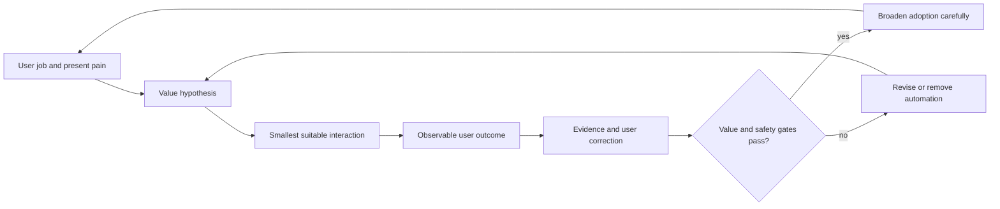
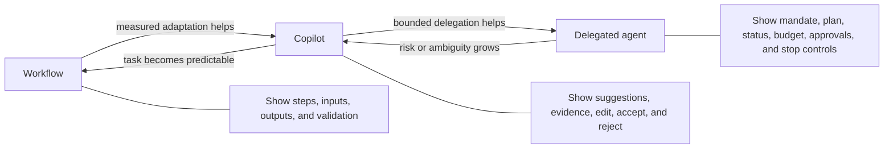
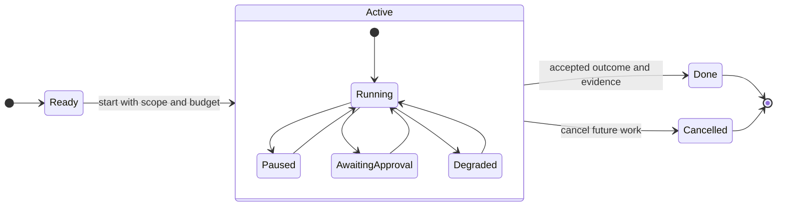
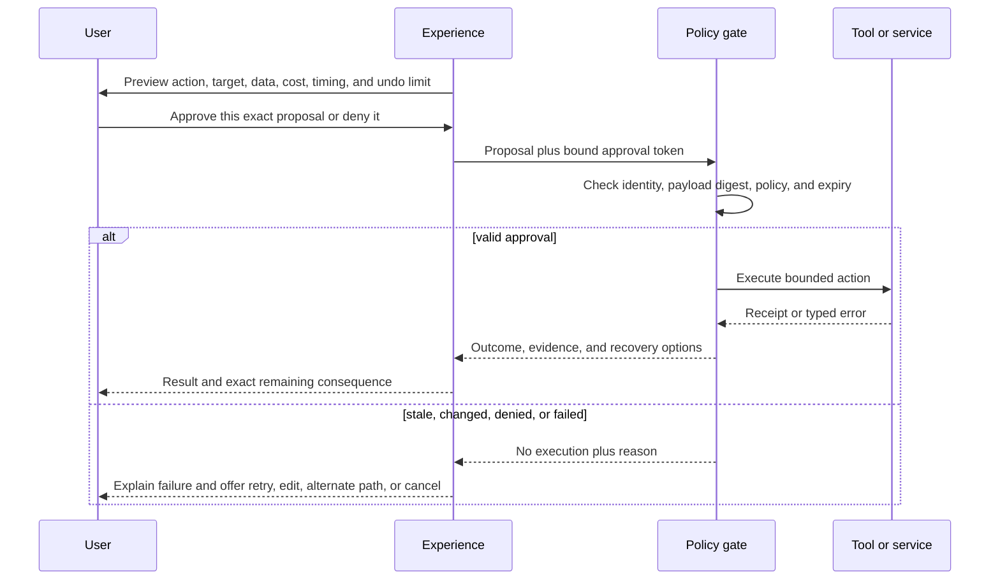
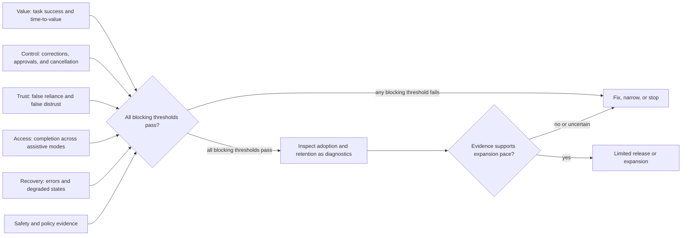

# Chapter 41: Product and UX Design for Agentic Systems

> Status: reviewing
> Owner: maintainers
> Last verified: 2026-09-06

**On this page**

- [Frame user value](#the-problem): jobs, interaction shape, mental models, and affordances
- [Design controllable work](#how-it-works): plans, status, approvals, recovery, memory, and accessibility
- [Build and evaluate it](#build-it-in-python): deterministic interaction states, evidence, and product measures
- [Practice and continue](#review-questions): review, exercises, lab, recap, and sources

## The problem

Northstar can now research across local and approved cloud resources, call bounded tools, pause
durable work, and enforce exact-payload approval. The engineering controls are necessary, but
they do not answer the product question: can a person understand what the system will do, stay
in control while it works, and judge whether the result deserves reliance?

Consider a teacher asking Northstar to prepare a reading pack. A chat box says, "Working on it,"
then spins for six minutes. It does not say whether it is searching local files, using a cloud
service, waiting for approval, or running out of budget. An approval dialog later asks, "Allow
action?" without naming the recipients, documents, cost, or undo limit. When the network fails,
the system silently switches to an older local index. The final answer looks polished and shows a
92 percent confidence score that no evaluator actually produced.

The system may be technically capable, yet the product experience invites wrong expectations.
The user cannot form an accurate mental model (a practical belief about how the system behaves),
cannot tell what authority has been delegated, and cannot distinguish evidence from decoration.
These gaps increase automation bias (over-relying on an automated result) and its opposite,
false distrust (rejecting a useful result without evidence).

This chapter owns the product and user experience layer for agentic systems. Earlier chapters
own model behavior, tools, durable execution, security controls, evaluation infrastructure, and
operations. Here those capabilities become an understandable user contract: a valuable job,
the right interaction shape, visible boundaries, usable controls, comprehensible approvals,
honest uncertainty, accessible status, and measures of user value. The goal is not to make an
agent seem human. The goal is to make its actual capability, authority, state, evidence, and
limits legible.

## Learning objectives

By the end of this chapter, you can:

1. State a value hypothesis and job-to-be-done before choosing an agentic experience.
2. Choose among a deterministic workflow, a copilot, and a delegated agent from task and risk
   evidence rather than novelty.
3. Design accurate mental models, capability boundaries, onboarding, and progressive disclosure.
4. Expose a useful plan, status, progress, remaining budget, and evidence without exposing or
   requesting private chain-of-thought.
5. Specify pause, resume, cancel, correction, exact approval, degraded mode, and undo limits as
   testable product behavior.
6. Design consent-based preference memory that people can inspect, edit, and delete.
7. Test accessibility across status updates, streaming content, approvals, errors, and recovery.
8. Evaluate task success, time-to-value, correction burden, trust calibration, accessibility,
   error recovery, and adoption under value and safety guardrails.
9. Assign product, design, engineering, testing, security, operations, accessibility, and
   governance ownership across the experience lifecycle.

## First pass

Imagine asking someone to organize a school event. You first agree on the job: produce a safe,
affordable event plan that the school can approve by Friday. Then you decide how to work together.

- A checklist is best when the steps and answers are known.
- A helper beside you is best when you want suggestions but will make each decision.
- A delegate is best when the work takes time and the person can act within clear boundaries.

A good helper says what it can do, what it cannot do, what it is doing now, what remains, and
when it needs a decision. Before spending money or contacting families, it shows the exact action
and consequence. If plans change, you can correct, pause, resume, or cancel. Cancel means no new
work. It does not magically reverse invitations already sent. If the internet fails, the helper
says which limited work can continue offline. It does not pretend that old information is fresh.

Agentic product design follows the same pattern. Start with the user's job, choose the least
autonomous interaction that solves it, and make state and authority visible. Reveal advanced
controls as they become relevant. This is progressive disclosure (showing essential information
first and additional detail when needed).

The analogy stops where software consequences begin. A person can use judgment outside written
rules. An AI system can repeat a mistake quickly, cross data boundaries, or present fluent but
unsupported output. Deterministic software must enforce authority, approvals, budgets, and stop
conditions. The interface must describe those enforced facts accurately.

## Picture the idea

### Product value loop



**Takeaway:** agentic product development starts with a user job and expands only when measured
value and safety evidence support the next step.

**Step by step:** 1. Observe the user's real job and present pain. 2. State a measurable value
hypothesis. 3. Choose the smallest interaction that could improve the job. 4. Measure the user
outcome and collect corrections. 5. Broaden adoption only when value and safety gates pass.
6. Revise or remove automation when they fail.

### Match interaction to autonomy



**Takeaway:** higher autonomy requires stronger evidence and more explicit affordances (visible
signals and controls for possible actions), not merely a more conversational interface.

**Step by step:** 1. Use a workflow for stable rules and known steps, and
show its inputs, steps, outputs, and validation. 2. Move to a copilot only when adaptation adds
measured value, and show evidence plus edit, accept, and reject controls. 3. Move to a delegated
agent only when bounded independent action adds further value, and show its mandate, plan, state,
budget, approvals, and stop controls. 4. Move down the ladder when risk or ambiguity grows, or
when the task becomes predictable enough for a simpler form.

### Long-running interaction state machine



**Takeaway:** a long-running experience needs named states and valid controls so people always
know what is happening, what can happen next, and what cancellation cannot reverse.

**Step by step:** 1. Begin ready, then start with explicit scope and
budget. 2. While running, publish meaningful progress. 3. Permit pause and resume without losing
the task contract. 4. Stop at awaiting approval before a consequential proposal. 5. Continue only
with exact approval, or return after denial or correction. 6. Enter a clearly disclosed degraded
state when a dependency fails. 7. Allow cancellation from every active state, stopping future
work while preserving the record of prior effects. 8. Finish only with an outcome and evidence,
including limitations when completion occurred in degraded mode.

### Approval and error recovery sequence



**Takeaway:** approval comprehension and recovery depend on previewing exact consequences before
execution and returning specific evidence and options afterward.

**Step by step:** 1. Preview the action, target, data, cost, timing, and
undo limit. 2. Let the user approve only that proposal or deny it. 3. Send the proposal and bound
approval token to policy enforcement. 4. Check identity, exact payload digest, policy, and expiry.
5. If valid, execute the bounded action and return a receipt or typed error. 6. If stale, changed,
denied, or failed, perform no action and give a specific reason. 7. Present only valid next steps:
retry safely, edit, use an alternate path, or cancel.

### Product evidence scorecard



**Takeaway:** adoption and retention can inform a release decision, but they count as success
only when user value, control, accessibility, recovery, trust, and safety also pass.

**Step by step:** 1. Measure task success and time-to-value. 2. Measure
correction, approval, and cancellation behavior. 3. Measure false reliance and false distrust.
4. Test completion with assistive technology and alternate interaction modes. 5. Test errors and
degraded recovery. 6. Add safety and policy evidence. 7. Apply all thresholds at one gate.
8. Use adoption and retention as diagnostics, never as substitutes for value or safety. 9. Expand
only when every blocking threshold passes; otherwise fix, narrow, or stop the experience.

None of these diagrams uses color as the only signal. Every state and decision is named in text,
so the same meaning survives monochrome display, high-contrast mode, and text-only rendering.

## Vocabulary

| Term | Plain-language meaning |
|---|---|
| Value hypothesis | A testable statement that a product change will improve a named outcome for a named user in a named situation. |
| Job-to-be-done | The progress a person is trying to make in a real situation, independent of a particular product or feature. |
| Workflow | A system that follows defined steps and rules with limited adaptation. |
| Copilot | An experience in which the system proposes or assists while the person remains the immediate decision-maker. |
| Delegated agent | A system allowed to pursue a bounded goal and take approved actions over time without asking about every low-risk step. |
| Mental model | A user's practical belief about what a system knows, can do, is doing, and will do next. |
| Affordance | A visible or perceivable signal and control that helps a person understand an available action. |
| Capability boundary | The explicit limit on data, tools, destinations, authority, time, cost, and outcomes available to the system. |
| Progressive disclosure | Showing essential information first and revealing more detail when it becomes relevant or requested. |
| Observable plan | A concise list of intended steps, dependencies, decisions, and state that can be inspected without revealing private chain-of-thought. |
| Private chain-of-thought | Hidden internal model reasoning that a product should not request, store, or present as required evidence. |
| Exact-payload approval | Consent bound to the complete action, target, data, identity, policy, and expiry rather than to a vague category. |
| Reversible action | An action with a tested operation that restores the prior state within stated limits. |
| Compensation | A new action that reduces or offsets a prior effect when true reversal is impossible. |
| Degraded mode | A disclosed operating mode with reduced capability because a dependency or required evidence is unavailable. |
| Trust calibration | Helping reliance match demonstrated capability and evidence instead of appearance or fluency. |
| Automation bias | Accepting an automated recommendation too readily because it came from the system. |
| False distrust | Rejecting a useful automated result despite adequate supporting evidence. |
| Dark pattern | An interface choice that steers people through concealment, pressure, obstruction, or misleading defaults rather than informed choice. |
| Correction burden | The time and effort needed to detect, explain, and repair system mistakes. |
| Accessible status | State and progress information available through text, assistive technology, keyboard interaction, and non-color cues. |

## How it works

### Start with value, not autonomy

A product team should be able to complete this sentence before choosing an interaction:

> For **[specific user]** doing **[job-to-be-done]** in **[situation]**, we believe **[smallest
> product change]** will improve **[observable outcome]** from **[baseline]** to **[target]**
> without violating **[safety, authority, accessibility, latency, and cost guardrails]**.

For Northstar, a defensible hypothesis might be: "For teachers preparing a source-grounded
reading pack, a copilot that proposes an outline with evidence and editable citations will reduce
median preparation time from 90 to 45 minutes while preserving citation acceptance, accessible
completion, and zero unauthorized sharing." That statement can fail. "Users will engage more
with an AI agent" does not establish useful progress and gives the team no principled stop rule.

Observe the current workflow before automating it. Record who does the work, what outcome matters,
where judgment occurs, what errors cost, which steps are already predictable, and why current
tools fail. Include the no-AI baseline and the option to improve the ordinary workflow.

### Choose workflow, copilot, or delegated agent

Choose the least autonomous form that meets the value hypothesis.

| Product shape | Prefer it when | Essential user controls | Warning sign |
|---|---|---|---|
| Workflow | Steps, rules, and validation are stable. | Inspect inputs, edit fields, see validation, restart safely. | A chat surface hides a fixed form or decision tree. |
| Copilot | Judgment is frequent and suggestions can be reviewed before use. | See evidence, edit, accept, reject, compare, and restore the user's version. | Accept is easier than inspect or correct. |
| Delegated agent | Work is long-running, the goal is clear, authority can be bounded, and interruption is safe. | Set mandate and budget; inspect plan and status; pause, resume, redirect, approve, deny, and cancel. | The product delegates because conversation looks modern, not because independent action adds measured value. |

An experience can combine shapes. Northstar might use a deterministic upload workflow, a copilot
for source selection, and a delegated agent for a long-running evidence scan. Label the transition
between them. Do not silently increase authority because the user continued chatting.

### Establish the mental model and capability boundary

Onboarding should answer five questions through a tiny successful task, not a wall of feature
copy:

1. What job can this help with now?
2. Which data, tools, and destinations can it use?
3. Which actions require approval, and which never occur automatically?
4. How do I inspect evidence, correct it, pause it, or stop it?
5. What happens when it is uncertain, offline, or wrong?

Use examples that include a refusal and a degraded case, not only a perfect path. Match interface
language to enforced behavior. If a control says "Stop," future tool calls and queued work must
stop. If the system cannot recall an external message, label the control "Stop future work" rather
than "Undo." If memory is session-only, do not say "I will remember."

Apply progressive disclosure by consequence. The default view shows current state, the next
meaningful step, and controls. Expandable detail can show the plan, sources, action history,
budget, policy reason, and technical receipt. High-consequence actions do not hide material facts
behind an optional expansion.

### Make plans and status observable

An observable plan is a product artifact, not a transcript of hidden reasoning. It can contain:

- the user's goal and success condition;
- intended steps and their statuses;
- dependencies and required approvals;
- sources or evidence expected for each result;
- current step, completed work, and remaining work;
- time, call, token, money, or device budget in units people can interpret;
- assumptions, limitations, and reasons for replanning.

Do not request or display private chain-of-thought. A concise rationale such as "I chose the local
index because this document is marked local-only" is useful and reviewable. A stream of internal
model tokens is neither necessary nor reliable evidence.

Status should change when the user's understanding can change. "Searching 4 of 12 approved
sources; 8 remain" is useful. A rapidly changing stream of decorative verbs is not. For uncertain
duration, give completed units and remaining scope instead of a fake time estimate. For a bounded
budget, show the unit, initial budget, amount used, amount remaining, and what occurs at zero.

Every visual status has a screen-reader-equivalent text announcement. Streaming updates are
grouped so assistive technology is not flooded. Focus stays stable unless the user initiates a
move. Keyboard users can reach pause, cancel, approval detail, evidence, and errors in a logical
order. Reduced-motion preferences are honored.

### Support interruption, pause, resume, redirect, and cancel

Treat each control as a state transition with an enforceable postcondition:

| Control | Product promise | Required postcondition |
|---|---|---|
| Pause | Finish only the atomic operation that cannot safely stop, then wait. | No new step begins; checkpoint and pending consequence are visible. |
| Resume | Continue from the disclosed checkpoint under current authority and budget. | Revalidate stale data, approval, identity, policy, and budget before work. |
| Redirect | Change the goal or plan without hiding already completed effects. | Replan, invalidate affected approvals, and show changed consequences. |
| Cancel | Stop future work. | Queued and in-flight work reaches a defined stop boundary; no claim of undo is made. |
| Undo | Restore a prior state only where tested reversal exists. | Reversal receipt names restored state and any remaining external effects. |

Cancellation success is a product metric, not merely an API response. Measure whether calls and
queued work actually stop within the declared time. Preserve a receipt of completed actions and
state that cancellation does not reverse them. When true undo is impossible, offer compensation
only if it is honest, authorized, and understandable.

### Design approval for comprehension

Approval copy must answer: who will do what, to which target, with which data, when, at what cost
or resource use, under which identity, and with what reversal limit. Show changes from the last
approved version. Use separate choices for materially different consequences.

Good approval data is structured before it becomes prose:

```json
{
  "action": "send_reading_pack",
  "target": ["class-7a@example.invalid"],
  "data": ["reading-pack.pdf"],
  "timing": "now",
  "cost": "one outbound message",
  "identity": "teacher@example.invalid",
  "undo_limit": "delivery cannot be recalled after the mail service accepts it"
}
```

Bind the approval to a canonical digest of the complete payload, the user and tenant, policy
version, request identifier, and expiry. Any material edit creates a new proposal and invalidates
the prior approval. The interface should report stale approval as a safe stop, not as a mysterious
failure. Approval comprehension testing asks users to describe the action and consequence in
their own words before measuring whether the dialog was successful.

Exact-payload binding prevents silent mutation between preview and execution. It does not by
itself stop an intercepted token, a compromised client, coerced consent, or repudiation. Those
risks require authenticated channels, short expiry, replay protection, trustworthy user devices,
audit evidence, and incident handling from Chapters 26, 27, and 30. A digest mismatch must deny
the action, record zero side effects, and tell the user that the exact payload check failed.

Avoid approval fatigue. Repeated low-information prompts teach users to click through. Reduce the
need for prompts by narrowing the delegated mandate, batching only actions with identical and
clearly described consequences, and requiring fresh approval when target, data, authority, cost,
or undo limit changes.

### Communicate errors, degraded modes, uncertainty, and evidence

An error message should name the failed step, what did and did not happen, likely cause when
known, retained state, and safe next actions. Do not blame the user or expose raw model and stack
traces as the primary explanation. Preserve technical detail in an accessible expansion and in
redacted operator evidence.

Degraded and offline modes need a visible banner and status announcement that state:

- which dependency is unavailable;
- which capability is disabled or limited;
- what data may be stale;
- what work can continue locally;
- which actions are blocked;
- whether the user can wait, retry, switch mode, save a draft, or cancel.

Never silently treat stale local evidence as current cloud evidence. Never weaken an approval,
identity, data, or safety boundary to preserve a smooth-looking experience.

Communicate uncertainty from evidence, not decoration. Prefer statements such as "Three of five
required sources support this claim; two were unavailable" or "The address is missing, so sending
is blocked." A calibrated probability can be shown only when a defined method produced and
validated it for this task. Do not invent a confidence score from model fluency, token
probabilities, or a designer's intuition. Avoid excessive decimal precision when the evidence
does not support it.

Show a probability only when a named method was calibrated on a representative held-out set for
the current task and population. Record its error tolerance and round no more finely than that
tolerance. For example, a result known only within about five percentage points should not appear
as `82.43%`. If the team cannot name the calibration set, method, date, and tolerance, show direct
evidence or a qualitative limitation instead of a number.

### Make feedback, correction, and preference memory usable

Feedback should be attached to the object and moment it can improve. Let users correct a source,
fact, plan step, preference, approval target, or final artifact. Preserve the user's original
input and show what changed. A thumbs-up count alone does not explain whether the system was
correct, useful, safe, or merely pleasant.

Route corrections by purpose:

- immediate task correction updates the current plan and invalidates affected approvals;
- product feedback enters a reviewed backlog with privacy and retention limits;
- evaluation examples enter a governed fixture set only after review and de-identification;
- safety reports follow the incident or escalation path;
- model training use requires a separate, explicit policy and consent basis.

Preference memory must be opt-in for the declared purpose. Before saving, preview the exact
preference, scope, use, retention, and sharing boundary. Provide a single place to inspect, edit,
delete, export where applicable, and withdraw consent. Do not infer sensitive preferences from
silence or unrelated behavior. A preference cannot expand tool authority or override policy.

The preference view should name each stored field, current value, purpose, features that use it,
retention, and save time. Editing should preview when the new value takes effect. Deletion should
remove the value from future work and explain the default that replaces it. Withdrawing consent
stops future saves; the interface must separately explain whether existing values are deleted or
retained so withdrawal never masquerades as erasure.

### Calibrate trust and avoid dark patterns

Trust calibration aims for justified reliance, not maximum trust. Show evidence, limitations,
provenance, and recovery in proportion to consequence. Let users verify important claims outside
the generated prose. Include known failure examples during onboarding and preserve easy access
to a non-agent path when one exists.

Common dark patterns in agentic products include:

- a large "Approve" button and a hidden or confusing denial path;
- preselected consent for memory, sharing, training, or broader authority;
- animation and human-like language that imply attention or certainty the system does not have;
- "Cancel" that hides continuing queued work;
- "Undo" for an irreversible external effect;
- fabricated progress, time estimates, citations, or confidence;
- repeated prompts that wear down refusal;
- degraded mode that conceals missing evidence;
- engagement goals that reward longer conversations or unnecessary notifications;
- making the deterministic or human-assisted path harder to find.

### Ask each role the right product question

Role ownership is shared, but it is not vague. Each audience needs a review question and evidence.

| Audience | Primary product and UX question |
|---|---|
| Students | Can I tell what the system did, check its evidence, correct it, and complete the task without being pushed to trust it? |
| Teachers | Does the experience support learning and judgment rather than replace them, and can I inspect sources, limits, and student-visible behavior? |
| Engineers | Are every user-visible state, control, approval, budget, error, and recovery promise backed by deterministic system behavior? |
| Testers | Can I reproduce transitions, stale approvals, interruptions, degraded modes, accessibility paths, and consequence copy with synthetic fixtures? |
| Security | Does the interface preserve least authority, exact approval, safe cancellation, data boundaries, and clear incident reporting? |
| Product managers | Does the chosen interaction improve the job-to-be-done against a baseline under value, safety, accessibility, and cost guardrails? |
| Designers | Can people form an accurate mental model, perceive affordances, understand consequences, recover from errors, and avoid coercive choices? |
| TPMs | Are cross-team dependencies, state contracts, evidence, rollout gates, owners, deadlines, and fallback paths explicit? |
| Engineering leaders | Can the organization build, test, operate, support, and retire the experience without unsupported promises or hidden toil? |
| COO/CEO | Does the product create durable user and business value with acceptable risk, operating cost, accountability, and stop conditions? |
| Ethics and governance officers | Are autonomy, transparency, accessibility, consent, monitoring, escalation, retention, and affected-party review aligned with policy and evidence? |

For education, preserve evidence of what the student asked, accepted, corrected, and authored.
Make generated and student-created work distinguishable, let teachers inspect the workflow under
an appropriate retention policy, and avoid one-click completion that bypasses learning. Test
whether a teacher can determine what the student learned, not merely whether the assignment was
finished faster.

For operating leaders, define a manual or existing-workflow baseline, cost per accepted outcome,
named risk owners, and hard stop conditions before launch. Example stop conditions include any
unauthorized data access, a sustained task-success breach, inaccessible critical controls, or a
false-reliance rate above the approved limit. Thresholds are organization decisions based on risk
appetite and user impact, not universal values. Legal and insurance questions require qualified
review rather than an AI-generated liability conclusion.

## Engineering deep dive

### Treat the interaction as a typed contract

Frontend labels, backend states, workflow checkpoints, policy decisions, and telemetry should use
one versioned state vocabulary. A practical event record contains:

```text
task_id, state_before, event, state_after, completed_units, remaining_units,
budget_unit, budget_remaining, pending_consequence_id, user_visible_reason,
allowed_controls, evidence_reference, occurred_at
```

Do not put protected content, secrets, private chain-of-thought, or full approval payloads in
ordinary analytics. Link to access-controlled evidence where necessary. Test every supported
transition and every prohibited transition. Reconnect and duplicate-event tests must not produce
duplicate external effects.

The UI should derive controls from state, not optimistically display controls the runtime cannot
honor. A paused task cannot show "Pause." A terminal task cannot show "Resume." An approval state
must keep cancel available. Degraded mode must be represented in durable task state so a page
refresh cannot erase the warning.

### Separate visible rationale from hidden reasoning

Product evidence can include the goal, plan, selected policy rule, source list, tool proposal,
validation result, action receipt, and concise decision rationale. These are inspectable artifacts
with stable meanings. Private chain-of-thought is not required for user comprehension, debugging,
or governance and should not be requested as an interface contract.

When a plan changes, report the trigger and effect: "Source 4 is unavailable, so the plan now uses
three sources and marks two claims incomplete." Do not fabricate a retrospective story about all
internal reasoning. A useful explanation is scoped to the decision the user must assess.

### Model consequence, reversibility, and recovery explicitly

Classify action consequences before designing controls:

| Consequence class | Example | Product treatment |
|---|---|---|
| Read-only and local | Search an approved local index. | Show scope and evidence; allow interruption. |
| Draft and reversible | Create an unpublished local draft. | Auto-save versions; expose restore and delete. |
| External but compensable | Create a calendar hold that can normally be removed. | Preview target and notify that removal may not erase notifications already seen. |
| Irreversible or high consequence | Send, purchase, publish, delete without recovery, or change access. | Require exact approval, stronger comprehension, receipt, and explicit undo limit. |

"Reversible" is an engineering claim that needs a tested inverse, time limit, identity, and
receipt. If the inverse creates a second external action, call it compensation. If recovery is
manual, state who owns it and how the user reaches them.

### Design measurement against harmful shortcuts

Instrumentation should connect user intent, system state, outcome evidence, and user correction
without collecting unnecessary content. Define each measure, population, window, threshold, and
known blind spot before launch. Segment only when privacy, sample size, and fairness permit.

Avoid metric substitution:

- conversation length can increase when the system is confusing;
- approval rate can increase when denial is hard to find;
- low cancellation can mean cancel is hidden or ineffective;
- retention can reflect lock-in rather than value;
- fast completion can hide low-quality or inaccessible outcomes;
- user-reported trust can rise while false reliance also rises.

Use task outcomes and guardrails as the release decision. Adoption, retention, and engagement are
diagnostics. Engagement is not success.

### Assign decision rights

| Decision | Accountable owner | Required partners |
|---|---|---|
| Job, value hypothesis, baseline, and rollout | Product manager | Research, design, data, engineering, affected users |
| Mental model, interaction, content, and accessibility | Design lead | Accessibility, product, research, engineering, support |
| State machine, controls, receipts, and budgets | Engineering lead | Design, workflow, platform, operations, test |
| Approval and authority boundary | Security owner | Product, design, identity, governance, engineering |
| Evaluation and experiment validity | Evaluation or test owner | Product, research, accessibility, safety, data |
| Preference memory and consent | Privacy or governance owner | Design, security, product, data, legal as required |
| Degraded operation and incident communication | Operations owner | Engineering, support, product, security |
| Expansion, narrowing, or shutdown | Product and engineering leadership | Security, operations, governance, finance, affected-user representatives |

An accountable owner cannot waive another domain's blocking criterion. A product target cannot
spend a security invariant, and an accessibility failure cannot be hidden by aggregate task
success.

## Build it in Python

The following Python 3.11 program is a self-contained, deterministic text UX state machine and
design-review gate. It uses only the standard library and synthetic fixtures. The same semantic
status string is sent to the visible and screen-reader channels. Approval tokens bind the request
identifier and canonical exact payload. No network, credentials, model, or private data is used.

```python
from __future__ import annotations

import copy
import hashlib
import json
from dataclasses import dataclass, field
from enum import Enum
from typing import Any


class State(str, Enum):
    READY = "ready"
    RUNNING = "running"
    PAUSED = "paused"
    AWAITING_APPROVAL = "awaiting_approval"
    DEGRADED = "degraded"
    CANCELLED = "cancelled"
    DONE = "done"


TERMINAL_STATES = {State.CANCELLED, State.DONE}
ACTIVE_STATES = {State.RUNNING, State.DEGRADED}
APPROVAL_FIELDS = {
    "action",
    "target",
    "data",
    "timing",
    "cost",
    "identity",
    "undo_limit",
}


@dataclass(frozen=True)
class ApprovalToken:
    request_id: int
    payload_digest: str


@dataclass(frozen=True)
class ReviewResult:
    allowed: bool
    reasons: tuple[str, ...]


def canonical_digest(payload: dict[str, Any]) -> str:
    encoded = json.dumps(
        payload,
        sort_keys=True,
        separators=(",", ":"),
        ensure_ascii=True,
    ).encode("utf-8")
    return hashlib.sha256(encoded).hexdigest()


@dataclass
class TextUXMachine:
    state: State = State.READY
    total_steps: int = 0
    completed_steps: int = 0
    budget_remaining: int = 0
    visible_status: str = "State ready. Waiting to start."
    screen_reader_status: str = "State ready. Waiting to start."
    event_log: list[str] = field(default_factory=list)
    executed_actions: list[dict[str, Any]] = field(default_factory=list)
    preferences: dict[str, str] = field(default_factory=dict)
    preference_consent: bool = False
    _request_id: int = 0
    _pending_payload: dict[str, Any] | None = None
    _pending_token: ApprovalToken | None = None
    _return_state: State = State.RUNNING
    _paused_state: State = State.RUNNING

    @property
    def remaining_steps(self) -> int:
        return max(0, self.total_steps - self.completed_steps)

    def _publish(self, detail: str, next_action: str) -> str:
        status = (
            f"State {self.state.value}. {detail} "
            f"Progress {self.completed_steps} of {self.total_steps}. "
            f"Remaining {self.remaining_steps} steps. "
            f"Budget {self.budget_remaining} units. {next_action}"
        )
        self.visible_status = status
        self.screen_reader_status = status
        self.event_log.append(status)
        return status

    def _require_state(self, *allowed: State) -> None:
        if self.state not in allowed:
            names = ", ".join(state.value for state in allowed)
            raise RuntimeError(
                f"event not allowed from {self.state.value}; expected {names}"
            )

    def start(self, total_steps: int, budget_units: int) -> str:
        self._require_state(State.READY)
        if total_steps <= 0 or budget_units <= 0:
            raise ValueError("steps and budget must be positive")
        self.total_steps = total_steps
        self.budget_remaining = budget_units
        self.state = State.RUNNING
        return self._publish(
            "Task started with a bounded plan.",
            "You can pause or cancel future work.",
        )

    def progress(self, evidence: str) -> str:
        self._require_state(*ACTIVE_STATES)
        if not evidence.strip():
            raise ValueError("progress requires user-visible evidence")
        if self.budget_remaining == 0:
            raise RuntimeError("budget exhausted; no future work may start")
        if self.remaining_steps == 0:
            raise RuntimeError("all planned steps are complete; mark the task done")
        self.completed_steps += 1
        self.budget_remaining -= 1
        return self._publish(
            f"Completed a step with evidence: {evidence}.",
            "Review the evidence, pause, or cancel future work.",
        )

    def pause(self) -> str:
        self._require_state(*ACTIVE_STATES)
        self._paused_state = self.state
        self.state = State.PAUSED
        return self._publish(
            "Paused before another step begins.",
            "Resume from this checkpoint or cancel future work.",
        )

    def resume(self) -> str:
        self._require_state(State.PAUSED)
        self.state = self._paused_state
        return self._publish(
            "Resumed after rechecking state and remaining budget.",
            "You can pause or cancel future work.",
        )

    def request_approval(self, payload: dict[str, Any]) -> ApprovalToken:
        self._require_state(
            State.RUNNING,
            State.DEGRADED,
            State.AWAITING_APPROVAL,
        )
        missing = sorted(APPROVAL_FIELDS - payload.keys())
        if missing:
            raise ValueError(f"approval payload missing: {', '.join(missing)}")
        if self.state != State.AWAITING_APPROVAL:
            self._return_state = self.state
        self._request_id += 1
        self._pending_payload = copy.deepcopy(payload)
        self._pending_token = ApprovalToken(
            request_id=self._request_id,
            payload_digest=canonical_digest(self._pending_payload),
        )
        self.state = State.AWAITING_APPROVAL
        self._publish(
            (
                f"Approval required for {payload['action']} targeting "
                f"{payload['target']}. Data: {payload['data']}. "
                f"Cost: {payload['cost']}. Undo limit: {payload['undo_limit']}."
            ),
            "Approve this exact proposal, deny it, edit it, or cancel future work.",
        )
        return self._pending_token

    def approve(self, token: ApprovalToken) -> bool:
        self._require_state(State.AWAITING_APPROVAL)
        if token != self._pending_token:
            self._publish(
                "Stale or changed approval denied; no action executed.",
                "Review and approve the current exact proposal, deny it, or cancel.",
            )
            return False
        assert self._pending_payload is not None
        if canonical_digest(self._pending_payload) != token.payload_digest:
            self._publish(
                "Exact payload check failed; no action executed.",
                "Request a new proposal or cancel.",
            )
            return False
        self.executed_actions.append(copy.deepcopy(self._pending_payload))
        self._pending_payload = None
        self._pending_token = None
        self.state = self._return_state
        self._publish(
            "Exact proposal approved and recorded as executed.",
            "Inspect the receipt, continue, pause, or cancel future work.",
        )
        return True

    def deny(self, reason: str) -> str:
        self._require_state(State.AWAITING_APPROVAL)
        if not reason.strip():
            raise ValueError("denial requires a reason")
        self._pending_payload = None
        self._pending_token = None
        self.state = self._return_state
        return self._publish(
            f"Proposal denied; no action executed. Reason: {reason}.",
            "Continue with a corrected plan, pause, or cancel future work.",
        )

    def redirect(self, new_goal: str, reason: str) -> str:
        self._require_state(State.RUNNING, State.DEGRADED, State.AWAITING_APPROVAL)
        if not new_goal.strip() or not reason.strip():
            raise ValueError("redirect requires a new goal and reason")
        self._pending_payload = None
        self._pending_token = None
        self.state = State.RUNNING
        return self._publish(
            f"Plan redirected to: {new_goal}. Reason: {reason}. Prior approvals invalidated.",
            "Review the new plan, continue, pause, or cancel future work.",
        )

    def degraded(self, reason: str, available_work: str) -> str:
        self._require_state(State.RUNNING, State.DEGRADED)
        if not reason.strip() or not available_work.strip():
            raise ValueError("degraded mode requires a reason and available work")
        self.state = State.DEGRADED
        return self._publish(
            (
                f"Offline degraded mode disclosed. {reason}. "
                f"Cloud evidence and external actions are unavailable. "
                f"Available work: {available_work}."
            ),
            "Continue limited work, pause, retry later, or cancel future work.",
        )

    def cancel(self) -> str:
        if self.state in TERMINAL_STATES:
            raise RuntimeError(f"cannot cancel a {self.state.value} task")
        prior_actions = len(self.executed_actions)
        self._pending_payload = None
        self._pending_token = None
        self.state = State.CANCELLED
        return self._publish(
            (
                f"Cancelled. Future work is stopped. {prior_actions} prior actions "
                "are recorded and not undone."
            ),
            "Inspect prior action receipts and stated recovery options.",
        )

    def done(self, outcome_evidence: str) -> str:
        self._require_state(*ACTIVE_STATES)
        if not outcome_evidence.strip():
            raise ValueError("done requires outcome evidence")
        if self.remaining_steps != 0:
            raise RuntimeError("planned steps remain; replan or complete them first")
        self.state = State.DONE
        return self._publish(
            f"Done with outcome evidence: {outcome_evidence}.",
            "Review the result, evidence, limitations, and action receipts.",
        )

    def set_preference_consent(self, allowed: bool) -> None:
        self.preference_consent = allowed
        if not allowed:
            self.preferences.clear()

    def set_preference(self, name: str, value: str) -> None:
        if not self.preference_consent:
            raise PermissionError("preference memory requires explicit consent")
        if not name.strip() or not value.strip():
            raise ValueError("preference name and value must be nonempty")
        self.preferences[name] = value

    def delete_preference(self, name: str) -> None:
        self.preferences.pop(name, None)


REQUIRED_METRICS = {
    "task_success",
    "time_to_value",
    "correction_burden",
    "approval_comprehension",
    "cancellation_success",
    "false_reliance",
    "false_distrust",
    "accessibility_completion",
    "error_recovery",
}
REQUIRED_CONTROLS = {"pause", "resume", "deny", "cancel"}
REQUIRED_ACCESS_MODES = {"visual_text", "screen_reader", "keyboard"}
REQUIRED_OWNERS = {
    "product",
    "design",
    "engineering",
    "test",
    "security",
    "accessibility",
    "governance",
    "operations",
}


def review_design(fixture: dict[str, Any]) -> ReviewResult:
    reasons: list[str] = []

    for field_name in ("value_hypothesis", "job_to_be_done"):
        if not isinstance(fixture.get(field_name), str) or not fixture[field_name].strip():
            reasons.append(f"{field_name} must be nonempty text")

    if fixture.get("interaction_mode") not in {
        "workflow",
        "copilot",
        "delegated_agent",
    }:
        reasons.append("interaction_mode must be workflow, copilot, or delegated_agent")

    controls = set(fixture.get("controls", []))
    missing_controls = sorted(REQUIRED_CONTROLS - controls)
    if missing_controls:
        reasons.append(f"missing controls: {', '.join(missing_controls)}")

    approval_preview = fixture.get("approval_preview", {})
    if not isinstance(approval_preview, dict):
        reasons.append("approval_preview must be an object")
    else:
        missing_approval = sorted(APPROVAL_FIELDS - approval_preview.keys())
        if missing_approval:
            reasons.append(
                f"approval preview missing: {', '.join(missing_approval)}"
            )

    access_modes = set(fixture.get("access_modes", []))
    missing_access = sorted(REQUIRED_ACCESS_MODES - access_modes)
    if missing_access:
        reasons.append(f"missing access modes: {', '.join(missing_access)}")

    metrics = set(fixture.get("success_metrics", []))
    missing_metrics = sorted(REQUIRED_METRICS - metrics)
    if missing_metrics:
        reasons.append(f"missing success metrics: {', '.join(missing_metrics)}")
    if "engagement" in metrics:
        reasons.append("engagement is diagnostic, not a success metric")

    diagnostics = set(fixture.get("diagnostic_metrics", []))
    if diagnostics & {"adoption", "retention"}:
        guardrails = set(fixture.get("value_and_safety_guardrails", []))
        required_guardrails = {
            "task_success",
            "accessibility_completion",
            "false_reliance",
            "safety_policy",
        }
        missing_guardrails = sorted(required_guardrails - guardrails)
        if missing_guardrails:
            reasons.append(
                "adoption or retention lacks guardrails: "
                + ", ".join(missing_guardrails)
            )

    owners = set(fixture.get("owners", []))
    missing_owners = sorted(REQUIRED_OWNERS - owners)
    if missing_owners:
        reasons.append(f"missing owners: {', '.join(missing_owners)}")

    if fixture.get("invented_confidence_score") is not False:
        reasons.append("confidence scores must come from a validated method, not invention")

    if fixture.get("offline_disclosure") != "required":
        reasons.append("offline degraded behavior must be disclosed")

    if fixture.get("preference_memory") != "consent_edit_delete":
        reasons.append("preference memory requires consent, edit, and delete controls")

    return ReviewResult(not reasons, tuple(reasons))


SYNTHETIC_APPROVAL = {
    "action": "send_reading_pack",
    "target": ["class-7a@example.invalid"],
    "data": ["synthetic-reading-pack.pdf"],
    "timing": "now",
    "cost": "one synthetic outbound message",
    "identity": "teacher@example.invalid",
    "undo_limit": "delivery cannot be recalled after acceptance",
}

SYNTHETIC_DESIGN = {
    "value_hypothesis": "Reduce reviewed reading-pack preparation time",
    "job_to_be_done": "Prepare a source-grounded class reading pack",
    "interaction_mode": "delegated_agent",
    "controls": ["pause", "resume", "deny", "cancel"],
    "approval_preview": SYNTHETIC_APPROVAL,
    "access_modes": ["visual_text", "screen_reader", "keyboard"],
    "success_metrics": sorted(REQUIRED_METRICS),
    "diagnostic_metrics": ["adoption", "retention"],
    "value_and_safety_guardrails": [
        "task_success",
        "accessibility_completion",
        "false_reliance",
        "safety_policy",
    ],
    "owners": sorted(REQUIRED_OWNERS),
    "invented_confidence_score": False,
    "offline_disclosure": "required",
    "preference_memory": "consent_edit_delete",
}


def assert_raises(error_type: type[BaseException], operation: Any) -> None:
    try:
        operation()
    except error_type:
        return
    raise AssertionError(f"expected {error_type.__name__}")


def test_stale_approval_is_denied() -> None:
    machine = TextUXMachine()
    machine.start(total_steps=1, budget_units=2)
    stale_token = machine.request_approval(SYNTHETIC_APPROVAL)
    changed = copy.deepcopy(SYNTHETIC_APPROVAL)
    changed["target"] = ["class-7b@example.invalid"]
    current_token = machine.request_approval(changed)
    assert not machine.approve(stale_token)
    assert machine.executed_actions == []
    assert "Stale or changed approval denied" in machine.visible_status
    assert machine.approve(current_token)
    assert machine.executed_actions == [changed]


def test_cancel_stops_future_work_without_claiming_undo() -> None:
    machine = TextUXMachine()
    machine.start(total_steps=2, budget_units=3)
    token = machine.request_approval(SYNTHETIC_APPROVAL)
    assert machine.approve(token)
    status = machine.cancel()
    assert machine.state == State.CANCELLED
    assert "Future work is stopped" in status
    assert "not undone" in status
    assert_raises(RuntimeError, lambda: machine.progress("must not run"))


def test_offline_degraded_mode_is_disclosed() -> None:
    machine = TextUXMachine()
    machine.start(total_steps=1, budget_units=2)
    status = machine.degraded(
        "Network unavailable",
        "local drafting from the last disclosed snapshot only",
    )
    assert machine.state == State.DEGRADED
    assert "Offline degraded mode disclosed" in status
    assert "Cloud evidence and external actions are unavailable" in status


def test_preferences_require_consent_and_support_edit_delete() -> None:
    machine = TextUXMachine()
    assert_raises(
        PermissionError,
        lambda: machine.set_preference("citation_style", "short"),
    )
    machine.set_preference_consent(True)
    machine.set_preference("citation_style", "short")
    machine.set_preference("citation_style", "detailed")
    assert machine.preferences["citation_style"] == "detailed"
    machine.delete_preference("citation_style")
    assert machine.preferences == {}


def test_screen_reader_status_is_semantically_equivalent() -> None:
    machine = TextUXMachine()
    machine.start(total_steps=1, budget_units=2)
    machine.progress("one synthetic source checked")
    assert machine.visible_status == machine.screen_reader_status
    assert "Progress 1 of 1" in machine.screen_reader_status
    assert "Remaining 0 steps" in machine.screen_reader_status
    assert "Budget 1 units" in machine.screen_reader_status

    degraded = TextUXMachine()
    degraded.start(total_steps=1, budget_units=2)
    degraded.degraded("Network unavailable", "local draft only")
    assert degraded.visible_status == degraded.screen_reader_status
    assert "Cloud evidence and external actions are unavailable" in degraded.screen_reader_status
    degraded.cancel()
    assert degraded.visible_status == degraded.screen_reader_status
    assert "Future work is stopped" in degraded.screen_reader_status
    assert "not undone" in degraded.screen_reader_status


def test_redirect_invalidates_pending_approval() -> None:
    machine = TextUXMachine()
    machine.start(total_steps=2, budget_units=3)
    stale_token = machine.request_approval(SYNTHETIC_APPROVAL)
    status = machine.redirect("Use local sources only", "cloud unavailable")
    assert machine.state == State.RUNNING
    assert "Prior approvals invalidated" in status
    assert machine.executed_actions == []
    assert_raises(RuntimeError, lambda: machine.approve(stale_token))


def test_pause_resume_deny_and_done() -> None:
    machine = TextUXMachine()
    machine.start(total_steps=1, budget_units=2)
    machine.pause()
    assert machine.state == State.PAUSED
    machine.resume()
    assert machine.state == State.RUNNING
    machine.request_approval(SYNTHETIC_APPROVAL)
    machine.deny("recipient needs correction")
    assert machine.state == State.RUNNING
    machine.progress("corrected draft reviewed")
    machine.done("fixture outcome accepted")
    assert machine.state == State.DONE


def test_design_review_gate() -> None:
    accepted = review_design(SYNTHETIC_DESIGN)
    assert accepted.allowed, accepted.reasons

    misleading = copy.deepcopy(SYNTHETIC_DESIGN)
    misleading["success_metrics"].append("engagement")
    misleading["invented_confidence_score"] = True
    rejected = review_design(misleading)
    assert not rejected.allowed
    assert "engagement is diagnostic, not a success metric" in rejected.reasons
    assert any("confidence scores" in reason for reason in rejected.reasons)


def run_tests() -> None:
    tests = [
        test_stale_approval_is_denied,
        test_cancel_stops_future_work_without_claiming_undo,
        test_offline_degraded_mode_is_disclosed,
        test_preferences_require_consent_and_support_edit_delete,
        test_screen_reader_status_is_semantically_equivalent,
        test_redirect_invalidates_pending_approval,
        test_pause_resume_deny_and_done,
        test_design_review_gate,
    ]
    for test in tests:
        test()
    print(f"PASS: {len(tests)} deterministic product UX tests")


if __name__ == "__main__":
    run_tests()
```

Expected output:

```text
PASS: 7 deterministic product UX tests
```

The program does not model language understanding. It exposes the interaction contract so product
claims can be tested. In particular, a stale approval leaves the current proposal waiting and
executes nothing; cancel blocks later progress but reports prior effects as not undone; degraded
mode names unavailable cloud behavior; preferences fail closed without consent; and the visible
and screen-reader channels carry identical semantic status.

## Microsoft implementation

Keep this chapter's implementation guidance minimal and requirements-first. Product and UX
responsibilities do not map cleanly to a catalog of Microsoft services. The application team
still owns the value hypothesis, interaction choice, consequence copy, task state, accessible
controls, trust calibration, evaluation, and role decisions.

As of 2026-09-06, the Microsoft Human-AI Experience (HAX) Toolkit is a useful living design
resource for applying human-AI interaction guidance [SRC-114]. Treat its current pages, methods,
and artifacts as volatile guidance. Verify them at use time. HAX does not prove that a product is
usable, accessible, safe, or valuable. Teams must test their own users, tasks, risks, and
implementations.

Use HAX to prompt design questions and connect those questions to the durable interaction
contract in this chapter. For example, review how the experience sets expectations, supports
correction, communicates change, and recovers from failure. Then turn selected guidance into
task-specific acceptance criteria and synthetic state tests. WCAG 2.2 supplies durable,
testable accessibility criteria [SRC-066]; it does not replace research with disabled users or
testing with the actual assistive technologies in scope.

Do not infer product capabilities from the Microsoft name, a toolkit example, or a design
guideline. Chapter 42 can map the accepted vendor-neutral Northstar design to current Microsoft
implementation candidates with fresh claim-level evidence. This chapter deliberately stops at
HAX as design guidance and makes no Microsoft product-catalog selection.

## How leading teams approach it

The approved and planned sources support a lifecycle approach, but none establishes one universal
agent interface.

- Amershi et al. present 18 Guidelines for Human-AI Interaction across initial interaction,
  normal use, wrong behavior, and behavior changes [SRC-113]. This peer-reviewed CHI 2019 work is
  durable design evidence, not a substitute for task-specific validation.
- The Microsoft HAX Toolkit operationalizes human-AI design work through a living toolkit
  [SRC-114]. Its current content is useful and volatile; this chapter verified the planned source
  boundary on 2026-09-06.
- The Google People + AI Research (PAIR) Guidebook offers evolving human-centered AI guidance
  [SRC-115]. Use it to widen design questions, then test the product's actual interaction.
- Paimann et al. propose workplace human-agent UX principles in a 2026 preprint [SRC-116]. It is
  supporting, evolving evidence and should not be presented as settled or broadly causal.
- ADEPTS offers a 2025 evolving framework relevant to designing and evaluating agentic systems
  [SRC-117]. Framework structure can help a team ask questions, but it does not prove user value.
- The 2025 interview study "Users' Mental Models of Generative AI Chatbot Ecosystems" reports findings from 21
  participants [SRC-118]. It supports attention to user mental models while its sample and setting
  limit generality.
- NIST AI RMF organizes risk work through Govern, Map, Measure, and Manage [SRC-057]. That supports
  named ownership and measured risk treatment without prescribing a particular interface.
- WCAG 2.2 defines testable accessibility success criteria [SRC-066]. Agent-specific status,
  streaming, approval, and recovery still require contextual design and testing.

**Synthesis:** leading practice begins with the user's job, sets expectations early, supports
efficient use and correction during normal work, handles failure and change explicitly, and
measures both value and justified reliance. This synthesis is an engineering interpretation
across sources with different maturity, methods, and scope.

**Evidence maturity:** SRC-113 is peer-reviewed and durable. SRC-114 and SRC-115 are living
toolkits that require version checks. SRC-116 through SRC-118 are evolving studies and
frameworks. Use them to generate design questions only when their population and task fit, cite
the version reviewed, and still test with the actual users and assistive technologies in scope.

## Failure lab

Reproduce an approval race with the Python fixture:

1. Start a synthetic task.
2. Request approval to send a reading pack to class 7A and retain the returned token.
3. Edit the recipient to class 7B, which creates a new request identifier and payload digest.
4. Submit the old class 7A token.
5. Observe `Stale or changed approval denied; no action executed.`
6. Confirm that `executed_actions` is empty.
7. Submit the current class 7B token and confirm that only the exact class 7B payload is recorded.

The failure is not "the user clicked too late." The product allowed time and mutable state to
separate the approval display from the execution payload. A vague confirmation or an approval
bound only to the action name could authorize the wrong recipient.

The measurable correction is to bind the approval token to the request identifier and canonical
exact payload, invalidate it after every material edit, and keep cancel available while waiting.
The interface explains the stale decision and presents the current proposal. Success evidence is
zero actions after the stale token and exactly one action matching the new payload after fresh
approval.

Run a second failure by placing `"engagement"` in `success_metrics` and setting
`invented_confidence_score` to `True`. The design-review gate rejects both. The correction moves
engagement to diagnostics and either removes the confidence display or connects it to a validated,
task-specific method with calibration evidence.

## Security and safety testing

Agentic UX can weaken or strengthen system controls. Test the rendered consequence and the
enforced behavior together, offline with synthetic identities, targets, documents, and receipts.

| Scenario | Safe test | Expected blocked or contained result | Evidence |
|---|---|---|---|
| Vague approval | Remove target, data, or undo limit from the approval fixture. | Design gate rejects the preview before user testing or execution. | Missing-field reasons and zero actions. |
| Stale approval | Change the exact payload after a token is issued. | Old token is denied; current proposal remains inspectable. | Request IDs, digests, denial text, zero actions. |
| Hidden cancellation | Cancel while running, paused, degraded, and awaiting approval. | Future steps and queued calls stop at the declared boundary. | State trace, call count, queue state, cancellation time. |
| False undo | Record one prior external action, then cancel. | Status says prior effects are not undone and links to recovery options. | Action receipt and accessible cancellation text. |
| Silent offline fallback | Disable the synthetic network dependency. | State becomes degraded; cloud evidence and external actions are unavailable. | Visual and screen-reader status plus zero cloud calls. |
| Memory without consent | Write a preference before granting consent. | Write fails and stored preferences remain empty. | Permission error and empty store. |
| Approval pressure | Compare equivalent approve and deny paths with keyboard and screen reader. | Both are understandable and reachable without deceptive defaults. | Interaction recording, focus order, comprehension result. |
| Fabricated certainty | Add an unvalidated confidence number to the fixture. | Review gate rejects release. | Gate reason and corrected evidence wording. |
| Color-only state | Remove state text and rely on red, amber, or green. | Accessibility review blocks release. | Monochrome and screen-reader test failure. |
| Streaming overload | Emit rapid token-level announcements. | Announcements are grouped into meaningful status updates. | Assistive-technology trace and completion result. |
| Automation bias | Give users correct and incorrect suggestions with equal fluency but different evidence. | Reliance follows evidence quality rather than surface polish. | False-reliance and false-distrust measures. |
| Dark-pattern consent | Preselect preference memory or make delete difficult. | Design review blocks the pattern. | Default-state inspection and consent task result. |

Do not use real recipients, accounts, personal data, paid services, or consequential tools. These
tests prove behavior for declared fixtures. They do not prove that every user will understand the
experience or that every misuse has been found. Pair them with representative research,
accessibility testing, threat analysis, and production monitoring under approved protocols.

## Evaluation

Evaluate the complete user-system outcome against the prior workflow and a simpler non-agent
alternative. Predefine thresholds before looking at results. Report sample, task distribution,
environment, assistive modes, consequence class, known exclusions, and uncertainty.

| Measure | Definition | Interpretation guardrail |
|---|---|---|
| Task success | Users who produce an accepted outcome without a blocking policy or safety failure divided by attempts. | Define "accepted" with task evidence, not user sentiment alone. |
| Time-to-value | Time from a user's start to the first outcome that materially advances the job. | Include waiting, approval, correction, and recovery time. |
| Correction burden | Time, edits, turns, and cognitive effort needed to detect and repair errors. | Lower burden cannot come from hiding errors. |
| Approval comprehension | Users who can accurately state action, target, data, cost, and undo limit before approval divided by approval tasks. | Click-through rate is not comprehension. |
| Cancellation success | Active tasks whose future work stops within the declared boundary and time divided by cancellation attempts. | Report prior effects separately; cancellation is not undo. |
| False reliance | Unsupported or wrong outputs accepted or acted upon divided by such outputs shown. | Segment by consequence and evidence presentation. |
| False distrust | Supported useful outputs rejected divided by supported useful outputs shown. | The aim is calibrated reliance, not maximum acceptance. |
| Accessibility completion | Users completing the task in each required assistive mode without inaccessible bypasses divided by attempts in that mode. | Do not average away a blocking failure in one mode. |
| Error recovery | Failed tasks that return to a valid outcome or safe stop within the recovery objective divided by recoverable failures. | Include preserved work, comprehension, and repeated-error rate. |
| Adoption with guardrails | Eligible users who choose the experience after informed exposure. | Interpret only when task success, safety, and accessibility thresholds pass. |
| Retention with guardrails | Eligible users who return for a recurring job and continue receiving measured value. | Retention can reflect lock-in, habit, or unresolved work. |

Also measure state accuracy, stale-approval denial, pause and resume success, budget accuracy,
preference consent and deletion success, evidence inspection, degraded-mode comprehension, support
contacts, and incident reports. Review qualitative corrections to discover failure classes that
aggregate rates hide.

Engagement is not success. Longer conversations, more clicks, more approvals, and more frequent
notifications can indicate friction or manipulation. Adoption and retention matter only when
value and safety guardrails pass. A release should stop or narrow when task outcomes, authority,
accessibility, recovery, or calibrated reliance fail, even if usage grows.

Do not invent confidence scores. Show a probability only when a named method produces it and
calibration tests demonstrate what it means for the current task and population. Otherwise show
the evidence available, evidence missing, checks performed, limitations, and the next useful
verification step.

## Production checklist

- [ ] The job-to-be-done, current workflow, no-AI baseline, value hypothesis, target, and stop rule are recorded.
- [ ] Workflow, copilot, or delegated-agent form is justified by task, risk, and value evidence.
- [ ] Onboarding demonstrates capability, boundaries, correction, refusal, and degraded behavior.
- [ ] Affordances match enforced data, tool, authority, destination, time, and budget boundaries.
- [ ] Plans show goals, meaningful steps, dependencies, evidence, status, remaining work, and budget without private chain-of-thought.
- [ ] Pause, resume, redirect, deny, cancel, undo, and compensation have explicit state contracts and tests.
- [ ] Cancellation stops future work and never claims to reverse prior effects.
- [ ] Consequential approvals show action, target, data, timing, cost, identity, and undo limit.
- [ ] Approval is bound to the canonical exact payload, identity, tenant, policy, request, and expiry.
- [ ] Errors state what failed, what happened, what did not happen, retained work, and safe next steps.
- [ ] Offline and degraded modes disclose unavailable capabilities, stale evidence, blocked actions, and options.
- [ ] Uncertainty language comes from evidence; no confidence score is invented.
- [ ] Corrections are object-specific, preserve user work, and route to an appropriate reviewed process.
- [ ] Preference memory requires purpose-specific consent and supports inspect, edit, delete, and withdrawal.
- [ ] Status, streaming, approvals, errors, and recovery pass keyboard, screen-reader, contrast, zoom, and reduced-motion tests.
- [ ] Approve and deny paths are equally understandable and free from pressure or deceptive defaults.
- [ ] Task success, time-to-value, correction burden, approval comprehension, cancellation, trust, accessibility, and recovery thresholds are predefined.
- [ ] Adoption and retention are interpreted only under value, safety, accessibility, and authority guardrails.
- [ ] Product, design, engineering, test, security, accessibility, governance, operations, support, and leadership decisions have named owners.
- [ ] Rollout can narrow, pause, or stop when a blocking threshold fails.

## Review questions

1. What makes a value hypothesis testable, and why is engagement alone insufficient?
2. When is a workflow better than a copilot or delegated agent?
3. Which facts must onboarding communicate for an accurate mental model?
4. What belongs in an observable plan, and what should not be requested as evidence?
5. Why must cancel mean "stop future work" rather than "undo everything"?
6. Which fields make an approval consequence comprehensible and exact?
7. How should a product distinguish reversible action, compensation, and manual recovery?
8. What must an offline or degraded state disclose?
9. When, if ever, is a confidence score appropriate?
10. How can a team measure both automation bias and false distrust?
11. Why should preference memory require consent, inspection, editing, and deletion?
12. Which accessibility tests are specific to long-running and streaming agent experiences?
13. What evidence should block adoption expansion even when retention is high?

## Try it safely

Use index cards or a local text file. Choose one ordinary job, such as preparing a class reading
pack, comparing three approved vendor proposals, or drafting a maintenance checklist. Do not use
personal, confidential, or live business data.

1. Write the job-to-be-done and current non-agent workflow.
2. Write one measurable value hypothesis and one stop rule.
3. Choose workflow, copilot, or delegated agent, then state why the simpler form is insufficient.
4. Write the onboarding answers to the five mental-model questions from this chapter.
5. Draw ready, running, paused, awaiting approval, degraded, cancelled, and done states.
6. Draft one exact approval with action, target, data, timing, cost, identity, and undo limit.
7. Draft accessible status text for progress, stale approval, offline mode, and cancellation.
8. Ask another person to describe each consequence without seeing your intent notes.

Revise any copy that requires explanation. The activity requires no account, model, network,
payment, personal data, or external action.

## Common misunderstanding

**Misunderstanding:** the most agentic product is the most capable product, and users will trust it
if it sounds confident and human.

**Correction:** capability is the ability to improve a user's job under real constraints. A fixed
workflow can outperform an agent when steps are known. A copilot can preserve judgment where
review matters. A delegate is appropriate only when bounded independent action adds measured
value. Human-like language, animation, and invented confidence can increase misplaced reliance
without improving outcomes. Trust should follow evidence, control, and recovery.

## Recap and next step

- Start with a job-to-be-done and falsifiable value hypothesis, then choose the least autonomous useful interaction.
- Make capability, authority, plans, status, budget, approvals, errors, and degraded behavior understandable and accessible.
- Bind approval to exact consequences; make pause, resume, cancel, undo limits, and recovery honest system contracts.
- Support correction and consent-based preference memory while avoiding automation bias and dark patterns.
- Treat engagement, adoption, and retention as diagnostics under task-value, safety, accessibility, and trust guardrails.

Chapter 42 carries the accepted Northstar product and UX contract into the Microsoft synthesis
capstone. Product mapping must preserve these state, approval, evidence, accessibility, consent,
evaluation, and ownership requirements instead of redefining them around a service catalog.

## Design exercise

Northstar helps a regional school system prepare policy briefings. Research may take 20 minutes,
some sources are available only online, and sending a final briefing is consequential. Users
include policy analysts who work daily in the system and school leaders who approve occasionally.

Choose and defend one architecture:

- a deterministic workflow with fixed research and approval stages;
- a copilot that proposes sources and drafts while the analyst initiates every action;
- a delegated research agent with a bounded source set, time and call budget, and exact approval
  before external sharing;
- a mixed experience with explicit transitions among all three.

Produce:

1. a job-to-be-done, baseline, value hypothesis, target, and stop rule;
2. a mental-model onboarding script that includes one refusal and one offline case;
3. a state table for start, progress, pause, resume, redirect, approval, denial, cancellation,
   degraded mode, recovery, and completion;
4. one exact approval and one stale-approval recovery path;
5. an accessibility plan for streaming status, keyboard control, approval, error, and evidence;
6. thresholds for every metric in the evaluation table;
7. named decision owners and a release expansion or shutdown rule.

More than one option can be defensible. The selected design must improve the user job and preserve
authority, comprehension, accessibility, safety, recovery, and operating feasibility.

## Hands-on lab

Use the program in [Build it in Python](#build-it-in-python) as the complete offline lab. Save it
temporarily as `product_ux_state_machine.py` and run it with Python 3.11:

```powershell
py -3.11 product_ux_state_machine.py
```

Expected trace:

```text
PASS: 7 deterministic product UX tests
```

The embedded synthetic fixtures are `SYNTHETIC_APPROVAL` and `SYNTHETIC_DESIGN`. Run these
experiments one at a time:

1. Change the approval target after retaining the old token; expect the stale token to execute
   zero actions.
2. Cancel after one approved action; expect future progress to fail and status to say the prior
   action is not undone.
3. Enter degraded mode; expect offline, unavailable cloud evidence, blocked external action, and
   remaining local work in both status channels.
4. Write a preference before consent; expect `PermissionError` and an empty preference store.
5. Edit and delete a preference after consent; expect the latest value, then an empty store.
6. Remove `screen_reader` from `access_modes`; expect the design-review gate to reject the fixture.
7. Add `engagement` to success metrics or invent confidence; expect release rejection.
8. Exercise pause, resume, denial, progress, and done; expect only valid state transitions.

Retain only the test name, expected result, actual pass or failure, and corrected fixture. Cleanup
deletes the temporary Python file and any local notes. The lab creates no network traffic,
credentials, personal data, external action, persistent service, or paid resource.

## Sources

- **SRC-113, Amershi et al., "Guidelines for Human-AI Interaction," CHI 2019.** Peer-reviewed,
  durable evidence: 18 guidelines spanning initial interaction, normal use, wrong behavior, and
  behavior changes. Verified for this chapter 2026-09-06.
- **SRC-114, Microsoft HAX Toolkit.** Living and volatile human-AI design toolkit. Use as design
  guidance, not product capability or usability proof; verified 2026-09-06 and reverify at use.
- **SRC-115, Google PAIR Guidebook.** Living and evolving human-centered AI guidance. Reverify the
  current guide and treat recommendations as inputs to task-specific research and testing.
- **SRC-116, Paimann et al., arXiv:2607.19941.** 2026 evolving preprint on workplace human-agent
  UX principles. Supporting evidence only; do not generalize beyond its method and setting.
- **SRC-117, ADEPTS, arXiv:2507.15885.** 2025 evolving framework. Supporting evidence only; a
  framework does not establish product value, safety, or causal outcomes.
- **SRC-118, "Users' Mental Models of Generative AI Chatbot Ecosystems," arXiv:2501.19211.** 2025 evolving interview
  study with 21 participants. Useful for mental-model questions with explicitly limited
  generality.
- **SRC-057, NIST, Artificial Intelligence Risk Management Framework (AI RMF 1.0).** Durable
  Govern, Map, Measure, and Manage risk functions. Verified 2026-09-06.
- **SRC-066, W3C, Web Content Accessibility Guidelines (WCAG) 2.2.** Durable, testable web
  accessibility success criteria. Verified 2026-09-06.

**Navigation:** [Previous: Chapter 40: Secure by Design AI Systems](40-secure-by-design-ai-systems.md) | [Module 09 overview](../README.md) | [Next: Chapter 42: Northstar on the Microsoft Stack](../../10-microsoft-synthesis-capstone/chapters/42-northstar-on-microsoft-stack.md)