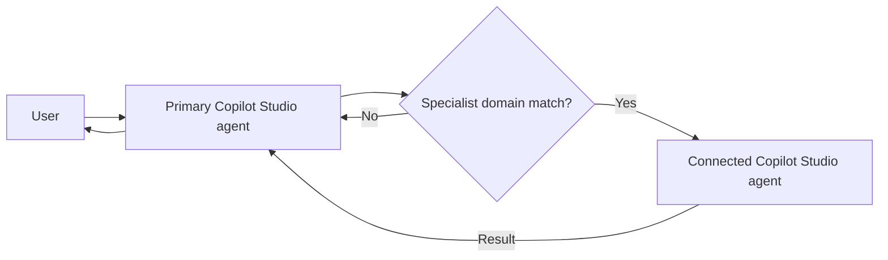
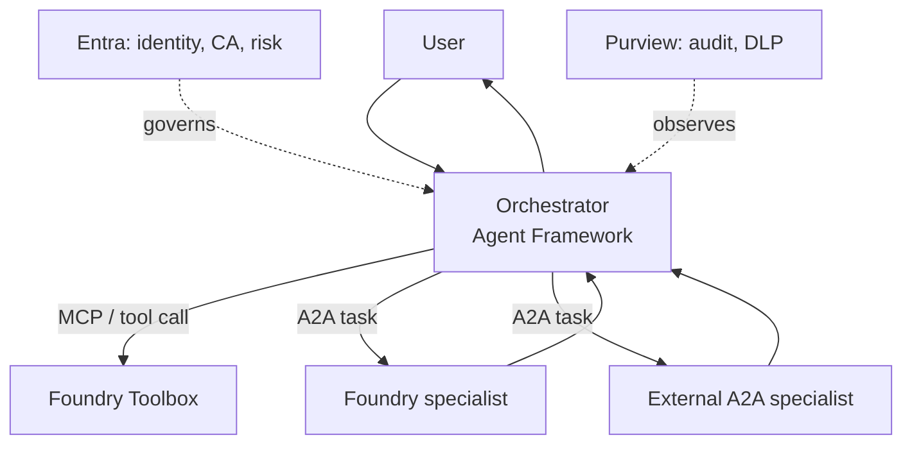

# Candidate Research Dossier: Microsoft Agent-to-Agent Delegation Architecture

**Scope:** How a central Microsoft Copilot-style orchestrator can discover, select, call, delegate to, and receive results from specialist agents, plus defensive testing of that delegation surface.
**Freeze date:** 2026-09-05
**Last verified:** 2026-09-06
**Maintenance:** This is a living dossier. Every statement about a Microsoft product, API, SDK, release status, region, quota, price, license, service boundary, data behavior, or supported feature is a **VOLATILE PRODUCT CLAIM**. Re-verify it against the cited primary source within 30 days before using it in chapter prose.

> **Source boundary:** Every `SRC-*` marker below is a globally unique entry in
> `research/source-ledger.csv`. Approval means the source supports only the ledger's bounded
> claim; it does not approve a product, release status, integration, or architecture.

## 0. Explain it to a child

Think of the central agent as a school receptionist. It does not solve every problem itself: it sends a math question to the math teacher and a computer problem to the IT teacher. It should show each teacher only the part of your permission slip they need. This dossier explains which Microsoft "phone lines" connect the receptionist to specialists, how everyone proves who they are, and how testers make sure no specialist sees secrets or does something the child was not allowed to request.

## 1. Dated status matrix

| Component | Child-friendly meaning | Status at freeze date | Source | Source date / update | Freshness | Confidence |
|---|---|---|---|---|---|---|
| Microsoft Foundry (formerly Azure AI Foundry) | A factory for code-first AI apps and agents | Current documented brand | [SRC-073] | 2026-08-19 / 2026-08-27 | volatile | high |
| Foundry Agent Service | Managed hosting and runtime for agents | Managed runtime documented; overall and per-subfeature release status unresolved by this source | [SRC-073] | 2026-08-19 / 2026-08-27 | volatile | medium |
| Foundry Toolboxes | A governed shared toolbox exposed through one managed MCP endpoint | Documented Agent Service component; exact release status unresolved | [SRC-073] | 2026-08-19 / 2026-08-27 | volatile | medium |
| Foundry agent identity | An Entra ID badge created for each agent | Behavior documented; release status unresolved by this source | [SRC-074] | 2026-08-21 / 2026-08-25 | volatile | medium |
| Copilot Studio Connected agents | One low-code agent hands a turn to another | Mechanics and Copilot-Studio-only scope documented; release status is not stated and remains unresolved | [SRC-075] | 2026-06-23 / 2026-08-27 | volatile | medium |
| Copilot Studio A2A/Foundry/Fabric integration | Bridges to agents outside Copilot Studio | UNRESOLVED; structural navigation is not availability evidence | [SRC-076] | accessed 2026-09-06 | volatile | low |
| Semantic Kernel | Microsoft's earlier open-source orchestration SDK | Educational reference only; current production positioning is unresolved | [SRC-077] | 2023-07-11 / 2024-06-24 | durable-but-stale | low |
| Microsoft Agent Framework | Current agents and graph-workflow SDK | .NET and Python examples documented; Go is public preview; .NET/Python release status is not stated and remains unresolved | [SRC-078] | 2026-07-29 / 2026-08-25 | volatile | medium-high |
| MCP | Open standard connecting agents to tools and data | Living protocol documentation; not Microsoft-owned | [SRC-079] | snapshot 2026-07-28 | evolving | high |
| A2A | Open standard connecting independent agents | Published documentation; Linux Foundation governed | [SRC-080] | accessed 2026-09-06 | evolving | high |
| Microsoft Agent 365 | Tenant-wide registry and control plane for agents | Commercial-segment GA statement in product-specific overview | [SRC-082] | 2026-08-19 / 2026-08-20 | volatile | high |
| Entra Agent ID | A special Entra identity for an AI agent | Release-note behavior requires precise revalidation before use | [SRC-083] | 2026-08-18 / 2026-08-20 | volatile | medium |
| Entra ID Protection for agents | Detects risky agent identities | Capability documented; release status and licensing are unresolved for chapter use | [SRC-084] | 2026-06-17 | volatile | medium |
| Conditional Access for agents | Rules controlling which agent tokens may be issued | Capability documented; release status, prerequisites, and licensing are unresolved for chapter use | [SRC-085] | 2026-06-19 / 2026-07-01 | volatile | medium |
| Purview for Agent 365 | Audit, DLP, labels, and AI observability | Capability coverage documented; licensing and configured-policy coverage vary | [SRC-086] | 2026-05-01 / 2026-06-25 | volatile | high |
| Foundry network isolation | Private endpoints and network allow/deny controls | Network/environment isolation behavior documented; release status unresolved by this source | [SRC-087] | 2026-08-14 / 2026-08-26 | volatile | high |
| Power Platform data policies | Rules classifying or blocking connectors | Connector classification behavior documented | [SRC-088] | 2026-04-07 / 2026-08-14 | evolving | high |
| Prompt Shields | Detects direct prompt attacks and indirect document attacks | Detection behavior documented; exact availability requires revalidation | [SRC-089] | 2025-11-21 / 2026-06-05 | evolving | high |
| PyRIT | Microsoft's open-source generative-AI red-team framework | Available open source | [SRC-090] | continuously updated | volatile | medium |

## 2. Agents/A2A are not tools/MCP/connectors

> "MCP is for agent-to-tool communication"; "A2A is for agent-to-agent communication." A2A also does not define how an agent talks to its own subagents or invokes tools. Use framework-native primitives or MCP for those jobs. [SRC-080]

**Explain it to a child:** MCP plugs the receptionist into a calculator, filing cabinet, or search box. A2A lets the receptionist ask another receptionist-like specialist to think, plan, and return a result.

- **Agent/A2A:** The callee has its own reasoning loop, instructions, opaque state, and possibly its own delegates. The caller gives it a task rather than prescribing each operation.
- **Tool/MCP:** The callee performs a bounded operation or returns data. A rich tool may look clever, but it is governed as a capability rather than as an independent reasoning peer.
- **Connectors:** Power Platform connectors and Foundry tools sit mainly on the tool/data side. They expose APIs and resources; they do not become peer agents merely because an agent calls them.
- **Connected agents:** **VOLATILE PRODUCT CLAIM:** Copilot Studio's feature is agent-to-agent in spirit, but the cited native feature connects only Copilot Studio-built agents [SRC-075]. It is not evidence of a general cross-vendor A2A bridge or of GA status.

| Diagnostic question | Tool/MCP-shaped | Agent/A2A-shaped |
|---|---|---|
| Does the callee execute a fixed capability or run its own reasoning? | Fixed capability | Own reasoning |
| Is its internal state intentionally opaque? | Usually simple or exposed | Yes |
| Can it independently delegate again? | Unusual | Expected possibility |

## 3. Reference architectures

### 3.1 Low-code: Copilot Studio Connected agents

**Explain it to a child:** The front-desk agent reads the question, chooses the right specialist, passes along only the useful conversation, and relays the answer.

**VOLATILE PRODUCT CLAIMS:** The following mechanics require fresh verification against [SRC-075]
before chapter use:

1. The primary agent's orchestration runtime compares each message with connected agents' declared domains.
2. The specialist runs in its own orchestration context with its own instructions, knowledge, and tools.
3. The primary sends the user message and relevant conversation history. The cited overview does not document a disable control. Treat forwarding as a disclosed data path: minimize conversation contents before delegation, test exactly what crosses the boundary, and do not claim it can be switched off.
4. The verified native feature connects only Copilot Studio agents. Foundry, Fabric, or external agents need another bridge, such as the relevant connect tool or A2A integration, whose current status must be checked.

### 3.2 Code-first: Foundry Agent Service + Agent Framework

**Explain it to a child:** Developers build the receptionist and specialists in code. Entra checks every badge at every doorway; MCP opens toolboxes, while A2A calls independent specialists.

- **VOLATILE PRODUCT CLAIM:** Foundry documents an identity blueprint, per-agent Entra identities, and a four-stage OAuth 2.0 token exchange for tool calls [SRC-074].
- **VOLATILE PRODUCT CLAIM:** Agent Service presents runtime, toolboxes, models, observability, optimization, identity/security, and publishing as product pillars [SRC-073].
- **VOLATILE PRODUCT CLAIM:** Agent Framework documents Agents, Harness Agent, Workflows, and Integrations, provides .NET and Python examples, and labels Go public preview. It does not state .NET or Python GA status [SRC-078].
- Use A2A only for independent peers. Use native framework primitives for tightly coupled subagents and MCP for tools.

## 4. Identity, governance, and defensive testing

### 4.1 Identity and authorization

- **On-Behalf-Of (OBO):** A middle tier exchanges a user token for a downstream token. OBO uses delegated scopes, not application roles, preventing the user from inheriting the middle tier's broader privileges [SRC-091].
- **Agent identity:** Give each agent a distinct Entra identity rather than sharing a generic service principal. This supports inventory, policy, and tool authentication [SRC-074].
- **Conditional Access:** Evaluate both token **subject** and **audience** across delegated, application-only, and agent-account scenarios [SRC-085].
- **Shared vs individual authentication:** Shared credentials are convenient but create confused-deputy risk. Prefer individual/OAuth-passthrough authentication when user permissions must survive a hop; re-verify exact Foundry A2A product wording before publication.
- **Risk attribution nuance:** Entra attributes risky OBO activity to the user rather than disabling the agent for everyone [SRC-084]. This helps remediation but is not itself a preventive control.

### 4.2 Governance and audit

- **VOLATILE PRODUCT CLAIM:** Purview documentation describes capture of prompts, responses, referenced files, and sensitivity labels; documented coverage varies by capability [SRC-086].
- **VOLATILE PRODUCT CLAIM:** Agent 365 documentation describes registry, Entra identity, Purview, and Defender as parts of a cross-product control plane [SRC-081], [SRC-082].
- Licensing requirements for ID Protection, Conditional Access, Agent 365, and related network controls are unresolved. Do not state them in chapter prose without current official licensing sources.
- **VOLATILE PRODUCT CLAIM:** Foundry Toolboxes and Power Platform data policies are candidate controls for tool credentials, policy, and connector classification [SRC-073], [SRC-088].

### 4.3 Security test matrix

**Explain it to a child:** Do not merely check that locks exist. Try the wrong keys, duplicate permission slips, hidden instructions, and secret notes, then prove every lock and alarm responds correctly.

Every Microsoft control named in this matrix is a **VOLATILE PRODUCT CLAIM** and requires fresh
verification. The adversarial test ideas remain useful even when a product mapping changes.

| Test area | Platform control to verify | Required adversarial test |
|---|---|---|
| Identity/OBO boundary | Delegated-scope-only OBO [SRC-091]; Entra agent exchange [SRC-074] | A Resource X token must fail against Resource Y even if the delegate app has broader permissions; reject wrong audiences |
| Cross-agent authorization | Individual/OAuth passthrough where supported | Direct and delegated specialist access must enforce identical rights; inventory every shared-auth exception |
| Confused deputy | CA subject/audience model [SRC-085] and OBO scope restrictions [SRC-091] | Ask the orchestrator to misuse a specialist's broader identity for an unauthorized user; expect denial |
| Delegated prompt injection | Prompt Shields distinguishes user-prompt and document attacks [SRC-089] | Pass a canary instruction through a hostile specialist; sanitize every specialist response/tool result before trust |
| Data minimization/exfiltration | Documented automatic history forwarding [SRC-075], Purview DLP/audit [SRC-086] | Plant a canary secret; prove the delegated context is necessary and contains no excluded data; do not claim an undocumented disable control |
| Tenant isolation | Application authorization and tenant-scoped data/cache/state/queue keys | Attempt cross-tenant reads, writes, cache hits, queue consumption, and tool calls; require authorization denial and no data disclosure |
| Network/environment isolation | Foundry private endpoint, public-network flag, and IP allow-list [SRC-087] | Attempt cross-environment and disallowed-network calls; require network-layer rejection without treating it as tenant-isolation proof |
| Tool permissions | Governed Toolbox [SRC-073] and connector classification [SRC-088] | Enumerate reachable tools per agent; test least privilege and shared-credential revocation |
| Replay/idempotency | No native Microsoft guarantee found | Replay captured tasks, race duplicate requests, and require application-layer idempotency for consequential actions |
| Approval bypass | Framework/workflow human-in-the-loop patterns | Call the underlying API directly; authorization, not only UI workflow, must enforce approval |
| Audit evidence | Purview audit [SRC-086] and Entra risk/sign-in logs [SRC-084] | Correlate one transaction across 3+ agents/tools and verify record integrity/retention |
| Synthetic red team | PyRIT [SRC-090] | Build a hostile-specialist test double for injection, replay, exfiltration, and approval-bypass cases |
| Regression | No product replaces a regression process | Re-run on auth, shared-tool, protocol, or preview-to-GA changes; keep confused-deputy and replay tests permanently |

## 5. Decision matrix

| Need | Recommended path | Why | Main caveat |
|---|---|---|---|
| Business-authored specialists, all in Copilot Studio | Copilot Studio Connected agents | Native routing and automatic history forwarding [SRC-075] | Native scope is Copilot Studio agents only; release status and a history-disable control are unresolved |
| Developer-owned specialists with per-user authorization | Foundry Agent Service + Agent Framework; individual/OAuth-passthrough A2A | Candidate path for identity, RBAC, and token-exchange control [SRC-074] | Re-check each integration's release and auth status |
| Cross-vendor independent agents | Linux Foundation A2A | Vendor-neutral agent delegation [SRC-080] | Build replay/idempotency and consequential-action safeguards |
| External data or fixed capability, no peer reasoning | MCP or connector, not A2A | Correct tool/data abstraction [SRC-079], [SRC-080] | Governance differs from peer-agent delegation |
| Tenant-wide discovery, risk, and compliance | Agent 365 + Entra Agent ID + Purview | Candidate cross-product registry, identity, and audit path [SRC-081], [SRC-082] | Availability and prerequisites require fresh verification |

## 6. Explicit unknowns

Do not silently convert these into facts:

1. The exact current retirement date/status of Foundry Workflows. A prior pass reported 2026-12-01; the current overview omits Workflows but does not prove retirement [SRC-073].
2. Whether classic Foundry "Connected Agents," distinct from Copilot Studio Connected agents, is removed or renamed.
3. Whether Copilot Studio A2A/Foundry/Fabric connect tools inherit reported text-only or no-streaming limitations.
4. No documented Microsoft replay window or idempotency-key mechanism was found for A2A tasks or Copilot Studio connected-agent calls.
5. The exact GA/preview split for tracing prompt, hosted, workflow, and external A2A agents.
6. Cross-agent cost and latency attribution.
7. Current Foundry RBAC role names; the guessed page returned 404, so fetch the role page linked from [SRC-074] before naming roles.
8. Exact current wording and defaults for shared versus individual/OAuth-passthrough Foundry A2A authentication.
9. Current licensing and service-plan prerequisites for ID Protection, Conditional Access,
   Agent 365, Purview, and related network controls.

## 7. Phased PoC-to-production plan

1. **Scope:** Choose one low-risk delegation and write its inputs, outputs, timeout, retry, and prohibited actions in plain language.
2. **Low-code PoC:** Build one primary and one specialist in Copilot Studio. Use synthetic, minimized conversation data and verify exactly what history is forwarded; the cited source does not document a disable control.
3. **Identity hardening:** Confirm Entra Agent IDs and evaluate Conditional Access after verifying current availability, prerequisites, and licensing [SRC-083], [SRC-085].
4. **Code-first comparison:** Rebuild the flow with Foundry and Agent Framework; compare individual and shared authentication empirically.
5. **Security pass:** Run every row in Section 4.3, fixing supported-but-misconfigured controls first.
6. **Governance:** Register all agents and enable the verified, licensed Purview auditing/DLP controls [SRC-081], [SRC-086].
7. **Custom controls:** Add idempotency, delegated-content inspection, end-to-end correlation, and authorization-layer approvals.
8. **Red team:** Exercise the hostile-specialist test double with PyRIT or equivalent [SRC-090]; fix and repeat.
9. **Staged rollout:** Start with a small group and actively monitor Entra and Purview signals.
10. **Production:** Automate regressions and trigger them for every relevant Copilot Studio, Foundry, Agent Framework, Entra, tool, or auth change.

## 8. Recommended chapter placement

- **Chapter 17: Multi-Agent Systems:** Put task contracts, capability discovery, routing, retries, human approval, the generalized reference architectures, and the agent/tool boundary here.
- **Chapter 18: Interoperability Protocols:** Put MCP, A2A, Linux Foundation governance, discovery/task/result mechanics, and "what A2A is not" here [SRC-080].
- **Chapter 42: Northstar on the Microsoft Stack:** Treat the dated matrix and Microsoft mappings only as candidate research. Apply the chapter's approved-source scope and 30-day re-verification gate before using any claim.
- Cross-reference Section 4.3 from the security/governance module when drafted.

## 9. Candidate primary-source register

Every claim marker above resolves to an approved, bounded primary-source entry in
`research/source-ledger.csv`. Dates are `ms.date / updated_at` where both were available.

| ID | Publisher | Primary source | Source date / update | Accessed | Freshness | Confidence |
|---|---|---|---|---|---|---|
| SRC-073 | Microsoft Learn | [What is Microsoft Foundry Agent Service?](https://learn.microsoft.com/en-us/azure/foundry/agents/overview) | 2026-08-19 / 2026-08-27 | 2026-09-06 | volatile | high |
| SRC-074 | Microsoft Learn | [Agent identity concepts in Microsoft Foundry](https://learn.microsoft.com/en-us/azure/foundry/agents/concepts/agent-identity) | 2026-08-21 / 2026-08-25 | 2026-09-06 | volatile | high |
| SRC-075 | Microsoft Learn | [Connected agents overview](https://learn.microsoft.com/en-us/microsoft-copilot-studio/agents-experience/authoring-add-other-agents) | 2026-06-23 / 2026-08-27 | 2026-09-06 | volatile | high |
| SRC-076 | Microsoft Learn | [Copilot Studio documentation table of contents](https://learn.microsoft.com/en-us/microsoft-copilot-studio/toc.json) | structural document | 2026-09-06 | volatile | medium |
| SRC-077 | Microsoft Learn | [Introduction to Semantic Kernel](https://learn.microsoft.com/en-us/semantic-kernel/overview/) | 2023-07-11 / 2024-06-24 | 2026-09-06 | durable-but-stale | medium |
| SRC-078 | Microsoft Learn | [Microsoft Agent Framework overview](https://learn.microsoft.com/en-us/agent-framework/overview/) | 2026-07-29 / 2026-08-25 | 2026-09-06 | volatile | high |
| SRC-079 | MCP project | [What is the Model Context Protocol?](https://modelcontextprotocol.io/docs/getting-started/intro) | snapshot 2026-07-28 | 2026-09-06 | volatile | high |
| SRC-080 | A2A project / Linux Foundation | [A2A Protocol documentation](https://a2a-protocol.org/latest/) | living site | 2026-09-06 | volatile | high |
| SRC-081 | Microsoft Learn | [Microsoft Agents documentation hub](https://learn.microsoft.com/en-us/agents/) | 2026-08-19 / 2026-08-19 | 2026-09-06 | volatile | high |
| SRC-082 | Microsoft Learn | [Microsoft Agent 365 overview](https://learn.microsoft.com/en-us/microsoft-agent-365/overview) | 2026-08-19 / 2026-08-20 | 2026-09-06 | volatile | high |
| SRC-083 | Microsoft Learn | [What's new in Copilot Studio](https://learn.microsoft.com/en-us/microsoft-copilot-studio/whats-new) | 2026-08-18 / 2026-08-20 | 2026-09-06 | volatile | high |
| SRC-084 | Microsoft Learn | [ID Protection for agents](https://learn.microsoft.com/en-us/entra/id-protection/concept-risky-agents) | 2026-06-17 | 2026-09-06 | volatile | high |
| SRC-085 | Microsoft Learn | [Conditional Access for agents](https://learn.microsoft.com/en-us/entra/identity/conditional-access/agent-id) | 2026-06-19 / 2026-07-01 | 2026-09-06 | volatile | high |
| SRC-086 | Microsoft Learn | [Use Purview to manage Agent 365 data security and compliance](https://learn.microsoft.com/en-us/purview/ai-agent-365) | 2026-05-01 / 2026-06-25 | 2026-09-06 | volatile | high |
| SRC-087 | Microsoft Learn | [Configure network isolation for Microsoft Foundry](https://learn.microsoft.com/en-us/azure/foundry/how-to/configure-private-link) | 2026-08-14 / 2026-08-26 | 2026-09-06 | volatile | high |
| SRC-088 | Microsoft Learn | [Power Platform data policies](https://learn.microsoft.com/en-us/power-platform/admin/wp-data-loss-prevention) | 2026-04-07 / 2026-08-14 | 2026-09-06 | volatile | high |
| SRC-089 | Microsoft Learn | [Prompt Shields](https://learn.microsoft.com/en-us/azure/ai-services/content-safety/concepts/jailbreak-detection) | 2025-11-21 / 2026-06-05 | 2026-09-06 | volatile | high |
| SRC-090 | Microsoft / GitHub | [PyRIT](https://github.com/Azure/PyRIT) | continuously updated | 2026-09-06 | volatile | medium |
| SRC-091 | Microsoft Learn | [OAuth 2.0 On-Behalf-Of flow](https://learn.microsoft.com/en-us/entra/identity-platform/v2-oauth2-on-behalf-of-flow) | 2025-01-04 / 2026-06-15 | 2026-09-06 | volatile | high |

### Research gaps recorded during validation

- Copilot Studio Connected agents release status and any operator control for disabling or
  filtering the documented relevant-history forwarding remain unverified; do not infer either.
- Foundry Workflows retirement, classic Foundry Connected Agents removal, current RBAC role names, and exact A2A authentication-mode wording remain deliberately unverified claims.
- No primary Microsoft documentation for A2A/Connected-agent replay or idempotency semantics was found.
- A guessed Defender runtime-protection page and guessed Foundry RBAC page returned 404; neither is cited as evidence.
